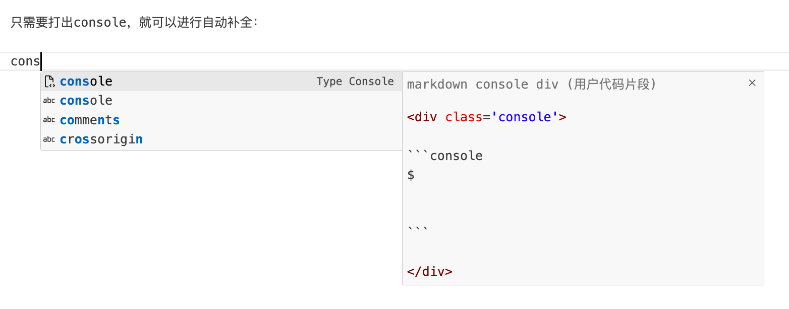

!!! info "兼mkdocs-material 9.4.14+ 特性介绍"

    这里用于调试**本站支持的**各类组件和markdown扩展语法。markdown基础的语法这里就不赘述了，参见官方教程[^1]。本页面涉及的组件和语法都可以在mkdocs material的官网[^2]以及mkdocs wiki[^3]找到说明文档。

??? note "Snippets：提高写作效率"
    你可能会问，这么多复杂的语法，写起来是不是太麻烦了，能记得住吗？

    针对这个问题，我建议使用VSCode的[Snippets功能](https://code.visualstudio.com/docs/editing/userdefinedsnippets)：

    
    
    把常用的一些代码块都保存下来，只要写过一次后面都可以用很短的关键词出发自动补全。谁用谁说好！

    例如下面的代码：

    ````markdown
    <div class='console'>
    
    ```console
    $ 
    
    
    ```
    
    </div>
    ````

    只需要打出console，就可以进行自动补全：

    

## 404 NotFound

mkdocs-material允许用户自定义404页面。

你可以去看看[本站的404页面](/not_found)，另外，如果你尝试去访问不存在的[英文版面](/en/not_found)，会弹窗提示并且自动回退。

## 页面元信息

在markdown文件的开头可以进行meta信息的标注：

```html title="可以设置的meta信息"
---
title: Playground of Markdown <!--(1)!-->
tags: <!--(2)!-->
  -  About
hide: <!--(3)!-->
  - navigation
  - toc

---
```

1. titile控制页面的一级标题
2. tags控制页面的标签，便于归纳整理
3. hide可以隐藏相应的内容，例如导航栏、目录、评论区等

!!! note "可以隐藏的组件"

    - navigation：隐藏导航栏
    - toc：隐藏目录
    - feedback：隐藏反馈按钮
    - comments：隐藏评论区
    - <s>math：不加载math.js</s>
    - tags：隐藏tag
    - edit：隐藏编辑按钮

    !!! warning "新的变化 2024.03.07"
        本站现在默认不加载math.js（因为真的很慢），如果页面需要写数学公式需要额外申明
        
        ```html
        include:
        - math
        - live <!--(1)!-->
        ```

        1. 当然还可以额外引入[live-photo.js](https://github.com/DavidAnson/live-photo-web)等其他组件

## 命令行组件

[termynal](https://github.com/ines/termynal)是一款简洁好看的命令行演示组件。

!!! info "termynal js & css"

    A lightweight, modern and extensible animated terminal window, using
    async/await.

    - @author Ines Montani <ines@ines.io>
    - @version 0.0.1
    - @license MIT
    

形如：

<div class="console">

```console
$ python3 -m pip install numpy
# 正在安装numpy，稍作等待

---> 100%

$ python3 -m pip list

Package    Version
---------- -------
numpy      1.25.2
pip        23.2.1
setuptools 58.0.4
six        1.15.0
wheel      0.37.0

```

</div>

## 注解

### 脚注

markdown支持一种比较通用的**脚注**方式：

```markdown title="脚注"
我家门前有两棵树，一颗是枣树，另外一颗也是枣树[^1]。

[^1]: 这话是鲁迅说的。
```

这样一来会自动在文末生成一个脚注[^1]。

### 旁注

mkdocs-material还允许我们可以在文本中插入旁注(1)，插入的方式如下：
{ .annotate }

1. 你好👋，这里是一个旁注

```markdown hl_lines="2"
mkdocs-material还允许我们可以在文本中插入旁注(1)，插入的方式如下：
{ .annotate }

1. 你好👋，这里是一个旁注
```

这样可以更便捷地查看注释的内容。

旁注的图标也可以自定义，默认是:material-plus-circle:，我改成了:material-alert-circle:。

## 代码块

代码块是markdown的基础组件：

```python
print("Hello, world!")
```

### 额外选项

mkdocs-material中，代码块还可以自定义标题、显示行号、高亮显示某些行：
=== "渲染效果"

    ``` python linenums="1" title="fibonacci" hl_lines="2 3"
    def fib(n: int):
        assert isinstance(n, int)
        if n<2:
            return 1
        else:
            return fib(n-1)+fib(n-2)
    ```

=== "源代码"

    ````markdown
    ``` python linenums="1" title="fibonacci" hl_lines="2 3"
    def fib(n: int):
        assert isinstance(n, int)
        if n<2:
            return 1
        else:
            return fib(n-1)+fib(n-2)
    ```
    ````

### 旁注

代码块中也可以加入旁注：

```python
print() # (1)
```

1. 这时候会输出一个换行符`\n`

此外代码块的旁注还有一种特殊写法，可以把注释提示词隐藏（例如python中的`#`），只留下注释的内容。

> 官方叫：Stripping comments，脱衣注释哈哈哈哈哈哈

=== "渲染效果"

    ``` python
    for i in range(10):
      # (1)
      print(i, end="") #(2)!
    ```
    
    1. 这是一个for循环，依次打印出0-9
    2. 使用end参数控制每次打印的休止符

=== "源代码"

    ````html hl_lines="5 6"
    <!-- (1)-->
    
    ``` python
    for i in range(10):
      # (1)
      print(i, end="") #(2)!
    ```
    
    1. 这是一个for循环，依次打印出0-9
    2. 使用end参数控制每次打印的休止符
    ````
    
    1.  这里还有一个小技巧，如果要在markdown的代码环境中再写markdown代码，可以在外层使用(四个`)来避免和内层语义冲突。

## 并列内容

=== "python"
    ```python
    print("Hello, World!")
    ```
=== "C"
    ```C
    #include <stdio.h>
    int main() {
      printf("Hello, World!");
      return 0;
    }
    ```
上面这种两个代码并排显示也是一种扩展语法，写法如下：

````markdown
=== "Block1"
    ```python
    print(1)
    ```
=== "Block2"
    ```C
    #include <stdio.h>
    int main() {
      printf("Hello, World!");
      return 0;
    }
    ```
````

当然这种写法并不局限于并列代码块，可以和其他组件嵌套组合出很多花样。
!!! example

    === "Unordered List"
    
        ``` markdown
        * Sed sagittis eleifend rutrum
        * Donec vitae suscipit est
        * Nulla tempor lobortis orci
        ```
    
    === "Ordered List"
    
        ``` markdown
        1. Sed sagittis eleifend rutrum
        2. Donec vitae suscipit est
        3. Nulla tempor lobortis orci
        ```

还可以和自己嵌套：

=== "左边"

    你好，请看右边➡️

=== "右边"
    你好，请看下边⬇️
    === "右边的左边"
        to be

    === "右边的右边"
        not to be

## 突出显示

Admonitions或者叫call-out，是一种突出内容的手段。
原生的样式比较简单：
> 突出内容
> 引用内容

mkdocs-material支持更好看的样式：
=== "渲染效果"
    ??? info "标题"

        这里可以写一些内容
=== "源代码"
    ```
    ??? info "标题"

        这里可以写一些内容
    ```

### 折叠与否

如果不需要折叠可以使用下面的写法：
=== "渲染效果"
    !!! caution "标题"

        这里可以写一些内容
=== "源代码"
    ```
    !!! caution "标题"

        这里可以写一些内容
    ```

### 样式

??? note "默认支持的样式"

    !!! note
        `note`是默认样式，其他样式加载失败就回退到这个样式。
    !!! abstract
    !!! info
    !!! tip
    !!! subcess
    !!! failure
    !!! question
    !!! warning
    !!! danger
    !!! bug
    !!! example
    !!! quote

此外我还自定义了一些样式：

!!! theorem
!!! tongyiai-summary
!!! chatgpt-summary
!!! deepseek-summary

## 图片

在原有markdown图片语法的基础之上，可以在末尾加上一些参数。
=== "渲染效果"

    {align=right width=200 loading=lazy}
    这是一个单位圆，图中$P$在第一象限，$PR\perp PQ$，$M,N$的横坐标都是2，问图示两个区域的面积何时相同？
=== "源代码"

    ```markdown
    {align=right width=200 loading=lazy}
    这是一个单位圆，图中$P$在第一象限，$PR\perp PQ$，$M,N$的横坐标都是2，问图示两个区域的面积何时相同？
    ```

### 居中

`align`参数可以调节居左、居右，但是无法实现居中效果，可以用下面的写法
=== "渲染效果"

    <figure markdown>
      {width=400}
      <figcaption>Image caption</figcaption>
    </figure>
=== "源代码"

    ```markdown
    <figure markdown>
      {width=400}
      <figcaption>Image caption</figcaption>
    </figure>
    ```

### 放大显示

使用glightbox插件支持了图片的放大显示。添加`{.nonzoom}`类标签可以禁用glightbox组件。

### 边框

对于有`figurecaption`子节点的`figure`，会额外加一个边框，变成类似拍立得的效果：

<figure markdown>

{width=400}

<figurecaption>Image caption</figurecaption>

</figure>

## 数学公式

本站的LaTex支持则是依靠MathJax实现的，语法上需要小心并非所有的写法通用，具体有何差异可以去官网看一看[^4]。

mkdocs material没有特殊的语法。行内公式$\cos \pi/2 = 0$和行间公式
$$
\sin^2\theta +\cos^2\theta =1
$$
都是支持的。

!!! caution "新的变化 2024.03.14"
    现在的数学公式不再依赖`pymdownx.arithmatex`这个插件，而是直接使用mathjax渲染。更快而且错误更少了，此外还通过[Peter Krautzberger写的代码](https://codepen.io/pkra/pen/EPeKjo)实现了数学公式自动换行。

## 视频

### 文件嵌入

视频的文件嵌入使用了mkdocs video插件，效果如下：


> 不得不说，我这波云霄飞车真的很帅

### 链接嵌入

使用HTML的iframe可以嵌入各大平台的视频，例如YouTube：

<div style="text-align:center;">
<iframe width="560" height="315" src="https://www.youtube.com/embed/d_qvLDhkg00" title="YouTube video player" frameborder="0" allow="accelerometer; autoplay; clipboard-write; encrypted-media; gyroscope; picture-in-picture; web-share" allowfullscreen></iframe>
</div>

再如哔哩哔哩：
<div style="position: relative; padding: 30% 45%;">
<iframe style="position: absolute; width: 100%; height: 100%; left: 0; top: 0;" src="https://player.bilibili.com/player.html?bvid=BV1nu9aYvEap&page=1&as_wide=1&high_quality=1&danmaku=0&autoplay=0" frameborder="no" scrolling="no">
</iframe>
</div>

## 流程图

mermaid是简单强大的流程图绘制工具，具体细节参见它的的官网[^5]，简单画个流程图：
=== "渲染效果"

    ``` mermaid
    graph LR
      A[Start] --> B{Error?};
      B -->|Yes| C[Hmm...];
      C --> D[Debug];
      D --> B;
      B ---->|No| E[Yay!];
    ```
=== "源代码"

    ````markdown
    ``` mermaid
    graph LR
      A[Start] --> B{Error?};
      B -->|Yes| C[Hmm...];
      C --> D[Debug];
      D --> B;
      B ---->|No| E[Yay!];
    ```
    ````

## pdf文件嵌入

使用html的`application/pdf`实现：

```html
<center>
<object
    type="application/pdf"
    data="some.pdf#page=1&view=FitH&toolbar=1&navpanes=0"
    width=80%
    height=400>
</object>
</center>
```

其中传递了一些参数

- page=1，加载的时候打开第一页
- view=FitH，视图设置为Horizontal Fit
- toolbar=1，显示工具栏
- navpanes=0，默认不显示导航栏

还有很多其他可用的参数，具体可以参考Adobe的文档：[Parameters for Opening PDF Files](https://pdfobject.com/pdf/pdf_open_parameters_acro8.pdf)。

## 广告

本站部分页面开启了[广告](../About/ads.md)。

这里也放一个：

<script async src="https://pagead2.googlesyndication.com/pagead/js/adsbygoogle.js?client=ca-pub-2353855407972667"
     crossorigin="anonymous"></script>
<ins class="adsbygoogle"
     style="display:block"
     data-ad-client="ca-pub-2353855407972667"
     data-ad-slot="4469440034"
     data-ad-format="auto"
     data-full-width-responsive="true"></ins>
<script>
     (adsbygoogle = window.adsbygoogle || []).push({});
</script>

[^1]: [Markdown语法](https://www.markdownguide.org/)
[^2]: [mkdocs-material](https://squidfunk.github.io/mkdocs-material/)
[^3]: [mkdocs-wiki](https://github.com/mkdocs/mkdocs/wiki)
[^4]: [MathJax官网：www.mathjax.org](https://www.mathjax.org/)
[^5]: [mermaid官网：mermaid-js.github.io/mermaid](https://mermaid-js.github.io/mermaid/#/)
