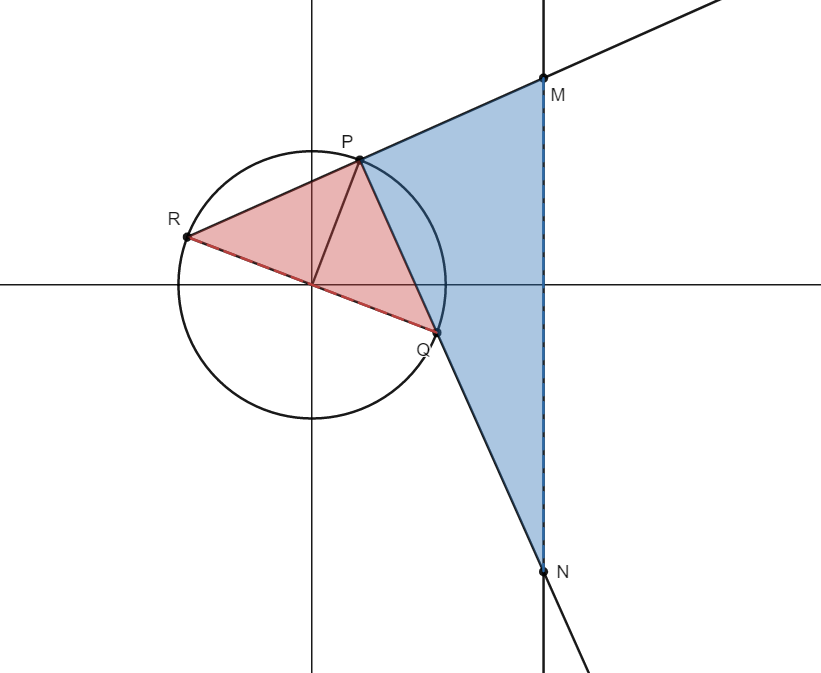

!!! question "Playground"

    这里用于调试本站支持的各类组件和markdown扩展语法。markdown基础的语法这里就不赘述了，参见官方教程[^1]。本页面涉及的组件和语法都可以在mkdocs material的官网[^2]以及mkdocs wiki[^3]找到说明文档。

## 404 NotFound

[👉本站的404页面](./none)

## 页面元信息

在markdown文件的开头可以进行meta信息的标注：
（下面这个加号是可以点击的）
```html title="可以设置的meta信息"
---
title: Playground of Markdown <!--(1)-->
tags: <!--(2)-->
  -  About
hide: <!--(3)-->
  - navigation
  - toc

---
```

1.  titile控制页面的一级标题
2.  tags控制页面的标签，便于归纳整理
3.  hide可以隐藏相应的内容，例如导航栏、目录、评论区等

!!! note "可以隐藏的组件"

    - navigation：隐藏导航栏
    - toc：隐藏目录
    - feedback：隐藏反馈按钮
    - comments：隐藏评论区
    - math：不加载math.js
    - tags：隐藏tag
    - edit：隐藏编辑按钮

!!! caution "新的变化 2024.03.07"
    本站现在默认不加载math.js（因为真的很慢），如果页面需要写数学公式可以使用
    ```md
    include:
    - math
    ```
## 命令行组件
[termynal](https://github.com/ines/termynal)是一款简洁好看的命令行演示组件。

!!! info "termynal js & css"
    
    A lightweight, modern and extensible animated terminal window, using
    async/await.

    - @author Ines Montani <ines@ines.io>
    - @version 0.0.1
    - @license MIT
    

形如：

<div class="console">

```console
$ python3 -m pip install numpy
# 正在安装numpy，稍作等待

---> 100%

$ python3 -m pip list

Package    Version
---------- -------
numpy      1.25.2
pip        23.2.1
setuptools 58.0.4
six        1.15.0
wheel      0.37.0

```

</div>

## 代码块
代码块是markdown的基础组件：
```python
print("Hello, world!")
```
### 悬浮注释
> 官方叫：Stripping comments，脱衣注释哈哈哈哈哈哈

mkdocs material有一个注释的特殊写法，可以把注释的内容隐藏起来，变成可点击展开的小加号！

具体来说就是把注释内容替换成`(num)`，然后在代码块下方写对应的数字`num.`+`注释内容`：

=== "渲染效果"

    ``` python
    for i in range(10):
      # (1)
      print(i)
    ```
    
    1. 这是一个for循环，依次打印出0-9

=== "源代码"

    ````html
    <!-- (1)-->
    
    ``` python
    for i in range(10):
      # (1)
      print(i)
    ```
    
    1.  这是一个for循环，依次打印出0-9
    ````
    
    2.  这里还有一个小技巧，如果要在markdown的代码环境中再写markdown代码，可以在外层使用(四个`)来避免和内层语义冲突。

> 不过现在这个样子还是有点丑的，虽然把注释内容隐藏了起来，但是注释符号还在，非常难受！不过mkdocs现在已经在测试进一步的功能（insider已经可以使用了），可以实现更加美观的样式

### 行号、标题、高亮
代码块还可以自定义标题、显示行号、高亮显示某些行：
=== "渲染效果"

    ``` python linenums="1" title="fibonacci" hl_lines="2 3"
    def fib(n: int):
        assert isinstance(n, int)
        if n<2:
            return 1
        else:
            return fib(n-1)+fib(n-2)
    ```

=== "源代码"

    ````markdown
    ``` python linenums="1" title="fibonacci" hl_lines="2 3"
    def fib(n: int):
        assert isinstance(n, int)
        if n<2:
            return 1
        else:
            return fib(n-1)+fib(n-2)
    ```
    ````


## 并列内容
=== "python"
    ```python
    print("Hello, World!")
    ```
=== "C"
    ```C
    #include <stdio.h>
    int main() {
      printf("Hello, World!");
      return 0;
    }
    ```
上面这种两个代码并排显示也是一种扩展语法，写法如下：
````markdown
=== "Block1"
    ```python
    print(1)
    ```
=== "Block2"
    ```C
    #include <stdio.h>
    int main() {
      printf("Hello, World!");
      return 0;
    }
    ```
````
当然这种写法并不局限于并列代码块，可以和其他组件嵌套组合出很多花样。
!!! example

    === "Unordered List"
    
        ``` markdown
        * Sed sagittis eleifend rutrum
        * Donec vitae suscipit est
        * Nulla tempor lobortis orci
        ```
    
    === "Ordered List"
    
        ``` markdown
        1. Sed sagittis eleifend rutrum
        2. Donec vitae suscipit est
        3. Nulla tempor lobortis orci
        ```

还可以和自己嵌套：

=== "左边"

    你好，请看右边➡️

=== "右边"
    你好，请看下边⬇️
    === "右边的左边"
        to be 

    === "右边的右边"
        not to be

## 突出显示
Admonitions或者叫call-out，是一种突出内容的手段。
原生的样式比较简单：
> 突出内容
> 引用内容

mkdocs-material支持更好看的样式：
=== "渲染效果"
    ??? info "标题"
        
        这里可以写一些内容
=== "源代码"
    ```
    ??? info "标题"
        
        这里可以写一些内容
    ```
如果不需要折叠可以使用下面的写法：
=== "渲染效果"
    !!! caution "标题"
        
        这里可以写一些内容
=== "源代码"
    ```
    !!! caution "标题"
        
        这里可以写一些内容
    ```
支持以下的样式：

- note
- abstract, summary, tldr
- info, todo
- tip, hint, important
- success, check, done
- question, help, faq
- warning, caution, attention
- failure, fail, missing
- danger, error
- bug
- example
- quote, cite

## 图片
在原有markdown图片语法的基础之上，可以在末尾加上一些参数。
=== "渲染效果"

    {align=right width=200 loading=lazy}
	这是一个单位圆，图中$P$在第一象限，$PR\perp PQ$，$M,N$的横坐标都是2，问图示两个区域的面积何时相同？
=== "源代码"

	```markdown
	{align=right width=200 loading=lazy}
	这是一个单位圆，图中$P$在第一象限，$PR\perp PQ$，$M,N$的横坐标都是2，问图示两个区域的面积何时相同？
	```
### 居中
`align`参数可以调节居左、居右，但是无法实现居中效果，可以用下面的写法
=== "渲染效果"

	<figure markdown>
      {width=400}
      <figcaption>Image caption</figcaption>
    </figure>
=== "源代码"

	```markdown
	<figure markdown>
      {width=400}
      <figcaption>Image caption</figcaption>
    </figure>
    ```
### 放大显示
使用glightbox插件支持了图片的放大显示。
## 数学公式
本站的LaTex支持则是依靠MathJax实现的，语法上需要小心并非所有的写法通用，具体有何差异可以去官网看一看[^4]。

mkdocs material没有特殊的语法。行内公式$\cos \pi/2 = 0$和行间公式
$$
\sin^2\theta +\cos^2\theta =1
$$
都是支持的。
## 视频
### 文件嵌入
视频的文件嵌入使用了mkdocs video插件，效果如下：


> 不得不说，我这波云霄飞车真的很帅

### 链接嵌入
使用HTML的iframe可以嵌入各大平台的视频，例如YouTube：

<div style="text-align:center;">
<iframe width="560" height="315" src="https://www.youtube.com/embed/d_qvLDhkg00" title="YouTube video player" frameborder="0" allow="accelerometer; autoplay; clipboard-write; encrypted-media; gyroscope; picture-in-picture; web-share" allowfullscreen></iframe>
</div>

## 流程图
mermaid是简单强大的流程图绘制工具，具体细节参见它的的官网[^5]，简单画个流程图：
=== "渲染效果"

    ``` mermaid
    graph LR
      A[Start] --> B{Error?};
      B -->|Yes| C[Hmm...];
      C --> D[Debug];
      D --> B;
      B ---->|No| E[Yay!];
    ```
=== "源代码"

	````
	``` mermaid
    graph LR
      A[Start] --> B{Error?};
      B -->|Yes| C[Hmm...];
      C --> D[Debug];
      D --> B;
      B ---->|No| E[Yay!];
    ```
    ````
## Google广告
当然，本站仅有此处嵌入了广告，仅做测试使用。
### 展示广告
<script async src="https://pagead2.googlesyndication.com/pagead/js/adsbygoogle.js?client=ca-pub-2353855407972667"
     crossorigin="anonymous"></script>
<!-- ads -->
<ins class="adsbygoogle"
     style="display:block"
     data-ad-client="ca-pub-2353855407972667"
     data-ad-slot="9380940342"
     data-ad-format="auto"
     data-full-width-responsive="true"></ins>
<script>
     (adsbygoogle = window.adsbygoogle || []).push({});
</script>

### 文章内嵌广告
<script async src="https://pagead2.googlesyndication.com/pagead/js/adsbygoogle.js?client=ca-pub-2353855407972667"
     crossorigin="anonymous"></script>
<ins class="adsbygoogle"
     style="display:block; text-align:center;"
     data-ad-layout="in-article"
     data-ad-format="fluid"
     data-ad-client="ca-pub-2353855407972667"
     data-ad-slot="8348998079"></ins>
<script>
     (adsbygoogle = window.adsbygoogle || []).push({});
</script>

### 多重广告
<script async src="https://pagead2.googlesyndication.com/pagead/js/adsbygoogle.js?client=ca-pub-2353855407972667"
     crossorigin="anonymous"></script>
<ins class="adsbygoogle"
     style="display:block"
     data-ad-format="autorelaxed"
     data-ad-client="ca-pub-2353855407972667"
     data-ad-slot="4381832902"></ins>
<script>
     (adsbygoogle = window.adsbygoogle || []).push({});
</script>

### 其他广告

……


[^1]: [markdown官方教程：markdownguide.org](https://www.markdownguide.org/)

[^2]: [mkdocs-material官网：squidfunk.github.io/mkdocs-material](https://squidfunk.github.io/mkdocs-material/)

[^3]: [mkdocs wiki](https://github.com/mkdocs/mkdocs/wiki)

[^4]: [MathJax官网：www.mathjax.org](https://www.mathjax.org/)

[^5]: [mermaid官网：mermaid-js.github.io/mermaid](https://mermaid-js.github.io/mermaid/#/)