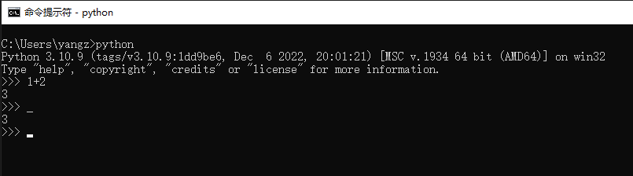
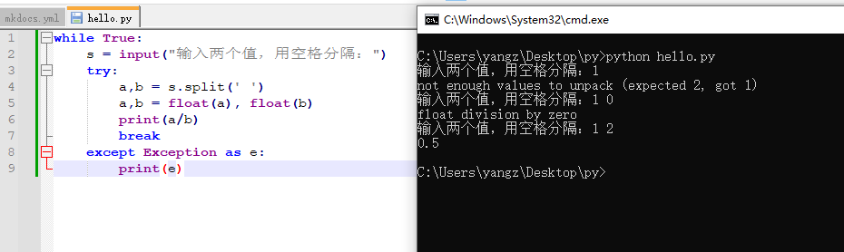
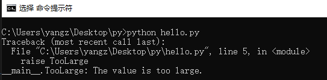

---
tags:
- python入门
---
# 内置关键字
到目前为止，我们所学的内容都是**一句话**可以解决的。不论是函数调用，还是变量赋值抑或是创建对象。

接下来我们就要学习**多行组成的逻辑块**。为了学习这个内容，我们先要介绍python中另外一个重要的文法——缩进（这也是新人最出错的地方之一）
## 缩进
在python的脚本中，缩进是有语法涵义的，它蕴含了代码的逻辑结构。缩进规格相同的代码处于同一层级，缩进越多代码层级越深。

例如：
```python
def hello():
    print("hi")
    print("hello world")
```
先不管`def`的用法如何，但看这两行代码我们就能知道`#!python print("hi")`和`#!python print("hello world")`是同属于`def`内部的代码。而如果去掉其中一个缩进，代码的意味就完全不同了：
```python
def hello():
    print("hi")
print("hello world")
```
不难理解，这样的代码`#!python print("hi")`是`def`内部的子代码，而`#!python print("hello world")`和`def`处在同一层次。

了解了缩进的意义之后，我们来学习缩进的方法。常见的缩进方法有两类：

- tab党
- space党

这就好比豆腐脑儿的咸甜党，各有人拥护。我这里只介绍space，也就是空格的缩进方法。理论上不论是多少个空格都是合法的缩进：
=== "1空格"

    ```python 
    def hello():
     print("hi")
    ```
=== "2空格"

    ```python 
    def hello():
      print("hi")
    ```
=== "3空格"

    ```python 
    def hello():
       print("hi")
    ```
=== "4空格（推荐）"

    ```python 
    def hello():
        print("hi")
    ```
但是按照`PEP8`（Python Enhancement Proposal 8）的建议，我们推荐使用4个空格来作为一层缩进。

## 自定义函数
### `def`
自定义函数的格式前文已经多次出现了，这里给出一个更加复杂的版本：
```python
def f(a, b):
    print(a, b)
    return a + b

print(f(2, 1)) ## 返回值为3
print(f(1, 4)) ## 返回值为5
```
我们定义函数需要先用`def`关键字来声明，然后**空格**，写下函数的名字和双括号`()`，在括号内写函数可以传入的参数，参数可以有多个。

参数可以作为函数内部的变量来使用，在函数被调用的时候会把传入的值赋值给对应的变量然后依次执行函数中所有的内容。请注意，函数内部的空间和外部的空间是不同的命名空间，变量并不通用。一般来说内部可以访问外部的变量，但是外部不可以访问内部的变量。

最后用`return`关键字来声明函数的返回值，函数结束之后就会返回这个值。如果没有`return`语句，就会返回一个`None`，代表没有返回值。

函数调用的方式是`()`，读者应该以及很熟悉。而函数传递参数的方式有很多种：

- 按照位置顺序传递：`f(1, 4)`就是这种用法
- 按照名字传递：`f(a=1, b=4)`这种用法可以无视位置，例如：`f(b=4, a=1)`
- 混合：`f(1, b=3)`不推荐

一般而言不引起歧义的时候都可以按照位置顺序来传递参数。
### `lambda`
之前的文章中也提到过`存在没有名字的函数`，这里我们就来介绍一下所谓的匿名函数。

匿名函数的定义方式为`lambda parameter : return value`，例如
```python
lambda x : x+2
```
就会返回一个函数，他的作用是把一个数字加上2，我们可以直接调用这个函数：
```python
(lambda x : x+2)(3)
# 返回值是5
```
> 注意到上面的`(lambda x : x+2)`里的括号代表一种逻辑优先级，先执行`lambda`语句得到一个函数对象然后再调用，这和数学中的圆括号是类似的。

而如果把匿名函数赋值给一个变量，那么就可以当作正常的函数来使用：
```python
add = lambda x,y : x+y
print(add(1, 2))  ## 打印出来的是3
```
由于匿名函数的简洁，我们经常会把它作为一个参数传递到其他函数中：
```python title="列表中的元素按照实部大小升序排列"
l = [1j, 2j+3, 1j, 3j+1]
l.sort(key = lambda x:x.real)
print(l) # 输出的值为 [1j, 1j, (1+3j), (3+2j)]
```
> 这里也展示了python中虚数的表示方法：`1j`，请注意不能用`j`代替`1j`，并且`0`和`0j`也不完全相同，前者是整数对象，后者是复数对象。

更加丰富的函数理论我们会在高级语法的函数式编程模块中介绍。

## 自定义类
### 从类到对象的过程
自定义类的格式之前的文章也出现过，下面我们加上一个`__new__`方法，让逻辑更加完整：
=== "源代码"

    ```python
    class Teacher:
        """老师类"""
        def __new__(cls, age): ## 一般而言这个方法可以省略
            print("new")
            return super().__new__(cls)

        def __init__(self, age): ## 如果需要初始化对象，这个方法不可省略
            print("init")
            self.age = age

        def update_age(self):
            print("update age")
            self.age += 1

    wang = Teacher(20)
    print("老师现在的年龄: ", wang.age)
    wang.update_age()
    print("老师明年的年龄: ", wang.age)
    ```
=== "运行结果"

    ```text
    new
    init
    老师现在的年龄: 20
    update age
    老师明年的年龄: 21
    ```

??? question "+=语法糖"
    细心的读者会发现，上面的代码中使用了一个从未介绍过的符号`+=`。实际上这是python的语法糖之一：

    - 简写：`a += b`
    - 等价写法：`a = a + b`

    类似的我们还有`*=`，`/=`，`-=`，`//=`和`%=`。

    借此机会补充一下之前漏掉的运算符相关内容。实际上这些内容比较符合日常使用习惯，所以也不必浪费太多笔墨：

    - `+`：加法运算符，也可以作为一元运算符
    - `-`：减法运算符，也可以作为一元运算符
    - `/`：除法运算符
    - `*`：乘法运算符
    - `%`：模运算符
    - `**`：乘方运算符
    - `//`：地板除运算符，等价于除法然后向下取整


首先看文法，这里涉及到了两层缩进。第一层缩进是`class`关键字下方，代表类定义的内部。第二层缩进是`def`关键字下方，代表类方法的内部。

其次注意到，我们定义`__new__`方法的时候使用了一个参数`cls`，它是python在创建对象的时候自动传入的参数，代表**要创建的类**。对象创建完毕后的类方法都可以使用一个参数`self`，这个self参数在实际方法调用的时候**无需传递**，python会把**对象本身**作为`self`的值传递进来。这两个参数的位置和名称都是不可变动的。另外和函数内部命名空间类似，类内部的命名空间也是自成一体的，和外部相对独立。

再次，`__init__`函数的返回值必须是`None`，而`__new__`的返回值为`super().__new__(cls)`，实际上就是调用了超类（或者叫父类）的`__new__`方法，新建了一个`cls`类的对象。

> 如果不指定继承某个类，那么python新建的类会自动继承自`object`类，而`super()`的返回值就是这个被继承的父类

最后我们通过输出的结果不难得知代码的运行过程：

1. 运行了`__new__`方法，创建了`Teacher`类的一个实例
2. 运行了`__init__`方法，初始化它的`age`
  - 在`#! wang = Teacher(20)`中就调用了`__init__`方法，把`wang`的`age`属性赋值为`20`
1. 打印了`wang`的`age`属性
2. 更新了年龄
3. 打印了更新后`wang`的`age`属性


### 类的继承
之前也提过这个概念，方便起见我们有时需要让某个类具有另外一个类的全部属性，那么就可以用类的继承来实现。例如下面的经典写法：
=== "源代码"

    ```python
    class Person:
        """人类"""
        def __init__(self, age):
            print("create a person with age ", age)
            self.age = age
        
        def update_age(self):
            print("update age")
            self.age += 1

    class Teacher(Person): ## 继承关系用()来表示
        """老师类"""
        def __init__(self, age, lesson):
            super(Teacher, self).__init__(age)
            print("set lesson as ", lesson)
            self.lesson  = lesson

    wang = Teacher(20, 'math')
    print("老师现在的年龄：", wang.age)
    print("老师教授的科目：", wang.lesson)
    wang.update_age()
    print("老师明年的年龄：", wang.age)
    ```
=== "运行结果"

    ```text
    create a person with age  20
    seet lesson as  math
    老师现在的年龄： 20
    老师教授的科目： math
    update age
    老师明年的年龄： 21
    ```


上面的代码示例中，老师类继承了人类（表示方法为`Teacher(Person)`），但是老师比人多出来一个属性：教授的课程。

于是我们需要定义老师类的初始化函数。但是又懒得完全重新写一次，于是先调用了父类的初始化函数：`super(Teacher, self).__init__`，完成父类定义的初始化内容，然后再进行进一步的初始化。

这个过程通过打印出来的文字内容也可以获悉：

- 先打印了：`create a person with age  20`，这是父类中定义的过程
- 然后打印了：`seet lesson as  math`，这是子类中定义的过程

至此，较为基础的类的知识就介绍完成了。类是python中最重要也是最深刻、最困难的内容之一，需要好好理解。上面的代码都是经典的写法，读者可以效仿这些写法进行练习。

更多的类编程的技术我们会在高级教程的面向对象编程模块介绍。

## `if`条件语句
### 布尔表达式
在讲解`if`条件语句之前，我们得先来了解布尔（bool）表达式。

`bool`是python中的一个类，他有且仅有两个值：`True`和`False`
> help文档中的说法是：The builtins True and False are the only two instances of the class bool.

这两个值分别代表真伪，这就类似于数学中的真假命题。

所谓的布尔表达式指的是结果为布尔值的算式，例如：

- `1 == 2`
- `1 < 2`
- `1 is None`
- `any(...)`和`all(...)`

等等。

??? question "逻辑运算符"
    在布尔表达式中常见以下的逻辑运算符：
    
    - `is`：判断两个对象是否为同一个对象
    - `not`：取否
    - `in`：判断是否属于
    - `and`：取和
    - `or`：取或
    - `>` `<` `=` `>=` `<=` `!=`：最后一个是不等于，其他按照语义理解即可

    实际上你可以在python中输入`help("&")`来获取相关信息：
    ??? question "所有的operator"
        ```
        +-------------------------------------------------+---------------------------------------+
        | Operator                                        | Description                           |
        |=================================================|=======================================|
        | "(expressions...)",  "[expressions...]", "{key: | Binding or parenthesized expression,  |
        | value...}", "{expressions...}"                  | list display, dictionary display, set |
        |                                                 | display                               |
        +-------------------------------------------------+---------------------------------------+
        | "x[index]", "x[index:index]",                   | Subscription, slicing, call,          |
        | "x(arguments...)", "x.attribute"                | attribute reference                   |
        +-------------------------------------------------+---------------------------------------+
        | "await x"                                       | Await expression                      |
        +-------------------------------------------------+---------------------------------------+
        | "**"                                            | Exponentiation [5]                    |
        +-------------------------------------------------+---------------------------------------+
        | "+x", "-x", "~x"                                | Positive, negative, bitwise NOT       |
        +-------------------------------------------------+---------------------------------------+
        | "*", "@", "/", "//", "%"                        | Multiplication, matrix                |
        |                                                 | multiplication, division, floor       |
        |                                                 | division, remainder [6]               |
        +-------------------------------------------------+---------------------------------------+
        | "+", "-"                                        | Addition and subtraction              |
        +-------------------------------------------------+---------------------------------------+
        | "<<", ">>"                                      | Shifts                                |
        +-------------------------------------------------+---------------------------------------+
        | "&"                                             | Bitwise AND                           |
        +-------------------------------------------------+---------------------------------------+
        | "^"                                             | Bitwise XOR                           |
        +-------------------------------------------------+---------------------------------------+
        | "|"                                             | Bitwise OR                            |
        +-------------------------------------------------+---------------------------------------+
        | "in", "not in", "is", "is not", "<", "<=", ">", | Comparisons, including membership     |
        | ">=", "!=", "=="                                | tests and identity tests              |
        +-------------------------------------------------+---------------------------------------+
        | "not x"                                         | Boolean NOT                           |
        +-------------------------------------------------+---------------------------------------+
        | "and"                                           | Boolean AND                           |
        +-------------------------------------------------+---------------------------------------+
        | "or"                                            | Boolean OR                            |
        +-------------------------------------------------+---------------------------------------+
        | "if" – "else"                                   | Conditional expression                |
        +-------------------------------------------------+---------------------------------------+
        | "lambda"                                        | Lambda expression                     |
        +-------------------------------------------------+---------------------------------------+
        | ":="                                            | Assignment expression                 |
        +-------------------------------------------------+---------------------------------------+
        ```

### `if`语句的结构
了解了布尔表达式之后我们就可以来写`if`条件语句了：
```python
a = float(input("输入一个数字："))
if a>1:
    print("大于1")
elif a<0:
    print("小于0")
else:
    print("0-1之间")
```
如果知道了`elif`就是`else if`的简写，那基本就是自然语言了，没啥好说的。

`if`和`elif`后面需要跟着一个布尔表达式，然后就是挨个判断，如果不满足就进入下一个选项，如果满足就结束掉这个逻辑块。写`if`语句之前需要理清楚逻辑关系，先判断哪个后判断哪个很重要。如果把上面的语句改成：
```python
if a>=0 and a<=1:
    print("[0,1]")
elif a>1:
    print(">1")
else:
    print("<1")
```
结果上都是正确的，但是理论上来说会比前面的写法慢上很多。因为判断`a>1`与否可以过滤掉数轴上一半的值，而判断`0<=a<=1`则只能过滤掉数轴上`[0,1]`的值，孰优孰劣高下立判。
??? info "了解一下其他语言的情况"
    if条件句大概是任何一门编程语言都有的，但是`elif`大概是python的特产，因为它是python的缩进带来的。

    ```python
    if a:
        pass
    else:
        if b:
            pass
        else:
            if c:
                pass
            else:
                pass
    ```
    你看，如果没有`elif`在python的缩进体系下，每次想使用`else if`都需要缩进一次，一旦逻辑结构比较复杂，缩进就非常让人头疼了。
    
    其他语言（C和类C语法的一大堆编程语言）都是这种造型：

    ```java
    if( x == 10 ){
         System.out.print("Value of X is 10");
      }else if( x == 20 ){
         System.out.print("Value of X is 20");
      }else if( x == 30 ){
         System.out.print("Value of X is 30");
      }else{
         System.out.print("这是 else 语句");
      }
    ```
    大概也就不需要`elif`了。

这里主要来介绍一下`input`函数，它可以获取用户的输入：


可以说这个函数提供了无穷的可玩性。
### 紧凑型的`if`语句
某些时候`if`语句可以写成只有一行的紧凑形式：
```python
abs_of = lambda x: x if x>0 else -x
```
## `match`语句
`python 3.10`新加入的功能，本身的功能使用`if`语句都可以实现，结构如下：
```python
flag = False
match code: # 用code来匹配
    case '404': # 如果code是404，就运行下面的代码
        print("Not Found")
    case '502' if flag: # 只有当flag为真的时候，才去匹配502
        print("Badway")
    case '405':
        print('Method Not Allowed ')
    case _: # 未能匹配到的全部执行下面的语句
        print('未知')
```
这是新的语法现象，也有很多细节在里面，我这里不细讲。感兴趣的可以去看看[官网的教程](https://docs.python.org/zh-cn/3.10/reference/compound_stmts.html#match)。

## `for`循环
### `range`
介绍`for`循环直接得先介绍一下`range`类。

我就不再细讲了，直接放出help文档：
```text
Return an object that produces a sequence of integers from start (inclusive)
 |  to stop (exclusive) by step.  range(i, j) produces i, i+1, i+2, ..., j-1.
 |  start defaults to 0, and stop is omitted!  range(4) produces 0, 1, 2, 3.
 |  These are exactly the valid indices for a list of 4 elements.
 |  When step is given, it specifies the increment (or decrement).
```
大意就是可以返回一个序列。

而`for`循环的作用就是来遍历一个序列，所以`range`这个类经常在`for`循环中出现承担计数的责任。
### `iterable`
下面来介绍`iterable`类，这是所有可迭代对象的总称，具体来说就是定义了`__iter__`方法的类。

而所谓的可迭代，指的就是这个对象里面有若干个东西，可以一个一个地拿出来。

比如：

- 列表`[1, 2, 3]`就是可迭代的
- 字符串`"hello"`也是可迭代的
- 整数`2`就是不可迭代的

不难理解，如果一个对象不可迭代，那么它也就不能作为`for`循环遍历的对象，里面都没东西迭代啥呢。

### `for`循环的结构
现在，终于能见到`for`循环本体了：
```python
for i in range(10):
    print(i)
```
核心语句是`for something in iterable`，重中之重在于被迭代的对象需要是一个可迭代对象，否则会报错。

而代码运行的逻辑过程就是，从可迭代对象中依次取出元素，然后执行下面的语句。

## `while`循环
`while`循环则比较简单：
```python
n = 1
while n < 10:
    print(n)
    n += 1
```
只要条件成立（布尔表达式为真）那么就一直运行下面的循环体。

## 循环控制
### `continue`, `break`和`pass`
下面我们来介绍`continue`，`break`和`pass`，他们都是循环控制中的关键字。

某些时候，我们可能需要直接跳到下一次循环（continue）、提前终止循环（break）或者是啥也不做（pass）。

例如：
```python
for i in range(100):
    if i%2:
        print(i)
    else:
        pass
```
就是在`0-99`之间的数字，如果是奇数就打印出来，偶数则啥也不做。
> 当然`while`循环中也可以使用`pass`关键字，逻辑相同

再如：
```python
for i in range(100):
    if i%2 == 1:
        continue
    elif i%3 ==0:
        print(i)
```
就是输出`0-99`所有既是`2`的倍数，又是`3`的倍数的数字。这里使用`continue`的意义在于，每当一个数字是奇数的时候，我们就直接跳过本次循环，而不去判断它是否是`3`的倍数。这样可以极大提高效率。
> 当然，`while`循环中也可以使用`continue`关键字，逻辑相同

最后：
```python
n = 0
while True:
    print(n)
    n += 1
    if n>10:
        break
```
就是打印出`0-11`的数字，这里写了一个死循环：`while True`，这样的写法也很常见，但是请务必在死循环中明确定义`break`语句，用以终止循环。
> 当然，`for`循环中也可以使用`break`关键字，逻辑相同

此外提一下，如果多层循环嵌套，这些关键字都只会影响本层循环，不会影响外层的循环。
### 循环的`else`子句
如果想在循环**正常结束**之后执行一些操作可以使用`else`关键字，例如：
=== "源代码"

    ```python
    for i in range(10):
        print(i)
    else:
        print("Done")
    ```
=== "运行结果"

    ```text
    0
    1
    2
    3
    4
    5
    6
    7
    8
    9
    Done
    ```
如果循环没有正常结束，而是被`break`语句终止，那么`else`子句的内容不会执行：
=== "源代码"

    ```python
    for i in range(10):
        print(i)
        if i==3:
            break
    else:
        print("Done")
    ```
=== "运行结果"

    ```text
    0
    1
    2
    3
    ```
> `while`循环也是如此，如果想要在条件由真变为假之后执行一些操作，可以用`else`子句

## `import`语句
至此我们python内置的语法我们就基本介绍完了。下面我们来介绍`import`关键字，通过这个语句我们可以导入包和库，例如导入python的标准库`math`：
```python
import math
```
这行代码就会在当前命名空间创建一个名为`math`的对象，在此之后我们就可以使用这个对象了：
```python
import math
print(math.pi) # 输出值为3.141592653589793
```
此外`import`还有很多的变种格式：
```python title="导入特定的对象"
from math import pi
```
```python title="导入多个对象"
from math import pi, sqrt
```
```python title="导入所有对象"
from math import *
```
```python title="导入特定对象，并且赋值给特定的变量"
from math import sqrt as sq
```

值得注意的是，我强调了`import`是在当前命名空间创建一个对象。例如，我在函数内部导入了`math`，但是在函数的外部依然是不能使用的：
=== "源代码"

    ```python
    def pr_pi():
        import math
        print('(from pr_pi function)',math.pi)
    pr_pi()
    print(math.pi)
    ```
=== "运行结果"

    ```text
    C:\Users\yangz\Desktop\py>python hello.py
    (from pr_pi function) 3.141592653589793
    Traceback (most recent call last):
    File "C:\Users\yangz\Desktop\py\hello.py", line 5, in <module>
        print(math.pi)
    NameError: name 'math' is not defined
    ```

代码运行之后成功输出了`(from pr_pi fuction)`的值，但是函数外部的`print(math.pi)`没有成功运行，python抛出了一个`NameError`错误。
## 异常
紧接着上文，我们来介绍python中异常（Exception）以及异常的处理、自定义异常。

所谓的异常就是python代码运行过程中出现的错误，错误的类型多种多样，比如语法错误（SyntaxError），变量类型错误（TypeError），变量名字错误（NameError）等等。这些错误都是`BaseException`的子类。在python碰到错误时会停止运行并且抛出一个`Traceback`，准确地指出错误的位置。

这些内容在上一节的[内置异常](/Python/基础语法/python基础语法1/#builtin-exception)也都介绍过。

下面我们来介绍如何处理遇到的异常。
### `try`语句
以一个除法计算器为例：

```python title="除法计算器"
while True:
    s = input("输入两个值，用空格分隔：")
    try:
        a,b = s.split(' ')
        a,b = float(a), float(b)
        print(a/b)
        break
    except Exception as e:
        print(e)
```
??? question "打包（pack）和解包（unpacking）"
    细心的读者会发现，上面的代码又出现了一个新的语法现象`#!python a,b = s.split(' ')`，我们称这个过程为解包（unpacking）。

    这个叫法非常形象，`s.split(' ')`按照我们的预想应当是一个有两个元素的列表，就以`['1', '2']`为例。那么上面的代码就等价于：
    
    - `#!python a,b = ['1', '2']`

    自然地它的结果就是把列表中的元素依次取出，赋值给左侧的变量：

    - `a = '1'`
    - `b = '2'`

    这样一来，上面出现的另外一行代码也就不难理解了：`#!python a,b = float(a), float(b)`，它的运行逻辑为

    - 首先计算`float(a)`和`float(b)`的结果，分别是`1.0`和`2.0`
    - 其次右侧的`float(a), float(b)`实际上被python解释为一个元组（tuple）：`(1.0, 2.0)`
    - 最后和上面的列表类似，从元组中依次取出值赋值给左侧的变量：
        - `a = 1.0`
        - `b = 2.0`

    更进一步，我们还有一系列的变种：

    - 用`*`把多个值打包（packing）成一个对象：`a,*b = [1, 2, 3, 4]`
        - 等价于：
        - `a = 1`
        - `b = [2, 3, 4]`
    - 更多的值同时解包：`a,b,c,d = 2,3,4,5`
        - 等价于：
        - `a=2;b=3;c=4;d=5`
    - 只取首尾：`head, *_, tail = range(10)`
        - 等价于：
        - `head = 0`
        - `tail = 9`
    
    这里用到了一个变量名`_`，根据我们之前所说的变量名规则，单独一个下划线是合法的变量名。但是它python中有默认的的含义：
    

    如图，我们先运行了`1+2`，python返回了`3`，然后直接运行`_`，python也给我们返回了`3`。也就是说`_`默认情况下是上一次代码运行的返回值。

    更多时候，我们会把**不关心的对象**赋值为`_`，例如`for`循环中，我们要打印十次1：

    === "正确示范"

        ```python
        for _ in range(10):
            print(1)
        ```
    === "错误示范"

        ```python
        for i in range(10):
            print(1)
        ```

    这里的`_`就是我们不关心的对象，正确示范的写法可以让阅读代码的人明确认识到被遍历的对象在循环体中没被使用过，而错误示范中定义了一个无用的变量`i`可能会造成歧义、变量的覆盖等问题。

    说完了解包，接下来我们来介绍一下打包的过程。python中有一个函数可以实现打包的操作：`zip`。
    === "源代码"

        ```python title="zip的代码示范"
        a = [1, 2, 3]
        b = 'AMD'
        c = 'YES'
        for i,j,k in zip(a,b,c):
            print(i)
            print(j+k)
        ```
    === "运行结果"

        ```text
        1
        AY
        2
        ME
        3
        DS
        ```
    `zip`在英文中的意思是拉链，而拉链的特点就是左半边和右半边环环相扣、一一对应。并且一个长的和一个短的链条配对在一起，拉链只能拉到短的那一根的末尾。换言之，`zip`有如下特性：
    
    - 输入若干个**可迭代**的对象；
    - 输出一个可迭代对象，里面有若干个元素，每个元素是由输入的可迭代对象各取一个元素组成；
    - 输出的可迭代对象的长度取决于输入中最短的那一个。

    例如，`#!python zip([1,2,3,4], 'YES')`实际上就可以理解为`#!python [(1, 'Y'), (2, 'E'), (3, 'S')]`。

除法计算器的运行效果如图：


可见我们捕获了一些错误，并且重新执行了输入语句，直到输入正确，程序结束。

这里面`try`语句后面是容易出错的代码，`except`关键字用来捕获错误类型，`as e`则是把错误赋值给变量`e`。`Exception`是所有错误的父类，这样可以捕获任何类型的错误，而如果想要捕获特定类型的错误也可以这么写：
```python title="除法计算器"
n = 0
while True:
    n += 1
    s = input("输入两个值，用空格分隔：")
    try:
        a,b = s.split(' ')
        a,b = float(a), float(b)
        print(a/b)
    except ZeroDivisionError:
        print("除数不能为0")
    except:
        print("未知错误")
    # 如果没有错误
    else: 
        print("计算完成")
        # 直到计算成功一次才能退出循环
        break
    # w无论如何都会执行的语句
    finally:
        print(f"这是第{n}次尝试")
```
运行效果如图：


这里面还新加入了两个关键字`else`和`finally`，前者是当没有错误的时候执行，后者是无论如何都会执行。

最后提一句，虽然`try`是一个很好用的语句，但是请不要滥用。只有当处理`input`这类不确定性很大的因素时才值得我们去用（因为错误处理的开销是很大的）。一般情况下还是尽量考虑周全，减少可能出现的错误方为上上策。
### 自定义异常
有的时候我们为了提供更加准确的报错信息，可能需要自定义一个异常，然后在合适的地方触发。

自定义的方法就是新定义一个继承自`BaseException`类：
```python title="大数异常"
class TooLarge(BaseException):
    def __str__(self):
        return "The value is too large."

raise TooLarge
```
上面的代码首先自定义了一个类，然后定义了他的`__str__`方法，也就是字符表示。

然后使用`raise`关键字触发了这个错误，运行结果如下：


在实际运用中，异常往往需要配合条件判断在合适的时候触发：
=== "源代码"

    ```python title="计算一个整数的e指数"
    from math import e

    class TooLarge(BaseException):
        def __str__(self):
            return "The value is too large."
            
    def exp(x : int):
        if isinstance(x, int):
            if x<1000:
                return e**x
            else:
                raise TooLarge
        else:
            raise TypeError("输入了错误的数据类型")

    print(exp(1))
    try:
        exp(1001)
    except TooLarge as e:
        print(e)
    try:
        exp(1.2)
    except TypeError as e:
        print(e)
    ```
=== "运行结果"

    ```text
    2.718281828459045
    The value is too large.
    输入了错误的数据类型
    ```

上面的代码中我们要求这个函数输入的值必须是小于一千的整数。

注意到我们在定义函数的时候进行了`type hint`：
```python title="type hint"
def exp(x : int):
    pass
```
提示用户输入的值应该是一个整数类。但这只是一种提示，而非强制要求。

如果输入的不是整数，就触发`TypeError("输入了错误的数据类型")`，如果整数大于一千，就触发`TooLarge`。至此，读者应当掌握了自定义异常和触发他们的方法。

当然我们现在定义的异常是非常简陋的，更多的细节留到后续的高级教程来学习。

### `assert`语句
`assert`就按照英文的语义来理解即可。它的作用很简单，就是断言后面一个布尔表达式为真，如果不是真那就触发`AssertionError`。

例如：
```python
assert 1==2
```
就会触发错误：
```text
Traceback (most recent call last):
  File "<stdin>", line 1, in <module>
AssertionError
```

这是一个非常好用的语句，但是也请不要滥用。因为它触发的错误类型全都是`AssertionError`，理想的错误控制应该是每种错误分别处理，而不是一锅炖。
## 总结

python的这些关键字和一系列的语法息息相关，需要多加练习、熟能生巧。文中给出的代码案例都比较经典，读者可以仔细推敲。