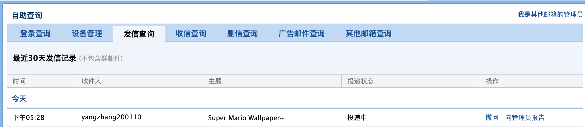
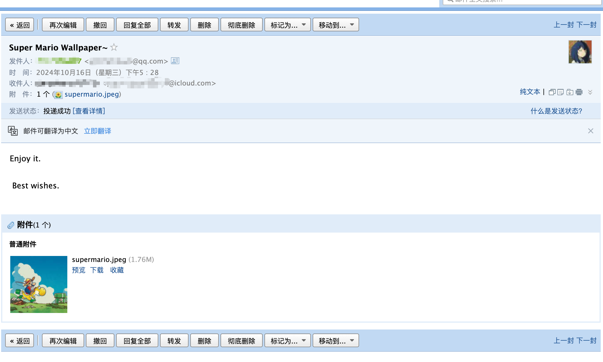
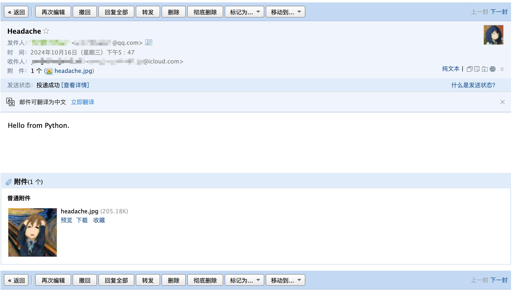

---
tags:
- PyEg
---

# 收发邮件

如果你要给一篮子人发邮件，用Python写一个脚本是个好选择。

## 服务端
首先你需要一个提供 POP3/IMAP/SMTP 服务的邮箱服务商，例如`mail.qq.com`。

而后你可以按照他们的[教程](https://wx.mail.qq.com/list/readtemplate?name=app_intro.html#/agreement/authorizationCode)获取服务器的使用方法：

### 什么是 POP3/IMAP/SMTP 服务

- POP3 （Post Office Protocol - Version 3）协议用于支持使用电子邮件客户端获取并删除在服务器上的电子邮件。
- IMAP （Internet Message Access Protocol）协议用于支持使用电子邮件客户端交互式存取服务器上的邮件。
- SMTP （Simple Mail Transfer Protocol）协议用于支持使用电子邮件客户端发送电子邮件。

### IMAP/SMTP 设置方法

- 用户名/帐户： 你的QQ邮箱完整的地址
- 密码： 生成的授权码
- 电子邮件地址： 你的QQ邮箱的完整邮件地址
- 接收邮件服务器： imap.qq.com，使用SSL，端口号993
- 发送邮件服务器： smtp.qq.com，使用SSL，端口号465或587

### POP3/SMTP 设置方法

- 用户名/帐户： 你的QQ邮箱完整的地址
- 密码： 生成的授权码
- 电子邮件地址： 你的QQ邮箱的完整邮件地址
- 接收邮件服务器： pop.qq.com，使用SSL，端口号995
- 发送邮件服务器： smtp.qq.com，使用SSL，端口号465或587

??? question "IMAP 和 POP 有什么区别？"
    **POP允许电子邮件客户端下载服务器上的邮件，但是你在电子邮件客户端上的操作（如：移动邮件、标记已读等）不会反馈到服务器上的**，比如：你通过电子邮件客户端收取了QQ邮箱中的3封邮件并移动到了其他文件夹，这些移动动作是不会反馈到服务器上的，也就是说，QQ邮箱服务器上的这些邮件是没有同时被移动的。需要特别注意的是，第三方客户端通过POP收取邮件时，也是有可能同步删除服务端邮件。在第三方客户端设置 POP 时，请留意是否有 保留邮件副本/备份 相关选项。如有该选项，且要保留服务器上的邮件，请勾选该选项。

    **在IMAP协议上，电子邮件客户端的操作都会反馈到服务器上，你对邮件进行的操作（如：移动邮件、标记已读、删除邮件等）服务器上的邮件也会做相应的动作**。也就是说，IMAP 是“双向”的。同时，IMAP 可以只下载邮件的主题，只有当你真正需要的时候，才会下载邮件的所有内容。在 POP3 和 IMAP 协议上，QQ邮箱推荐你使用IMAP协议来存取服务器上的邮件。

??? question "什么是授权码？"
    授权码是QQ邮箱用于登录第三方客户端/服务的专用密码，适用于登录以下服务：POP3/IMAP/SMTP/Exchange/CardDAV/CalDAV 服务。

    温馨提醒：为了你的帐户安全，请不要告诉他人你的授权码，更改QQ帐号密码会触发授权码过期，需要重新获取新的授权码登录。

拿到了授权码之后，就可以使用Python的客户端登录了。

## 客户端

### smtplib
> SMTP 协议客户端

快速发邮件：
```python
from smtplib import SMTP_SSL

from_addr = "user@qq.com"
to_addrs = ["mail@yangzhang.site"]
lines = [
    f"From: {from_addr}", 
    f"To: {', '.join(to_addrs)}", 
    "Hello from Python.",
]
msg = "\r\n".join(lines)

with SMTP_SSL("smtp.qq.com", 465) as server:
    server.set_debuglevel(1)
    server.login(user="user@qq.com", password="******")
    server.sendmail(from_addr, to_addrs, msg)
```

### imaplib
> IMAP4 协议客户端

将打开邮箱，检索并打印消息:
```python
from imaplib import IMAP4_SSL

with IMAP4_SSL("imap.qq.com", 993) as M:
    M.login("user@qq.com", "******")
    M.select(mailbox='INBOX', readonly=True)
    typ, data = M.search(None, 'ALL')
    for num in data[0].split()[:2]:
        typ, data = M.fetch(num, '(RFC822)')
        print('Message %s\n%s\n' % (num, data[0][1]))
```

IMAP4还支持删除邮件等其他的操作，此处不再赘述。

### poplib
> POP3 协议客户端

和IMAP类似，打开邮箱，检索并打印消息：

```python
from poplib import POP3_SSL

M = POP3_SSL("pop.qq.com", 995)
M.user("user@qq.com")
M.pass_("******")
numMessages = len(M.list()[1])
for i in range(numMessages)[:2]:
    for j in M.retr(i + 1)[1]:
        print(j)
```

## 发送复杂邮件

上述例子已经有了纯文本邮件的发送。我们可以使用`email`包来构造更复杂的邮件。

> 更多的例子参考[email: 示例](https://docs.python.org/zh-cn/3/library/email.examples.html#email-examples)

### 纯文本

```python
from smtplib import SMTP_SSL
from email.message import EmailMessage

# 构造邮件消息
with open(textfile) as fp:
    msg = EmailMessage()
    msg.set_content(fp.read())
msg['Subject'] = f'The contents of {textfile}'
msg['From'] = me
msg['To'] = you

# 发邮件
with SMTP_SSL('localhost') as server:
    server.send_message(msg)
```

### 带附件
发送一个马里奥的照片：

```python
from smtplib import SMTP_SSL
from email.message import EmailMessage

# 构造邮件消息
msg = EmailMessage()
msg["Subject"] = "Super Mario Wallpaper~"
msg["From"] = "user@qq.com"
msg["To"] = "xxx@icloud.com"
msg.preamble = "You will not see this in a MIME-aware mail reader.\n"

# 添加附件
with open("/Users/yang/Downloads/imgs/mario.jpeg", "rb") as fp:
    img_data = fp.read()

msg.set_content("Enjoy it. \n\n Best wishes.")
msg.add_attachment(
    img_data, maintype="image", subtype="png", filename="supermario.jpeg"
)

# 发邮件
with SMTP_SSL("smtp.qq.com", 465) as server:
    server.set_debuglevel(1)
    server.login("user@qq.com", "******")
    server.send_message(msg)
```

投递状态：



成功发送：



### MIMEMultipart
> MIME(Multipurpose Internet Mail Extensions)多用途互联网邮件扩展类型

当然，你也可以手动构造MIME消息：

```python
import smtplib
from email.mime.text import MIMEText
from email.mime.multipart import MIMEMultipart

from_addr = "user@qq.com"
to_addrs = ["xxx@icloud.com"]

# 构造邮件
message = MIMEMultipart()
message["Subject"] = "Headache"
message["From"] = from_addr
message["To"] = to_addrs[0]
message.attach(MIMEText("Hello from Python.", "plain", "utf-8"))

# 添加附件
attachment = MIMEText(
    open("/Users/yang/Downloads/imgs/head.jpg", "rb").read(), "base64", "utf-8"
)
# octet-stream指任意类型的二进制流数据
attachment["Content-type"] = "application/octet-stream"
# 附件文件名
attachment["Content-Disposition"] = 'attachment; filename="headache.jpg"'
message.attach(attachment)

# 登录并发送邮件
try:
    server = smtplib.SMTP_SSL("smtp.qq.com", 465)
    server.login("user@qq.com", "******")
    server.sendmail(from_addr, to_addrs, message.as_string())
    print("success")
    server.quit()
except smtplib.SMTPException as e:
    print("error:", e)
```

投递结果：




好诶✌️