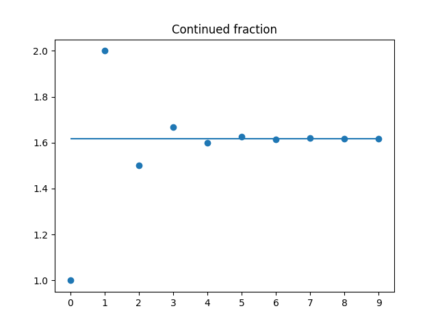
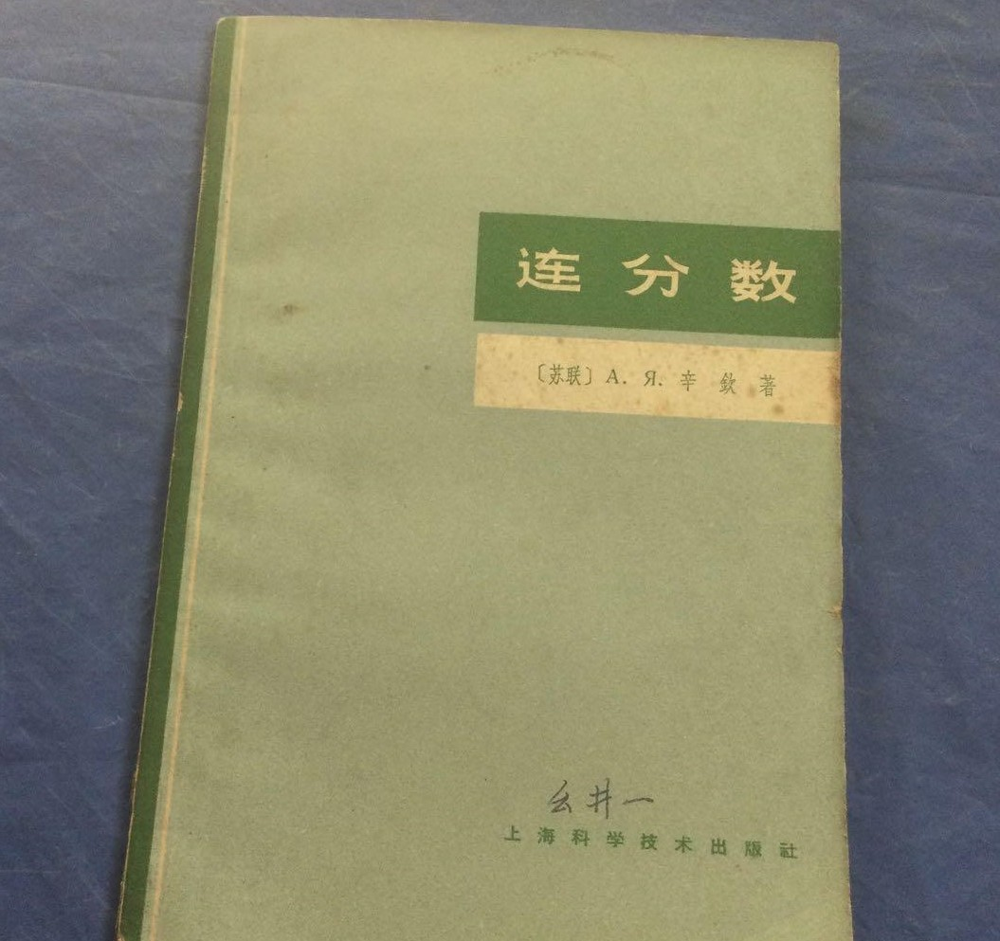
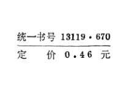

---
tags:
- PyLib
- 读源码
include:
- math
---

# fractions

> 本文最初发在我的微信公众号：悖论14，现转载至此。

如果你想学一点python，那跟着谁学最好呢？我认为是设计python的人，读一读标准库的源代码（特指用python实现的库），**看看设计这门语言的人是如何使用它的**，一定会受益匪浅。

本文内容分为以下三节：

1. 框架的搭建
2. 连分数
3. 分数的运算

## 第一节：框架的搭建

千万别害怕，读源代码听起来高深莫测，其实也就那么一回事儿。fractions的[源代码文件](https://github.com/python/cpython/blob/3.13/Lib/fractions.py)在Cpython的GitHub repo里可以直接看到。其实相当短，去掉注释的话只有400多行。

今天我们将通过对`python 3.10.4`内置分数库`fractions`源代码的解读来介绍下列内容的相关知识

- python编程规范
- OOP基础知识
- 类的魔法方法(magic method)
  - 类的实例化
  - 运算符重载
- 装饰器(decorator)

### fractions是干什么的

> The fractions module provides support for rational number arithmetic.

简单来说就是在Python中，实现了对分数表示和运算的支持。直接举几个例子感受一下：

```python
>>> from fractions import Fraction as f
>>> f('3/7') # 分数表示
Fraction(3, 7)
>>> f('3/7')+f(0.5) # 分数运算
Fraction(13, 14)
>>> f(0.71428571).limit_denominator() # 分数近似
Fraction(5, 7)
```

下面我们来看源代码，在你的python安装路径找到`Lib`文件夹下的`fractions.py`文件，这就是我们要找的源代码啦。

值得注意的是我这里使用最新版的python也就是`python 3.10.4`内置的`fractions`源码，不同版本略有区别，总体上差别不大：

> Changed in version 3.2: The Fraction constructor now accepts float and decimal.Decimal instances.
>
> Changed in version 3.9: The math.gcd() function is now used to normalize the numerator and denominator. math.gcd() always return a int type. Previously, the GCD type depended on numerator and denominator.

### 作者、简介以及依赖

```python title="源代码片段1"
# Originally contributed by Sjoerd Mullender.
# Significantly modified by Jeffrey Yasskin <jyasskin at gmail.com>.

"""Fraction, infinite-precision, real numbers."""
from decimal import Decimal
import math
import numbers
import operator
import re
import sys
```

前两行标注了这个项目的发起人`Sjoerd Mullender`以及做出很大修改的人`Jeffrey Yasskin`.

值得注意的是下面`三引号`里面的内容, 这部分内容有其特殊含义. 它是一个`.py`文件的`__doc__`, 一般是文件内容的说明文档(document).

类似的, 在定义函数或者类的时候, 也可以在`def`和`class`关键字的下一行使用三引号为该对象添加`document`, 我们在写程序的时候也可以使用这种方式来添加说明文档, 增加程序的可读性.

我们可以使用`__doc__`来访问一个对象的`document`.

```python
>>> import fractions
>>> fractions.__doc__
'Fraction, infinite-precision, real numbers.'
```

依赖的几个库大概功能介绍如下

- `decimal`库是python的一个处理小数的库
- `math`,`re`,`sys`比较常见,分别是数学库, 正则库以及系统库
- `numbers`官方说法是`The abstract base classes making up the numeric tower.`一个比较底层的库.
- `operator`是一个运算符库. `+`,`-`,`%`这类运算符都在该库中有定义.

### 常量定义

为了方便查看, 我们去掉了所有的注释. 但是多写注释是一个必要的好习惯!

源码中注释的比例往往是很高的, `fractions.py`源码748行, 去掉所有的注释后仅有423行, 注释量恐怖如斯.

```python title="源代码片段2"
__all__ = ['Fraction']
_PyHASH_MODULUS = sys.hash_info.modulus
_PyHASH_INF = sys.hash_info.inf
_RATIONAL_FORMAT = re.compile(r"""
    \A\s*                      
    (?P<sign>[-+]?)            
    (?=\d|\.\d)                
    (?P<num>\d*)               
    (?:                        
       (?:/(?P<denom>\d+))?    
    |                          
       (?:\.(?P<decimal>\d*))? 
       (?:E(?P<exp>[-+]?\d+))? 
    )
    \s*\Z
""", re.VERBOSE | re.IGNORECASE)
```

首先是`__all__`这个变量, 这是声明此文件中可调用的所有对象(更多时候这是为了声明一个库的所有子模块`submodule`). 可以理解为`from fractions import *`之后, 命名空间多出来的所有东西. 定义这一变量可以隐藏某些接口, 例如下面的用法

```python
# tmp.py
def A():
    pass
class B():
    pass
__all__ = ["B"]
```

该文件中定义了两个对象, 分别是函数`A`和类`B`, 但是我用`__all__`声明了只有`B`, 于是我在另外一个文件中`from tmp import *`的时候只会载入`B`:

```python
>>> from tmp import *
>>> print(dir())
['B', '__annotations__', '__builtins__', '__cached__', '__doc__', '__file__', '__loader__', '__name__', '__package__', '__spec__']
```

注意用双下划线开始和结束的变量一般都是有特殊用途的保留变量, 例如最常见的`__name__`, 就声明了该文件是以导入的方式运行还是以主文件运行.

其次是`_PyHASH_MODULUS`和`_PyHASH_INF`, 分别是`hash`函数和`inf`的定义. 后续我们会看到它们的用法.

最后是`_RATIONAL_FORMAT`这就是一个正则表达式, 它对应着各种分数的合法表达形式. 例如`2/3`, `0.5`等.

### 主类定义和实例化方法

```python title="源代码片段3"
class Fraction(numbers.Rational):
    __slots__ = ('_numerator', '_denominator')
```

这段代码使用`class`关键字声明了 Fraction的定义, 它继承于`numbers.Rational`. 也就是说它有`Rational`的属性和方法.

然后我们又碰到了一个双下划线开头的变量`__slots__`, slot在英文里的意思是插槽之类的东西, 在这里的作用是声明`Fraction`类拥有的属性, 也就是分子(numerator)和分母(denominator).

下面所有的源代码引用都是`Fraction`类中定义的方法, 本应该缩进一下, 但是为了美观就不做缩进了.

```python title="源代码片段4"
def __new__(cls, numerator=0, denominator=None, *, _normalize=True):
    self = super(Fraction, cls).__new__(cls)
    if denominator is None:
        巴拉巴拉
    if denominator == 0:
        raise ZeroDivisionError('Fraction(%s, 0)' % numerator)
    if _normalize:
        g = math.gcd(numerator, denominator)
        if denominator < 0:
            g = -g
        numerator //= g
        denominator //= g
    self._numerator = numerator
    self._denominator = denominator
    return self
```

这是类中第一个方法`__new__`, 和我们一般见到的`__init__`方法略有不同.

这里我们需要理解类实例化的逻辑. 如果我们有一个`class`:

```python
class A(object):
    pass
```

当我们实例化的时候:

```python
a = A()
```

实际上背后的逻辑是:

```python
a = A.__new__(...).__init__(...)
```

也就是说, 我们先使用`__new__`方法创建对象, 然后使用`__init__`初始化对象.

注意所有python的类默认继承`object`, 如果我们没有重载相应的方法, 就默认使用`object`中定义的方法, 这也是为什么我们平时只定义`__init__`也可以成功创建实例.

之所以这里使用`__new__`而不用`__init__`是因为我们想要实现一个不可变(`inmutable`)的类.

该方法的其他内容就是处理不同的输入情况, 并且若有必要进行一定的正则化: 保持分母为正, 分子分母没有公约数.

最终返回了`self`(self一词在class的内部一般代指类的实例), 从这一点也可以看出`__new__`的作用就是创建类的实例.

### 其他的实例化方法

```python title="源代码片段5"
@classmethod
def from_float(cls, f):
    if isinstance(f, numbers.Integral):
        ...
    return cls(*f.as_integer_ratio())
@classmethod
def from_decimal(cls, dec):
    ...
    return cls(*dec.as_integer_ratio())
```

这是`Fractions`类的第2,3个方法, 注意到它有一个修饰器`@classmethod`, 这表示他是一个实例化方法(可以用此方法创建类的实例).

用法如下

```python
f = Fractions.from_float(0.5)
```

如果你理解了`__new__`方法, 那么这个方法本身不难理解, 这里补充一些装饰器的概念.

### 装饰器的使用

装饰器在OOP中经常碰到, 例如

- `@classmethod`
- `@staticmethod`
- `@property`
- `@property.setter`
- `@property.getter`等.

我列举这五个分别是

- 实例化方法
- 静态方法
- 属性方法
- 属性的设置方法
- 属性的获取方法

它们各自怎么用这里不多说, 我们只要理解装饰器是如何工作的.

当你`@decorator`的时候, 例如:

```python
@decorator
def func():
    pass
```

完全等价于

```python
def func():
    pass
func = decorator(func())
```

注意我说完全等价于, 的的确确是完全等价于. 因为`@`这个用法只是一个语法糖(第一次听到这个词的时候觉得超级可爱), 是程序猿为了节约时间发明的一种简写方法.

看到这样下面一个形式, 或许你已经猜到它的原理了

```python
func = decorator(func)
```

装饰器, 器如其名, 就是在函数外层添加一个包装, 在数学中相当于复合函数.

举个例子:

```python
def warn(func):
    print(f"{func.__name__} is decorated")
    def inner(*args,**kargs):
        print("位置参数:",args)
        print("关键字参数:",kargs)
        return func(*args,**kargs)
    return inner
@warn
def calculate(x,y,op):
    return eval(f"{x}{op}{y}")
```

上述函数定义完之后, 会输出`calculate is decorated`, 这不难理解, 因为我们相当于运行了`calculate = warn(calculate)`

调用:

```python
>>> calculate("4","5",op="+")
位置参数: ('4', '5')
关键字参数: {'op': '+'}
9
```

解析:

这时候`calculate`已经被`warn`函数装饰成`inner`了, 我们调用它相当于在做下面的事情

```python
inner("4","5",op="+")
```

根据这个函数的定义, 这句话等价为:

```python
print("位置参数:",["4","5"])
print("关键字参数:",{"op":"+"})
return calculate(*["4","5"],**{"op":"+"})
```

使用装饰器我们可以做很多事情, 例如生成日志信息, 管理函数的输入等等. 熟悉之后非常好用!

至此`Fractions`的框架已经搭建好了, 下面就需要实现实例间各种运算以及一些特殊的方法, 这些内容较为独立我们放到下一篇推文, 敬请期待.

## 第二节：连分数

今天咱们接着来看fractions的源代码.

上一篇推文已经看完了框架部分, 包括下面的部分

- docstring
- 依赖库
- 常量定义
- `class`语句
- `__new__`方法
- 其他使用`@classmethod`装饰器的方法

至此我们实际上已经可以**用各种方法**创建一个分数对象了:

```python
>>> from fractions import Fraction as f
>>> f(0.5)
Fraction(1, 2)
```

下面我们来给这个分数类实现一些特性.

> 为了方便归类展示, 后面引用源码的时候会做一定的顺序调整, 不影响程序的结构和功能.

### 分子和分母

```python title="源代码片段6"
def as_integer_ratio(self):
    return (self._numerator, self._denominator)
@property
def numerator(a):
    return a._numerator
@property
def denominator(a):
    return a._denominator
```

这三个方法都是分子分母的接口, 第一个方法`as_integer_ratio`, 它返回元组`(numerator, denominator)`. 另外两个方法则分别返回分子和分母.

注意`@property`装饰器, 这表明此方法是一个`属性`方法,在调用的时候不需要加`()`, 而一般的方法若不加括号则不能调用:

```python
>>> f(0.5).numerator # 属性
1
>>> f(0.5).as_integer_ratio # 一般方法
<bound method Fraction.as_integer_ratio of Fraction(1, 2)>
>>> f(0.5).as_integer_ratio() # 一般方法()
(1, 2)
```

下面还有另外一个重要的方法和分子分母相关

```python title="源代码片段7"
def limit_denominator(self, max_denominator=1000000):
    if max_denominator < 1:
        raise ValueError
    if self._denominator <= max_denominator:
        return Fraction(self)
    p0, q0, p1, q1 = 0, 1, 1, 0
    n, d = self._numerator, self._denominator
    while True:
        a = n//d
        q2 = q0+a*q1
        if q2 > max_denominator:
            break
        p0, q0, p1, q1 = p1, q1, p0+a*p1, q2
        n, d = d, n-a*d
    k = (max_denominator-q0)//q1
    bound1 = Fraction(p0+k*p1, q0+k*q1)
    bound2 = Fraction(p1, q1)
    if abs(bound2 - self) <= abs(bound1-self):
        return bound2
    else:
        return bound1
```

### 连分数

这个方法是全篇唯一涉及一点点数学以及算法的地方, 恰是我的兴趣点, 我们仔细唠一唠.

**连分数理论**是该算法的基础, 下文略作介绍, 主体内容参考苏联数学家辛钦的著作《连分数》, 也结合了WiKi的相关词条([连分数](https://zh.wikipedia.org/zh-hans/%E8%BF%9E%E5%88%86%E6%95%B0), [丢番图逼近](https://zh.wikipedia.org/zh-hans/%E4%B8%9F%E7%95%AA%E5%9C%96%E9%80%BC%E8%BF%91)).

从数学史的角度来说, 研究连分数的动机源于想要有**实数**在“数学上纯粹”的表示, 可以说是一个数学家追求美的产物. 下面看完下面的论述, 想必你也能体会到它优雅的美.

形如
$$
a=a_0+\frac{1}{a_1+\frac{1}{a_2+\frac{1}{a_3+...}}}
$$
这样的算式称为连分数. 一般简记为$[a_0;a_1,a_2,a_3,\cdots]$. 如果最终只有有限项分式, 那么称为有限连分数. 若有无限项, 则称之为无限连分数.

一般我们都取$a_i\in \mathrm{N}$, 当然也可以取任意合法的实数. 无限连分数的收敛性由下列定理描述.

!!! theorem "定理10"
    连分数$[a_0;a_1,a_2,a_3,\cdots]$收敛的充分必要条件为
    $$\sum_{n=0}^{\infty}a_n
    $$
    发散.  

    摘自《连分数》苏联.辛钦.上海科学技术出版社.

### 实数的连分数表示方法

可以证明

!!! theorem "定理14"
    每一个实数a都对应着**唯一**的以这个数为值的连分数.如果数a是有理的, 那么这个连分数是有限的;如果它是无理的, 则是无限的.  

    摘自《连分数》苏联.辛钦.上海科学技术出版社.

对于有理数来说, 此定理显然. 例如$\frac{10}{7}$

- 首先分离整数部分$1+\frac{3}{7}$
- 再对小数部分取倒数$\frac{7}{3}=2+\frac{1}{3}$
- 回代得到

$$
\frac{10}{7}=1+\frac{1}{2+\frac{1}{3}}
$$
实际上就是不断取倒数, 分离整数部分的迭代过程.

无理数则对应一个无限连分数, 涉及到数列的极限. 我们举一例说明, 黄金分割比:
$$
1.618\cdots=\frac{1+\sqrt{5}}{2}=1+\frac{1}{1+\frac{1}{1+\frac{1}{1+\cdots}}}
$$
<center><font><i>黄金分割用连分数来表达十分优雅!</i></font></center>

这个式子的证明也很简单, 我们给出连分数的递推式:
$$
A_0=1,A_{n+1} = \frac{1}{A_n}+1
$$
两边取极限得到:
$$
A=\frac{1}{A}+1
$$
即是
$$
A^2-A-1=0
$$
$A$显然大于1, 故$A=\frac{1+\sqrt{5}}{2}=a$.

可以看到, 实际上我们是在用一个数列$A_k$来逼近$a$
$$
\left\\{1,2,\frac{3}{2},\frac{5}{3},\frac{8}{5},\frac{13}{8},\frac{21}{13}\cdots\right\\}
$$
逼近过程如图



这个定理可以说是"数学上纯粹"的核心体现. 连分数十分优雅地统一了有理数和无理数的表示方法, 和传统的小数表示思路截然不同但又有些共通之处.

### 渐进分数

任意一个实数$[a_0;a_1,a_2,\cdots]$, 可以用$k$阶截断连分数$A_k = [a_0;a_1,a_2,\cdots,a_k]$来逼近, $A_k$称为$k$阶渐进分数. 如果用
$$
A_k=\frac{p_k}{q_k}
$$
来描述, 那么可以证明渐进分数的构成规律如下:

!!! theorem "定理1"
    对于任何$k\ge 1$
    $$
    p_k = a_kp_{k-1}+p_{k-2}\\
    q_k = a_kq_{k-1}+q_{k-2}
    $$
    其中$A_{-1}=1/0=p_{-1}/q_{-1}$  

    摘自《连分数》苏联.辛钦.上海科学技术出版社.

上述定理给出了如何从根据连分数写出渐进分数, 下面我们介绍$a_k$也就是连分数形式的求法(实际上求法已经在前文的例子$\frac{10}{7}$中出现了, 这里给出更加一般的描述).

我们定义$[a_0;a_1,a_2,\cdots]$的余式为$$r_k=[a_k;a_{k+1},a_{k+2},\cdots]$$
显然$r_0=a=[a_0;a_1,a_2,\cdots]$

并且根据定义有
$$
\begin{aligned}
&r_{k}\\\\
=&[a_k;a_{k+1},a_{k+2},\cdots]\\\\
=&a_k+\frac{1}{a_{k+1}+\frac{1}{a_{k+2}\cdots}}\\\\
=&a_k+\frac{1}{r_{k+1}}> 1
\end{aligned}
$$
也就是$$r_{k}=a_k+\frac{1}{r_{k+1}}(k\ge0)$$
上式向下取整得到
$$
a_{k}=\left\lfloor r_k \right\rfloor(k\ge0)
$$
那么对于任一实数$a$, 可以根据$a_0=\lfloor r_0\rfloor=\lfloor a\rfloor$求出连分数的首项, 进而可以求得$r_1=\frac{1}{a-a_0}$, 再由$a_1=\lfloor r_1\rfloor$可以求得$r_2=\frac{1}{r_1-a_1}$

依此类推, 可以求得$a$的连分数表示$[a_0;a_1,a_2,\cdots]$. 这可以作为定理14一个粗略的证明.

我们前面直接给出了黄金分割数的连分数形式, 但是没有推导, 下面则给出连分式的推导过程.

$$
a=1.618\cdots=\frac{1+\sqrt{5}}{2}
$$
<center>
<table border="1">
    <tr>
        <th>k</th>
        <th>r_k</th>
        <th>a_k</th>
    </tr>
    <tr>
        <td>0</td>
        <td>1.61803</td>
        <td>1</td>
    </tr>
    <tr>
        <td>1</td>
        <td>1.61803</td>
        <td>1</td>
    </tr>
    <tr>
        <td>2</td>
        <td>1.61803</td>
        <td>1</td>
    </tr>
</table>
</center>

此后的$a_k$始终为$1$, 出现这种情况是由于余式递推过程中,$r_1=1/(1-r_0)=1/(1-a)=a$, 最后一个等式是由于黄金分割比是下式的一个根
$$
a=\frac{1}{a-1}
$$
所以$r_k\equiv a$, 从而$a_k\equiv 1$. 我们这里同时也给出黄金分割数的各阶渐进分数:
$$
\left\\{\frac{0}{1},\frac{1}{0},\frac{1}{1},\frac{2}{1},\frac{3}{2},\frac{5}{3},\frac{8}{5}\cdots\right\\}
$$
不难发现, 分子分母各成一个斐波拉契数列, 实在是美轮美奂.

渐进分数的定义可以类比小数
$$
a=\sum_{n=0}^{+\infty}\tilde{a}_n10^{-n}
$$
进行级数的截断可以得到保留$k$位有效数字的小数.

值得一提的是:

!!! theorem "定理11"
    一切渐进分数都是既约分数.  

    摘自《连分数》苏联.辛钦.上海科学技术出版社.

这也是连分数表示一个优良的性质.

### 实数的最佳丢番图逼近

可以证明

!!! theorem "定理15"
    实数a的任何第一类最佳逼近都是这个数的连分数的渐进分数或者中位数.  

    摘自《连分数》苏联.辛钦.上海科学技术出版社.

显然最佳逼近不是一个单独的数, 而是一系列数. 上述定理中第一类最佳逼近的定义如下:

我们称$\frac{a}{b}(b>0)$是$\alpha$的第一类最佳逼近, 若

$$
0\lt d\le b, \quad \frac{a}{b}\ne \frac{c}{d}\Rightarrow \left|\alpha - \frac{c}{d}\right|\gt \left|\alpha - \frac{a}{b}\right|
$$

也就是任何分母不超过$b$的分数都比$a/b$的逼近效果差.

而中位数指的是
$$
\mathrm{mid}(\frac{a}{b},\frac{c}{d})=\frac{a+c}{b+d}
$$
它位于两个分数之间, 显然有
$$
\frac{a}{b}\le\frac{c}{d}\Rightarrow\frac{a}{b}\le\frac{a+c}{b+d}\le\frac{c}{d}
$$
这样总有点膈应, 我们废了那么大劲搞出来的连分数竟然有的时候不是最佳逼近, 但如果在第二类最佳逼近的意义下就可以得出**更加完美的结论**:

!!! theorem "定理16"
    实数的任何第二类最佳逼近是渐进分数.  

    摘自《连分数》苏联.辛钦.上海科学技术出版社.

不过第二类最佳逼近的定义相对第一类就不那么直观:

我们称$\frac{a}{b}(b>0)$是$\alpha$的最佳逼近, 若
$$0\lt d\le b, \quad \frac{a}{b}\ne \frac{c}{d}\Rightarrow \left|d\alpha - c\right|\gt \left|b\alpha - a\right|$$

我们举一个例子来说明第一类最佳逼近和第二类最佳逼近的区别与联系, 考虑自然对数底数$e$的最佳逼近:
$$
\begin{aligned}
&e \approx 2.718281828459045\\\\
&\mathrm{Type 1}\quad\left\\{\frac{3}{1}, \frac{5}{2},\frac{8}{3}, \frac{11}{4}, \frac{49}{18}, \frac{68}{25}, \frac{87}{32},\frac{106}{39}\cdots\right\\}\\\\
&\mathrm{Type 2}\quad\left\\{\frac{3}{1}, \frac{8}{3}, \frac{11}{4}, \frac{19}{7}, \frac{87}{32}, \frac{106}{39}\cdots\right\\}
\end{aligned}
$$
显然可见, 第二类最佳逼近更加"稀疏", 第二类最佳逼近必然是第一类最佳逼近, 但是第一类最佳逼近不必是第二类最佳逼近.

我们这里的`limit_denominator()`方法采用的是第一类最佳逼近. 那么根据定理15, 最佳逼近要么在$A_{k+1}$取到, 要么在$A_{k}和A_{k+1}$的某个中位数取到.

源码的注释中把那个中位数称为最佳下界逼近, 把$A_{k+1}$称为最佳上界逼近, 若$A_k\le a\le A_{k+1}$, 想来也是很合理的.

具体实现方法是

- 输入一个分式 `f = n/d`
- 初始化 ==> 一阶为1/0, 二阶为0/1
- 在一个while循环中不断递推求渐进分数
    - a = int(r) 实际上为 `a = n//d`
    - 判断下一阶渐进分数的分母是否超出了用户设置的上限, 若超出了则跳出循环, 否则进入下一步
    - 利用**定理1**的内容更新逼近, 新的渐进分数为
    $$
    \frac{p_0+ap_1}{q_0+aq_1}
    $$
    - 更新余式r = 1/(r-a)也就是`n,d = d, n-a*d`.
    - 注意前面的代码把 n//d当作是int(r)所以需要在这里**交换**n和d
- 循环结束, 我们已经获得了合法分母的**次高阶**和**最高阶**渐进分数`p0/q0`和`p1/q1`
- 根据**定理15**, 下面考虑中位数`(p0+k*p1)/(q0+k*q1)`其中k取使得分母合法的最大整数, 也即使得分母尽量大(我的理解是分母越大近似能力越强, 故这么取中位数)

<center><s>实话说我想不出如何严格证明中位数这么取,实在才疏学浅</s></center>

- 比较下界(中位数)和上界(p1/q1)谁逼近得更好返回谁.

可以验证上述算法, 对负值也成立, 因为符号仅影响$a_0$:
$$
\frac{n}{d} = \lfloor \frac{n}{d} \rfloor+\frac{1}{r}
$$
当$n/d<0$的时候, 向下取整$\lfloor \frac{n}{d} \rfloor=1+\lfloor -\frac{n}{d} \rfloor$, 也就是说$r>0$, 例如$-1.5=-2+0.5$.

至此, 整个`fractions`最有技术含量的一个函数就讲完了. 虽然讲了很多数学, 但是本质上的想法非常简单. 任何人都可以上手, 都可以从中深刻体会到数学的美感.

非常推荐大家去读一下辛钦写的这本连分数, 书很薄差不多刚到100页, 读起来很爽:

<figure markdown>

{width=400}

<figurecaption>这是我从网上找的封面</figurecaption>
</figure>

我手里有一个扫描版, 和图里的版本一致都是上海科学出版社的.

书翻到最后一页, 还有一个小彩蛋:



这样一本好书, 原价0.46元, 现在直接免费了, 在公众号后台回复**连分数**获取全本, 还不快冲??

啊, 营销的口吻真ex

不过我们似乎还忘了点什么...源代码还没看完呢! 洋洋洒洒写了那么多, 推文又很长了, 还是放到下篇文章吧. 余下的内容都是一些常见魔法方法的定义, 讲起来很快. 还是敬请期待下周的推送!

## 第三节：分数的运算

前两篇推文我们已经介绍了fractions库整个框架的搭建

[这里放链接](./fractions.md#_1)

以及一个重要的函数`limit_denominator`

[这里放链接](./fractions.md#_7)

至此我们以及可以用各种方式创建`Fraction`类了, 还可以找到任一实数的最佳逼近分数. 接下来我们要实现分数之间的运算, 例如`a+b`,`a*b`,`a/b`等.

我们先讲一点OOP的基础知识作为铺垫

### 用类的语言来理解py的一切

从最简单的一个例子说起

```python
>>> print("Hello World!")
Hello World!

```

从类的角度来看, `print`是一个`callable`的对象, 在`print`后面接着`()`就是在调用它的`__call__`方法, 传入的参数也就是该方法定义的参数.

也就是说, 上面这段代码等价于

```python
>>> print.__call__("Hello World!")
Hello World!

```

理解了这个你就可以实现一个`callable`的类了, 例如

```python
>>> class ins:
...     def __call__(self):
...         print("I am called.", end='')
>>> ins()()
I am called.
```

不过新的疑惑出现了, 为什么这里有两个`()`呢?

实际上第一组`()`调用`__new__`方法, 返回了`ins`类的一个实例, 第二组`()`则调用了该实例的`__call__`方法.

也就是说`ins()()`等价于下面的代码

```python
>>> ins.__new__(ins).__call__()
I am called.
```

*不过这样的解释还是不够底层, 不过我能力有限也就只能理解到这一层.*

### 运算符

上面这个例子和我们的分数类其实没太大的关系, 因为我们并不打算让分数`callable`. 我们要实现的是一系列的数学运算.

最简单的就是加法了

```python
>>> a, b = 1, 2
>>> a + b
3
```

这等价于a左加b

```python
>>> a.__add__(b)
3
```

或者是b右加a

``` python
>>> b.__radd__(a)
3
```

类似的有

- `__sub__`定义减法(subtract), `a-b`
- `__mul__`定义乘法(multiply), `a*b`
- `__truediv__`定于除法(divide), `a/b`
- `__floordiv__`定义地板除(floor divide), `a//b`
- `__mod__`定义模余(modulo), `a%b`
- `__pow__`定义次幂(power), `a**b`

以上都是常见的算术二元运算符, 有的时候我们定义诸如`__rmul__`使得左侧运算和右侧运算具有不同的性质, 例如矩阵乘法就需要分别定义左乘和右乘.

类似的还有逻辑运算符, 一元的运算符, 位运算符以及增强赋值, 列举如下:

- 逻辑运算符
- `__eq__`定义等于(equal to)`a==b`
- `__ne__`定义不等于(not equal to)`a!=b`
- `__le__`定义小于等于(less than or equal to)`a<=b`
- `__ge__`定义大于等于(greater than or equal to)`a>=b`
- `__lt__`定义小于(less than)`a<b`
- `__gt__`定义大于(greater than)`a>b`
- 一元运算符
- `__pos__`定义取正(positive)`+a`
- `__neg__`定义取负(negative)`-a`
- 位运算符
- `__invert__`定义取反(invert)`~a`
- `__or__`定义或`a | b`
- `__xor__`定义异或(exclusive or)`a ^ b`
- `__and__`定义与`a & b`
- `__lshift__`定义左移`a << b`
- `__rshift__`定义右移动`a >> b`
- 增强赋值
- `__iadd__`定义加等于`a+=b`
- 类似的有`a-=b`,`a*=b`,`a/=b`,`a//=b`等
- 以及一些位预算符`a>>=b`,`a<<=b`,`a&=b`

其中位运算符是一个大坑, 千万要注意`&`和`|`在python中是位运算符不是逻辑运算符, 1和2的与是0啊, 千万不要用这个来做逻辑判断.

```python
>>> 1 & 2 == 0
True
```

这些运算符虽然看起来多, 但是命名都贴合实际用途, 记住了英文还是很好记下来的!

### 魔法方法

严格来说上面的`__mul__`之类的也是魔法方法, 这种用前后双下划线的特殊方法在OOP中称为魔法方法. 是python保留的方法, 通常用于实现特殊的功能. 我们再来介绍几个常见的!

#### `__str__`

不难发现, python几乎万物皆可`str()`, 你把任何一个东西放到str函数中都会得到一个什么输出. 就是因为他们都定义了`__str__`魔法方法, 例如

```python
>>> class example:
...     def __str__(self):
...         return "str magic method!"
>>> str(example())
'str magic method!'
```

#### `__repr__`

类似的, python万物皆可`print()`, 它输出的内容定义在`__repr__`方法中, repr是representation的缩写, 意为描述:

```python
>>> class example:
...      def __repr__(self):
...          return "print magic method!"
>>> print(example())
print magic method!

```

我们也可以显示调用`repr()`函数来得到representation内容

```python
>>> repr(example())
'print magic method!'
```

#### `__getitem__`和`__setitem__`和`slice`

我们似乎忘记了python亲儿子`list`, 作为python最常用的数据类型, `list`有很多语法现象

```python
>>> l = [1, 2, 3, 4]
>>> l[0] # getitem
1
>>> l[2] = 10 # setitem
>>> l[::2] # slicing
[1, 10]
```

`[]`是一种常见的运算符, 单独使用的时候, 它的作用是`getitem`, 也就是拿出指定的元素.

如果放在赋值号的左侧那么就是`setitem`. 如果使用了`:`, 那么就可以一起性取出多个元素, 也就是所谓的slicing.

注意`slice`在python中是一种数据类型(一个三元组, 包括start, stop以及step), 本身也是一个类, 我们可以用下面的方式实现slicing

```python
>>> class example:
...     # 实现列表从1开始计数
...     def __init__(self, l):
...         self.value = l
...     def __getitem__(self, key):
...         if isinstance(key, int):
...             return self.value[key-1]
...         elif isinstance(key, slice):
...             a = key.start-1
...             b = key.stop-1
...             c = key.step
...             return self.value[a:b:c]
>>> e = example([1,2,3,4,5])
>>> print(e[1:5:2], e[1:3], e[2], end='')
[1, 3] [1, 2] 2
```

下面这个例子可以帮你理解slice

```python
>>> [1,2,3,4,5][slice(0,4,2)]
[1, 3]
>>> [1,2,3,4,5][0:4:2]
[1, 3]
```

可以说, `[0:4:2]`这种写法也是一种语法糖, 为了简写而生, 实质上与`[slice(0,4,2)]`无异.

另外提一嘴, 与之类似的还有一个特殊的保留字在切片的时候经常遇到, `...`与`Ellipsis`无异, 也是一种简写, 这在numpy数组的切片中经常遇到.

- `__getitem__`定义`a[]`, 同时可以实现切片
- `__setitem__`定义`a[] = b`

#### `dir`

诸如此类的魔法方法太多太多了, 我就不再一一列举, 后面见到了再说. 这里介绍一个有用的内置函数, 每当遇到一个对象你都可以用`dir()`函数查看它的全部方法.

```python
>>> from fractions import Fraction
>>> dir(Fraction)
['__abs__', '__abstractmethods__', '__add__',
'__bool__', '__ceil__', '__class__',
'__complex__', '__copy__', '__deepcopy__',
'__delattr__', '__dir__', '__divmod__',
'__doc__', '__eq__', '__float__',
'__floor__', '__floordiv__', '__format__',
'__ge__', '__getattribute__', '__gt__', 
'__hash__', '__init__', '__init_subclass__', 
'__le__', '__lt__', '__mod__',
'__module__', '__mul__', '__ne__',
'__neg__', '__new__', '__pos__',
'__pow__', '__radd__', '__rdivmod__', 
'__reduce__', '__reduce_ex__', '__repr__', 
'__rfloordiv__', '__rmod__', '__rmul__', 
'__round__', '__rpow__', '__rsub__',
'__rtruediv__', '__setattr__', '__sizeof__',
'__slots__', '__str__', '__sub__',
'__subclasshook__', '__truediv__',
'__trunc__', '_abc_impl', '_add',
'_denominator', '_div', '_divmod',
'_floordiv', '_mod', '_mul',
'_numerator', '_operator_fallbacks',
'_richcmp', '_sub', 'as_integer_ratio',
'conjugate', 'denominator', 'from_decimal',
'from_float', 'imag', 'limit_denominator',
'numerator', 'real']
```

上述就是`Fraction`实现的全部方法, 其中有一部分继承自它的父类, 下面是`Fraction`的继承关系

```python
>>> Fraction.__mro__
(
<class 'fractions.Fraction'>,
<class 'numbers.Rational'>,
<class 'numbers.Real'>,
<class 'numbers.Complex'>,
<class 'numbers.Number'>,
<class 'object'>
)
```

另外一部分方法在`Fraction`的源代码中定义或被重载, 下面我们来逐一解读.

### 分数的格式化输出

- `__str__`定义`str(a)`的返回值
- `__repr__`定义`repr(a)`的返回值, 同时也是`print(a)`的输出值

```python title="源代码片段8"
def __repr__(self):
    return '%s(%s, %s)' % (self.__class__.__name__,
                            self._numerator, self._denominator)
def __str__(self):
    if self._denominator == 1:
        return str(self._numerator)
    else:
        return '%s/%s' % (self._numerator, self._denominator)
```

这两个魔法方法定义了`Fraction`输出时的样子, 没什么可讲的, 举几个例子看看.

```python
>>> f = Fraction("1/3")
>>> f
Fraction(1, 3)
>>> print(f)
1/3
>>> str(f)
'1/3'
>>> repr(f)
'Fraction(1, 3)'
```

### 分数的四则运算

```python title="源代码片段9"
def _operator_fallbacks(monomorphic_operator, fallback_operator):
    def forward(a, b):
        if isinstance(b, (int, Fraction)):
            return monomorphic_operator(a, b)
        elif isinstance(b, float):
            return fallback_operator(float(a), b)
        elif isinstance(b, complex):
            return fallback_operator(complex(a), b)
        else:
            return NotImplemented
    forward.__name__ = '__' + fallback_operator.__name__ + '__'
    forward.__doc__ = monomorphic_operator.__doc__
    def reverse(b, a):
        if isinstance(a, numbers.Rational):
            return monomorphic_operator(a, b)
        elif isinstance(a, numbers.Real):
            return fallback_operator(float(a), float(b))
        elif isinstance(a, numbers.Complex):
            return fallback_operator(complex(a), complex(b))
        else:
            return NotImplemented
    reverse.__name__ = '__r' + fallback_operator.__name__ + '__'
    reverse.__doc__ = monomorphic_operator.__doc__
    return forward, reverse
```

注意这个方法一`单下划线`开头, 说明这是一个私有方法, 不对外开放. (或者说是这是为了方便程序内部实现一些功能的, 在外部使用没有实际意义)

这个方法的功能就是同时实现`双侧运算`.

举个例子来说, 我们想要同时定义左侧加法和右侧加法, 也就是`a+f`和`f+a`. 其中f就是我们`Fraction`类的实例, a是`[int,float, complex, Fraction]`中的一个.

一个方案是写两个方法`__add__`和`__radd__`, 但是这样有点呆, 因为两个函数的内容想必几乎一致, 并且可以想象后续其他的运算也是如此. 于是源码中写了一个函数来同时生成两个函数.

它输入`monomorphic_operator`(左侧运算符),和`fallback_operator`(右侧运算符), 返回两个函数.

例如

```python
__add__, __radd__ = _operator_fallbacks(_add, operator.add)
```

其中`_add`是我们定义好的`f+a`的函数.

内部的逻辑就是, 左侧加法定义为

- `f+a = f__add__(a) = forward(f, a)`
- `forward(f,a)`仅当a也是分数类型的时候, 返回`_add(f,a)`
- 其他情况, 把f转化为a的类型, 然后再相加.

右侧加法定义为

- `a+f = f__radd__(a) = reverse(a, f)`.
- `reverse(a,f)`仅当a也是分数类型的时候, 返回`_add(f,a)`
- 其他情况, 把f转化为a的类型,然后再相加.

>说实话, 我觉得这种写法非常的麻烦!!!  
>我宁可手动实现`__add__`和`__radd__`两个方法也不写这么迷惑的方法.

#### 加减法

- `__add__`定义左侧加法
- `__sub__`定义左侧减法
- `__radd__`定义右侧加法
- `__rsub__`定义右侧减法

```python title="源代码片段10--加减"
def _add(a, b):
    na, da = a.numerator, a.denominator
    nb, db = b.numerator, b.denominator
    g = math.gcd(da, db)
    if g == 1:
        return Fraction(na * db + da * nb, da * db, _normalize=False)
    s = da // g
    t = na * (db // g) + nb * s
    g2 = math.gcd(t, g)
    if g2 == 1:
        return Fraction(t, s * db, _normalize=False)
    return Fraction(t // g2, s * (db // g2), _normalize=False)
__add__, __radd__ = _operator_fallbacks(_add, operator.add)

def _sub(a, b):
    ...
__sub__, __rsub__ = _operator_fallbacks(_sub, operator.sub)
```

上面是加法的运算方法
$$
\frac{n_a}{d_a}+\frac{n_b}{d_b}=\frac{n_ad_b+n_bd_a}{d_ad_b}
$$
算法还进行了约分, 细节就不说了, 一看便知.
下面用同样的方法可以定义减法.

>另外一个让我匪夷所思的就是`a-b=a+(-b)`这种trick为什么不用, 有必要把几乎完全一样的算法重复写一次吗? 我在此大放厥词, 如果让我来写必然比这简洁的多!

#### 乘除法

- `__mul__`定义左侧乘法
- `__truediv__`定义左侧除法
- `__rmul__`定义右侧乘法
- `__rtruediv__`定义右侧除法

```python title="源代码片段11--乘除"
def _mul(a, b):
    na, da = a.numerator, a.denominator
    nb, db = b.numerator, b.denominator
    g1 = math.gcd(na, db)
    if g1 > 1:
        na //= g1
        db //= g1
    g2 = math.gcd(nb, da)
    if g2 > 1:
        nb //= g2
        da //= g2
    return Fraction(na * nb, db * da, _normalize=False)
__mul__, __rmul__ = _operator_fallbacks(_mul, operator.mul)

def _div(a, b):
    ...
__truediv__, __rtruediv__ = _operator_fallbacks(_div, operator.truediv)
```

这也没什么好说的, 分数的乘除法非常简单.

#### 模余运算

- `__floordiv__`定义左侧地板除
- `__rfloordiv__`定义右侧地板除
- `__divmod__`定义`divmod(f,a)`的返回值
- `__rdivmod__`定义`divmod(a,f)`的返回值
- `__mod__`定义左侧模运算
- `__rmod__`定义右侧模运算

```python title="源代码片段12--模余运算"
def _floordiv(a, b):
    return (a.numerator * b.denominator) // (a.denominator * b.numerator)
__floordiv__, __rfloordiv__ = _operator_fallbacks(_floordiv, operator.floordiv)

def _divmod(a, b):
    da, db = a.denominator, b.denominator
    div, n_mod = divmod(a.numerator * db, da * b.numerator)
    return div, Fraction(n_mod, da * db)
__divmod__, __rdivmod__ = _operator_fallbacks(_divmod, divmod)

def _mod(a, b):
    """a % b"""
    da, db = a.denominator, b.denominator
    return Fraction((a.numerator * db) % (b.numerator * da), da * db)
__mod__, __rmod__ = _operator_fallbacks(_mod, operator.mod)
```

这几个运算也比较简单，值得一提的是`__divmod__`, 它定义了`divmod()`的返回值, 也就是需要返回一个`tuple`, 包括商和余数.

```python
>>> help(divmod)
Help on built-in function divmod in module builtins:

divmod(x, y, /)
    Return the tuple (x//y, x%y).  Invariant: div*y + mod == x.
```

#### 其他运算

- `__pow__`定义`f**a`
- `__rpow__`定义`a**f`
- `__pos__`定义`+f`
- `__neg__`定义`-f`
- `__abs__`定义`abs(f)`
- `__round__`定义`round(f,n)`

```python title="源代码片段13"
def __pow__(a, b):
    ...

def __rpow__(b, a):
    ...
def __pos__(a):
    return Fraction(a._numerator, a._denominator, _normalize=False)

def __neg__(a):
    return Fraction(-a._numerator, a._denominator, _normalize=False)

def __abs__(a):
    return Fraction(abs(a._numerator), a._denominator, _normalize=False)
def __trunc__(a):
    if a._numerator < 0:
        return -(-a._numerator // a._denominator)
    else:
        return a._numerator // a._denominator

def __floor__(a):
    return a.numerator // a.denominator

def __ceil__(a):
    return -(-a.numerator // a.denominator)
def __round__(self, ndigits=None):
    ...
```

乘方具体怎么算还是略去.

值得一提的是

- `__trunc__`定义`math.trunc(f)`的返回值
- `__floor__`定义`math.floor(f)`的返回值
- `__ceil__`定义`math.ceil(f)`的返回值

以上都是为了支持内置`math`库中函数的运算.

#### hash运算

```python title="源代码片段14--hash函数"
def __hash__(self):
    try:
        dinv = pow(self._denominator, -1, _PyHASH_MODULUS)
    except ValueError:
        hash_ = _PyHASH_INF
    else:
        hash_ = hash(hash(abs(self._numerator)) * dinv)
    result = hash_ if self._numerator >= 0 else -hash_
    return -2 if result == -1 else result
```

这个方法很重要, 定义了`__hash__`的类称为`hashable`, 这样一来就可以作为字典的key等, 具有一些优良的性质. 具体hash值怎么算的, 我也看不懂. 知道这么件事情就行了.

```python
>>> f = Fraction(0.5)
>>> hash(f)
1152921504606846976
>>> d = {f:0.5} # 作为字典的key
>>> d
{Fraction(1, 2): 0.5}
```

#### 逻辑运算

```python title="源代码片段15--逻辑运算"
def _richcmp(self, other, op):
    if isinstance(other, numbers.Rational):
        return op(self._numerator * other.denominator,
                    self._denominator * other.numerator)
    if isinstance(other, float):
        if math.isnan(other) or math.isinf(other):
            return op(0.0, other)
        else:
            return op(self, self.from_float(other))
    else:
        return NotImplemented
def __lt__(a, b):
    return a._richcmp(b, operator.lt)
def __gt__(a, b):
    return a._richcmp(b, operator.gt)
def __le__(a, b):
    return a._richcmp(b, operator.le)
def __ge__(a, b):
    return a._richcmp(b, operator.ge)
def __bool__(a):
    return bool(a._numerator)
```

和之间的四则运算类似, 这里也采用了一种顶层设计的方法. `_richcmp`是一个通用的逻辑运算方法

- 如果与之比较的是一个小数类型, 那么通分之后看比较分子.
- 如果与之比较的是一个浮点
    - 若为inf或nan, 则返回0和该值比较的结果.
    - 否则转化为小数类型, 进入第一种情况比较.

最后一个`__bool__`方法返回分母的布尔值, 它定义了一个分数的布尔值`bool(f)`.

#### 序列化

```python title="源代码片段16"
def __reduce__(self):
    return (self.__class__, (str(self),))
```

这个方法比较特殊, 他和python对象序列化相关. 这个我懂得不多, 感兴趣可以参见
> [pickle](https://docs.python.org/zh-cn/3/library/pickle.html) --- Python 对象序列化

以及一个论坛问答
> [What's the exact usage of `__reduce__` in Pickler](https://stackoverflow.com/questions/19855156/whats-the-exact-usage-of-reduce-in-pickler)

#### 拷贝

```python title="源代码片段17"
def __copy__(self):
    if type(self) == Fraction:
        return self
    return self.__class__(self._numerator, self._denominator)

def __deepcopy__(self, memo):
    if type(self) == Fraction:
        return self
    return self.__class__(self._numerator, self._denominator)
```

这两个方法

- `__copy__`定义`copy.copy(f)`
- `__deepcopy__`定义`copy.deepcopy(f)`

这是为了支持内置库`copy`中的深浅拷贝函数.

## 结语

至此, `Fraction`的源代码就看完了, 除了些许的高级内容(pickle序列化, hash算法等), 大体内容都提到了.

不得不说, 就算是实现这样一个精简的小库, 也是十分需要耐心的

<s>还需要一点数学, 比如连分数</s>

看完整个代码之后学到了很多OOP的知识, 也更加佩服那些开发奇奇怪怪库的大佬们了, python这一胶水语言就是因为有了这些倾注心血的开发者们才焕发生机!!

希望有朝一日我也能写一个小模块, 为这个社区做一些贡献!
