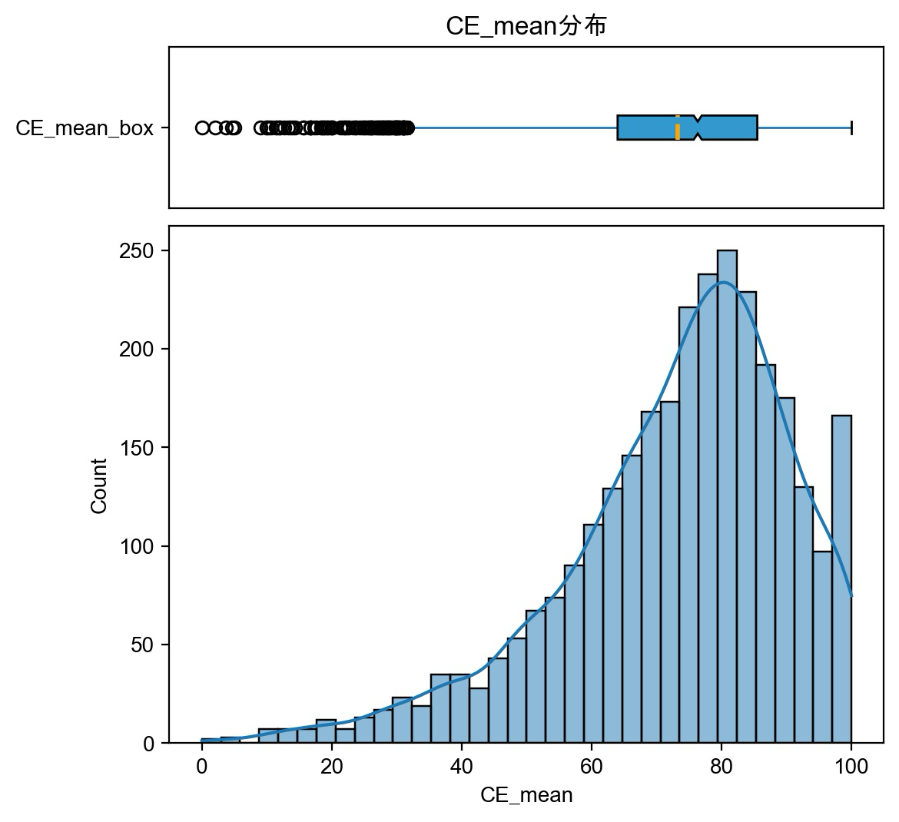

---
tags:
- PyLib
- matplotlib
hide:
- tags
---

# matplotlib

## 简介

!!! cite "official intro"
    Matplotlib is a comprehensive library for creating static, animated, and interactive visualizations in Python. **Matplotlib makes easy things easy and hard things possible**.

加粗的这句话说的非常好，如果读者看过一些古老的Python教科书，一定会知道Python还有一个知名的绘画库：turtle，这是一个非常有趣的库但是非常难用，很简单的图也需要很复杂的代码才能画出来。相比之下，matplotlib真正做到了：简单的几句话就搞定，再复杂的图也能搞定。

咱也算一个统计人，下面这种分布图还是经常画的。R、MATLAB、Excel啥的都用过一点。个人觉得还是matplotlib更自由，画起来得心应手。
<figure markdown>
{width=400}
<caption>直方图+盒子图</caption>
</figure>

像下面这种复杂的图，也能画（但我是没画过）：

<figure markdown>
{width=400}
</figure>

!!! question "为什么叫matplotlib"
    Copy from [matplotlib history](https://matplotlib.org/stable/users/project/history.html)

    Matplotlib is a library for making 2D plots of arrays in Python. Although it has **its origins in emulating the MATLAB graphics commands**, it is independent of MATLAB, and can be used in a Pythonic, object-oriented way. Although Matplotlib is written primarily in pure Python, it makes heavy use of NumPy and other extension code to provide good performance even for large arrays.
    ...

## 两套api

初学者可能会很迷惑的点就是matplotlib画图是有两套交互方式的（虽然本质上他们相同），我们之后也会分别介绍。

### [函数式：plt](./plt.md)

这种方式是最常见的，也是简单任务下最方便快捷的方式，缺点就是很多操作是不透明的、全局的，plt的处理方法可能和你预想的不同。

使用方法就是调用`matplotlib.pyplot`提供的各种api在默认的画布上绘制。

```python
import matplotlib.pyplot as plt
plt.plot(x, y)
plt.title("Sample plot")
plt.show()
```

### [面向对象式：axes](./subplots.md)

这种方式的自由度更高，可以手动控制`Figure`和`Axes`对象。

```python
import matplotlib.pyplot as plt
fig, ax = plt.subplots()
ax.plot(x, y)
ax.set_title("Sample plot")
plt.show()
```

## 库的架构

```text
Modules include:

:mod:`matplotlib.axes`
    The `~.axes.Axes` class.  Most pyplot functions are wrappers for
    `~.axes.Axes` methods.  The axes module is the highest level of OO
    access to the library.

:mod:`matplotlib.figure`
    The `.Figure` class.

:mod:`matplotlib.artist`
    The `.Artist` base class for all classes that draw things.

:mod:`matplotlib.lines`
    The `.Line2D` class for drawing lines and markers.

:mod:`matplotlib.patches`
    Classes for drawing polygons.

:mod:`matplotlib.text`
    The `.Text` and `.Annotation` classes.

:mod:`matplotlib.image`
    The `.AxesImage` and `.FigureImage` classes.

:mod:`matplotlib.collections`
    Classes for efficient drawing of groups of lines or polygons.

:mod:`matplotlib.colors`
    Color specifications and making colormaps.

:mod:`matplotlib.cm`
    Colormaps, and the `.ScalarMappable` mixin class for providing color
    mapping functionality to other classes.

:mod:`matplotlib.ticker`
    Calculation of tick mark locations and formatting of tick labels.

:mod:`matplotlib.backends`
    A subpackage with modules for various GUI libraries and output formats.

The base matplotlib namespace includes:

`~matplotlib.rcParams`
    Default configuration settings; their defaults may be overridden using
    a :file:`matplotlibrc` file.

`~matplotlib.use`
    Setting the Matplotlib backend.  This should be called before any
    figure is created, because it is not possible to switch between
    different GUI backends after that.

The following environment variables can be used to customize the behavior:

:envvar:`MPLBACKEND`
    This optional variable can be set to choose the Matplotlib backend. See
    :ref:`what-is-a-backend`.

:envvar:`MPLCONFIGDIR`
    This is the directory used to store user customizations to
    Matplotlib, as well as some caches to improve performance. If
    :envvar:`MPLCONFIGDIR` is not defined, :file:`{HOME}/.config/matplotlib`
    and :file:`{HOME}/.cache/matplotlib` are used on Linux, and
    :file:`{HOME}/.matplotlib` on other platforms, if they are
    writable. Otherwise, the Python standard library's `tempfile.gettempdir`
    is used to find a base directory in which the :file:`matplotlib`
    subdirectory is created.
```

## 二次封装

matplotlib作为Python最火爆的画图库，有很多其他的库对它进行了二次封装：

A large number of third party packages extend and build on Matplotlib functionality, including several higher-level plotting interfaces (seaborn, HoloViews, ggplot, ...), and a projection and mapping toolkit (Cartopy).

我用过的例如：[seaborn](https://seaborn.pydata.org/)、[plotnine](https://plotnine.readthedocs.io/en/stable/)都是开箱即用的好库。相比matplotlib的默认样式更加美观，但是自由度有所下降。

## 依赖

matplotlib的最新版本是`3.8.3`，有以下依赖：

```toml
dependencies = [
    "contourpy >= 1.0.1",
    "cycler >= 0.10",
    "fonttools >= 4.22.0",
    "kiwisolver >= 1.3.1",
    "numpy >= 1.23",
    "packaging >= 20.0",
    "pillow >= 8",
    "pyparsing >= 2.3.1",
    "python-dateutil >= 2.7",
    "importlib-resources >= 3.2.0; python_version < '3.10'",
]
requires-python = ">=3.9"
```
