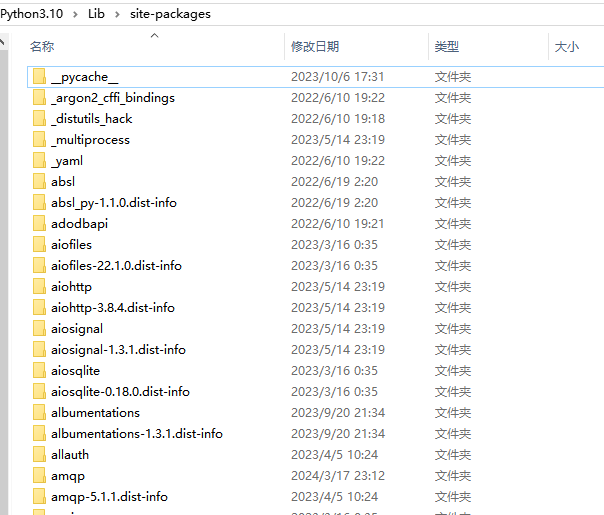

---
tags:
- PyLib
---

# 包管理

与其他语言相比，Python最有竞争力的大概就是庞大的第三方库了。究其原因，大概是Python[简洁而又强大的语法](../../SeniorSyntax/OOP)造就了活跃的开发者社区。

开发者几乎想干啥干啥，运算符重载、元类……

任何人都可以发布自己的package，成为这个社区的一份子。我写下本文的时候，[PyPI](https://pypi.org/)已经有了521,310个项目，这个数目还是相当可观的。
> 或许js的生态也不错，但是大概没人喜欢用js？？反正我是看到就烦。不过据说npm上有百万计的js包，恐怖如斯。

<figure markdown>

<caption>PyPI: The Python Package Index</caption>
</figure>

然而，根据我有限的观察，即便已经很会写Python的代码了**很多朋友依然是包管理的苦手**。希望本文能帮助大家更好地理解Python的包从而实现优雅的包管理。


## 什么是包、模块和库

### 模块（Module）
一般来说，模块指的是单个`.py`文件，你可以使用`import`关键字在`.py`文件之间相互引用。这是分离代码逻辑常见的操作，例如我现在有一个`pi.py`文件，定义了一个常数：

```python title="pi.py"
PI = 3.1415 
```

我可以在其他文件中引用这个变量：

```python title="print_pi.py"
from pi import PI
print(PI)
```
当然，如果这个`pi.py`文件和`print_pi.py`不在同一个文件夹内，我们也可以通过其他方式`import`。

- 例如`pi.py`在当前目录的`lib`文件夹内，我们就可以写：
```python
from lib.pi import PI
...
```

- 再如，这个`pi.py`在一个很遥远的文件夹（例如`~/username/lib/`），我们还可以直接操作`PATH`来让Python解释器找到它：
```python
import sys
sys.path.append("~/username/lib/")
from pi import PI
...
```

### 包（Package）
包指的是多个模块组成的文件夹，我们需要通过`__init__.py`文件来初始化包，例如：
```
- main.py
- lib
    - __init__.py
    - pi.py
    - print_py.pi
```

在这样的文件结构下，我们就可以在`main.py`中调用`lib`文件夹内的代码了。值得一提的是，在包内部的代码相互引用需要使用特殊的`import`写法：
```python title="print_pi.py" hl_lines="1"
from .pi import PI
print(PI)
```

更多关于如何写一个包的知识我们之后会介绍，请看[自己写一个包](../DIY)。
### 库（Library）
最后，库就是多个包组成的工具箱，例如诸多的Python标准库、Python科学计算库[SciPy](https://scipy.org/)等等。
### 缓存

如果你执行了`import`操作，Python就会在包的路径生成一个`__pycache__`文件夹，里面包含了经过编译的`.pyc`文件。这是Python提高包内代码运行效率的一种措施，下次你再调用包内的代码时就会自动使用预编译的`.pyc`了。

??? question "Python不是解释型语言吗，为什么还有编译？"
    Copy from [Python Documentation](https://docs.python.org/3/glossary.html#term-interpreted)

    Python is an interpreted language, as opposed to a compiled one, though the distinction can be blurry because of the presence of the **bytecode compiler**. This means that source files can be run directly without explicitly creating an executable which is then run. Interpreted languages typically have a shorter development/debug cycle than compiled ones, though their programs generally also run more slowly.

## 包管理软件
> 不管是模块、包还是库，我下面就直接叫包了，反正就是一堆写好的代码。

现在你应该理解了什么是包，理论上只要我们下载了源代码就可以使用他们了。但是手动进行这个过程是非常痛苦的（你需要下载包，然后把包放在合适的地方以便Python解释器能够找到这个包，如果想卸载包还得手动删除），所以我们需要使用**包管理软件**。

### [pip](https://pip.pypa.io/en/stable/)
> pip is the package installer for Python. You can use pip to install packages from the Python Package Index and other indexes.

包管理软件我首推`pip`，从`Python 3.4`版本开始，`pip`就是内置的包了，开箱即用。

!!! info "运行Python包？"
    使用`python -m`选项可以run library module as a script (terminates option list)。

默认情况下，在Windows平台`pip`会从[PyPI](https://pypi.org/)下载你想要的包，保存在`C:\Python3.10\lib\site-packages`，其中`C:\Python3.10`是Python的安装目录。其他的操作系统也是类似的。

下面介绍一些常用的`pip`命令。

#### pip命令一览

```text
Usage:
  python -m pip <command> [options]、

Commands:
  install     Install packages.
  download    Download packages.
  uninstall   Uninstall packages.
  freeze      Output installed packages in requirements format.
  inspect     Inspect the python environment.
  list        List installed packages.
  show        Show information about installed packages.
  check       Verify installed packages have compatible dependencies.
  config      Manage local and global configuration.
  search      Search PyPI for packages.
  cache       Inspect and manage pip's wheel cache.
  index       Inspect information available from package indexes.
  wheel       Build wheels from your requirements.
  hash        Compute hashes of package archives.
  completion  A helper command used for command completion.
  debug       Show information useful for debugging.
  help        Show help for commands.

```

#### pip -V
查看`pip`的版本以及他所对应的Python。
<div class="console">

```console
$ python -m pip -V
pip 24.0 from C:\Python3.10\lib\site-packages\pip (python 3.10)
```

</div>

#### pip install
安装特定的包。

!!! caution "谨慎安装第三方包"
    不是所有开源的代码都是无害的，大家安装的时候需要小心为上。

    此外，安装任何的包最好参照他们官方的说明文档，不要直接`pip install`，很有可能会安装一个错误的版本。特别是pytorch这种，需要和CUDA这样的其他软件联动的包，需要格外注意。

    最后，包之间可能是有依赖冲突的，需要提前调查一下。安装之后也可以用`pip check`检查一下是否存在冲突依赖。

<div class="console">

```console
$ python -m pip install numpy
# 正在安装numpy，稍作等待

---> 100%

```

</div>

#### pip install -r requirements.txt
批量安装`requirements.txt`中列出的包。 

#### pip install -i
从指定的网站下载包。

由于国内网络环境的特殊性，有的时候我们和PyPI的连接性可能很差。因此国内有许多镜像网站，例如[清华镜像](https://mirrors.tuna.tsinghua.edu.cn/help/pypi/)

#### pip config
可以把清华源设置为默认源：

<div class="console">

```console
$ python -m pip install --upgrade pip # 安装最新版本的pip
---> 100%
$ pip config set global.index-url https://pypi.tuna.tsinghua.edu.cn/simple # 修改默认源
```

</div>

#### pip list
查看现在已经安装的包。
<div class="console">

```console
$ python -m pip list

Package    Version
---------- -------
numpy      1.25.2
pip        23.2.1
setuptools 58.0.4
six        1.15.0
wheel      0.37.0
```

</div>

#### pip freeze
按照特定的格式输出现在已经安装的包，方便其他人通过`pip install -r`复刻你的环境。

<div class="console">

```console
$ python -m pip freeze
absl-py==1.1.0
aiofiles==22.1.0
aiohttp==3.8.4
aiosignal==1.3.1
aiosqlite==0.18.0
albumentations==1.3.1
amqp==5.1.1
anyio==3.6.2
appdirs==1.4.4
...
```

</div>

### [miniconda](https://docs.anaconda.com/free/miniconda/index.html)
> Miniconda is a free minimal installer for conda. It is a small bootstrap version of Anaconda that includes only conda, Python, the packages they both depend on, and a small number of other useful packages (like pip, zlib, and a few others). If you need more packages, use the conda install command to install from thousands of packages available by default in Anaconda’s public repo, or from other channels, like conda-forge or bioconda.

另外一个很流行的包管理器，比起`pip`我最印象深刻的一点就是它支持多线程下载，如果你需要一次性安装很多的包可以省一些时间。


## 虚拟环境

之前提到，Python的`pip`默认情况下会把包都下载在`C:\Python3.10\Lib\site-packages`这个目录下。如果你去看一眼就会发现，这个目录下的包是不区分版本的，这就导致**Python是不支持多个版本的包同时存在的**。

例如`aiohttp`这个包，在安装的时候会创建两个文件夹，一个是`aiohttp`另外一个是`aiohttp-3.8.4.dist-info`。前者是实际的代码库，后者是发布日志。

<figure markdown>
{width=600}
</figure>

可有的时候我们又确实想用多个版本的库，这时虚拟环境就派上用场了。

简单来说，虚拟环境就是把包都安装在**一个指定的地方**，并且通过改变Python解释器的`sys.path`来控制`import`的行为。你完全可以手动来完成这件事情，但是基于和包管理同样的理由——程序员太懒了，我们也有特定的工具来做这件事情。

### [venv](https://docs.python.org/3/library/venv.html)
创建虚拟环境我首推`venv`，它也是（不太老版本）Python内置的包，开箱即用。从`Python 3.5`开始它就成为了推荐的工具。
> Changed in version 3.5: The use of venv is now recommended for creating virtual environments.

#### 创建虚拟环境

<div class="console">

```bash
$ python -m venv /path/to/new/virtual/environment
```

</div>

#### 激活虚拟环境
> A virtual environment may be “activated” using a script in its binary directory (bin on POSIX; Scripts on Windows). This will prepend that directory to your PATH, so that running python will invoke the environment’s Python interpreter and you can run installed scripts without having to use their full path. The invocation of the activation script is platform-specific (<venv> must be replaced by the path to the directory containing the virtual environment):


创建虚拟环境完成之后，会有一些脚本放在特定的文件夹，可以运行这些脚本来激活虚拟环境。

Platform | Shell | Command to activate virtual environment
--|--|--
POSIX | bash/zsh | `$ source <venv>/bin/activate`
Windows | cmd.exe | `C:\> <venv>\Scripts\activate.bat`
Windows | PowerShell | `PS C:\> <venv>\Scripts\Activate.ps1`

然后你就可以在虚拟环境里干任何事情了。

### [miniconda](https://docs.anaconda.com/free/miniconda/index.html)
miniconda同样可以创建虚拟环境，比起pip它很强大一点是可以创建不同Python版本的虚拟环境。比如`Python 3.9.10`或者`Python 3.12.1`。

安装miniconda不需要root权限，并且创建虚拟环境的操作也不需要root权限！！！在没有root权限的服务器上不要太好用。