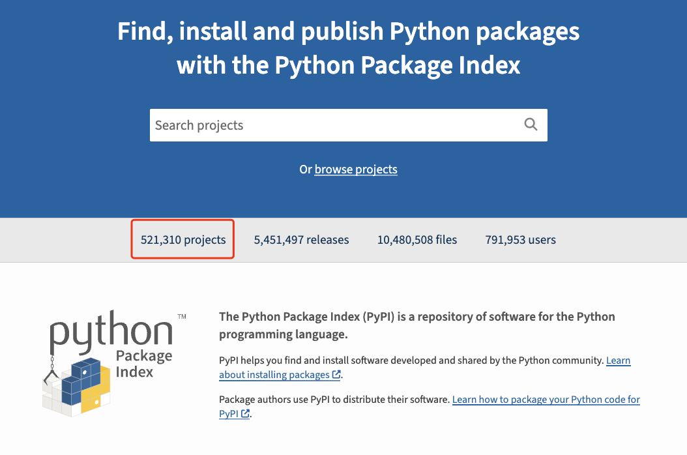

---
tags:
- python第三方库
---

# 包管理

与其他语言相比，Python最有竞争力的大概就是庞大的第三方库了。究其原因，大概是Python[简洁而又强大的语法](../../SeniorSyntax/OOP)造就了活跃的开发者社区。

开发者几乎想干啥干啥，运算符重载、元类……

任何人都可以发布自己的package，成为这个社区的一份子。我写下本文的时候，[PyPI](https://pypi.org/)已经有了521,310个项目，这个数目还是相当可观的。
> 或许js的生态也不错，但是大概没人喜欢用js？？反正我是看到就烦。不过据说npm上有百万计的js包，恐怖如斯。

<figure markdown>

<caption>PyPI: The Python Package Index</caption>
</figure>

## 包管理软件
??? question "包？库？模块？"
    啊？

如果想要使用第三方的库，就需要使用一种包管理软件。

TBC:Python Package Management