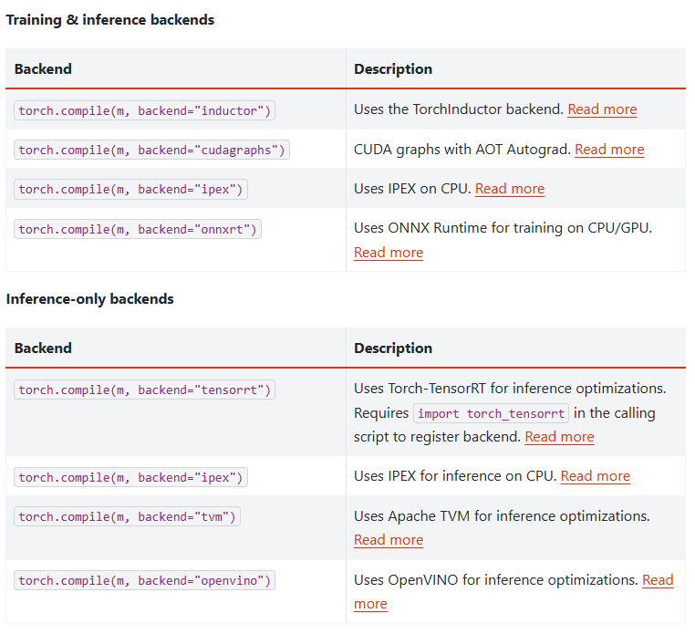
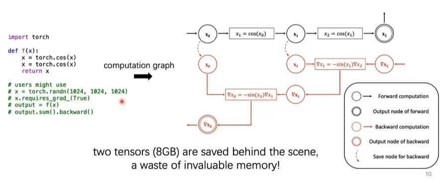
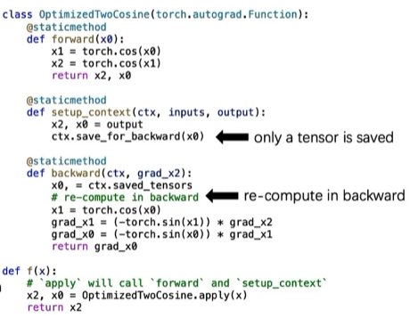
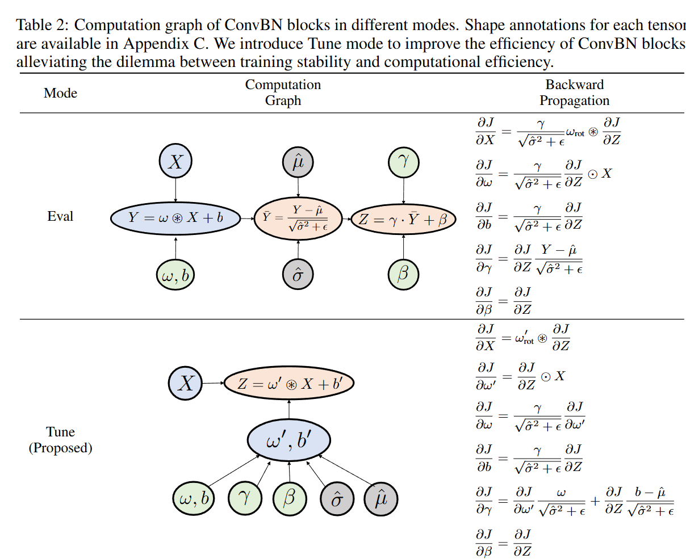

---
tags:
- pytorch
include:
- math
---

# 编译优化

> [torch.compile](https://docs.pytorch.org/docs/stable/torch.compiler.html)

之前看了一个talk：[\[FAI\] 清华 游凯超 | 理解、学习与使用PyTorch编译器（torch.compile）](https://www.bilibili.com/video/BV14T4y187bN)，很受启发。特此记录一下。

这里也贴一下他们的工作：

<figure markdown>

[](https://github.com/thuml/depyf)

</figure>

## 用法

编译优化和我们之前介绍的一些[训练技巧](./tricks.md)以及[分布式训练](./multi_gpu.md)殊途同归，都是为了**加速模型训练**。只不过编译优化可以**本质上节省算力开支**，而我们介绍的训练技巧、分布式训练只是把算力开支均摊到时间、空间上。

编译优化分为训练时和推理时两种，本文只会涉及到训练时的优化：



### 基本思想

如果你学过一点C语言，就知道我们在编译代码的时候编译器可以对我们写的代码进行优化。比如[函数内联](https://oi-wiki.org/lang/optimizations/#%E5%87%BD%E6%95%B0%E5%86%85%E8%81%94-function-inlining)：

```c
int add(int x) { return x + 1; }

int foo() {
    int a = 1;
    a = add(a);
}
```

（开启了某些编译优化选项后）可能会被编译器优化为：

```c
int foo() {
    int a = 1;
    a = a + 1;  // <-- add() 的函数体，未经过传参
}
```

==我们的代码被编译器自动转换为了更高效的形式，这就是编译优化。==

torch中也存在这样的编译优化方案：`torch.compiler`。

### 代数化简

一类最简单的编译优化方案就是代数化简，我们可以通过对代数式的等价变形把算子转化为更简单的形式。

例如：

```python
y = torch.exp(torch.log(x))
```

几乎就等价于：

```python
y = x
```

### 算子融合

> 重计算（或者叫算子融合，[Kernel Fusion](https://www.abhik.xyz/articles/kernel-fusion)？）这个词从弹幕里学来的，[Paddle](https://fleet-x.readthedocs.io/en/latest/paddle_fleet_rst/collective/collective_mp/recomputation.html)有一个相关的文档.

重计算的含义就是把**多个算子融合为一个算子**，这样就可以**避免很多中间过程的激活值存储**，从而减少显存占用（这一点和我们之前的介绍的[激活值检查点](tricks.md#_8)很类似）。

例如下面的函数：

```python
import torch
def f(x):
    a = torch.cos(x)
    b = torch.cos(a)
    return b
x = torch.randn(1024,1024,1024)
x.requires_grad = True
out = f(x)
out.sum().backward()
```

它的计算图为：



在这个过程中我们会存储两个激活值（`x`和`cos(x)`）以便计算梯度，这非常占用显存。

实际上我们可以把它替换为：



这样可以少保存一个中间变量（`cos(x)`就不保存了）。

??? question "这不就是激活值检查点吗？"
    还真是。

    我们这个$cos(cos(x))$的例子干的事情和激活值检查点这个trick完全相同：通过减少前向传播过程中显存里保存的激活值来优化显存占用，然后在反向传播的时候重新计算一次即可。

    > $y = cos(cos(x)) \implies y' = \sin(x)\sin(\cos(x))$

    不过这里的实现显然是一个更通用的方案：封装一个`torch.autograd.Function`，后续还可以用在其他地方，甚至可能由`torch.compile`自动完成替换。激活值检查点就只能对特定的模型优化，写起来比较麻烦。

    !!! info "计算是便宜的"
        此外你可能会疑惑，如果我的显存足够大，可以把激活值都放进去，那么做这样的优化还有意义吗？

        但是是肯定的。因为用**计算替代数据的存储、读取操作**大概率是稳赚不赔的。
        
        ==现代GPU的主要瓶颈不在计算，而是数据的读存~==

        显存也是分等级的，速度越快的显存越稀有！

??? note "现实例子：Conv+BN的优化"
    当然现实中可能由更复杂的优化场景，例如常见的`Conv+BN`算子组合可以优化为[下面的形式](https://arxiv.org/pdf/2305.11624)：

    

### 编译方法

捞了这么多，torch里一行代码就可以优化这个函数的计算，只要加一个装饰器就可以了：

```python hl_lines="3"
import torch

@torch.compile
def f(x):
    a = torch.cos(x)
    b = torch.cos(a)
    return b
```

如果写成了Module的形式，也是类似的：

```python hl_lines="8"
import torch

class DoubleCosine(torch.nn.Module):
    def forward(self, x):
        return torch.cos(torch.cos(x))

mod = DoubleCosine()
mod.compile()
```

!!! warning "Windows不支持"
    悲伤的消息：`RuntimeError: Windows not yet supported for torch.compile`
