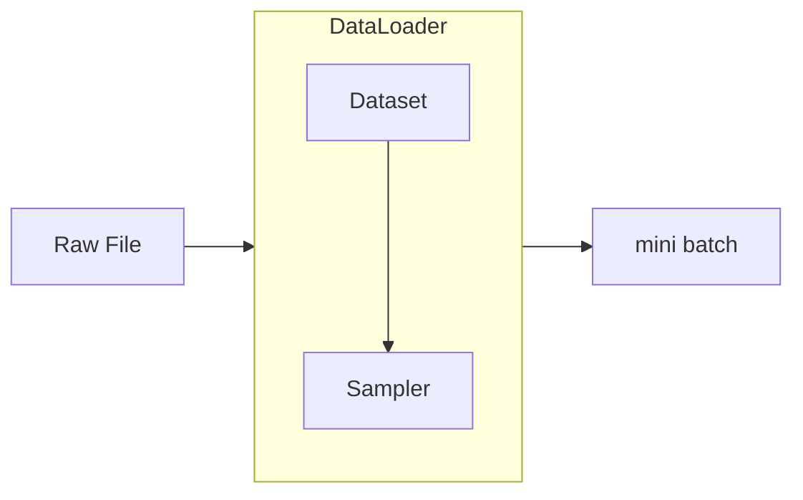

---
tags:
- pytorch
---

# 数据加载

> [torch.utils.data](https://docs.pytorch.org/docs/stable/data.html)

数据是机器学习的核心，没有数据一切模型和算法都是苍白无力的，可谓巧妇难为无米之炊！

目前最普遍使用的优化算法就是[随机梯度下降](https://en.wikipedia.org/wiki/Stochastic_gradient_descent)（SGD），其中最核心的步骤就是每次从全量数据集中选取一个mini-batch，而后根据这一小批数据来寻找梯度下降的方向。

??? question "batch和mini-batch"
    batch一般而言指的是全部数据，也就对应**标准的梯度下降**算法。

    **随机梯度下降**有时候会被表述为**单个样本**上的梯度下降。

    介于全部数据和单个样本之间的策略就是mini-batch，例如一次选取32个样本进行梯度下降。

本篇笔记就来介绍在pytorch中如何构建mini-batch数据流，从而支持后续的SGD优化。



如图所示，从原始文件到一个mini batch通常需要经过DataLoader的包装。

DataLoader中主要包含Dataset和Sampler两个元素，前者负责从原始文件中读取、转换数据，后者决定数据采样的方式、输出的顺序。

## Dataset

> [torch.utils.data.Dataset](https://docs.pytorch.org/docs/stable/data.html#torch.utils.data.Dataset)

Dataset是整个数据流的入口，负责读取原始的文件数据，而后把这些数据包装为一个容器，便于后续的读取。

这个数据容器可以是map-style或者是iterable-style的。

### map-style

通常一个自定义的map-style Dataset子类需要定义下面几个方法：

```python
class CustomDataset(torch.utils.data.Dataset):

    def __init__(self) -> None:
        """初始化"""
        self.data = [1,2,"3",(4,5)]

    def __getitem__(self, idx: int):
        """
        获取一个样本【此方法必须定义】
        """
        return self.data[idx]

    def __len__(self) -> int:
        """
        数据集的大小【此方法必须定义】
        这个方法在Sampler中比较有用，数据集的采样需要基于数据集的大小。
        """
        return len(self.data)

    def __getitems__(self, idx_lst: list[int]) -> list:
        """
        一次获取多个样本【此方法可选】
        你可以在这个方法里控制一次性读取多个样本的行为。
        一般用来加速后续取mini batch的过程。
        """
        return [self.data[idx] for idx in idx_lst]
```

默认情况下，pytorch的Dataloader是通过**自然数下标**来遍历Dataset的。所以我们的`__getitem__`方法一般都处理自然数下标的取数据行为：

```python
>>> ds = CustomDataset()
>>> ds[1] # 自然数下标
2
>>> list(torch.utils.data.DataLoader(ds, num_workers=2))
[tensor([1]), tensor([2]), ['3'], [tensor([4]), tensor([5])]]
```

!!! note
    如果你想用非自然数的idx，需要自定义DataLoader的行为。

    此外注意这里DataLoader会尝试自动转换数据类型为torch.Tensor，这一点我们后面也会看到原因。
    
    并且默认情况下这里使用多进程来加载也不会出现数据重复的问题。这一点可以和后面的iterable style数据集做对比。

### iterable-style

除了上面那种map style的方法，通过`__getitem__`方法挨个读数据。也可以使用iterable style数据集，这时候需要定义`__iter__`方法，返回一个迭代器：

```python
class MyIterableDataset(torch.utils.data.IterableDataset):

    def __init__(self, start, end):
        super(MyIterableDataset).__init__()
        assert end > start
        self.start = start
        self.end = end

    def __iter__(self):
        return iter(range(self.start, self.end))
```

这时候我们就只能按照数据集**定义好的顺序**来挨个访问数据，而无法像map style那样访问特定的数据，也就[无法实现随机采样](./#iterable-style_1)了。

!!! warning "多进程数据加载"
    iterable style数据集在使用多进程DalaLoader的时候可能会出现数据重复的问题。例如上面定义的数据集：
    ```python
    >>> ds = MyIterableDataset(3, 6)
    >>> print(list(torch.utils.data.DataLoader(ds, num_workers=2)))
    [tensor([3]), tensor([3]), tensor([4]), tensor([4]), tensor([5]), tensor([5])]
    ```
    可以看到，数据会重复两次。并且数据被自动转换为了torch.Tensor。

    这个问题可以通过DataLoader的worker_init_fn参数来解决。[后续的小节](./#worker_init_fn)我再来详细介绍。

一般来讲，大家都用map-style比较多。

当然，iterable-style也有一些独特的用法，例如动态batch size。实际上我们可以在iterable-style数据集中，直接yield打包好的batch，而不是依赖DataLoader进行打包。

## DataLoader

> [torch.utils.data.DataLoader](https://docs.pytorch.org/docs/stable/data.html#torch.utils.data.DataLoader)

DataLoader是数据加载最核心的类，是最外层的接口，控制着整个数据流的出口。它的signature如下：

```python
DataLoader(
    dataset,
    batch_size=1,
    shuffle=False,
    sampler=None,
    batch_sampler=None,
    num_workers=0,
    collate_fn=None,
    pin_memory=False,
    drop_last=False,
    timeout=0,
    worker_init_fn=None,
    *,
    prefetch_factor=2,
    persistent_workers=False,
    pin_memory_device="",
    in_order=True,
)
```

这里面这几个参数最常用：

- `dataset`就是我们第一小节介绍的Dataset类，它提供挨个访问数据的接口
- `batch_size`控制mini batch的大小
- `shuffle`控制是否每次打乱数据集
- `num_workers`控制多进程同时加载数据
- `drop_last`控制是否丢弃掉最后几个不够组成一个batch的那些数据

这几个不太常用：

- `prefetch_factor`参数控制预载的数据量，因为CPU可能比IO要快所以通常需要预载
- `persistent_workers`参数控制在不同的epoch是否重启dataload workers
- `sampler`和`batch_sampler`控制采样的行为，这个我们[最后一节](./#sampler)来介绍

### 参数冲突

注意`batch_sampler`参数和`batch_size`, `shuffle`, `sampler`, `drop_last`是冲突的。启用了前者，后面几个都无效（因为`batch_sampler`相当于完全控制了产生batch的行为，不需要其他几个参数了）。

以及`sampler`和`shuffle`是冲突的，设定了前者后者就无效了（因为`shuffle=Ture`相当于指定`sampler=RandomSampler`）。

通常有这样几种用法：

1. `DataLoader(dataset, batch_size=4)`
    - 全自动
2. `DataLoader(dataset, batch_size=4, shuffle=True)`
    - 只设定shuffle的情况下会默认使用RandomSampler
3. `DataLoader(dataset, batch_size=4, sampler=some_sampler)`
    - 使用特定的sampler
4. `DataLoader(dataset, batch_sampler=some_batch_sampler)`
    - 指定batch sampler

### `pin_memory`

`pin_memory`这个参数值得单独说一下。通常我们的模型是使用GPU来训练的，但是数据加载却是通过CPU进行的。所以这里会有一个从**内存**到**显存**的数据拷贝行为。

而在操作系统中，内存分为两种：物理内存和虚拟内存（也叫交换内存，swap memory）。

物理内存就是超高速的内存条，虚拟内存则是普通的磁盘空间。为了系统的稳定性通常操作系统会把一部分的磁盘空间映射为虚拟内存，以便把一些不常用的数据放到虚拟内存；或者是应对某些超大的内存占用。

pin_memory这个参数就是说：**不要把我的数据放到虚拟内存里面**。这样，数据总是从高速的物理内存拷贝到显存，极大提高了效率。

不过这显然也有一个问题，就是比较占用系统资源。需要取舍一下。

### `collate_fn`

`collate_fn`也值得单独拎出来介绍一下。

在NLP中经常遇到一种场景：不等长的数据。

例如一些文本预料，每一句话通常长度不一。这时候我们可能就需要做一些padding的操作。但是我们又不希望在全局进行padding（这样就必须要padding到全局的最长），这时候就可以在DataLoader中进行。

又或者，另外一种场景：动态可变的batch_size。

默认情况下，DataLoader加载数据的行为可以抽象为：

```python
# map style Dataset
for indices in batch_sampler:
    yield collate_fn([dataset[i] for i in indices])

# iterable style Dataset
dataset_iter = iter(dataset)
for indices in batch_sampler:
    yield collate_fn([next(dataset_iter) for _ in indices])
```

可以看到collate_fn起到起到重要的作用，[默认情况下](https://docs.pytorch.org/docs/stable/data.html#torch.utils.data.default_collate)它把一个mini batch的数据进行打包（**此前提到的类型转换也是由它完成的**），以便后续并行处理。

因此，我们可以通过自定义collate_fn来实现自定义batching的过程。例如：

```python
import torch

class CustomDataset(torch.utils.data.Dataset):
    def __init__(self, n) -> None:
        self.n = n
        self.data = list(range(n))
    def __getitem__(self, idx: int):
        return self.data[idx]
    def __len__(self):
        return self.n

def batch_fn(batch):
    """打包的时候去掉3的倍数"""
    return [data for data in batch if data%3 !=0 ]


ds = CustomDataset(20)
dl = torch.utils.data.DataLoader(
    ds,
    batch_size=4,
    collate_fn=batch_fn
)
print(*list(dl), sep='\n')
```

这时候的输出就是：

```text
[1, 2]
[4, 5, 7]
[8, 10, 11]
[13, 14]
[16, 17, 19]
```

可以看到，我们成功把所有3的倍数从数据集中剔除掉了。

### `worker_init_fn`

这个参数控制着dataloader worker启动的行为。可以解决我们之前提到的iterable style数据集数据重复加载的问题：

```python
import torch
import math


class MyIterableDataset(torch.utils.data.IterableDataset):
    def __init__(self, start, end):
        assert end > start
        self.start = start
        self.end = end

    def __iter__(self):
        return iter(range(self.start, self.end))


def worker_init_fn(worker_id):
    worker_info = torch.utils.data.get_worker_info()
    # 每个worker会拿到数据集的一个复制
    dataset = worker_info.dataset
    overall_start = dataset.start
    overall_end = dataset.end
    # 手动划分每个worker处理的数据
    per_worker = int(math.ceil(
            (overall_end - overall_start) / float(worker_info.num_workers)
    ))
    worker_id = worker_info.id
    dataset.start = overall_start + worker_id * per_worker
    dataset.end = min(dataset.start + per_worker, overall_end)


if __name__ == "__main__":
    ds = MyIterableDataset(start=3, end=5)
    dl1 = torch.utils.data.DataLoader(ds, num_workers=2)
    dl2 = torch.utils.data.DataLoader(
        ds,
        num_workers=2,
        worker_init_fn=worker_init_fn
    )
    print(list(dl1))
    print("-" * 20)
    print(list(dl2))
```

这时候的输出就是：

```text
[tensor([3]), tensor([3]), tensor([4]), tensor([4])]
--------------------
[tensor([3]), tensor([4])]
```

??? warning "num_workers > 1"
    由于multiprocessing的实现不同，dataloader workers的创建在[不同平台](https://docs.pytorch.org/docs/stable/data.html#platform-specific-behaviors)的行为可能有所区别。

    在Unix平台，使用`fork()`系统调用，而在Windows和MacOS使用`spawn()`系统调用。

    通常需要加上`if __name__ == '__main__'`来避免多进程重复运行脚本。

## Sampler

> [torch.utils.data.Sampler](https://docs.pytorch.org/docs/stable/data.html#torch.utils.data.Sampler)

Sampler控制着DataLoader从Dataset中采样数据的行为。

### iterable-style

对于iterable style数据集来说，Sampler啥也不干。数据加载的顺序完全由Dataset来决定。

实际上，iterable style数据集根本不能和sampler（包括batch sampler）一起使用，会报错。

### map-style

对于map style数据集来说，Sampler则至关重要。因为**map本身没有顺序**，所以DataLoader加载数据的顺序需要由Sampler来决定。

典型的sampler和batch sampler如下，需要实现`__iter__`方法，前者返回一个个下标、后者返回下标的列表：

```python
class AccedingSequenceLengthSampler(Sampler[int]):
    def __init__(self, data: List[str]) -> None:
        self.data = data
    def __len__(self) -> int:
        return len(self.data)
    def __iter__(self) -> Iterator[int]:
        sizes = torch.tensor([len(x) for x in self.data])
        yield from torch.argsort(sizes).tolist()

class AccedingSequenceLengthBatchSampler(Sampler[List[int]]):
    def __init__(self, data: List[str], batch_size: int) -> None:
        self.data = data
        self.batch_size = batch_size
    def __len__(self) -> int:
        return (len(self.data) + self.batch_size - 1) // self.batch_size
    def __iter__(self) -> Iterator[List[int]]:
        sizes = torch.tensor([len(x) for x in self.data])
        for batch in torch.chunk(torch.argsort(sizes), len(self)):
            yield batch.tolist()
```

通过Sampler我们也可以实现一些特殊操作，例如动态batch size。只需要在batch sampler返回动态长度的下标列表即可。

### built-in sampler

torch还为我们封装了一些常用的Sampler：

- `torch.utils.data.SequentialSampler`
- `torch.utils.data.RandomSampler`
- `torch.utils.data.SubsetRandomSampler`
- `torch.utils.data.WeightedRandomSampler`
- `torch.utils.data.BatchSampler`
- `torch.utils.data.distributed.DistributedSampler`

看名字就知道是干什么的。

其中最后一个`torch.utils.data.distributed.DistributedSampler`比较特殊，它用于分布式训练。他会自动把整个按照分布式节点数数据集划分为若干个不相交的部分，然后给每个节点提供数据。后续的[多卡训练笔记](../multi_gpu/)还会详细介绍它。
