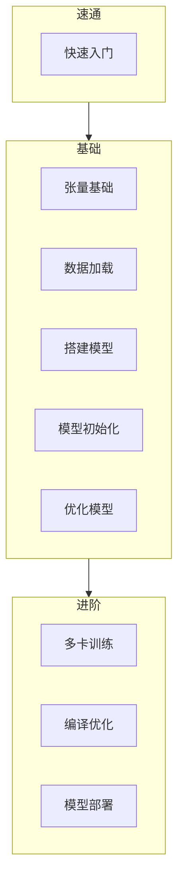

---
tags:
- PyLib
- pytorch
hide:
- tags
include:
- math
---

# pytorch

!!! cite "official intro"
    PyTorch is an optimized tensor library for deep learning using GPUs and CPUs.

[PyTorch](https://pytorch.org/)是一个开源的Python机器学习库，基于[torch](http://torch.ch/)实现。它们二者的关系大家可以看看[浅谈Pytorch与Torch的关系](https://oldpan.me/archives/pytorch-torch-relation)。

PyTorch同时提供Python和[C++](https://docs.pytorch.org/cppdocs/)的api，当然我只会Python。本系列笔记会分成下面几块内容来介绍pytorch：



本篇文章则是对深度学习编程核心算法（autograd）的简短介绍。

## 自动梯度计算
> [torch.autograd](https://pytorch.org/docs/stable/autograd.html)

既然是搞机器学习，那就逃不开**梯度下降**这一最通用的优化方法。所以pytorch比较核心的设计就是梯度的计算。

### 模型
举例来说，我们考虑用下面的线性预测模型来拟合$y\in \mathbb{R}^3$：

$$
z = wx+b
$$

其中$x\in \mathbb{R}^5$是自变量，$w\in \mathbb{R}^{3\times 5}$和$b\in \mathbb{R}^3$是模型的参数，我们定义
$$
\mathrm{loss} = \frac{1}{3}\lVert y-z\rVert_2^2
$$
我们想要做梯度下降来最小化`loss`，那么就需要计算：
$$
\frac{\partial\mathrm{loss}}{\partial w}, \frac{\partial\mathrm{loss}}{\partial b}
$$
### 手算
这里的模型比较简单，我们可以很容易（<s>好吧也没那么容易，翻书翻了半天，矩阵的微分是真的容易忘掉</s>）计算得到：
$$
\frac{\partial\mathrm{loss}}{\partial w} = \frac{-2(y-b-wx)x^T}{3}
$$
和
$$
\frac{\partial\mathrm{loss}}{\partial b} = \frac{-2(y-b-wx)}{3}
$$

??? question "咋算的"
    利用链式法则：
    $$
    \frac{\partial\mathrm{loss}}{\partial w} = \frac{ \partial \frac{1}{3}\lVert y-z\rVert_2^2}{\partial w} = \frac{1}{3} \frac{ \partial \lVert y-z\rVert_2^2}{\partial z} \frac{\partial z}{\partial w}
    $$
    其中
    $$
    \frac{ \partial \lVert y-z\rVert_2^2}{\partial z} = -2(y-z)
    $$
    以及
    $$
    \frac{\partial z}{\partial w} = x^T
    $$
    都是比较常见的结论。

### torch实现
而`torch`就实现了这些梯度的自动计算。我们来用`torch`实现上述的预测模型：
```python hl_lines="6 7"
import torch
torch.manual_seed(1)    # set a random seed

x = torch.randn((5,1))  # input tensor
y = torch.randn((3,1))  # expected output
w = torch.randn(3, 5, requires_grad=True)
b = torch.randn(3, 1, requires_grad=True)
z = torch.matmul(w, x)+b
loss = torch.nn.MSELoss()(z, y)
print(w, b, z, loss, sep='\n')
```
注意高亮的两行代码，我们需要额外申明`requires_grad`让`torch`知道我们想求这两个参数的梯度。此外由于我们设置了随机数种子，输出的结果是固定的：
```
tensor([[-1.0276, -0.5631, -0.8923, -0.0583, -0.1955],
        [-0.9656,  0.4224,  0.2673, -0.4212, -0.5107],
        [-1.5727, -0.1232,  3.5870, -1.8313,  1.5987]], requires_grad=True)
tensor([[-1.2770],
        [ 0.3255],
        [-0.4791]], requires_grad=True)
tensor([[-2.1098],
        [-0.2148],
        [-3.1912]], grad_fn=<AddBackward0>)
tensor(6.0846, grad_fn=<MseLossBackward0>)
```
使用`.backward`即可完成自动梯度的反向传播计算：
```python hl_lines="1"
loss.backward()
print(w.grad)
print(b.grad)
```
输出
```
tensor([[-0.8570, -0.3459, -0.0799, -0.8051,  0.5856],
        [ 0.5767,  0.2328,  0.0538,  0.5418, -0.3941],
        [-1.5753, -0.6358, -0.1469, -1.4799,  1.0764]])
tensor([[-1.2958],
        [ 0.8720],
        [-2.3819]])
```
可以验证这个结果和我们手动计算的梯度是一样的：
```python
print((-2*(y-b-w@x)@x.T)/3)
print((-2*(y-b-w@x))/3)
```
```
tensor([[-0.8570, -0.3459, -0.0799, -0.8051,  0.5856],
        [ 0.5767,  0.2328,  0.0538,  0.5418, -0.3941],
        [-1.5753, -0.6358, -0.1469, -1.4799,  1.0764]], grad_fn=<DivBackward0>)
tensor([[-1.2958],
        [ 0.8720],
        [-2.3819]], grad_fn=<DivBackward0>)
```
### 计算图
实际上每次`torch`计算都会**动态构建**如下计算图：
> 图中使用的损失函数是CE（cross entropy），我们这里实际上是MSE

<figure markdown>
{width=500}
</figure>

我们调用`backward`的时候，只要追溯每个操作的`grad function`就可以完成梯度的反向传播。

读者不难注意到我们之前输出`z`和`loss`的时候就可以看到`grad function`的信息：
```hl_lines="3 4"
tensor([[-2.1098],
        [-0.2148],
        [-3.1912]], grad_fn=<AddBackward0>)
tensor(6.0846, grad_fn=<MseLossBackward0>)
```

## 模块化的模型搭建
> [torch.nn](https://pytorch.org/docs/stable/nn.html)

PyTorch另外一个比较核心特点的就是模型的模块化，我们可以使用`torch.nn`中提供的各种模块构建自己的模型，自定义程度非常高。
> 这一点很有可能是PyTorch在机器学习学术研究领域一枝独秀的最主要原因

```python
from torch import nn

class NeuralNetwork(nn.Module):
    def __init__(self):
        super().__init__()
        self.flatten = nn.Flatten()
        self.linear_relu_stack = nn.Sequential(
            nn.Linear(28*28, 512),
            nn.ReLU(),
            nn.Linear(512, 512),
            nn.ReLU(),
            nn.Linear(512, 10),
        )

    def forward(self, x):
        x = self.flatten(x)
        logits = self.linear_relu_stack(x)
        return logits
```

## 高性能计算
> [torch.Tensor](https://pytorch.org/docs/stable/tensors.html)

最后但不得不提的是PyTorch的高性能计算，作为出了名的慢速语言Python的库（当然PyTorch也提供其他语言比如C++的api），PyTorch却不是很慢，它的底层运算主要是是C、C++和CUDA等高性能的代码来处理。

`torch`定义了一个名为张量(`torch.Tensor`) 的类来存储和操作多维数组。PyTorch的张量与NumPy的数组类似，但前者可以在[支持CUDA的N卡](https://pytorch.org/docs/stable/notes/cuda.html)上做运算。 

PyTorch 也一直在开发对其他 GPU 平台的支持，例如 [AMD 的 ROCm](https://pytorch.org/blog/pytorch-for-amd-rocm-platform-now-available-as-python-package/) 和 [Apple 的Metal Framework](https://developer.apple.com/metal/pytorch/)。

此外PyTorch还支持多卡训练，可以实现multithreading（`DataParallel`）或者multiprocessing（`DistributedDataParallel`）训练。

## v.s. TensorFlow
> tensor flow，这个名字太优雅了！！

PyTorch是[Meta（前Facebook）的开源项目](https://opensource.fb.com/projects/pytorch/)，TensorFlow则是[Google的开源项目](https://opensource.google/projects/tensorflow/)，因而自然形成了两大阵营。

二者都是非常热门的机器学习框架，我一直是用PyTorch的。不过我最近发现TensorFlow写起来也很爽，比如官网的小例子：

```python
import tensorflow as tf
# MNIST数据集
mnist = tf.keras.datasets.mnist

# 数据集拆分
(x_train, y_train),(x_test, y_test) = mnist.load_data()
x_train, x_test = x_train / 255.0, x_test / 255.0

# 模型定义
model = tf.keras.models.Sequential([
  tf.keras.layers.Flatten(input_shape=(28, 28)),
  tf.keras.layers.Dense(128, activation='relu'),
  tf.keras.layers.Dropout(0.2),
  tf.keras.layers.Dense(10, activation='softmax')
])

# 模型编译
model.compile(optimizer='adam',
  loss='sparse_categorical_crossentropy',
  metrics=['accuracy'])

# 模型训练
model.fit(x_train, y_train, epochs=5)

# 模型评估
model.evaluate(x_test, y_test)
```

这个训练流程如果要用`torch`实现，大概是这样的（下面的代码是GPT3.5写的，基本没问题）：
```python
import torch
import torch.nn as nn
import torch.optim as optim
import torchvision.transforms as transforms
from torch.utils.data import DataLoader
from torchvision.datasets import MNIST

# 定义数据预处理
transform = transforms.Compose([
    transforms.ToTensor(),
    transforms.Normalize((0.5,), (0.5,))
])

# 加载 MNIST 数据集
train_dataset = MNIST(root='./data', train=True, download=True, transform=transform)
test_dataset = MNIST(root='./data', train=False, download=True, transform=transform)

# 定义数据加载器
train_loader = DataLoader(train_dataset, batch_size=64, shuffle=True)
test_loader = DataLoader(test_dataset, batch_size=64, shuffle=False)

# 定义模型
class SimpleNet(nn.Module):
    def __init__(self):
        super(SimpleNet, self).__init__()
        self.flatten = nn.Flatten()
        self.fc1 = nn.Linear(28*28, 128)
        self.relu = nn.ReLU()
        self.dropout = nn.Dropout(0.2)
        self.fc2 = nn.Linear(128, 10)
        self.softmax = nn.LogSoftmax(dim=1)

    def forward(self, x):
        x = self.flatten(x)
        x = self.fc1(x)
        x = self.relu(x)
        x = self.dropout(x)
        x = self.fc2(x)
        x = self.softmax(x)
        return x

# 创建模型实例
model = SimpleNet()

# 定义损失函数和优化器
criterion = nn.NLLLoss()
optimizer = optim.Adam(model.parameters(), lr=0.001)

# 训练模型
epochs = 5
for epoch in range(epochs):
    running_loss = 0.0
    for images, labels in train_loader:
        optimizer.zero_grad()

        outputs = model(images)
        loss = criterion(outputs, labels)
        loss.backward()
        optimizer.step()

        running_loss += loss.item()
    else:
        print(f"Epoch {epoch+1} - Training loss: {running_loss/len(train_loader)}")

# 评估模型
correct = 0
total = 0
with torch.no_grad():
    for images, labels in test_loader:
        outputs = model(images)
        _, predicted = torch.max(outputs, 1)
        total += labels.size(0)
        correct += (predicted == labels).sum().item()

print('Accuracy on test images: %d %%' % (100 * correct / total))
```

各有千秋吧，你怎么看？