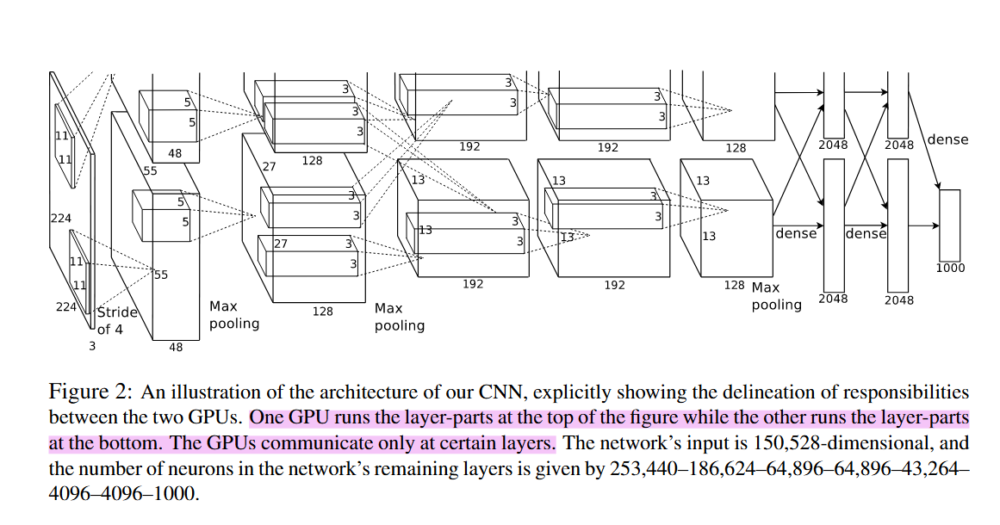
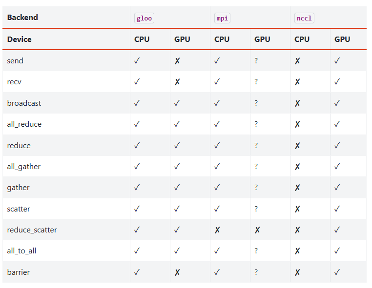
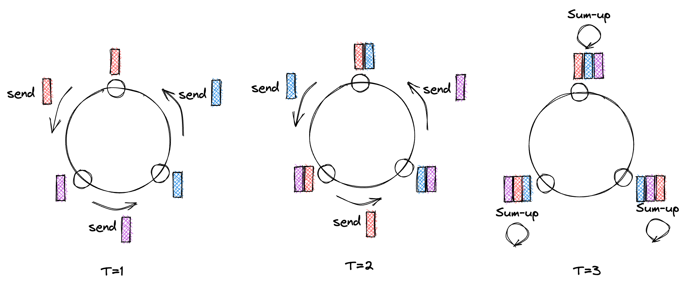
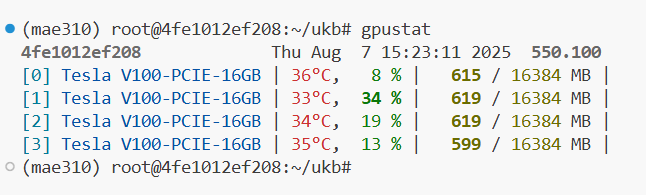
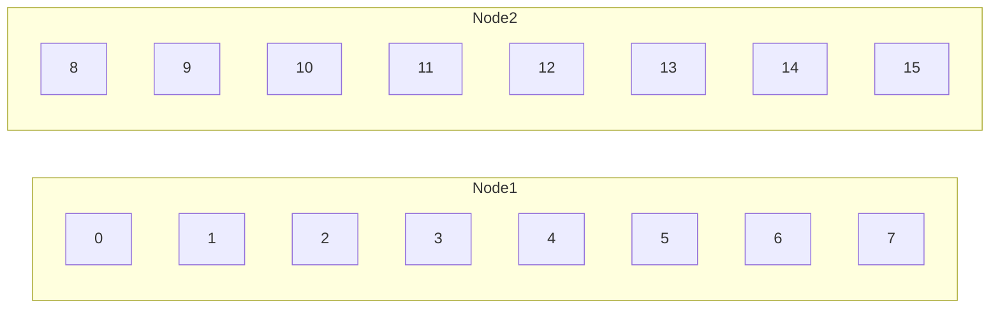
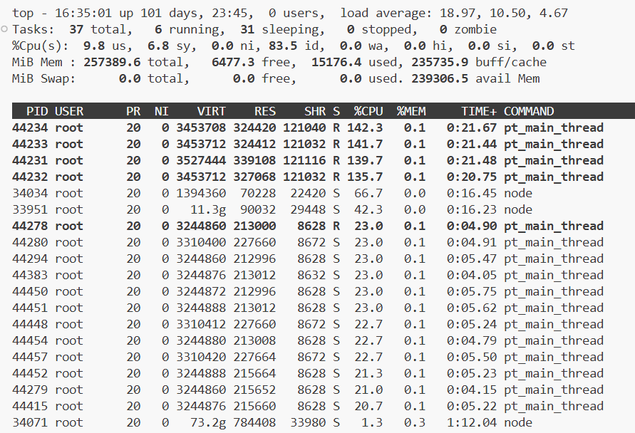
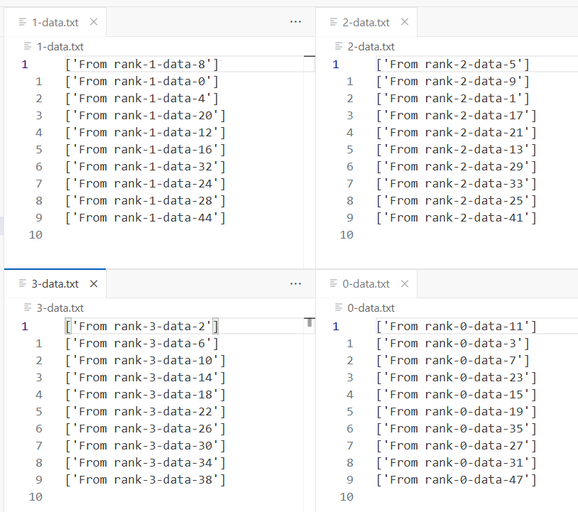

---
tags:
- pytorch
include:
- math
---

# 分布式训练

> [torch.distributed](https://docs.pytorch.org/docs/stable/distributed.html)

torch提供了一些简单好用的api，帮我们实现分布式训练：

- 数据并行
    - [DP](https://docs.pytorch.org/docs/stable/generated/torch.nn.DataParallel.html)（Data-Parallel）
    - [DDP](https://pytorch.org/docs/stable/notes/ddp.html)（Distributed Data-Parallel）
- 模型并行
    - [FSDP2](https://pytorch.org/docs/stable/distributed.fsdp.fully_shard.html)（Fully Sharded Data-Parallel Training）
    - [TP](https://pytorch.org/docs/stable/distributed.tensor.parallel.html)（Tensor Parallel）
    - [PP](https://pytorch.org/docs/main/distributed.pipelining.html)（Pipeline Parallel）

如果对分布式这个topic很陌生，我在下一节梳理了一些资料，可以帮你快速了解分布式训练。

## 分布式训练？

分布式训练系统主要为了解决**单节点**（single-node）的算力和内存不足的问题。我们可以使用多个机器、多张GPU、多个CPU、多个存储设备等（泛称为多个节点，multiple nodes）同时协作来**加速训练**、或者完成单节点无法完成的**超大模型训练**。

分布式训练有多种实现方式，分别适用于不同的场景：

- ==数据并行==（Data Parallelism i.e. DP）
    - 适用于数据量大，模型不大（单机可加载）的场景
    - 主要目的是加速训练，==快训！==
- ==模型并行==（Model Parallelism）
    - 适用于模型非常大（单机无法加载）的场景
    - 可以用流水线并行，把不同的算子**串联**起来
    - 也可以使用张量并行，把单层参数切分到不同设备，类似**并联**
    - 主要目的是变不可能为可能，==能训！==
- ==混合并行==
    - 数据和模型都并行~
    - 如下图所示（图源：[openmlsys](https://openmlsys.github.io/chapter_distributed_training/methods.html)，后面还有几个图也是来自这里）：
    

### 模型并行

模型并行的一个知名案例是[AlexNet](https://papers.nips.cc/paper/4824-imagenet-classification-with-deep-convolutional-neural-networks)（是的，就是2012年那个举世闻名的卷积神经网络），Alex用两张显存3GB的GTX 580完成了62.3M参数规模的训练：



然而模型并行需要比较困难的工程实现，我接触不多就不深入介绍了。我们后面主要介绍数据并行。

### 数据并行

数据并行简单一些，更常见也容易实现。我们简单分析一下它的原理：

通常我们用随机梯度下降的方法来训练深度神经网络，流程如下：

- 从全体样本中抽取一个mini-batch：$x_i \sim X,\quad i=1,2,\cdots,b$
- 计算模型在这个mini-batch上的损失和梯度
    - $\hat{y_i} = f_\theta(x_i)$
    - $l = \sum_{i=1}^b \mathcal{L}(\hat{y_i}, y_i)$
    - $g = \frac{\partial l}{\partial \theta}$
- 然后使用梯度下降更新参数
    - $\theta_{t+1} = \theta_t - \rho g$
- 如此循环往复

在这个过程中，我们的梯度实际上存在一个**加性结构**：

$$
g = \frac{\partial l}{\partial \theta} = \frac{\partial}{\partial \theta} \sum_{i=1}^b \mathcal{L}(\hat{y_i}, y_i)
$$

因此我们实际上可以把一个mini-batch的计算分配给不同的节点来完成，最后再加起来就完成了数据并行：


$$
g = \frac{\partial l}{\partial \theta} = {\color{blue}\sum_{i=1}^k\frac{\partial}{\partial \theta}  \mathcal{L}(\hat{y_i}, y_i)} + {\color{red}\sum_{i=k+1}^b\frac{\partial}{\partial \theta}  \mathcal{L}(\hat{y_i}, y_i)}
$$

> 蓝色和红色的梯度分别由设备1和设备2来计算即可

### 分布式通信

你会发现，不论是模型并行还是数据并行，一个重要的问题是不同设备之间如何通信。

就以数据并行为例，我们把一个mini-batch中的数据**发送**给到了不同的节点，每个节点完成了计算之后需要**同步**计算出的梯度，然后各自更新模型。

下面这个表展示了`torch.distributed`支持的不同分布式通信后端以及api：



举例来说，`torch.distributed.broadcast`可以把一个tensor广播给集群中的所有节点，而`torch.distributed.all_reduce`可以在集群内交换、同步、聚合某个tensor。

下图是All Reduce的一个[示意图](https://siboehm.com/articles/22/data-parallel-training)：



??? deepseek-summary "Ring All Reduce？"
    **Ring AllReduce** 是一种高效的分布式计算算法，主要用于在多个设备（如GPU或服务器节点）之间高效聚合数据（如梯度或参数），常用于深度学习训练中的同步并行（如数据并行）。其核心思想是通过**环形拓扑结构**和**分阶段通信**来优化传统AllReduce的带宽和延迟问题。

    **核心原理**
    
    1. **环形拓扑**：
        - 所有节点排列成一个逻辑环（如`Node 0 → Node 1 → ... → Node N → Node 0`）。
        - 每个节点只与相邻的两个节点通信（前驱和后继），避免全连接的高带宽压力。

    2. **分阶段操作**：
        - **Reduce-Scatter阶段**：
            - 数据被分块（如分成N块，N为节点数）。
            - 节点依次传递并累加（Reduce）数据块，经过N-1步后，每个节点持有最终聚合结果的一个分块。
        - **All-Gather阶段**：
            - 节点交换已聚合的分块，经过N-1步后，所有节点获得完整的全局聚合结果。

    **优势**
    
    1. **带宽优化**：
        - 传统AllReduce需要每个节点发送大量数据，而Ring AllReduce将通信量均匀分布到环上，总通信量固定为 $2(N-1)\times\frac{D}{N}$（D为数据大小）。
    2. **避免瓶颈**：
        - 无中心节点，所有节点平等参与，避免参数服务器（PS）架构的带宽瓶颈。
    3. **适合大规模训练**：
        - 扩展性好，节点增加时通信量仅线性增长（而PS架构是`O(N)`）。

    **应用场景**
    
    - **深度学习框架**：
        - TensorFlow（通过Horovod）、PyTorch（`torch.distributed`）等均支持Ring AllReduce。
        - 例如，在数据并行中，每个GPU计算本地梯度后，通过Ring AllReduce同步全局梯度。
    - **高性能计算**：
        - MPI库（如NCCL、OpenMPI）实现了该算法，用于GPU集群的高效通信。

    
    **示例（4个节点）**
    
    1. **Reduce-Scatter**：
        - 每个节点将数据分4块（A1,A2,A3,A4）。
        - 第1步：Node 0发送A1给Node 1，Node 1累加；同时Node 1发送A2给Node 2，依此类推。
        - 经过3步后，Node 0持有最终的A1块（A1+B1+C1+D1），其他节点同理。
    2. **All-Gather**：
        - 节点交换聚合后的分块，最终所有节点获得完整结果。

    **对比其他方法**
    
    | 方法               | 通信复杂度       | 瓶颈风险       | 适用规模       |
    |--------------------|------------------|----------------|----------------|
    | **Ring AllReduce** | `O(N)`（线性）     | 无             | 大规模集群     |
    | **参数服务器**     | `O(N)`（中心节点） | 中心节点带宽   | 小规模         |
    | **Tree AllReduce** | `O(logN)`          | 根节点带宽     | 中等规模       |

    **局限**
    
    - **延迟敏感**：环形通信的步数随节点数增加，小规模时可能不如Tree AllReduce快。
    - **容错性差**：任一节点故障会导致环断裂，需额外机制处理。

    总结来说，Ring AllReduce通过巧妙的环形分块通信，成为分布式深度学习中的主流同步算法，尤其在GPU集群训练中表现优异。

## DP

> [torch.nn.DataParallel](https://docs.pytorch.org/docs/stable/generated/torch.nn.DataParallel.html)

前面讲了这么多理论，下面我们来实战一下。torch中实现数据并行主要有DP和DDP两种方法。

### DP和DDP的异同

按照torch的[best practices](https://docs.pytorch.org/docs/stable/notes/cuda.html#cuda-nn-ddp-instead)的说法，不论是单机多卡还是多个机器，我们永远不应该使用DP，而应该使用DDP。

??? warning "Why DDP beats DP?"
    DP和DDP都是分布式数据并行的实现。它们的核心区别在于，DP使用Python的[threading](https://docs.python.org/3/library/threading.html)标准库实现并行。而DDP使用Python的[multiprocessing](https://docs.python.org/3/library/multiprocessing.html)标准库实现并行。DDP通过使用多进程，每个GPU都有其专用进程，这避免了Python解释器的GIL带来的性能开销。

    因此DP和DDP的区别就是**多线程**和**多进程**的区别。

    ??? deepseek-summary "多线程与多进程的区别？"
        多线程和多进程都是实现并发编程的方式，但它们在资源管理、通信方式和应用场景上有显著差异。

        | 特性        | 多进程                          | 多线程                          |
        |-----------|-------------------------------|-------------------------------|
        | 内存空间    | 每个进程有独立的内存空间               | 同一进程内的线程共享内存空间            |
        | 创建开销    | 较大（需要复制父进程资源）              | 较小（共享进程资源）                 |
        | 通信方式    | 进程间通信(IPC)如管道、消息队列、共享内存等 | 可直接通过共享变量通信                |
        | 稳定性     | 一个进程崩溃不会影响其他进程             | 一个线程崩溃可能导致整个进程崩溃          |
        | 上下文切换  | 开销较大                         | 开销较小                        |
        | 并行性     | 可真正并行（在多核CPU上）             | 受GIL限制（如Python）            |
        | 同步需求    | 通常不需要同步                     | 需要同步机制（如锁）来保护共享数据        |
    ??? question "Python的多线程和GIL"
        多线程看起来非常完美，然而我们知道，Python的多线程是假的。由于全局解释器锁（GIL, Global Interpreter Lock）的存在，Python的多线程无法真正并行执行Python代码。因此threading这个库实际上只适合IO密集任务，并不适合计算密集任务。

        > 不过未来Python的GIL似乎要移除，说不定以后多线程就是更好的了。

### 一行代码实现DP

虽然不被推荐，但DP有其独特的优势：**一行代码就可以在单机多卡上引入**，非常简单。所以我们还是介绍一下它的用法。

```python hl_lines="1" title="DP的实现方法"
net = torch.nn.DataParallel(model, device_ids=[0, 1, 2])
output = net(input_var)  # input_var can be on any device, including CPU
```

是的，只需要用`torch.nn.DataParallel`包装一下我们的模型，我们就实现了数据并行。包装完毕之后，后续torch会自动把输入的tensor切分、发送到不同的device进行计算。

显然DP只适用于单机多卡，无法胜任多机多卡的情况。并且由于GIL的问题，DP的性能有损耗。

## DDP

> [torch.nn.parallel.DistributedDataParallel](https://docs.pytorch.org/docs/stable/generated/torch.nn.parallel.DistributedDataParallel.html)

相比之下DDP就要复杂地多。

!!! question "DDP的几套实现方式"
    更复杂的是，由于历史遗留问题，DDP有几套完全不同的写法和对应的启动方式：

    ??? note "第一套：手动spawn"
        第一套是最原始的，我们自己来创建多个进程：
        ```python title="run.py" hl_lines="28-31"
        #!/usr/bin/env python
        import os
        import sys
        import torch
        import torch.distributed as dist
        import torch.multiprocessing as mp

        def run(rank, size):
            """ Distributed function to be implemented later. """
            pass

        def init_process(rank, size, fn, backend='gloo'):
            """ Initialize the distributed environment. """
            os.environ['MASTER_ADDR'] = '127.0.0.1'
            os.environ['MASTER_PORT'] = '29500'
            dist.init_process_group(backend, rank=rank, world_size=size)
            fn(rank, size)


        if __name__ == "__main__":
            world_size = 2
            processes = []
            if "google.colab" in sys.modules:
                print("Running in Google Colab")
                mp.get_context("spawn")
            else:
                mp.set_start_method("spawn")
            for rank in range(world_size):
                p = mp.Process(target=init_process, args=(rank, world_size, run))
                p.start()
                processes.append(p)

            for p in processes:
                p.join()
        ```

        然后直接用Python启动就行：
        ```bash
        python run.py
        ```
    ??? note "第二套：torch.distributed.launch"
        第二套稍微简单一些，我们使用`torch.distributed.launch`来启动：

        ```python title="launch.py" hl_lines="15-19"
        import torch
        import torch.distributed as dist
        import argparse
        import os

        def worker(rank, world_size):
            dist.init_process_group("gloo", rank=rank, world_size=world_size)
            tensor = torch.tensor(rank + 1, dtype=torch.float)
            dist.all_reduce(tensor, op=dist.ReduceOp.SUM)
            if rank == 0:
                print(f"Sum of ranks: {tensor.item()}")
            dist.destroy_process_group()

        def main():
            parser = argparse.ArgumentParser()
            parser.add_argument("--local-rank", type=int)
            args = parser.parse_args()
            world_size = int(os.environ['WORLD_SIZE'])
            worker(args.local_rank, world_size)

        if __name__ == "__main__":
            main()
        ```
        启动的方式是：
        ```bash
        python -m torch.distributed.launch --nproc-per-node=4 launch.py
        ```

        这种方式需要使用argparse和os.environ来传递参数，也很麻烦。不过不需要我们手动spawn各个进程，已经简化非常多了。
    
    第三套就是我们后面介绍的`torchrun`方式（也叫[Elastic Launch](https://docs.pytorch.org/docs/stable/elastic/run.html)，是`torch.distributed.run`模块的脚本封装），最简单也最推荐。

### 极简例子

下面我们用一个简单的例子来展示DDP的实现方法。代码来自[pytorch-ddp-examples](https://github.com/CSCfi/pytorch-ddp-examples/blob/master/mnist_ddp.py)，略有修改：

```python title="DDP的实现方法：mnist_ddp.py" hl_lines="43 56 62 78"
# Based on multiprocessing example from
# https://yangkky.github.io/2019/07/08/distributed-pytorch-tutorial.html

import os
import argparse
import torch
import torch.nn as nn
import torch.distributed as dist
import torchvision.transforms as transforms

from torchvision.datasets import MNIST
from torch.utils.data import DataLoader
from torch.utils.data.distributed import DistributedSampler
from torch.nn.parallel import DistributedDataParallel


class ConvNet(nn.Module):
    def __init__(self, num_classes=10):
        super(ConvNet, self).__init__()
        self.cnn = nn.Sequential(
            nn.Conv2d(1, 16, kernel_size=5, stride=1, padding=2),
            nn.BatchNorm2d(16),
            nn.ReLU(),
            nn.MaxPool2d(kernel_size=2, stride=2),
            nn.Conv2d(16, 32, kernel_size=5, stride=1, padding=2),
            nn.BatchNorm2d(32),
            nn.ReLU(),
            nn.MaxPool2d(kernel_size=2, stride=2),
        )
        self.fc = nn.Linear(7 * 7 * 32, num_classes)

    def forward(self, x):
        out = self.cnn(x)
        out = out.reshape(out.size(0), -1)
        out = self.fc(out)
        return out


def train(num_epochs):
    torch.manual_seed(0)

    # 1、初始化集群
    dist.init_process_group(backend="nccl")
    rank = dist.get_rank()

    # 我们只需要在rank==0的进程上打印消息就行了
    # 因为所有进程的信息应该是一致的
    verbose = rank == 0
    if verbose:
        print(os.environ)

    # 2、准备模型
    local_rank = int(os.environ["LOCAL_RANK"])  # 进程的本机rank
    torch.cuda.set_device(local_rank)
    model = ConvNet().cuda()
    model = DistributedDataParallel(model, device_ids=[local_rank])

    # 3、准备数据集
    train_dataset = MNIST(
        root="./data", train=True, transform=transforms.ToTensor(), download=False
    )
    train_sampler = DistributedSampler(train_dataset)
    batch_size = 100
    train_loader = DataLoader(
        dataset=train_dataset,
        batch_size=batch_size,
        shuffle=False,
        num_workers=0,
        pin_memory=True,
        sampler=train_sampler,
    )

    # 下面的过程基本和普通训练无异
    criterion = nn.CrossEntropyLoss().cuda()
    optimizer = torch.optim.SGD(model.parameters(), 1e-4)
    for epoch in range(num_epochs):
        # 需要手动设置，否则采样顺序一成不变
        train_sampler.set_epoch(epoch)
        tot_loss = 0
        for i, (images, labels) in enumerate(train_loader):
            images = images.cuda(non_blocking=True)
            labels = labels.cuda(non_blocking=True)
            outputs = model(images)
            loss = criterion(outputs, labels)
            optimizer.zero_grad()
            loss.backward()
            optimizer.step()
            tot_loss += loss.item()
        if verbose:
            print(
                f"Epoch [{epoch + 1}/{num_epochs}], "
                "average loss: {tot_loss / (i + 1):.4f}"
            )


def main():
    parser = argparse.ArgumentParser()
    parser.add_argument(
        "--epochs",
        default=10,
        type=int,
        metavar="N",
        help="number of total epochs to run",
    )
    args = parser.parse_args()
    train(args.epochs)


if __name__ == "__main__":
    main()
```

然后，我们需要使用[torchrun](https://docs.pytorch.org/docs/stable/elastic/quickstart.html)来启动训练（下面的例子是2个节点，每台节点8个进程）：

```bash
torchrun --nnodes=2 --nproc_per_node=8 \
    --rdzv_id=100 --rdzv_backend=c10d \
    --rdzv_endpoint=$MASTER_ADDR:29400 mnist_ddp.py --epochs 10
```

??? question "rdzv是什么"
    rdzv是[Rendezvous](https://docs.pytorch.org/docs/stable/elastic/rendezvous.html)的缩写，在多机器训练的过程中我们需要指定rdzv_endpoint（也就是汇聚点，作为master发号施令）。

    不过讲真我也没用过，穷逼实验室只有单机多卡可以用😅😄

    如果您有相关的资源，应该就有人提供对应的文档和支持~

如果是**单机多卡**训练就简单多了，本地通信不需要rdzv参数，只需要指定使用的进程数量即可：

```bash
CUDA_VISIBLE_DEVICES="0,1,2,3" torchrun --nproc_per_node=4 mnist_ddp.py --epochs 10
```

下面是该脚本在我的环境中的运行情况：

<figure markdown>

<figurecaption>穷鬼专用V100</figurecaption>
</figure>

注意，我输出了`rank==0`进程的环境变量，可以看到torchrun添加了非常多有用的环境变量（详情间[torch/distributed/run.py](https://github.com/pytorch/pytorch/blob/main/torch/distributed/run.py)）。例如`LOCAL_RANK`，`LOCAL_WORLD_SIZE`，`WORLD_SIZE`等。如有必要你可以读取这些环境变量。

```text title="运行日志" hl_lines="4-21"
environ({
    'SHELL': '/bin/bash', 
    ... # 此处省略了无关的内存
    'OMP_NUM_THREADS': '1', 
    'LOCAL_RANK': '0', 
    'RANK': '0', 
    'GROUP_RANK': '0', 
    'ROLE_RANK': '0', 
    'ROLE_NAME': 'default', 
    'LOCAL_WORLD_SIZE': '4', 
    'WORLD_SIZE': '4', 
    'GROUP_WORLD_SIZE': '1', 
    'ROLE_WORLD_SIZE': '4', 
    'MASTER_ADDR': '127.0.0.1', 
    'MASTER_PORT': '29500', 
    'TORCHELASTIC_RESTART_COUNT': '0', 
    'TORCHELASTIC_MAX_RESTARTS': '0', 
    'TORCHELASTIC_RUN_ID': 'none', 
    'TORCHELASTIC_USE_AGENT_STORE': 'True', 
    'TORCH_NCCL_ASYNC_ERROR_HANDLING': '1', 
    'TORCHELASTIC_ERROR_FILE': '/tmp/torchelastic_gfcioxya/none_6ffbx9v6/attempt_0/0/error.json'
    })
Epoch [1/10], average loss: 2.2009
Epoch [2/10], average loss: 1.9731
Epoch [3/10], average loss: 1.7889
Epoch [4/10], average loss: 1.6223
Epoch [5/10], average loss: 1.4896
Epoch [6/10], average loss: 1.3651
Epoch [7/10], average loss: 1.2676
Epoch [8/10], average loss: 1.1728
Epoch [9/10], average loss: 1.1013
Epoch [10/10], average loss: 1.0307

```

下面我们详细介绍几个关键的步骤：

### 1、初始化集群

DDP的训练中，首先我们需要选择一个分布式通信的后端进行初始化。主要的四个后端我们[之前的图](#_5)也展示过了。后端选择的基本原则可以看[Which backend to use?](https://docs.pytorch.org/docs/stable/distributed.html#which-backend-to-use)。

- gloo：CPU训练推荐的后端
- mpi
- nccl：GPU训练推荐的后端（仅N卡支持，也是目前最高效的后端）
- ucc
- 等等

选好了后端之后（通常要么是gloo要么是nccl），我们就可以初始化集群了：

```python
dist.init_process_group("nccl")
```

这条代码执行的时候，torch会尝试在集群之间相互通信（由于不同进程启动顺序的问题，可能会因此出现一些warning，这是正常的）。

初始化完成之后，所有的进程都会得到一个全局的编号：

```python
rank = dist.get_rank()
```

例如参数为`--nnodes=2 --nproc_per_node=8`的情况下，rank就是`0-15`。画个图帮助一下理解：



### 2、准备模型

模型的准备就简单多了，和DP几乎一致：

```python
local_rank = int(os.environ["LOCAL_RANK"]) # 进程的本机rank
torch.cuda.set_device(local_rank)
model = ConvNet().cuda()
model = DistributedDataParallel(model, device_ids=[local_rank])
```

这里需要注意的点是`local_rank`这个变量是从环境变量中读取的。

我们启动了分布式训练之后，一共会开启`nnodes * nproc_per_node`个进程，一般情况下我们只给一张卡分配一个进程。所以这个时候大致可以认为：

```python
local_rank == rank % nproc_per_node
```

### 3、准备数据集

在DDP训练中，我们的DataLoader需要使用[DistributedSampler](https://docs.pytorch.org/docs/stable/data.html#torch.utils.data.distributed.DistributedSampler)，这样才能**确保不同的进程接收到的数据是互斥的**，从而实现一个mini-batch数据的有效切分。这一点我们在之前的[数据加载笔记](./data.md)中提到过。

此外有一个小陷阱是，我们在每个epoch都应该手动call一下`DistributedSampler.set_epoch`函数，否则每个epoch采样数据的顺序不会变：

```python
train_sampler.set_epoch(epoch)
```

这样做是为了**在不同进程之间使用相同的随机种子**，保证进程间采样的顺序一致。`DistributedSampler`的大致原理和其他的`Sampler`差不多，==都是针对map-style的数据集设计的==。`Sampler`会先读取数据集的所有keys，然后**无放回随机采样**若干个key形成一个mini-batch的数据。只不过`DistributedSampler`会把采样出的keys进一步划分到不同的进程。

!!! warning "iterable-style数据集需要手动划分数据集"
    我们知道torch的数据集有两种形态：

    - map-style
    - iterable-style

    对于map-style的数据集，使用`DistributedSampler`是标准的做法。

    然而对于iterable-style的数据集，我们反而**不能使用DistributedSampler**，详细的原因[之前](./data.md#iterable-style_1)介绍过。

    > 直观上也很好理解，iterable-style的数据集从设计上来说就是按照既定的顺序挨个遍历，压根无法确定有多少个样本（没有实现`__len__`），自然就无法进行随机采样。

    这个时候，为了适配分布式训练我们需要**手动控制数据集的划分**。
    
    此外还需要注意和`num_workers`进行兼容，因为iterable-style数据集在启用**多进程加载**的时候也需要进行切分。
    
    此时可以使用`DataLoader`的`worker_init_fn`参数控制数据在每个worker的加载行为。这个我们[之前的笔记](./data.md#worker_init_fn)也介绍过。

    下面给出了一个完整的例子，希望能帮你理解。

??? example "一个完整的例子：DPP+多进程Dataloader+IterableDataset"
    在DPP+多进程Dataloader的场景下，iterable-style数据集的加载需要特别小心处理。

    假设现在需要在4个节点上进行DDP训练，每个进程的Dataloader设置`num_workers=3`，拓扑关系如下：
    
    ```mermaid
    graph LR
    DDP --- NodeA & NodeB & NodeC & NodeD
    NodeA --- DataLoaderWorker_A1 & DataLoaderWorker_A2 & DataLoaderWorker_A3
    ```

    我们的数据字应该较为均匀地划分到这些节点。**现实情况下，iterable-style的数据集没有定义`__len__`方法**，无法获得准确的大小。
    
    因此我们只能在每个Dataset内部维护一个计数器。然后通过模`world_size`以及模`num_workers`的方式来分配数据（需要适当选取使得它们俩互质）：

    ```python title="IterableDataset在DPP+多进程Dataloader中的处理" hl_lines="21-22"
    from itertools import count
    from torch.utils.data import DataLoader, IterableDataset, get_worker_info
    import torch.distributed as dist


    class IkunDataSet(IterableDataset):
        def __init__(self, rank, world_size):
            self.rank = rank
            self.world_size = world_size
            self.worker_id = 0
            self.num_workers = 1
            self.count = 0
            # 无限正整数数据流，模拟某种在线数据流
            self.data = count()

        def __iter__(self):
            for single_data in self.data:
                # 这个数据集已经生产的数据个数
                self.count += 1
                if (
                    self.count % self.world_size == self.rank
                    and self.count % self.num_workers == self.worker_id
                ):
                    yield f"From rank-{self.rank}-data-{single_data}"


    def worker_init_fn(worker_id):
        worker_info = get_worker_info()
        # 每个worker会拿到数据集的一个复制
        dataset = worker_info.dataset
        # 把worker的信息传递给数据集
        dataset.worker_id = worker_id
        dataset.num_workers = worker_info.num_workers


    if __name__ == "__main__":
        dist.init_process_group(backend="gloo")
        dataset = IkunDataSet(rank=dist.get_rank(), world_size=dist.get_world_size())
        # 这里的num_workers必须要取得和world_size互质
        dataloader = iter(DataLoader(dataset, num_workers=3, worker_init_fn=worker_init_fn))
        # 我们获取10条数据，然后输出到指定的文件
        f = open(f"{dist.get_rank()}-data.txt", "w")
        for _ in range(10):
            data = next(dataloader)
            print(data, file=f, flush=True)
        f.close()
        dist.destroy_process_group()

    ```

    你可以在后台看到我们创建的进程：

    

    最终，我们的四个进程获得的数据如下：

    

    注意，顺序被打乱了（因为我们使用了多个dataload workers，它们输出数据的不保证顺序）。如果你使用`num_workers=1`就可以观察到顺序未被打乱。

### 4、启动训练

多节点启动和单机多卡启动之前都介绍过了：

```bash title="多节点启动"
torchrun --nnodes=2 --nproc_per_node=8 \
    --rdzv_id=100 --rdzv_backend=c10d \
    --rdzv_endpoint=$MASTER_ADDR:29400 mnist_ddp.py --epochs 10
```

```bash title="单机多卡启动"
torchrun --nproc_per_node=4 mnist_ddp.py --epochs 10
```

此致。
