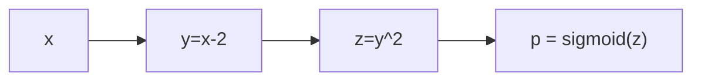

---
tags:
- pytorch
include:
- math
---

# 训练技巧

<figure markdown>

[](https://github.com/owenliang/torch-thins)

</figure>

这个仓库提到的三个小技巧都是很实用的技术，于是我自己也来梳理一下。

首先需要明确的是，这些技术都是为了**缓解模型占用显存过多**而采取的权宜之计，如果你财大气粗完全可以不要这些妥协的办法。

*为什么* 的问题解决了，下面我们主要讲解 *是什么* 和 *怎么办* 。

## 自动混合精度

> [torch.amp](https://docs.pytorch.org/docs/stable/amp.html)

自动混合精度（Automatic Mixed Precision）是torch提供的自动处理**单精度浮点数**（`torch.float32`）和其他**低精度浮点数**（例如半精度`torch.float16`、`torch.bfloat16`等）**混合计算**的功能。

!!! info
    似乎CPU上也有AMP，但是我们只看GPU上的AMP，或者更确切只看CUDA。其他平台是类似的。

### 核心想法

amp的核心想法是针对不同的算子，使用不同的精度：

- 例如，对于线性层、卷积层这些算子通常不需要特别高的精度（半精度）就可以保证计算的准确
- 而对于`sum`，`mean`，`prod`这些数据约减操作就需要比较高的精度（单精度）

### 极简例子

torch中amp技术通常由`torch.autocast`和`torch.amp.GradScaler`配合完成。

一个最简单的使用amp训练的[例子](https://docs.pytorch.org/docs/stable/notes/amp_examples.html#typical-mixed-precision-training)是：

```python
from torch import autocast
from torch.amp import GradScaler

# 创建模型和优化器
# 默认情况下，CUDA平台使用单精度浮点数
model = Net().cuda()
optimizer = optim.SGD(model.parameters(), ...)

# 创建梯度放缩器：GradScaler
scaler = GradScaler()

for epoch in epochs:
    for input, target in data:
        optimizer.zero_grad()

        # 使用autocast上下文管理器进行前向传播
        with autocast(device_type='cuda', dtype=torch.float16):
            output = model(input)
            loss = loss_fn(output, target)

        # 为了防止underflow，先使用scaler把loss放大若干倍
        # 然后再进行反向传播计算梯度
        scaler.scale(loss).backward()

        # scaler会先把梯度缩小回正常的倍率
        # 然后再进行梯度下降（如果没有发生overflow的话）
        scaler.step(optimizer)

        # 调整缩放因子
        # 如果出现了overflow的情况，就缩小放大的倍率
        scaler.update()
```

??? question "为什么总是放大梯度？"
    通常情况下，我们在初始化模型的时候会**控制参数的量级**不至于太大，输入的数据也经常会采取一些**标准化**措施。所以通常我们的梯度即使经过了scaler放大也不会overflow。因此我们一般都会先尝试放大梯度，优先避免underflow。

    常用的几种浮点数的范围如下：

    |类型|正值范围|构成（sign+exponent+decimal）|$\epsilon_{\text{machine}}$|
    |--|--|--|--|
    |float32|$[1.18\times10^{-38},3.4\times10^{38}]$|1 + 8 + 23 bits|$1.19\times 10^{-7}$|
    |float16|$[5.96\times10^{-8},6.55\times10^{4}]$|1 + 5 + 10 bits|$9.77\times 10^{-4}$|
    |bfloat16|$[1.18\times10^{-38},3.39\times10^{38}]$|1 + 8 + 7 bits|$7.81\times 10^{-3}$|

    > 从bits的配置也可以看出来bfloat16就是为了完全保留单精度浮点的exponent而设计的。`float32`到`bfloat16`的转换中，只会发生underflow，一定不会发生overflow。当然，这样也就导致machine epsilon非常大，舍入误差很大。
    >
    > 也正是因此，如果我们是`bfloat16`的amp，放大梯度可能就会造成overflow了（默认情况下的缩放因子是65536，很容易就爆炸了）。

    结合上面的表来理解，放大梯度在二进制数字中看来就是把更多的bits留给小数部分，而不是无用的指数部分（因为梯度不会很大）。从而间接减小machine epsilon，降低舍入误差。
    

## 梯度累积

> 请看[torch.optim.Optimizer.zero_grad](https://docs.pytorch.org/docs/stable/generated/torch.optim.Optimizer.zero_grad.html)和[torch.Tensor.backward](https://docs.pytorch.org/docs/stable/generated/torch.Tensor.backward.html)

### 核心想法

梯度累积（Gradient Accumulation）和我们之前介绍的[分布式训练](./multi_gpu.md)的数据并行想法有点类似。

只不过梯度累积使用的策略是**把繁重的计算任务摊销到更多的时间上**，而分布式训练是把繁重的任务拆解到更多的机器上。

$$
g = \frac{\partial l}{\partial \theta} = {\color{blue}\sum_{i=1}^a\frac{\partial}{\partial \theta}  \mathcal{L}(\hat{y_i}, y_i)} + {\color{red}\sum_{i=a+1}^b\frac{\partial}{\partial \theta}  \mathcal{L}(\hat{y_i}, y_i)} + {\color{blue}\sum_{i=b+1}^c\frac{\partial}{\partial \theta}  \mathcal{L}(\hat{y_i}, y_i)}+ {\color{red}\sum_{i=c+1}^d\frac{\partial}{\partial \theta}  \mathcal{L}(\hat{y_i}, y_i)}
$$

> 假设我们累积步长为4，就相当于把$d$个样本的梯度分为四批**在不同的时刻计算**，存储在一个地方不断累积。

### 极简例子

```python hl_lines="16-19"
model = MyModel()
optimizer = torch.optim.Adam(model.parameters(), lr=1e-4)
accumulation_steps = 4  # 累积4步

for epoch in range(epochs):
    for i, (inputs, labels) in enumerate(dataloader):
        # 前向传播
        outputs = model(inputs)
        loss = criterion(outputs, labels)
        
        # 反向传播（梯度累积）
        loss = loss / accumulation_steps  # 损失按步数归一化
        loss.backward()
        
        # 累积足够步数后更新参数
        if (i + 1) % accumulation_steps == 0:
            optimizer.step()  # 参数更新
            optimizer.zero_grad()  # 清空梯度
```

梯度累计的代码非常简单，无非就是添加一个**归一化**和**条件判断**。

然而，想要真正理解这个代码我们必须了解torch对于梯度自动反向传播（[autograd](https://docs.pytorch.org/tutorials/beginner/blitz/autograd_tutorial.html#computational-graph)）的处理：

!!! note "autograd算法"
    前向传播的过程中，torch会动态地构建一个计算图，这是一个有向无环图（DAG）。图中的节点要么是参数和激活值（requires_grad）要么是算子，要么是根节点（输入值）。对于requires_grad的节点，会有额外的空间来存储梯度信息（`.grad_fn`和`.grad`）。

    

    而后，在反向传播的过程中，torch根据链式法则从后往前计算梯度（调用`.grad_fn`），并且**累加到已经存储的梯度上**（`.grad`）。

    因此，只要我们不**手动把梯度设置为0**，实际上就一直在进行梯度累积。这也是为什么我们需要调用`optimizer.zero_grad()`的原因。

## 激活值检查点

> [torch.utils.checkpoint](https://docs.pytorch.org/docs/stable/checkpoint.html)

### 核心想法

常规训练过程中，我们需要在前向传播的时候把所有中间节点的激活值都保存在显存中以便后续的反向传播梯度计算。例如下述计算过程：



我们需要保存以下中间激活值：

- $y=x-2$
    - 因为$z$的梯度需要用到：$z' = 2y$
- $z=y^2$
    - 因为$p$的梯度需要用到：$p' = \sigma(z)(1-\sigma(z))$

激活点检查（Activation Checkpointing）是一种以计算换内存（时间换空间）的技术。我们可以**不保存某些激活值**，而是在反向传播过程中重新计算。例如上面例子中的$x-2$，计算应该很简单，我们完全可以在反向传播的时候重新算一下。

### 极简例子

```python
import torch
from torch.utils.checkpoint import checkpoint


class MLP(torch.nn.Module):
    def __init__(self, input_size, hidden_sizes, output_size):
        super(MLP, self).__init__()
        self.fc_first = torch.nn.Linear(input_size, hidden_sizes[0])
        fc_middle = []
        for i in range(1, len(hidden_sizes) - 1):
            fc_middle.append(torch.nn.Linear(hidden_sizes[i - 1], hidden_sizes[i]))
            fc_middle.append(torch.nn.ReLU())
        self.fc_middle = torch.nn.Sequential(*fc_middle)
        self.fc_final = torch.nn.Linear(hidden_sizes[-1], output_size)

    def forward(self, x, ckp=False):
        out = self.fc_first(x)
        out = torch.relu(out)
        if ckp:
            # 如果开启了ckp选项
            # 就在中间的所有线性层都使用checkpoint
            for layer in self.fc_middle:
                if isinstance(layer, torch.nn.Linear):
                    out = checkpoint(layer, out, use_reentrant=False)
                else:
                    out = layer(out)
        else:
            out = self.fc_middle(out)
        out = self.fc_final(out)
        return out
```

效果还是很显著的：

=== "使用检查点"
    ```python
    model = MLP(
        input_size=1024, hidden_sizes=[512, 256, 128, 128], output_size=10
    ).cuda()
    x = torch.randn(1024, 1024).cuda()

    torch.cuda.reset_peak_memory_stats()
    output = model(x, ckp=True)
    print(
        "Peak Memory Usage With Checkpointing: {:.2f} MB".format(
            torch.cuda.max_memory_allocated() / 1e6
        )
    )
    ```
    输出是：`Peak Memory Usage With Checkpointing: 19.67 MB`
=== "不用检查点"
    ```python
    model = MLP(
        input_size=1024, hidden_sizes=[512, 256, 128, 128], output_size=10
    ).cuda()
    x = torch.randn(1024, 1024).cuda()

    torch.cuda.reset_peak_memory_stats()
    output = model(x, ckp=False)
    print(
        "Peak Memory Usage Without Checkpointing: {:.2f} MB".format(
            torch.cuda.max_memory_allocated() / 1e6
        )
    )
    ```
    输出是：`Peak Memory Usage Without Checkpointing: 30.34 MB`
