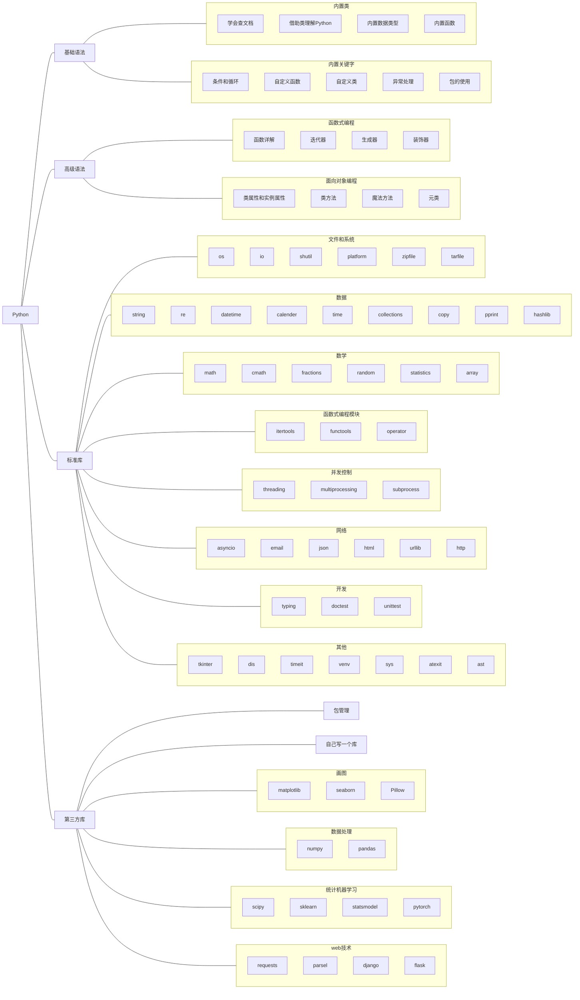

# 蟒蛇🐍

<div class="console">

```console
$ python -c "import this"
The Zen of Python, by Tim Peters

Beautiful is better than ugly.
Explicit is better than implicit.
Simple is better than complex.
Complex is better than complicated.
Flat is better than nested.
Sparse is better than dense.
Readability counts.
Special cases aren't special enough to break the rules.
Although practicality beats purity.
Errors should never pass silently.
Unless explicitly silenced.
In the face of ambiguity, refuse the temptation to guess.
There should be one-- and preferably only one --obvious way to do it.
Although that way may not be obvious at first unless you're Dutch.
Now is better than never.
Although never is often better than *right* now.
If the implementation is hard to explain, it's a bad idea.
If the implementation is easy to explain, it may be a good idea.
Namespaces are one honking great idea -- let's do more of those!


```

</div>

## 绪
学了很久的Python了，在网上看了许许多多的教程，平时我也写过很多笔记也有很多编程的案例。总想着哪天系统整理一下，放到网上。一方面是方便自己查阅，另外一方面也是希望能帮助到一些入门的小伙伴。构想了许久，终于在这个寒假开启了这个项目。

<s>我这套教程</s>（我的笔记！）预计会包含基础语法、高级语法、标准库和第三方库这四个板块，详细的内容我[列个思维导图在后面](#_3)。

需要说明的是，涉及到的库我不会事无巨细地介绍所有的api（这些内容官网都是有的），而是会讲解主要的api，然后再以案例的形式展现常见的用法（这个似乎官网也有哈哈哈）。

语法方面我也没法面面俱到，只能讲一个大致的脉络。我希望能把自己对Python的理解传达给读者，而不是把Python的documentation搬运过来。

希望你我都有所收获！

> Python != python，官方名称是需要大写P的，当然我经常不大写，见谅。
## 思维导图

!!! info "FYI"
    点击思维导图中的节点即可跳转到相应的文章（点不了就是没写完）。

> 以下内容基于Python 3.10.9



