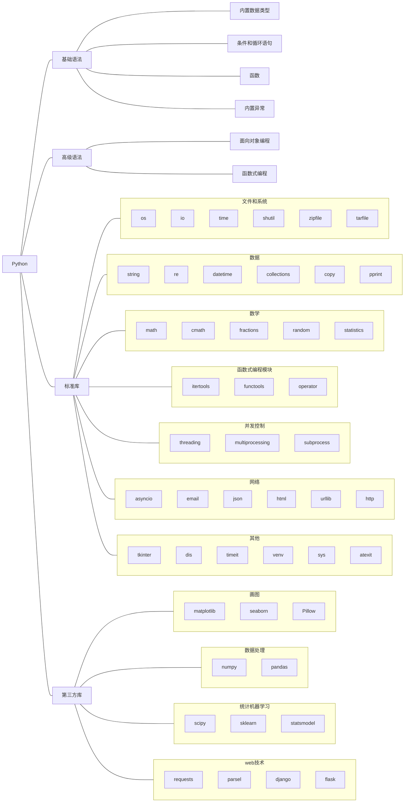

# Python🐍

!!! quote "The Zen of Python, by Tim Peters"
    Beautiful is better than ugly.
    
    Explicit is better than implicit.
    
    Simple is better than complex.
    
    Complex is better than complicated.
    
    Flat is better than nested.
    
    Sparse is better than dense.
    
    Readability counts.
    
    Special cases aren't special enough to break the rules.
    
    ……

## 绪
学了很久的python了，在网上看了许许多多的教程，平时我也写过很多笔记也有很多编程的案例。总想着哪天系统整理一下，放到网上。一方面是方便自己查阅，另外一方面也是希望能帮助到一些入门的小伙伴。

我这套教程预计会包含基础语法、高级语法、标准库和第三方库这四个板块，详细的内容我列个图表在后面。需要说明的是，涉及到一些库我不会事无巨细地介绍所有的api（这些内容官网都是有的），而是会讲解主要的api，然后再以案例的形式展现常见的用法（这个似乎官网也有哈哈哈）。

另外再提一句，虽然网上已经有了数不清的python教程，但是我还是要写。一方面与我自己而言算是一个系统的复习、回顾，另一方面则是我希望自己能做出一个不一样的教程，带入自己的思考、用全新的思路讲好它。

希望你我都有所收获！

> 2023.1.15
## 知识图谱

> 以下内容基于python 3.10.9

