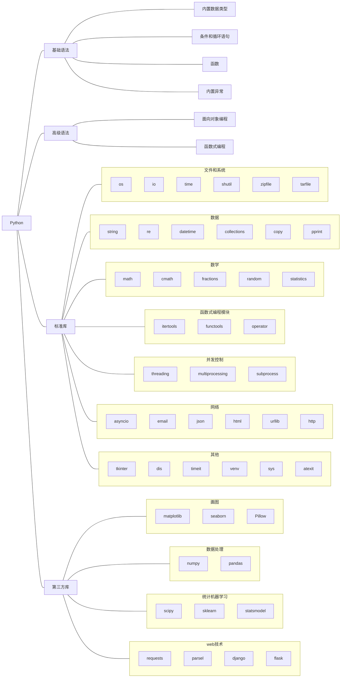

# Python🐍

!!! quote "The Zen of Python, by Tim Peters"
    Beautiful is better than ugly.
    
    Explicit is better than implicit.
    
    Simple is better than complex.
    
    Complex is better than complicated.
    
    Flat is better than nested.
    
    Sparse is better than dense.
    
    Readability counts.
    
    Special cases aren't special enough to break the rules.
    
    ……

## 知识图谱

> 以下内容基于python 3.10.9

