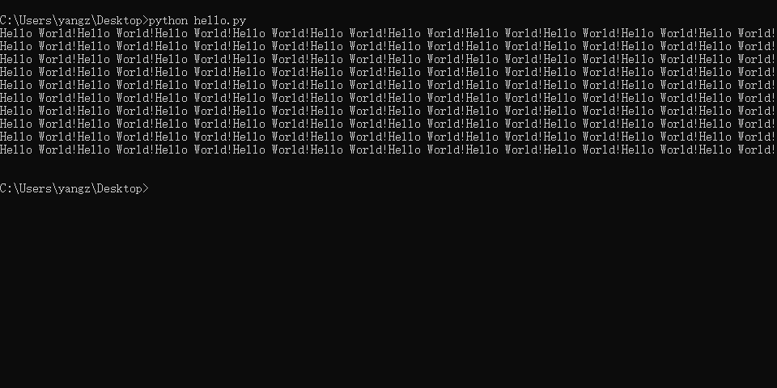
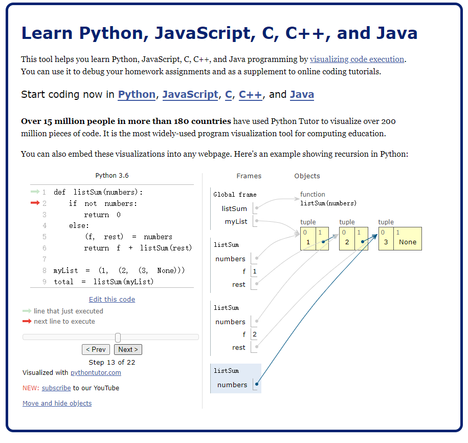
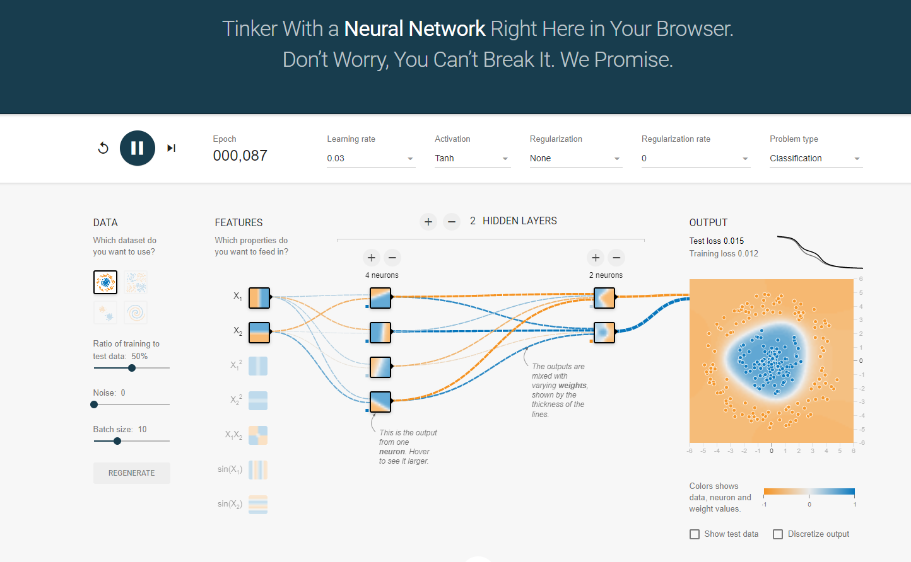

---
tags:
- python入门
---

# 前置知识

## 什么是编程？

按照我的理解，所谓的编程（Coding）就是把一些**操作**用特定格式化的文本记录下来，等到需要用的时候就用特定的**程序**解释、运行。

举一个最简单的例子：
```python
print("Hello World!"*100)
```
这段代码的功能很简单，按照英语的字面意思理解就猜到：`打印100个Hello World`。我们把这段代码写在一个`hello.py`文件里，然后用`python`解释器解释、运行，就可以在命令行打印出100个Hello World了：



> 这里我用的命令行就是Windows自带的CMD，具体的python命令行操作我们以后再介绍

我想这个例子大概能体现出编程的核心逻辑：

1. **存储**操作过程：我们写下的这段代码存储了一个操作：`打印100个Hello World`，以后我们如果还想再重复一次这个操作只需要再次运行即可，不需要重复写代码的过程。
2. **简化**操作过程：并且这段代码大大简化了`打印100个Hello World`这一操作的难度。如果我们要手动输入100个Hello World，估计大多数的人是要奔溃的，就算有人能坚持下来也是效率低下的。

当然，编程并非永远在**简化**，很多时候想要用结构化的语言描述事物是非常困难的。举例来说如果我们想和现实交互往往就需要付出许多的努力。正常人能很轻松的识别出图片上的阿拉伯数字，可是如果想要让计算机认识这些数字则需要诸多天才若干年的苦思冥想和成千上万行的代码，这反而是复杂化了。
> 不过这么比也不是很公平，毕竟大家小时候学认数字也是花了很长时间的，这个过程一点也不简单。总之大概就是那么个意思。
## 为什么选Python？
### 少儿编程的摇钱树
在很多的领域，python有难以撼动的地位。就比如中小学编程教育，不开玩笑，我小学二年级的小侄子肯定能学会最简单的python。因为python的代码真的太简单、易读了，（如果你掌握了一定的英语词汇）简直就和自然语言无异。并且作为一个弱类型语言，它的包容性很强。相比之下如果你让小学的孩子来学一点C语言，恐怕比较困难。所以，楼下少儿编程的辅导班都赚疯了。

### 其他的都不重要
如果你是编程小白，想要选择一门语言入门，那么我二年级小侄子都能掌握的python自然是不二之选。

而如果你是有一定经验的程序员，大概会自己去官网看一看，应该不会来我这里。

总而言之，python在我眼中最重要的特点就是简单，好入门。至于他的强大和美妙就等读者在以后的学习过程中细细体会了，不可与他人语也。

## 怎么学Python？
### 教程
其实网上已经有诸多的教程，如果读者不习惯我的风格可以去看看下面这些优质的教程：

- [Python官方](https://docs.python.org/zh-cn/3/tutorial/index.html)：良心文档，有全中文，是首选
- [菜鸟教程](https://www.runoob.com/python3/python3-tutorial.html)：算是比较有名的网站，基本啥编程语言都有
- [w3cschool](https://www.w3cschool.cn/python3/)：另外一个有名的编程学习网站
- [廖雪峰](https://www.liaoxuefeng.com/wiki/1016959663602400)：有名的大佬的博客，也是有一系列的教程

### 解决问题
如果学习过程中遇到了问题，我的建议是到这些网站搜一搜、看一看：

- [stackoverflow](https://stackoverflow.com/)：国际著名的程序员问答平台
- [github](https://github.com)：程序员的集结地，在issue中可以找到很多有用的信息

并且搜索的时候尽量用英文搜索，如果有条件的话使用Google会比较好，如果用不了就用Bing，总之别用百度。中文互联网的环境确实够臭的，[CSDN](https://www.csdn.net/)、[博客园](https://www.cnblogs.com/)之类的博客网站的质量良莠不齐，千万注意甄别。

### 有用的网站

- [在线调试python](https://pythontutor.com/)：可以可视化python的运行过程，是个学习python的神器

- [在线运行python](https://www.w3cschool.cn/tryrun/runcode?lang=python3)：类似的网站很多，随意找一个即可，用处其实不是很大
- [AI模型可视化](http://playground.tensorflow.org/)：好玩也好看的网站

- [Leetcode](https://leetcode.com/)：算法刷题网站，可以去练一练python的语法
- [checkio](https://checkio.org/)：另外一个OJ（online judge）平台，可以刷题