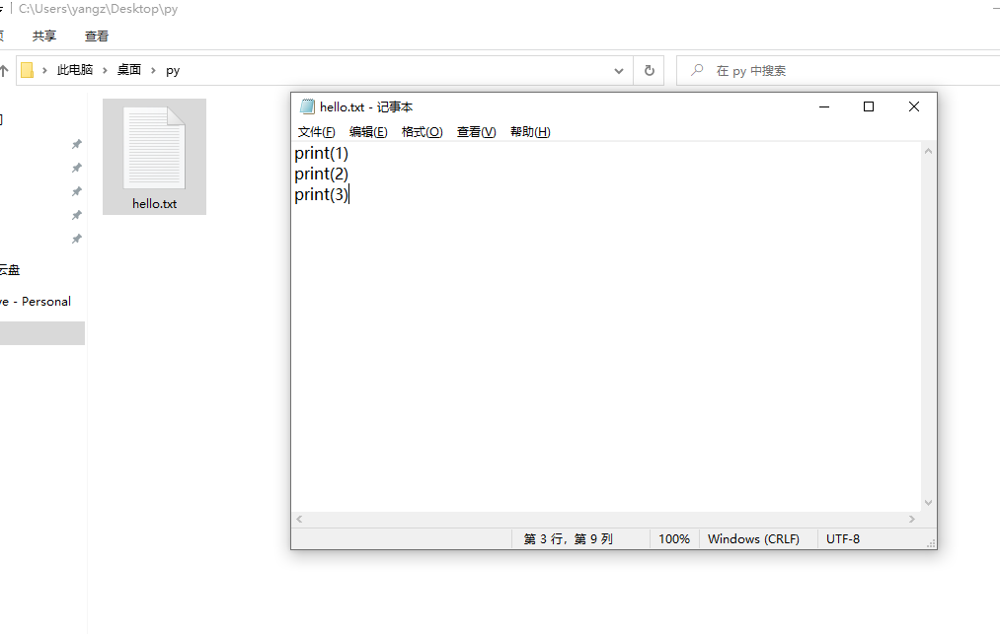
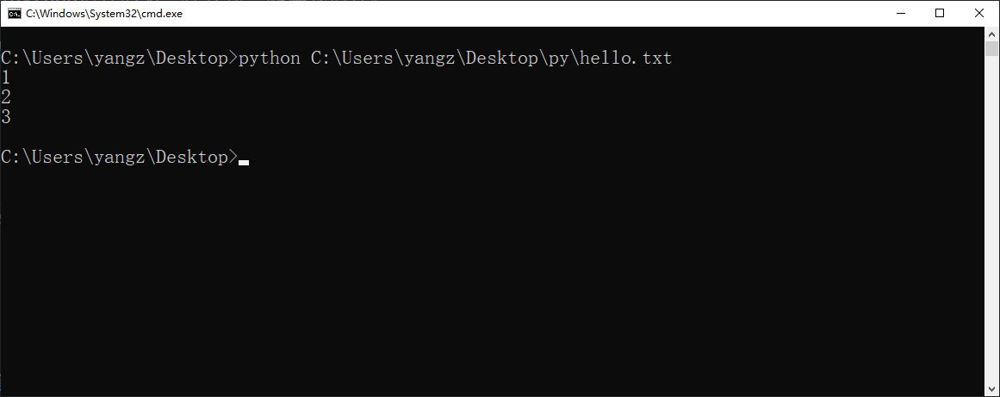
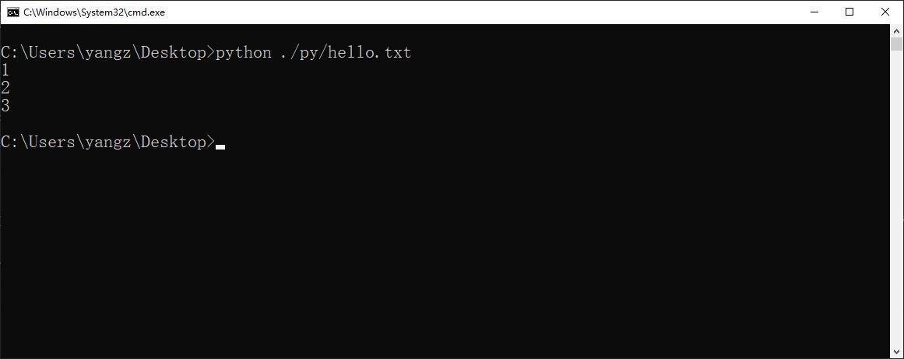
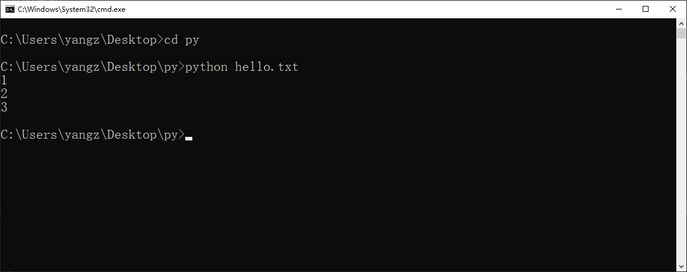
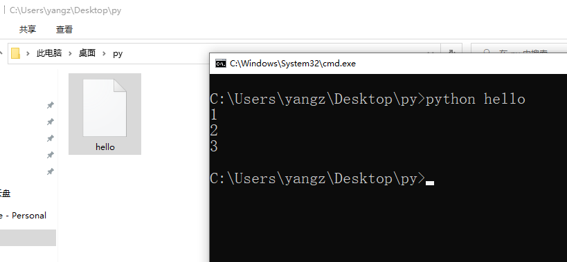

---
tags:
- python入门
---

# 脚本式运行和脚本书写规范
接下来我们学习python运行的第二种方式——脚本式运行。

如果使用交互式运行，想要一次运行多行代码是很困难的。这时候我们可以把代码写在文本文件里，然后在命令行运行。

例如：



我们`C:\Users\yangz\Desktop\py`文件夹内的`hello.txt`文件中写下了
```python
print(1)
print(2)
print(3)
```
然后在命令行输入：
```cmd
python C:\Users\yangz\Desktop\py\hello.txt
```
这句话的涵义就是用`python`运行后面的那个文件。

结果如图：


## 绝对路径和相对路径
注意到，我们上面指定被运行文件的时候使用的路径是`C:\Users\yangz\Desktop\py\hello.txt`，这样的路径被称为绝对路径，一般来说绝对路径是能够唯一确定一个文件的。

简便起见，我们可以使用相对路径`./py/hello.txt`，其中`.`代表当前工作目录，`/`是下一级目录的分隔符，在windows中使用`/`和`\`都可以但最好使用`/`：



注意图中命令行的提示符（prompt）：`C:\Users\yangz\Desktop>`，这里面`C:\Users\yangz\Desktop`是当前工作目录，`>`是提示符。

!!! caution "路径总结"
    工作目录+相对路径=绝对路径
    
    `C:\Users\yangz\Desktop` + `.\py\hello.txt` = `C:\Users\yangz\Desktop\py\hello.txt`

## 工作目录
一般情况下打开一个CMD窗口，默认的工作目录都是`C:\User\username`，如果我们想改变工作目录就可以使用`cd`（change directory）命令：



这样只用文件名就可以定位到脚本文件了然后运行了。

## 文件的后缀名和编码
相信细心的朋友发现了，我们上面的`hello.txt`后缀名是`txt`啊，为什么python也能运行呢？稍有了解的朋友都知道，`.py`才是python的官方后缀名啊。

其实这就涉及到何谓文件的问题。所谓的文件无非是计算机磁盘上的0-1，底层是是完全没有区别的。文件之间最核心的区别在于从0-1转换为人类可理解的内容的那一套规则，也就是编码方式。比如微软的`.xls`文件肯定有自己的编码方式，再如`.mp4`文件也有自己的一套编码方式。

但是请注意，后缀名和编码方式的关系不大。比如`.mp4`文件在Linux系统中，根本没有后缀名这个东西。很多时候我们加上`.py`只是为了告诉自己这是一个python的脚本文件，但是在计算机看来是没有任何区别的。



如上图所示，就算我把后缀名删掉，也是不影响程序运行的。

综上所述，之所以python可以运行`hello.txt`文件，就是因为`hello.txt`文件和`hello.py`文件甚至没有后缀的那个`hello`文件都是同样的编码规则（例如utf8编码）。这种类型的文件被称为`纯文本文件`，都可以用文本编辑器打开。而像是`.mp4`文件这种的非文本文件，我们称之为`二进制文件`，需要特殊的软件才能解码。

## python脚本的文法
语文课上我们都学过作文的文法，标点符号怎么用、段落如何区分等等。python的代码作为一种文本也有自己的文法。

前文展示的三行代码：
```python
print(1)
print(2)
print(3)
```
并非乱写的，是需要遵循一定的语法规则的。
### 半角字符
首先，就是全/半角字符。中文母语的python初学者最容易犯的错误之一就是全角和半角字符无法区分。

因为大家日常使用的中文输入法都会输入全角字符，例如`，。？、【】’‘“”`等，但是在编程中切记要使用半角字符`, . ? \ [ ] ' ' " "`，毕竟编程语言这一套东西都是老外发明的。
### 换行
其次是换行，在python脚本中，换行是需要格外注意的。每一行都应该是一个完整的语句，不能把两句话连起来写：
```python title="错误示范"
print(1)print(2)
```
如果非要写成很紧凑的形式（在命令行中这还是有点用处的），也可以用分号：
```python title="正确示范"
print(1);print(2)
```
如果想把原本在一行的内容错开到两行，也可以用`\`来表示连接符（有点像英文文法里句末的`-`），但是断的地方也是有讲究的，这里不细说只给出一个例子：
```python title="错误示范"
prin\
t(1)
```
```python title="正确示范"
print\
(1)
```
### 调用函数的方式
python中函数调用的方式是一对圆括号`function()`，括号内是传给函数的参数。

如果需要传递多个参数可以用逗号分隔：
=== "源代码"
    ```python
    print(1, 2, 3)
    ```
=== "运行结果"
    ```text
    1 2 3
    ```
### 写注释的方式
最后，给出python脚本文件中写注释的方法。

1. 使用`#`开头，写单行注释。
```python title="单行"
# 打印1
print(1)
```
2. 使用三引号`""" """`包裹住多行注释。
```python title="多行"
"""
下面这个函数
会把1打印到命令行
"""
print(1)
```
注释掉的内容不会被运行：
=== "源代码"
    ```python
    # print(1)
    print(2)
    ```
=== "运行结果"
    ```text
    2

    ```
一般来说编辑器也会用颜色来区分注释内容和正文内容。