---
tags:
- python入门
---
# 安装以及交互式运行
## python环境的配置

### 安装

不论是Windows还是MacOS，都可以直接去[官网](https://www.python.org/downloads/)下载到python的程序包。下载完之后一路默认选项安装即可。

python现在已经更新到了`3.11.1`，但是最新的特性我不是很熟悉所以我们这套教程按照`3.10.9`来，并且由于手头没有Mac设备，所以演示也都是在Windows平台上进行。

下载安装完成之后，可以在开始菜单找到python的快捷方式：

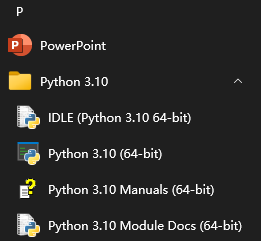

从上到下依次是：

- python的IDLE（Integrated Development and Learning Environment）
- python的主程序
- python的手册
- python内置库的文档

### 添加到PATH

**（如果在安装的时候已经勾选了`add to path`选项，或者不想把python添加到环境变量，则不需要这一步）**

我们需要找到python主程序的位置：

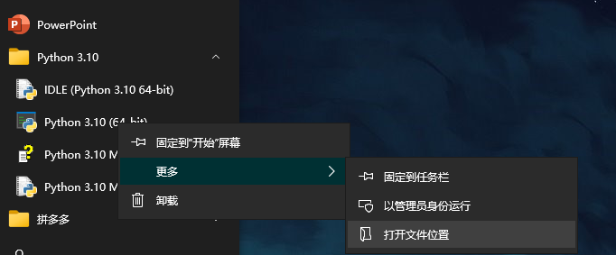

点击打开文件位置：

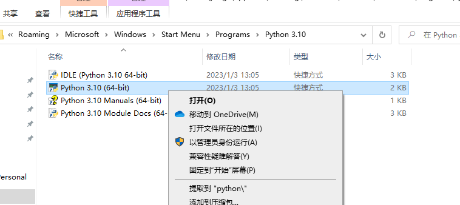

然后再点击打开文件所在的位置：

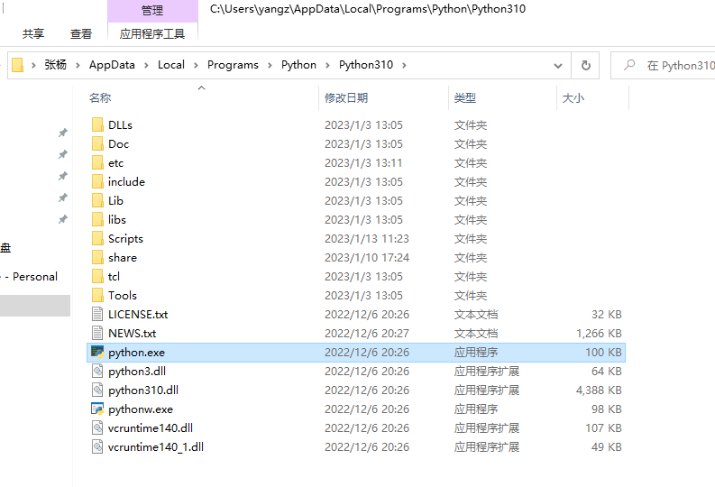

需要记下这个文件夹的路径：
`C:\Users\yangz\AppData\Local\Programs\Python\Python310`

然后我们把这个路径添加到系统的PATH即可，在windows搜索环境变量点击运行：

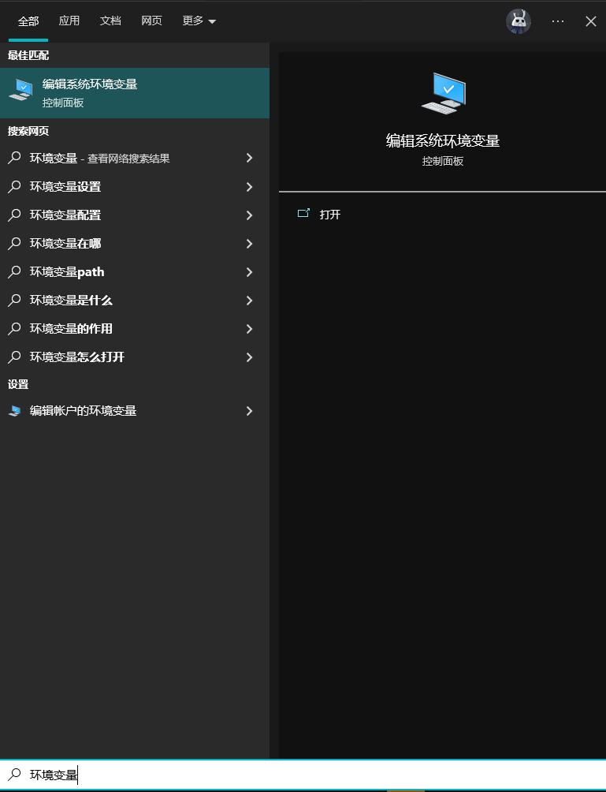

然后按照步骤添加路径：

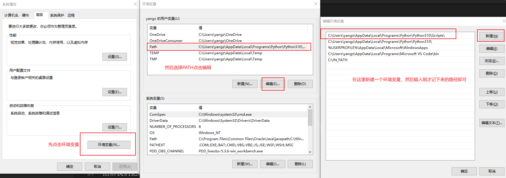

添加完成之后，启动CMD：

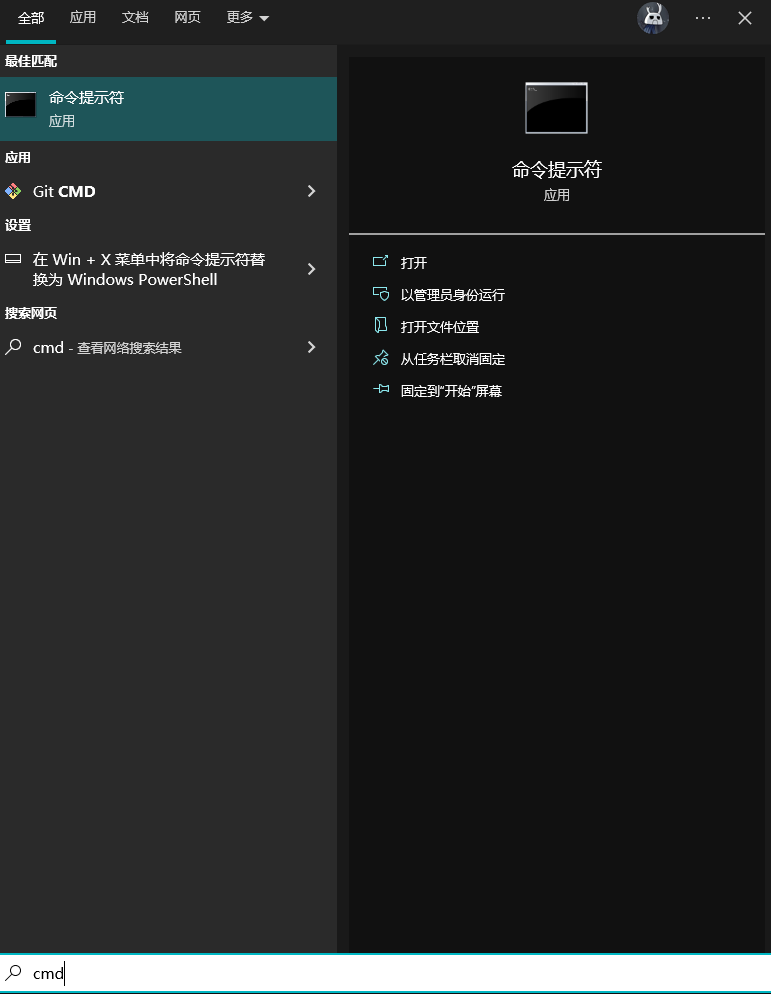


然后输入下面的内容，**回车运行**：

```bash title=""
python -V
```

如果输出`Python 3.10.9`则代表配置成功了。

然后运行：
```bash title=""
python
```
即可进入交互环境：

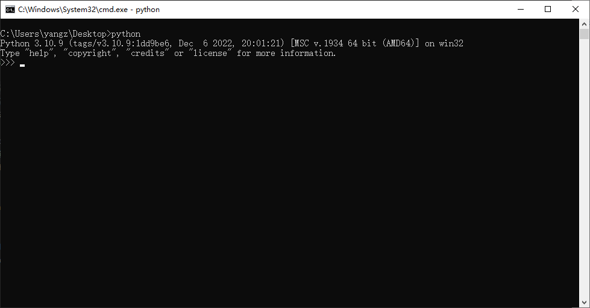

当然，使用python自带的IDLE也是不错的选项，打开之后也会直接进入python交互环境：

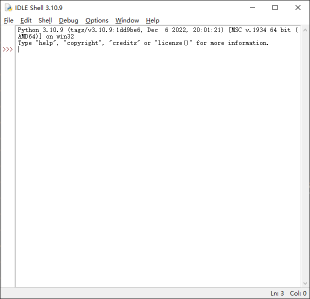

??? question "交互环境"
    所谓的交互就是指一问一答，每次你输入一条指令python都会给出相应的回答。而回车键就是每条指令结束的标志。

    最简单的`#!python print("hello world")`就是一条指令，在交互环境中python会输出`hello world`。

    然而这也就决定了，在交互环境中运行多行代码（和写有很多行的逻辑块）是很困难的，虽然python也给出了解决方案（按住`Shift`键再按回车可以换行），但还是不那么方便。所以下一篇文章我们会介绍python的脚本式运行，可以解决这些问题。

## hello world

在交互环境中，你就可以运行python代码了。

最简单的`hello world`：
=== "源代码"
    ```python
    print("Hello world!")
    ```
=== "输出结果"
    ```text
    Hello world!
    ```
> 以后我就不再截图（太占空间）展示代码的运行结果，而是用上面的方式。

我经常用python的交互环境作为一个可编程计算器：
=== "源代码"
    ```python
    100 * 3
    ```
=== "输出结果"
    ```text
    300
    ```
## ipython
最后再来介绍一个好用的python交互环境：ipython。

在命令行中运行：
```bash title="安装ipython"
python -m pip install ipython
```
> 这行代码的具体含义我们后续会介绍

等待安装完成，即可输入`ipython`启动：

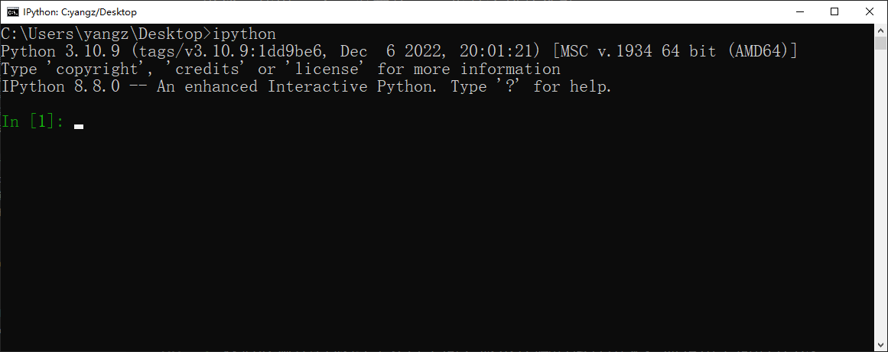

图中可见ipython的简介：A enhenced Interactive Python.


ipython提供了很多便捷的工具，例如使用`?+查询对象`即可查找相关的说明：
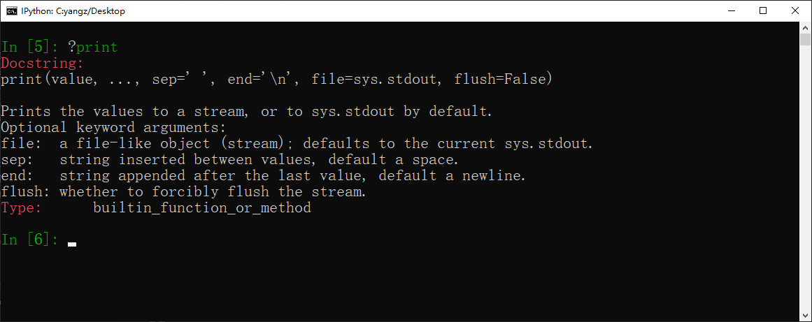

还有一些魔法命令，例如`timeit`，可以计算程序运行的耗时：

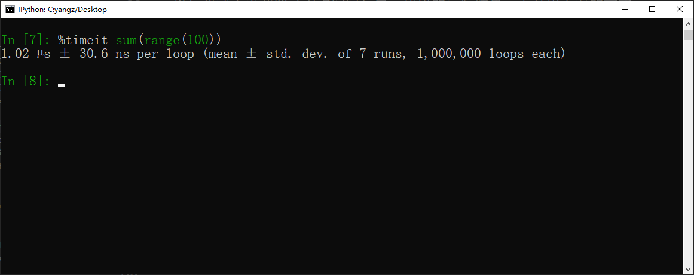

不论是CMD还是IDLE还是ipython，总而言之我们学会了在交互环境中运行`hello world`。