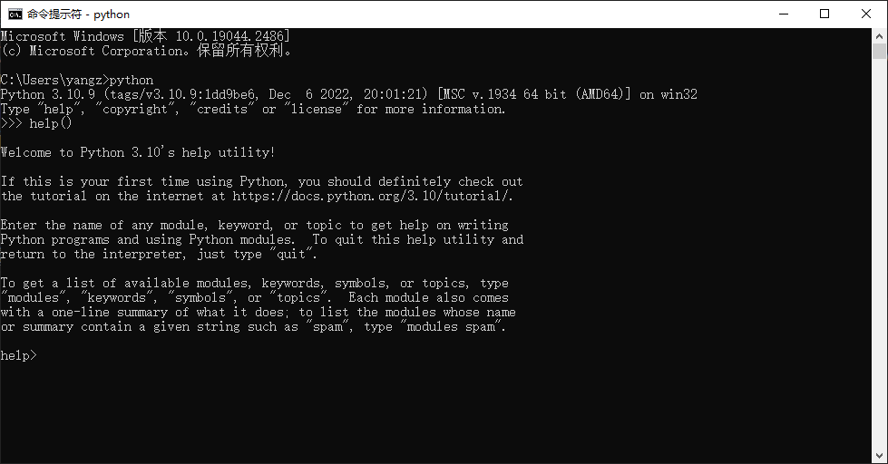

---
tags:
- python入门
---

# 内置类
通过之前的[交互式运行](/Python/命令行/)和[脚本式运行](/Python/脚本/)教程，读者应该掌握了如何写`hello world`、在哪里写`hello world`以及写完之后怎么运行，接下来我们就介绍各种语法来丰富代码的内容。

> 篇幅限制我不会事无巨细，只能介绍最基础的内容和深入学习的方法。我希望读者看完本篇内容可以学会**怎么学python**。

## 学会使用dir和help函数
读者应该已经熟稔`print`的用法，也大概能体会到何为函数、如何调用函数、如何传递参数，并且也应该注意到我们会用`""`引号把字符包裹住传递到函数中。这足够让我们在一切开始之前先介绍两个非常有用的函数。
??? question "函数和参数"
    可能有读者会对这两个词感到疑惑，因为我们还未介绍函数和它的参数。

    一个粗浅的理解是：函数是一个机器，输入一个东西，输出一个东西。输入的东西就叫参数，输出的东西叫返回值。
    ```mermaid
    flowchart LR
        参数 --> f{函数} --> 返回值
    ```
    后面我们还会从类的角度给出另外一个理解。

### 学会寻求`help`
> 求救是每个人都应该学会的生存技能

如果不传入任何参数，直接运行`help()`，那么我们会进入一个交互式命令行：



在这个命令行我们可以进行一些查询，按照提示可以输入任何的`module`、`keyword`或是`topic`。

例如输入`print`就会返回一下内容：
```text title="help print的返回值"
help> print
Help on built-in function print in module builtins:

print(...)
    print(value, ..., sep=' ', end='\n', file=sys.stdout, flush=False)

    Prints the values to a stream, or to sys.stdout by default.
    Optional keyword arguments:
    file:  a file-like object (stream); defaults to the current sys.stdout.
    sep:   string inserted between values, default a space.
    end:   string appended after the last value, default a newline.
    flush: whether to forcibly flush the stream.
```

如果我们传递一些参数进去，就可以直接查询相关的内容：
=== "源代码"

    ```python
    help("print")
    ```
=== "运行结果"

    ```text
    Help on built-in function print in module builtins:

    print(...)
        print(value, ..., sep=' ', end='\n', file=sys.stdout, flush=False)

        Prints the values to a stream, or to sys.stdout by default.
        Optional keyword arguments:
        file:  a file-like object (stream); defaults to the current sys.stdout.
        sep:   string inserted between values, default a space.
        end:   string appended after the last value, default a newline.
        flush: whether to forcibly flush the stream.
    ```
通过这样一个函数，我们可以快速学习python的大多数内容。你可以忘记任何一个函数，但请不要忘记`help`。

### `dir`是一把解剖钳
先用`help`函数查一下`dir`函数的用法：

=== "源代码"

    ```python
    help("dir")
    ```
=== "运行结果"

    ```text
    Help on built-in function dir in module builtins:

    dir(...)
        dir([object]) -> list of strings

        If called without an argument, return the names in the current scope.
        Else, return an alphabetized list of names comprising (some of) the attributes
        of the given object, and of attributes reachable from it.
        If the object supplies a method named __dir__, it will be used; otherwise
        the default dir() logic is used and returns:
        for a module object: the module's attributes.
        for a class object:  its attributes, and recursively the attributes
            of its bases.
        for any other object: its attributes, its class's attributes, and
            recursively the attributes of its class's base classes.
    ```
返回的结果说的也很清楚，我这里做一个中文翻译：

如果不传递参数运行`dir()`，那么就会返回当前命名空间（scope）的所有变量（names）。如果传递了一个对象进去，那么就会返回这个对象的属性（attributes）列表。

如果对象自定义了`__dir__`方法（method），则会被调用。默认的`__dir__`方法的逻辑是：

- 对于一个模块（module）对象，会返回模块的属性
- 对于一个类（class）对象，会返回它的属性并且递归到它所有的父类
- 对于其他的对象，则会返回它的属性、类的属性并且递归到所有的父类

总而言之，`dir`函数可以帮助我们了解某个对象的属性和方法，还可以查询命名空间内的变量。

例如：

=== "源代码"

    ```python
    dir()
    ```
=== "运行结果"

    ```text
    ['__annotations__', '__builtins__', '__doc__', '__loader__', '__name__', '__package__', '__spec__']
    ```

就返回了默认情况下，python内置的所有变量。

例如这个`__builtins__`：
=== "源代码"

    ```python
    dir(__builtins__)
    ```
=== "运行结果"

    ```text
    ['ArithmeticError', 'AssertionError', 'AttributeError', 'BaseException', 'BlockingIOError', 、'BrokenPipeError', 'BufferError', 'BytesWarning', 'ChildProcessError', 'ConnectionAbortedError', 
    'ConnectionError', 'ConnectionRefusedError', 'ConnectionResetError', 'DeprecationWarning', 'EOFError', 
    'Ellipsis', 'EncodingWarning', 'EnvironmentError', 'Exception', 'False', 'FileExistsError', 
    'FileNotFoundError', 'FloatingPointError', 'FutureWarning', 'GeneratorExit', 'IOError', 'ImportError', 
    'ImportWarning', 'IndentationError', 'IndexError', 'InterruptedError', 'IsADirectoryError', 'KeyError', 
    'KeyboardInterrupt', 'LookupError', 'MemoryError', 'ModuleNotFoundError', 'NameError', 'None', 
    'NotADirectoryError', 'NotImplemented', 'NotImplementedError', 'OSError', 'OverflowError', 
    'PendingDeprecationWarning', 'PermissionError', 'ProcessLookupError', 'RecursionError', 'ReferenceError', 
    'ResourceWarning', 'RuntimeError', 'RuntimeWarning', 'StopAsyncIteration', 'StopIteration', 'SyntaxError', 
    'SyntaxWarning', 'SystemError', 'SystemExit', 'TabError', 'TimeoutError', 'True', 'TypeError', 
    'UnboundLocalError', 'UnicodeDecodeError', 'UnicodeEncodeError', 'UnicodeError', 'UnicodeTranslateError', 
    'UnicodeWarning', 'UserWarning', 'ValueError', 'Warning', 'WindowsError', 'ZeroDivisionError', '_', 
    '__build_class__', '__debug__', '__doc__', '__import__', '__loader__', '__name__', '__package__', 
    '__spec__', 'abs', 'aiter', 'all', 'anext', 'any', 'ascii', 'bin', 'bool', 'breakpoint', 'bytearray', 
    'bytes', 'callable', 'chr', 'classmethod', 'compile', 'complex', 'copyright', 'credits', 'delattr', 'dict', 
    'dir', 'divmod', 'enumerate', 'eval', 'exec', 'exit', 'filter', 'float', 'format', 'frozenset', 'getattr', 
    'globals', 'hasattr', 'hash', 'help', 'hex', 'id', 'input', 'int', 'isinstance', 'issubclass', 'iter', 
    'len', 'license', 'list', 'locals', 'map', 'max', 'memoryview', 'min', 'next', 'object', 'oct', 'open', 
    'ord', 'pow', 'print', 'property', 'quit', 'range', 'repr', 'reversed', 'round', 'set', 'setattr', 'slice', 
    'sorted', 'staticmethod', 'str', 'sum', 'super', 'tuple', 'type', 'vars', 'zip']
    ```


查询的结果包含了python所有的内置异常、内置函数、内置数据类型等等。
## 从类的视角来理解python
上面突然蹦出来了一大推的专有名词，我来挨个解释一下（下面可能会出现一些很高级的语法现象，**读者可以暂时不管代码细节，重要的是文字解读**）：

### 内置（builtin）
所谓内置就是区别于自定义，内置是本来就有的，无需定义就可以使用的东西，而自定义是用户后续创建的。
### 类（class）
类是对象的抽象表达。说人话就是类（class）是一个模具，对象（object）则是模具生产出来的东西。

例如：
!!! example "老师"
    老师就是一个类，而隔壁班的王老师就是一个对象。

由于老师们之所以都叫老师，是因为他们有共同的特质，所以我们把这些共同特质抽象出来做成了`老师`这个类。而那些共同的特质我们就称之为类的属性（attribute）和方法（method）。

- 所谓的属性是指类的特征，例如每个老师都应该有年龄这个特征。
- 所谓的方法是在类上定义的函数，例如每个老师都可以在年末自然增长年龄。

再举一个数学上的例子，在**抽象**代数中这个思想无处在：

!!! example "群（Group）"
    群$(G, \cdot)$是由集合$G$和二元运算$\cdot$构成的，满足群公理的数学结构。

    所谓的群公理指的是：

    1. 封闭性：二元运算$\cdot$在$G$上是封闭的
    2. 结合律：二元运算满足$(a\cdot b)\cdot c=a\cdot (b\cdot c)$
    3. 单位元：$\exists e \in G$使得$e\cdot a=a \quad \forall a \in G$
    4. 逆元：$\forall a \in G$都$\exists b \in G$满足$a\cdot b=e$

这个定义是从诸多的数学对象中抽象出来的定义，比如整数和加法就是一个群，魔方某种意义上也是一个群。

- 这里的群公理就是群这个类的共同特质
- 这里的集合$G$就是群的属性
- 这里的运算$\cdot$就是群上定义的方法

python中几乎所有的东西都是类：函数是类，模块和包也是类；数据类型是类，错误和异常也是类……所以理解类这个概念对于理解python的逻辑至关重要。

类的定义方式是`class`关键字，例如
```python title="创建老师类"
class Teacher:
    """老师类"""
    def __init__(self, age):
        """初始化老师对象的时候需要传入一个年龄参数"""
        self.age = age
    def update_age(self):
        """更新老师的年龄，让他增加1"""
        self.age += 1
```
定义完之后，我们可以创建一个老师类的对象：
=== "源代码"

    ```python title="王老师"
    # 上面定义Teacher类的代码省略
    #######
    # 创建王老师，初始化年龄为29岁
    wang = Teacher(29)
    # 打印王老师的年龄
    print(wang.age)
    # 年龄+1
    wang.update_age()
    # 再次打印
    print(wang.age)
    ```
=== "运行结果"

    ```text
    29
    30
    ```

注意到这里我们访问了定义在类里面的函数`update_age`和属性`age`，而访问的方式是`object.attribute`，这种用`.`来访问对象属性的语法风格和其他很多语言都是类似的。
??? info "了解一下其他语言的情况"
    R语言中`.`是合法的变量名字符，没有任何的语法含义。

    ```R title="R语言"
    # 变量
    a.b <- 1
    # 打印
    print(a.b)  
    ## 输出结果就是1
    ```
    java中`.`和python一样，都是访问对象属性和方法的语法结构。

    ```java
    public class StringToUpperCaseEmp {
        public static void main(String[] args) {
            String str = "string hello";
            String strUpper = str.toUpperCase();
            System.out.println(str);
            System.out.println(strUpper);
        }
    } 
    // 编译运行后输出结果为：
    // hello
    // HELLO
    ```

    C语言也和python类似：

    ```C
    #include <stdio.h>
    struct Books
    {
    char  title[50];
    char  author[50];
    } book = {"C 语言", "Alen"};
    
    int main()
    {
        printf("title : %s\nauthor: %s", book.title, book.author);
    }
    // 编译运行后输出结果为：
    // title : C 语言
    // author: Alen
    ```

最后，类之间是存在继承与被继承关系的。假如我们有一个`人类`，而`人`是一个很高级的类，`老师`肯定有人的一切特质，所以如果我们可以让老师**继承**这个类。老师和人之间的关系就成为子类和父类。这种继承关系可以用`.__mro__`（含义是Method resolution order，直译为方法的解释顺序）来查询，后续我会给出例子。

### 对象（object）
理解了何谓类，对象就好理解多了。对象就是类的一个实现，还是前面的例子：

- 王老师是老师类的一个对象，简言之王老师是老师
- 整数集和加法是群类的一个对象，简言之$(\mathbb{Z},+)$是一个群

对象的生成方式是多种多样的，例如一些python内置的类可以用特定的语法来生成。例如字符串可以用`"  "`来生成，列表可以用`[  ]`来生成。也可以用类的调用来生成，例如：
=== "源代码"

    ```python
    a = list('hello')
    print(a)
    ```
=== "运行结果"

    ```text
    ['h', 'e', 'l', 'l', 'o']
    ```

### 函数（function）
函数是一个特殊的类，他们的共同特质是**可以被调用**（callable）。具体来说函数是定义了`__call__`方法的类，每一个具体的函数是函数类的一个对象。函数的调用方式读者应该很熟悉了，就是在后方加上`()`，这和数学中的习惯是一致的。

函数的定义方式是`def`关键字，之前在类的例子中我们已经见过了。

在不同的场合我们会把同一个东西强调为类或者是函数，比如`list`

- 在`#!python list(range(10))`中，我们一般会把他叫作函数，功能是把`range(10)`转化为一个列表。
- 而在`#!python isinstance(1, list)`中，我们一般把他叫做类，代表着列表这个数据类型。

读者注意区分这些叫法。
### 变量（name）和命名空间（scope）
同样的，前文已经使用了变量的语法`#!python a = list('hello')`就创建了一个变量。

请注意变量只是对象的一个名字，但并不是对象本身。如果我们弃用了这个名字，对象本身不一定会消失。而如果我们把这个名字给别人，那么变量的数据类型就会改变，所以python被称为弱类型语言。一个名字只能指向一个对象，但是一个对象可以有多个名字。

变量是存在于命名空间内的，例如函数内部的空间和外部的空间就是两个不同的空间，变量是彼此独立的，类内部的空间和外部的空间也是不同的空间。

此外变量的命名是有一定的规范的：
!!! info "变量命名规范"

    1. 不能包含特殊字符例如`$`
    2. 不能包含语法保留字符例如`#`，`@`，`+`，`-`，`.`等
    3. 不能用数字开头

    常见的命名方式有两类;

    - 下划线：`update_age`
    - 驼峰命名法：`UpdateAge`

    虽然理论上可以用中文、日文等字符作为变量名，但是不推荐。

变量的创建方式是`=`：
=== "源代码"

    ```python
    n = 1
    print(n)
    ```
=== "运行结果"

    ```text
    1
    ```

此外提一句，函数用`def`定义之后也是一个名字，实际上存在没有名字的函数`lambda`函数。因此，函数的存在也是有命名空间的，前文所述的`定义在类里面的函数`就是在强调函数的命名空间。


### 关键字（keyword）
关键字并非一个独立的概念，而是和前面的概念交叉的：

有些关键字承载着python的语法，例如`def`、`for`、`while`、`if`、`arise`等，他们是逻辑结构的组成者。有特殊的地位，可以说是我们用类来理解python中为数不多的例外。因为`def`等这些关键字都不是对象，如果你运行`type(def)`会直接报错。这一部分内容我们下一篇文章会详细介绍。

有些关键字则是一个变量，例如`True`、`False`、`Ellipsis`等，他们是内置的变量，无需定义声明即可使用，本质上都是对象。

还有些关键字是一个函数，例如`print`、`help`、`dir`等，他们是内置的函数，无需定义声明即可使用，本质上也是对象。

### 内置数据类型（builtin type）
所谓的内置数据类型就是内置的一些类，这些类上往往实现了某种数据结构以及很多的方法。并且各自有着专用的表示方式：

- 字符串（string），例如`#!python "hello"`
- 布尔值（bool），例如`#!python True`
- 列表（list），例如`#!python [1, 2, 3]`
- 元组（tuple），例如`#!python (1, 2, 3)`
- 集合（set），例如`#!python {1, 2, 3}`
- 整数（int），例如`#!python 100`
- 浮点数（float），例如`#!python 3.1415`
- 复数（complex），例如`#!python 1j+2`
- 字典（dict），例如`#!python {1 : 'one', 2 : 'two'}`

等等。
### 内置异常（builtin Exception）

异常（Exception）也是一个类，各种异常都继承自`BaseException`，例如`NameError`的继承关系为：
```python title="NameError.__mro__"
(<class 'NameError'>, <class 'Exception'>, <class 'BaseException'>, <class 'object'>)
```
如果你跟着咱们教程运行了一些代码，那么难免会遇到一些错误。他们的格式是这样的：
```python
Traceback (most recent call last):
  File "<stdin>", line 1, in <module>
NameError: name 'clear' is not defined
```
python的错误会告诉你错误什么时候发生的，发生在什么文件，哪一行，错误的名字是啥，原因是啥等等，可以说是非常友好了。

例如上面的错误，是一个`NameError`，错误的原因是`<stdin>`的第一行有一个变量`clear`未定义。

### 模块（module）和包（package）
module也是一个类，这个类背后是一个或多个python文件，这些python文件就被称为包，或者库。我们可以通过`import`关键字，来导入一个module，然后就可以使用module里面的东西了。

例如`math`就是一个module，我们现在来用一下`math`里面的开方函数：

=== "源代码"

    ```python
    import math # 导入math模块
    print(math.__class__) # 打印math的类
    print(math.sqrt(2)) # 打印根号2
    ```
=== "运行结果"

    ```text
    <class 'module'>
    1.4142135623730951
    ```

!!! info "嵌套函数"
    上面的代码中包含了嵌套函数的写法，其实完全可以按照数学里的复合函数来理解。

    `#!python print(math.sqrt(2))`就是先计算根号2，然后把计算结果传入`print`函数再运行。
### 技术总结
讲完了上面这些概念，读者应该能体会到为什么这节的标题叫做`从类的视角来理解python`。可以说，**python内万物都是类和对象**，甚至类本身也是抽象类的一个对象。而我们前面说过，`dir`可以接受一个对象作为参数，所以任何一个东西你都可以拿过来`dir()`一下看看它里面有什么东西。

!!! info "上帝创造万物，那么上帝从哪里来"
    *类是抽象类的对象* 这句话我并没有深入考究过，甚至你如果问我那抽象类是对象嘛？我是回答不上来的，因为本质上用python来理解python是不太够的。最流行python的解释器是C语言来写的，也即是Cpython。不过也有用python来写的python解释器，叫PyPy，这方面我了解不多留给读者自行探索。

## 细说内置数据类型
理解了上面一节的内容，那么这一节基本就是在学习各种类以及类上实现的方法和属性。
### str
python中用单双引号`' '`和双双引号`" "`以及三引号`""" """`、`''' '''`包裹起来的东西都是字符串，他们没什么大区别。

`dir(str)`返回的结果为：
```text
['__add__', '__class__', '__contains__', '__delattr__', '__dir__', '__doc__', '__eq__', 
'__format__', '__ge__', '__getattribute__', '__getitem__', '__getnewargs__', '__gt__', 
'__hash__', '__init__', '__init_subclass__', '__iter__', '__le__', '__len__', '__lt__', 
'__mod__', '__mul__', '__ne__', '__new__', '__reduce__', '__reduce_ex__', '__repr__', 
'__rmod__', '__rmul__', '__setattr__', '__sizeof__', '__str__', '__subclasshook__', 
'capitalize', 'casefold', 'center', 'count', 'encode', 'endswith', 'expandtabs', 
'find', 'format', 'format_map', 'index', 'isalnum','isalpha', 'isascii', 
'isdecimal', 'isdigit', 'isidentifier', 'islower', 'isnumeric','isprintable', 
'isspace', 'istitle', 'isupper', 'join', 'ljust', 'lower', 'lstrip', 'maketrans', 
'partition', 'removeprefix', 'removesuffix', 'replace', 'rfind', 'rindex', 'rjust', 
'rpartition', 'rsplit', 'rstrip', 'split', 'splitlines', 'startswith', 'strip', 
'swapcase', 'title', 'translate', 'upper', 'zfill']
```
我不说读者应该也能发现这里面的东西分为两类：

- `__xx__`这种带着双下划线的
- 以及`count`这种普普通通的

前者我们称为魔法方法（magic method），是python类编程中的一个特殊机制，是为了实现特殊的语法而写的一些函数。

例如`__add__`方法，就规定了字符串之间的加法：
```python title="str.__add__"
"Hello".__add__(" world")
# 👆上面完全等价与下面👇，结果都是 Hello world
"Hello" + " world"
```
再如`__len__`方法，就规定了字符串的长度算法：
```python title="str.__len__"
"hello world".__len__()
# 👆上面完全等价与下面👇， 结果都是11
len("hello world")
```
最后介绍`__getitem__`方法，这大概是最复杂的那个了。

这个方法规定了取值的算法，在python中取值的行为用两个方括号来表示：`object[]`

```python title='str.__getitem__'
'hello'.__getitem__(1:2)
# 👆上面完全等价与下面👇，结果都是 e
'hello'[1]
```
注意，python中所有东西的编号都是从0开始的，字符串`hello`从左到右依次是`0：h`，`1：e`……，所以我们最终取出来的东西是`e`。

另外这个取值函数还接受`slice`类型的参数：
```python title='str.__getitem__'
'hello'.__getitem__(slice(1,3))
# 👆上面完全等价与下面👇，结果都是 el
'hello'[1:3]
```

其中`slice`是另外一个内置数据类型。

!!! info "切片（slice）介绍"

    slice可以传入三个参数：slice(start, stop, step)，这三个参数都是整数，并且都可以缺省

    - 如果start缺省，默认从开头开始切，如果为负数则从右边开始数
    - 如果stop缺省，默认切到最后，如果为负数则从右边开始数
    - 如果step缺省，默认为1，如果为负数，则从stop切到start
    - 切片的范围是从start到stop（如果setp为负数则反过来），每隔step取一个，并且不包含stop的那一个，但是包含start的那个，简单来说就是左闭右开

    与之对应的是一个语法糖`#!python s[start:stop:stop]`，他们的功能完全是差不多的，前面的例子也给出了演示。以后我们更多地会使用语法糖，而不是`#!python s.__getitem__(slice())`的调用方式。
    
    ??? question "语法糖"
        所谓的语法糖就是可以减少代码量的一种简便写法。python中到处都是这种语法糖，所以增加了难度，但是学会之后写代码的速度也显著地高。

        下面列举一些"*语法糖*"：
        
        - 取值
            - `#!python object.__getitem__()`
            - `object[]`
            - `object[]`就是`object.__getitem__`的语法糖
        - 切片
            - `#!python object[slice(1, 10, 2)]`
            - `object[1:10:2]`
            - `1:2:3`就是`slice(1,2,3)`的语法糖
        - 调用
            - `#!python print.__call__(1)`
            - `#!python print(1)`
            - `()`就是`__call__`的语法糖
            - 这个东西能不能称之为语法糖有待商榷，我写在这里是想让读者明白当我们给一个对象加上`()`实际上就是在调用他的`__call__`方法
        - 逻辑运算
            - `#!python 1.__gt__(2)`
            - `#!python 1 > 2`
            - `>`就是`__gt__`的语法糖
        - 列表
            - `#!python [i for i in 'hello']`
            - `#!python list('hello')`
            - `[object]`就是`list(object)`的语法糖

        之所以“语法糖”加了引号，是因为一般来说上面这些东西一般来说我们不称之为语法糖，而是视作python语法的一部分。

        但是我想说，如果我们不学习这些语法，而是仅仅学习`object.method()`这样的调用方式，也可以完成几乎全部的工作。如此一来，python的语法就变得简单起来，不再有各种复杂的语法现象，只有`a.b`这一种调用方式。

        这样的学习方式不能提高写代码的速度，但是可以加深我们对类的理解：**python中几乎所有的操作都是在调用某个对象的某个方法**。
        

    总而言之，这个slice的效果就是**切片**，把对象的指定片段取出来。举几个例子来感受一下：

    - `#!python "hello"[::2]`就是从开头切到最后，间隔为2，所以他的结果为`hlo`.
    - `#!python "hello"[::-1]`就可以把字符串倒过来，变成`olleh`
    - `#!python "hello"[:1]`按照左闭右开原则，结果为`h`
    - `#!python "hello"[1:-2]`按照左闭右开原则，结果为`el`

普普通通的函数例如`upper`，我们可以用`help`函数来看看他的用法：

```python title="help(str.upper)"
>>> help(str.upper)
Help on method_descriptor:

upper(self, /)
    Return a copy of the string converted to uppercase.
```
可以看到，这个函数就是把字符串里的小写字符全部变成大写。

例如：
```python
"Hello".upper()
# 返回的结果为 HELLO
```

其他的函数我就不再介绍了，读者可以如法炮制，用`help`函数来学习。

### list
python中最常用的数据类型，没有之一。它的创建语法是：`[]`，用方括号括起来的东西就成为列表的元素。

例如`#!python [1, 2, 3]`，再如`#!python [1, '2', False]`。

列表对元素没有任何的要求，他们可以重复，可以类型不一，甚至可以是指向同一个对象的两个变量。

列表也有诸多的方法，`dir(list)`返回的结果为：
```text
['__add__', '__class__', '__class_getitem__', '__contains__', '__delattr__', 
'__delitem__', '__dir__', '__doc__', '__eq__', '__format__', '__ge__', 
'__getattribute__', '__getitem__', '__gt__', '__hash__', '__iadd__', 
'__imul__', '__init__', '__init_subclass__', '__iter__', '__le__', 
'__len__', '__lt__', '__mul__', '__ne__', '__new__', '__reduce__', 
'__reduce_ex__', '__repr__', '__reversed__', '__rmul__', '__setattr__', 
'__setitem__', '__sizeof__', '__str__', '__subclasshook__', 'append', 
'clear', 'copy', 'count', 'extend', 'index', 'insert', 'pop', 'remove', 
'reverse', 'sort']
```
总体来说比字符串的少了许多，但也算是很复杂的数据类型了。

列表也支持切片操作，切片方法和字符串完全一致。


### 其他
常用的类型还有`int`,`float`,`bool`,`range`,`dict`,`tuple`,`set`等等。他们本质都是类，里面的方法和属性大差不差，读者可以自行探索。

## 内置函数
函数虽然也是类，但是和数据类型的学习方法大相径庭。我们主要学习的内容不是函数类上定义的属性和方法，而是函数需要传入的参数、可以实现的功能以及最终返回的结果（这些内容只需要用`help`函数就可以知道了）。

下面介绍几个我们之前遇到过的函数
### `print`
找到前面我们`help(print)`的返回值：
```text title="print的用法"
print(value, ..., sep=' ', end='\n', file=sys.stdout, flush=False)

Prints the values to a stream, or to sys.stdout by default.
Optional keyword arguments:
file:  a file-like object (stream); defaults to the current sys.stdout.
sep:   string inserted between values, default a space.
end:   string appended after the last value, default a newline.
flush: whether to forcibly flush the stream.
```
这里面展示了`print`函数可以传入的参数：

- value：要打印的东西，可以是多个
- sep：分隔符
- end：用什么结尾
- file：打印到哪里
- flush：是否强制flush

文档并未提及`print`的返回值，实际上这个函数是没有返回值的。

知道了参数和涵义之后，我们就可以来运用这些参数达成我们想要的效果了：
=== "源代码"
    
    ```python
    print(1, 2, 3, sep="&", end="&")
    ```
=== "运行结果"

    ```python title=
    1&2&3&
    ```

### 其他常用的函数

- `len`：反对一个对象的长度，例如`len("hello")`，运行结果为`5`
- `type`：返回一个对象的类，例如`type(1)`，运行结果为`<class 'int'>`

其他的我就不再列举了，如果你有兴趣可以把`__builtins__`里面所有的东西全部用`help`和`dir`查一遍，就都了然于胸了。