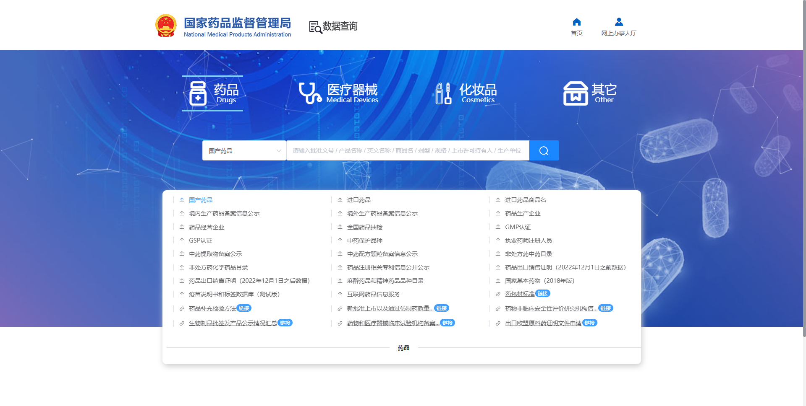
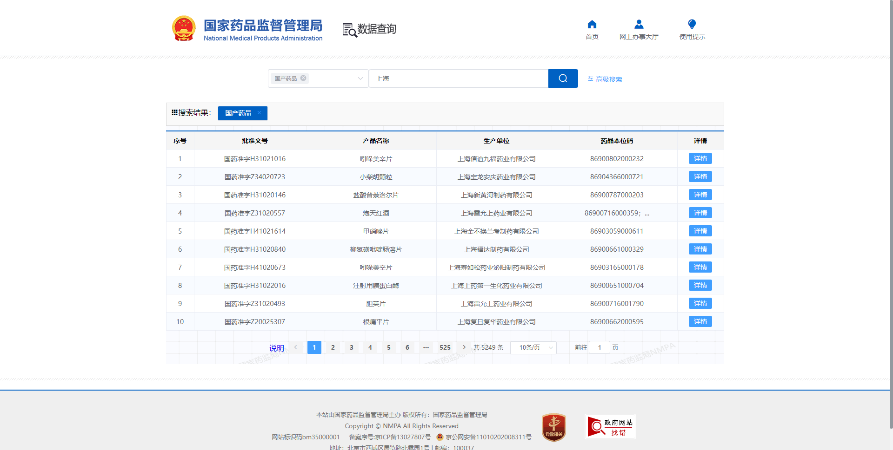
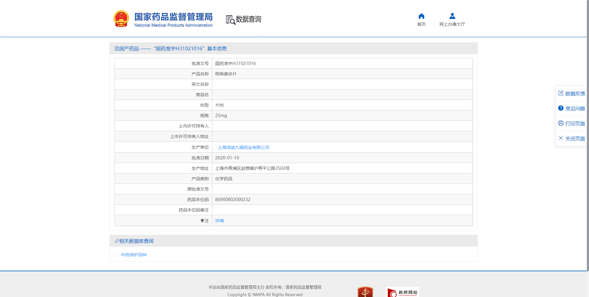
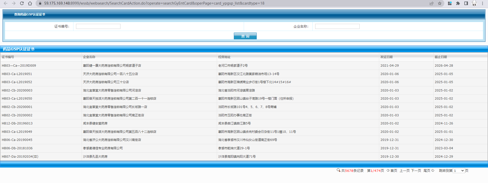

---
tags:
- 爬虫
- python案例
---

# 获取国家药监局官网上的GSP认证信息
!!! question "什么是GSP和GMP认证"
	GSP（Good Supply Practice）是指在药品流通过程中，针对计划采购、购进验收、储存养护、销售及售后服务等环节而制定的防止质量事故发生、保证药品符合质量标准的一整套管理标准和规程。GSP认证是指药品监督管理部门对药品流通（经营、储运、使用）全过程中实施《药品经营质量管理规范》，进行检查、评价、并决定是否发给认证证书的过程。

	GMP（Good Manufacturing Practice）认证是一套适用于制药、食品等行业的强制性标准，要求企业从原料、人员、设施设备、生产过程、包装运输、质量控制等方面按国家有关法规达到卫生质量要求，形成一套可操作的作业规范帮助企业改善企业卫生环境，及时发现生产过程中存在的问题，加以改善。 GMP标准《药品生产质量管理规范》是为保证药品在规定的质量下持续生产的体系。
## 任务概述

获取各个省份的药企GSP认证信息

- [检索页面](https://www.nmpa.gov.cn/datasearch/)

- [搜索结果](https://www.nmpa.gov.cn/datasearch/search-result.html)

- [详情页面](https://www.nmpa.gov.cn/datasearch/search-info.html?nmpa=aWQ9ZmZmYTcwZDQ2Y2Q1ZmE4ZWY1MzUzZTc0MjUwZDcxYWImaXRlbUlkPWZmODA4MDgxODNjYWQ3NTAwMTg0MDg4MWY4NDgxNzlm)

- 数据样本

| 批准文号           | 国药准字H31021016                  |
| ------------------ | ---------------------------------- |
| 产品名称           | 吲哚美辛片                         |
| 英文名称           |                                    |
| 商品名             |                                    |
| 剂型               | 片剂                               |
| 规格               | 25mg                               |
| 上市许可持有人     |                                    |
| 上市许可持有人地址 |                                    |
| 生产单位           | 上海信谊九福药业有限公司           |
| 批准日期           | 2020-01-10                         |
| 生产地址           | 上海市青浦区赵巷镇沪青平公路3502号 |
| 产品类别           | 化学药品                           |
| 原批准文号         |                                    |
| 药品本位码         | 86900802000232                     |
| 药品本位码备注     |                                    |

## 页面分析

### 服务器信息：

web服务器：**tengine**

前端框架：**Vue**

### 反爬手段：

- **无限debugger妨碍调试**：如果直接打开F12进行调试，会进入无限的debugger无法进行抓包。如果禁用了调试功能则会爆内存。（这是最主要的难点，如果可以正常通过F12抓包分析，那么再难的网站总能找到突破口）
- cookie黑名单：一旦出现疑似爬虫的行为就会被注入黑名单cookie，只有清除了相关cookie才能继续访问
- 动态加载数据：查询详情页面的数据都是通过Ajax动态加载的，每次的请求都只包含少量的数据
- js加密：网页上的js代码都是经过丑化加密的，无法解读逻辑
- 复杂的页面交互逻辑：即便使用selenium模拟用户点击也无济于事，模拟的点击始终无法达到和真实用户点击一样的效果

## 解决方案

❌没有解决方案，鄙人实在是搞不懂这个网站。

✔️可能的解决方案是通过selenium模拟用户点击，但是我还没找到绕过该网站检测的方式。

但是根据网站的Q&A：

>  4.药品经营企业、GMP认证、GSP认证问题
>
> 数据来源于省级药品监管部门，如果未查到数据或者公开内容和证书信息不一致，请联系企业所在地省级药品监管部门，由省级药品监管部门通过国家药品监管数据共享平台更新或补录数据。

我转而从各个省自己的药监局下手，果然省级的和国家级的技术天差地别。

就以[湖北省药监局的GSP查询](https://59.175.169.148:8999/wssb/websearch/SearchCardAction.do?operate=searchGyEntCard&operPage=card_ypgsp_list&cardtype=18)为例：

页面逻辑很简单，服务器也是单机java服务器（域名都懒得搞，直接用ip），抓起来很舒服。

!!! info "但是他们的数据略有差异！"
	湖北省的药监局只放出了现在仍然有效的证书，所以只有5678条，国家药监局还有部分已经失效的证书，所以有9121条。

具体如何实现，以及其他省市的情况下篇再聊。