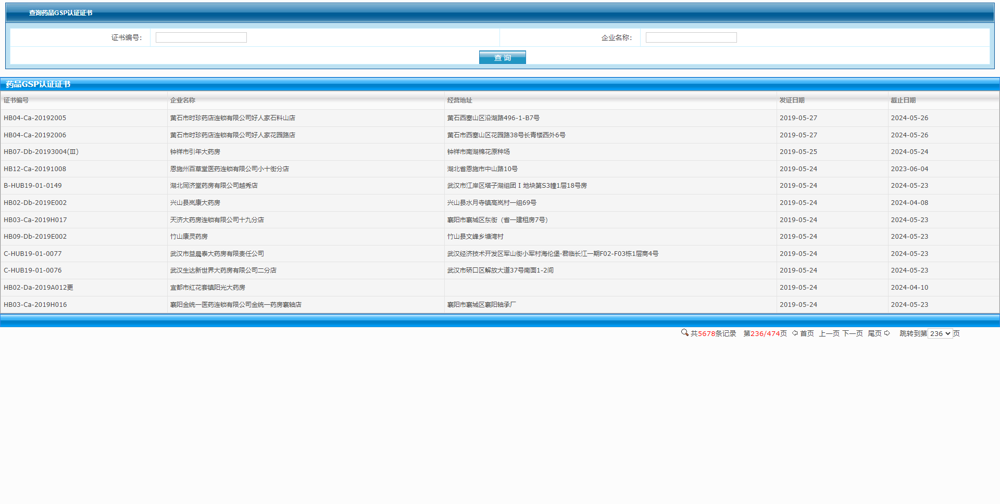
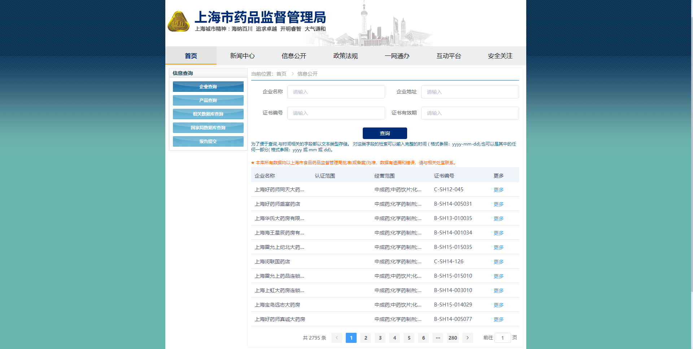
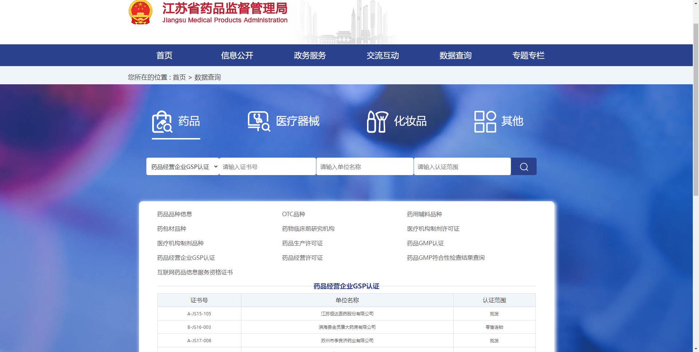
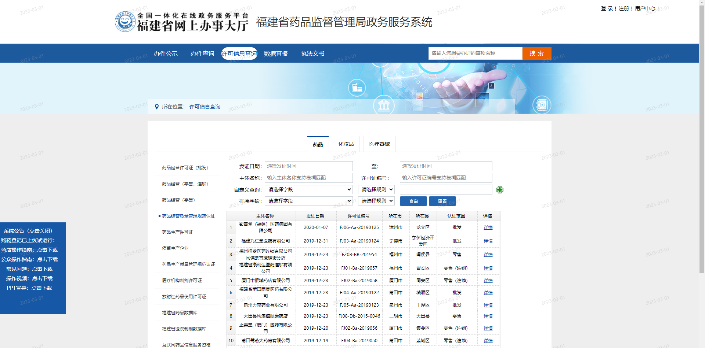
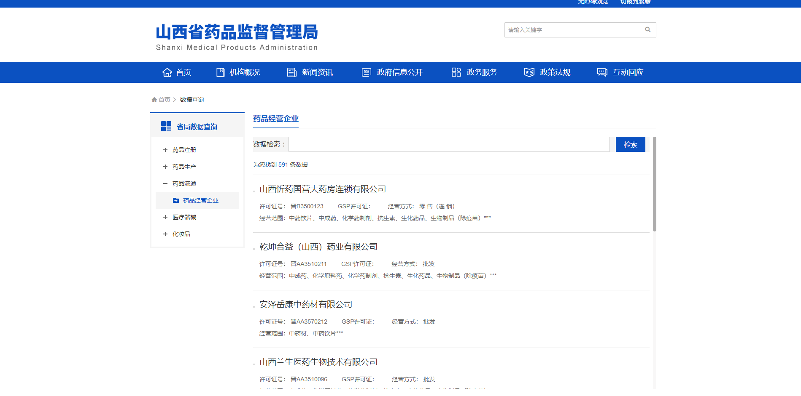

---
tags:
- 爬虫
- python案例
---

# 获取地方药监局官网上的GSP认证信息
> GSP认证又叫**药品经营质量管理规范认证**
> 
> GMP认证又叫**药品生产质量管理规范认证**
> 
> 有的网站会用中文名

## 进度


??? question "各省药监局网"
    - [x] [北京市❌](http://yjj.beijing.gov.cn/)
      - 数据查询页面：http://xxcx.yjj.beijing.gov.cn/eportal/ui?pageId=723636
      - 没找到GSP查询接口
    - [x] [天津市❌](https://scjg.tj.gov.cn/tjsscjdglwyh_52651/tjyj/)
      - 没找到GSP查询接口
    - [x] [河北省❓](http://yjj.hebei.gov.cn/)
      - http://yjj.hebei.gov.cn/datasearch/face3/dir_html_new.jsp
      - 有省局数据查询，但是服务器挂了
    - [x] [山西省❓](http://yjj.shanxi.gov.cn)
      - 有一个药品经营企业查询，结果里面的一部分企业能在国家药监局查到GSP认证信息，一部分查不到
    - [x] [内蒙古❌](http://mpa.nmg.gov.cn)
      - http://110.16.70.4:9240/online/
      - 没GSP接口
    - [x] [辽宁省❌](http://ypjg.ln.gov.cn/)
      - https://ypjg.ln.gov.cn/ypjg/sjcx/sjsjzx/index.shtml
      - 没GSP接口
    - [x] [吉林省❌](http://mpa.JL.gov.cn)
      - http://mpa.jl.gov.cn/gzfw/sjcx/yp/
      - 没GSP接口
    - [x] [黑龙江省❌](http://mpa.hlj.gov.cn/)
      - https://221.208.28.172:9443/sjcx
      - 没GSP接口
    - [x] [上海市✔️](http://yjj.sh.gov.cn/)
    - [x] [江苏省✔️](http://da.jiangsu.gov.cn/)
    - [x] [浙江省❌](http://mpa.zj.gov.cn/)
      - http://mpa.zj.gov.cn/col/col1228990181/index.html
      - 没GSP接口
    - [x] [安徽省❌](http://mpa.ah.gov.cn)
      - https://mpa.ah.gov.cn/sjcx/sjcx/index.html
      - 没GSP接口
    - [x] [福建省✔️](http://yjj.scjgj.fujian.gov.cn/default.htm)
    - [x] [江西省❓](http://mpa.jiangxi.gov.cn/)
      - http://59.53.245.36:7089/sjfb/medicinelicence/gotoYpjyList.xhtml
      - 该页面展示的是所有有药品经营许可的企业，不一定有GSP认证
    - [x] [山东省❌](http://mpa.shandong.gov.cn)
      - http://mpa.shandong.gov.cn/col/col101865/index.html
      - 没有GSP接口
    - [x] [河南省❓](http://yjj.henan.gov.cn/)
      - http://222.143.21.45/ypjylsGspXkzSearch.jsp?c=dahe
      - 页面上没有数据，必须通过GSP认证编号来查询
    - [x] [湖北省✔️](http://mpa.hubei.gov.cn/)
    - [x] [湖南省❌](http://mpa.hunan.gov.cn/)
      - http://mpa.hunan.gov.cn/mpa/bsfw/sjcx/index.html
      - 没有GSP接口
    - [x] [广东省✔️](http://mpa.gd.gov.cn/)
    - [x] [广西区❓](http://yjj.gxzf.gov.cn/)
      - http://yjj.gxzf.gov.cn/cxfw/zzqjsj/
      - 接口挂了
    - [x] [海南省❌](http://amr.hainan.gov.cn/himpa/)
      - https://amr.hainan.gov.cn/himpa/bsfw/sjcx/
      - 没有GSP接口
    - [x] [重庆市❌](http://yaojianju.cq.gov.cn/)
      - https://yaojianju.cq.gov.cn/sjcx/
      - 没有GSP接口
    - [x] [四川省❌](http://yjj.sc.gov.cn/)
      - http://yjj.sc.gov.cn/scyjj/c103140/sjcx.shtml
      - 没有GSP接口
    - [x] [贵州省❌](http://yjj.guizhou.gov.cn/)
      - http://yjj.guizhou.gov.cn/bsfw/cx/
      - 没有GSP接口
    - [x] [云南省❌](http://mpa.yn.gov.cn/)
      - http://mpa.yn.gov.cn/pages/SearchCertificate.aspx
      - 没有GSP接口
    - [x] [西藏自治区❌](http://mpa.xizang.gov.cn/)
      - http://app1.nmpa.gov.cn/data_nmpa/face3/dir.html?type=yp
      - 用的是国家药监局的旧链接
    - [x] [陕西省❌](http://mpa.shaanxi.gov.cn/)
      - https://mpa.shaanxi.gov.cn/gkgs/
      - 没GSP接口
    - [x] [甘肃省❌](http://yjj.gansu.gov.cn)
      - http://apps.yjj.gansu.gov.cn:2180/detail_yj.jsp
      - 没有GSP接口
    - [x] [青海省❌](http://ypjgj.qinghai.gov.cn/)
      - 外链国家药监局
    - [x] [新疆区❌](http://mpa.xinjiang.gov.cn/)
      - http://mpa.xinjiang.gov.cn/xjyjj/yaop/list_yp.shtml
      - 没有GSP接口
    - [x] [宁夏区❌](http://nxyjj.nx.gov.cn)
      - https://www.nmpa.gov.cn/yaopin/index.html
      - 外链国家药监局

## 湖北省

[药品GSP认证证书](https://59.175.169.148:8999/wssb/websearch/SearchCardAction.do?operate=searchGyEntCard&operPage=card_ypgsp_list&cardtype=18)



### 解决方案
- 使用POST请求下面的网址

https://59.175.169.148:8999/wssb/websearch/SearchCardAction.do?operate=searchGyEntCard&operPage=card_ypgsp_list&cardtype=18&pageModel.afreshQuery=true

POST参数为：

```python
data={
        'gyEntcardprint.cardid': '',
        'gyEntcardprint.name': '',
        'pageModel.nextPageNo': '1', # 页码
        'pageModel.pageSize': '12', # 似乎不可变
        'cardtype': '18' # 意义不明，没试出来除了18之外其他可用的取值
    }
```

得到特定页码的页面，然后在页面上即可获取每个GSP认证的id，形如：`8a85036169e1fc6e016a4cd372ae288c`

- 带着上面获取到的ID，使用GET请求下面的网址

https://59.175.169.148:8999/wssb/websearch/SearchCardAction.do?operate=viewGyEntCard&operPage=card_ypgsp_view&recid=8a85036169e1fc6e016a4cd372ae288c

即可获得详细的数据。

## 上海市

[上海市获GSP认证证书企业名单](https://sjcx.yjj.sh.gov.cn/#/gsp)



### 解决方案

最简单的一种：

直接GET请求下面这个网址就会返回json格式的数据了

https://sjcx.yjj.sh.gov.cn/api/v1/gsp/list?pageNum=1&pageSize=500&_t=1677571296

这里面`pageNum`是页码，`pageSize`是每页的数据量（最大可以设置到500），`_t`是时间戳。

## 江苏省

[药品经营企业GSP认证](https://zwpt.da.jiangsu.gov.cn/datacenter/dc/list/9ef795a57980417cb24c274d67059910?pageNo=1)



和湖北省类似。

## 福建省
[许可信息查询](https://zxsb.fjmpa.cn:8070/webSiteController/view.do?navTarget=website/xkcx/xkcx_search&tabFlag=drug&typeFlag=druggsp)




一句话就爬完了，真是个讨喜的网站
```python
import requests
import pandas as pd
import json

pd.DataFrame(json.loads(
        requests.post(
        "https://zxsb.fjmpa.cn:8070/safesocialPermissionController/xzxkListEasyUI.do?xktype=12",
        headers={
            "User-Agent":'Mozilla/5.0 (Windows NT 10.0; Win64; x64) AppleWebKit/537.36 \
                (KHTML, like Gecko) Chrome/110.0.0.0 Safari/537.36'
        },
        data={
            'page' : '1',
            'rows' : '958' # 一共958个数据，可以一次性请求
        }
    ).text)['rows']).set_index('CURRENTROW')
```

## 广东省
[药品GSP认证（批发、连锁）](https://mpa.gd.gov.cn/wycxh5/yjj-pc/#/data)


也是一句话就可以爬完：
```python
import requests
import pandas as pd
import json

pd.DataFrame(json.loads(
    requests.get(
        f"https://mpa.gd.gov.cn/wycxh5/api/dataQuery?currPage={pageno}\
            &pageSize=40&table_name=EX_0118001_fix0008",
        headers={
            "User-Agent":'Mozilla/5.0 (Windows NT 10.0; Win64; x64) AppleWebKit/537.36 \
                (KHTML, like Gecko) Chrome/110.0.0.0 Safari/537.36'
        }
    ).text)['data']).loc[:,
    ['ZSBH', 'FZRQ', 'YXQZ', 'ZCDZ', 'QYMC', 'FZJG_DETAIL', 'RZFW',]
    ]
```

## 山西省
[药品经营企业](https://yjj.shanxi.gov.cn/sjcx/yplt/ypjyqy/)



这里列出来的企业不一定都有GSP认证信息。