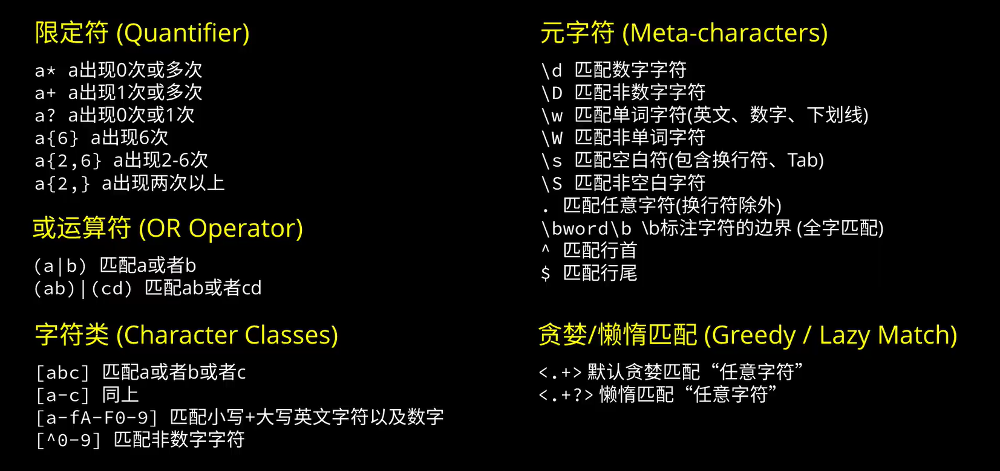

---
tags:
- python标准库
---

# re

`re`是最常用的标准库之一，它为python提供了一个正则表达式（Regular Expression）引擎。

## 什么是正则表达式
Regular Expression，或者简写为Regex、regexp等。

!!! cite "维基百科"
    正则表达式，又称规律表达式、正则表示式、正则表示法、规则表达式、常规表示法，是计算机科学概念，用简单字符串来描述、匹配文中全部匹配指定格式的字符串，现在很多文本编辑器都支持用正则表达式搜索、取代匹配指定格式的字符串。

各类主流的编程语言都有正则表达式的支持（然而C和C++的标准库不支持正则表达式）。当然不同编程语言的实现可能有所不同，我们下面只介绍python的`re`库。

## 举个例子
先来看一个例子体会一下正则表达式的用法，如果我有下面的一列字符串：

```text title="薪资"
2.5-3.5万·15薪
8千-1.5万·13薪
1-1.5万
7千-1万·13薪
4-7万·17薪
1-1.5万·13薪
8千-1.2万
```
我想把他们转化成标准化的月薪，应该怎么做呢？
> FYI  
> `2.5-3.5万·15薪`指的是每个月2.5到3.5万，每年发15个月的工资（可能以奖金的形式发放）。

如果使用正则表达式，我们可以这样写：

=== "源代码"

    ```python
    import re
    lst = [
        '2.5-3.5万·15薪',
        '8千-1.5万·13薪',
        '1-1.5万',
        '7千-1万·13薪',
        '4-7万·17薪',
        '1-1.5万·13薪',
        '8千-1.2万'
        ]
    pattern = r'(\d+\.?\d*)([万千百]?)-(\d+\.?\d*)([万千百]?)·?(\d*)薪?'
    print(*[re.match(pattern, item).groups() for item in lst], sep='\n')
    ```
=== "输出"

    ```text
    ('2.5', '', '3.5', '万', '15')
    ('8', '千', '1.5', '万', '13')
    ('1', '', '1.5', '万', '')    
    ('7', '千', '1', '万', '13')  
    ('4', '', '7', '万', '17')    
    ('1', '', '1.5', '万', '13')  
    ('8', '千', '1.2', '万', '')
    ```

后续再对这些匹配的结果进行数值化处理即可。

不难发现这里面最奇怪的一行就是`#!python r'(\d+\.?\d*)([万千百]?)-(\d+\.?\d*)([万千百]?)·?(\d*)薪?'`。

实际上这就是所谓的正则表达式，他描述了我们想要搜索的字符模式。

具体来说：
- `\d`代表0-9的数字
- `+`代表它前面的内容至少一个
- `?`代表它前面的内容0或1个
- `*`代表它前面的内容不限个数
- `[万千百]`代表万、千、百当中的一个
- `()`表示我们想提取括号内的内容

这样一来
- `(\d+\.?\d*)`的意思就是，我们要匹配并且提取【至少一个数字开头的，可能有小数部分的一个数字】。
- `([万千百]?)`的意思就是，我们要匹配并且提取【可能存在的万、千、百当中的一个】

匹配的结果可视化大概是这样的：


这里也推荐一下图里这个网站：[regex101.com](https://regex101.com/)可以很方便地调试各种编程语言的正则表达式。

## 更加全面的规则
上面的例子展示的正则表达式的威力，我们接下来更加细致地讲解正则表达式的规则。

我有一张图，来源不明但我常常拿出来看：



这张图虽然不够全面，但大体上是够用的。

re库的`__doc__`里也给出了很详细的说明文档，我这里做一个翻译。

??? cite "原文"

    python 3.10.9的`re.__doc__`
    ```python
    r"""Support for regular expressions (RE).
    
    This module provides regular expression matching operations similar to
    those found in Perl.  It supports both 8-bit and Unicode strings; both
    the pattern and the strings being processed can contain null bytes and
    characters outside the US ASCII range.
    
    Regular expressions can contain both special and ordinary characters.
    Most ordinary characters, like "A", "a", or "0", are the simplest
    regular expressions; they simply match themselves.  You can
    concatenate ordinary characters, so last matches the string 'last'.
    
    The special characters are:
        "."      Matches any character except a newline.
        "^"      Matches the start of the string.
        "$"      Matches the end of the string or just before the newline at
                the end of the string.
        "*"      Matches 0 or more (greedy) repetitions of the preceding RE.
                Greedy means that it will match as many repetitions as possible.
        "+"      Matches 1 or more (greedy) repetitions of the preceding RE.
        "?"      Matches 0 or 1 (greedy) of the preceding RE.
        *?,+?,?? Non-greedy versions of the previous three special characters.
        {m,n}    Matches from m to n repetitions of the preceding RE.
        {m,n}?   Non-greedy version of the above.
        "\\"     Either escapes special characters or signals a special sequence.
        []       Indicates a set of characters.
                A "^" as the first character indicates a complementing set.
        "|"      A|B, creates an RE that will match either A or B.
        (...)    Matches the RE inside the parentheses.
                The contents can be retrieved or matched later in the string.
        (?aiLmsux) The letters set the corresponding flags defined below.
        (?:...)  Non-grouping version of regular parentheses.
        (?P<name>...) The substring matched by the group is accessible by name.
        (?P=name)     Matches the text matched earlier by the group named name.
        (?#...)  A comment; ignored.
        (?=...)  Matches if ... matches next, but doesn't consume the string.
        (?!...)  Matches if ... doesn't match next.
        (?<=...) Matches if preceded by ... (must be fixed length).
        (?<!...) Matches if not preceded by ... (must be fixed length).
        (?(id/name)yes|no) Matches yes pattern if the group with id/name matched,
                        the (optional) no pattern otherwise.
    
    The special sequences consist of "\\" and a character from the list
    below.  If the ordinary character is not on the list, then the
    resulting RE will match the second character.
        \number  Matches the contents of the group of the same number.
        \A       Matches only at the start of the string.
        \Z       Matches only at the end of the string.
        \b       Matches the empty string, but only at the start or end of a word.
        \B       Matches the empty string, but not at the start or end of a word.
        \d       Matches any decimal digit; equivalent to the set [0-9] in
                bytes patterns or string patterns with the ASCII flag.
                In string patterns without the ASCII flag, it will match the whole
                range of Unicode digits.
        \D       Matches any non-digit character; equivalent to [^\d].
        \s       Matches any whitespace character; equivalent to [ \t\n\r\f\v] in
                bytes patterns or string patterns with the ASCII flag.
                In string patterns without the ASCII flag, it will match the whole
                range of Unicode whitespace characters.
        \S       Matches any non-whitespace character; equivalent to [^\s].
        \w       Matches any alphanumeric character; equivalent to [a-zA-Z0-9_]
                in bytes patterns or string patterns with the ASCII flag.
                In string patterns without the ASCII flag, it will match the
                range of Unicode alphanumeric characters (letters plus digits
                plus underscore).
                With LOCALE, it will match the set [0-9_] plus characters defined
                as letters for the current locale.
        \W       Matches the complement of \w.
        \\       Matches a literal backslash.
    
    This module exports the following functions:
        match     Match a regular expression pattern to the beginning of a string.
        fullmatch Match a regular expression pattern to all of a string.
        search    Search a string for the presence of a pattern.
        sub       Substitute occurrences of a pattern found in a string.
        subn      Same as sub, but also return the number of substitutions made.
        split     Split a string by the occurrences of a pattern.
        findall   Find all occurrences of a pattern in a string.
        finditer  Return an iterator yielding a Match object for each match.
        compile   Compile a pattern into a Pattern object.
        purge     Clear the regular expression cache.
        escape    Backslash all non-alphanumerics in a string.
    
    Each function other than purge and escape can take an optional 'flags' argument
    consisting of one or more of the following module constants, joined by "|".
    A, L, and U are mutually exclusive.
        A  ASCII       For string patterns, make \w, \W, \b, \B, \d, \D
                    match the corresponding ASCII character categories
                    (rather than the whole Unicode categories, which is the
                    default).
                    For bytes patterns, this flag is the only available
                    behaviour and needn't be specified.
        I  IGNORECASE  Perform case-insensitive matching.
        L  LOCALE      Make \w, \W, \b, \B, dependent on the current locale.
        M  MULTILINE   "^" matches the beginning of lines (after a newline)
                    as well as the string.
                    "$" matches the end of lines (before a newline) as well
                    as the end of the string.
        S  DOTALL      "." matches any character at all, including the newline.
        X  VERBOSE     Ignore whitespace and comments for nicer looking RE's.
        U  UNICODE     For compatibility only. Ignored for string patterns (it
                    is the default), and forbidden for bytes patterns.
    
    This module also defines an exception 'error'.
    ```

!!! note "我的翻译"
    re的手册

    本模块提供了和`Perl`（另外一个编程语言）类似的正则表达式的匹配操作。同时支持8bit和unicode字符。匹配模式（pattern，也就是正则表达式）和被处理的字符串都可以包含空字节或者ASCII码之外的字符。
    
    正则表达式可以包含特殊的`保留字`和其他的普通字符。像是“A”、“a”或者“0”这种普通的字符本身就是最简单的正则表达式，它们的匹配结果就是自身。你可以把普通字符串起来使用，例如`'last'`就会匹配`'last'`。
    
    re中的保留字列举如下：
    |保留字|功能|
    |--|--|
    |`.`|匹配除去换行(`\n`)的任何字符|
    |`^`|匹配字符的开头|
    |`$`|匹配字符的结尾|
    |`*`|匹配任意长度的字符(贪婪地, 有多少匹配多少)|
    |`+`|匹配一个或者更多的字符(贪婪地)|
    |`?`|匹配零个或者一个字符(贪婪地)|
    |`{m,n}`|匹配m到n个字符,例如2-5个|
    |`*?, +?, ??, {m,n}?`|前面四个的懒惰模式(尽可能少地匹配)|
    |`\\`[^1]|转义字符, 或者是逃逸字符. 例如`\\n`就是转义字符, 匹配一个换行而不是`n`. `\\.`就是逃逸字符, 匹配一个英文句号`.`, 而不是前面所说的任意字符.|
    |`[...]`|匹配一组字符, 在方括号内用`^`符号作为第一个字符则是匹配这组字符之外的字符.|
    |`|`|或连接符, `A|B`会匹配A或者B|
    |`(...)`|匹配括号内的字符, 这些子字符后续可以被检索或者进一步匹配|
    |`(?aiLmsux)`|设定后面定义的几种匹配模式|
    |`(?:...)`|和普通的括号类似, 但是不会把括号内匹配的子字符串作为一个组(group)|
    |`(?P<name>...)`|把匹配的子字符串组命名为`name`|
    |`(?P=name...)`|匹配名称为`name`的组|
    |`(?#...)`|注释|
    |`(?=...)`|前视断言|
    |`(?!...)`|否定型前视断言|
    |`(?<=...)`|肯定型后视断言|
    |`(?>=...)`|否定型后视断言|
    |`(?(id/name)yes-pattern|no-pattern)`|如果id或者name存在, 尝试匹配yes表达式, 否则匹配no表达式|
    
    匹配模式(flags)列举如下:
    |flag|全称|涵义|
    |--|--|--|
    |A|ASCII|使用ASCII字符集|
    |I|IGNORECASE|不区分大小写|
    |L|LOCALE|没看懂, 估计用处不大. 官网的[中文解释](https://docs.python.org/zh-cn/3.10/library/re.html#re.L)|
    |M|MULTILINE|多行模式, 待处理的字符串有多行, 这个模式下`^$`标记的是行头行尾而不是字符串的首尾.|
    |S|DOTALL|`.`匹配包括换行在内的所有字符(dot match all)|
    |X|VERBOSE|忽视正则表达式中的空白和`#`之后的内容|
    |U|UNICODE|使用Unicode字符集|
    
    re中的转义字符[^1]列举如下:
    |转义字符|涵义|
    |--|--|
    |`\number`|指代之前的某个组, 例如`(\d+) \1`, 实际上等同于`(\d+) (\d+)`. 可以匹配, `223 223`. |
    |`\A`|只匹配字符串开头|
    |`\Z`|只匹配字符串结尾|
    |`\b`|匹配开头或是结尾的空字符[^2]|
    |`\B`|匹配不在开头或是结尾的空字符|
    |`\d`|匹配数字, 在ASCII模式下, 等价于`[0-9]`. 但非ASCII模式下则是整个Unicode数字集.|
    |`\D`|匹配`\d`的补集, 等价于`[^\d]`|
    |`\s`|匹配空白字符, ASCII模式下等价于`[\t\n\r\f\v]`.|
    |`\S`|匹配`\s`的补集|
    |`\w`|匹配英文字母和数字, ASCII模式下等价于`[a-zA-Z0-9]`|
    |`\W`|匹配`\w`的补集|
    |`\\`|匹配反斜杠|


[^1]: 注意这里使用了`\\`而不是`\`, 这本身其实也是python字符的一种逃逸行为. 实战中我们使用python的字符串书写正则表达式的时候, 往往加上前缀`r`来取消转义行为, 例如`#!python r"\d+"`. 这实际上等价于`#!python "\\d+"`
[^2]: 原文说的就是empty字符, 翻译成空字符可能存在歧义. 这里实际上并非一般意义上的空格(用`\s`匹配)之类的, 而是真正意义上的什么都没有的地方. 例如`apple`, 如果用`\b`去匹配, 匹配结果是`a`之前和`e`之后的空字符. 如果用`\B`去匹配, 结果则是我标记竖线的地方:`a|p|p|l|e`. 总的来说我认为没什么卵用.


## 规则太复杂了, 再看点例子
> 我会写一些正则表达式，配上相应的例子。截图中也会包含相应的解释！

#### VERBOSE模式：`(?x)a pple#match apple`

可以忽略空格以及后面的注释内容。


#### 不分组匹配：`(?:\d+-\d+)`

不会分组。


#### 条件匹配：`^(<)?(\w+@\w+(?:\.\w+)+)(?(1)>$|$)`

条件匹配：`(?(1)>$|$)`，这里的**条件**是第一个匹配分组：`(<)`，如果它匹配成功了上面这个条件匹配就会匹配`>$`，否则就是`$`。

这样一来就可以匹配`<xx@xx.xx>`或者是`xx@xx.xx`了：


#### 前视断言：`\w+(?=@gmail\.com)`

可以提取所有使用gmail的用户名。


#### 分组命名：`(?:(?P<mainland>\+86)|(?P<taiwan>\+886)) (?(mainland)\d{11}|\d{10})`

可以分别提取大陆的手机号码和台湾的手机号码。


## re库的api
到这里，你大概已经知道正则表达式怎么写了。借助在线调试网站[regex101.com](https://regex101.com/)我们可以很方便地查看匹配的情况。

接下来就可以使用各种api来进行正则匹配了。

主要的几个api如下：
- `match`：从开头匹配一个字符
- `fullmatch`：从头到尾匹配
- `search`：在字符中搜索要匹配的正则表达式（不从头开始）
- `sub`：把匹配的结果替换成指定字符
- `subn`：把匹配的结果替换成指定字符，同时返回替换的个数
- `split`：按照匹配的结果把字符串切割为列表
- `findall`：把所有匹配的结果列举出来，返回一个列表
- `finditer`：效果同上，但是返回一个迭代器
- `compile`：把一个正则表达式字符串编译为`Pattern object`
- `purge`：清除缓存
- `escape`：取消字符串中的转义

两个主要的对象：
- `Pattern`：正则表达式对象
- `Match`：匹配的结果

来点例子：
=== "findall"

    ```python
    import re
    print(re.findall(r'\d+', '233是大笑的意思，233333中的3越多表示笑得越厉害，233来源于猫扑表情第233号，是一张捶地大笑的表情，因此不少网友就喜爱在贴吧和论坛发帖的时候加上一句“233”，于是流行开来。 "溜"的意思是指流暢、順利之類嗎？'))
    ```
=== "结果"

    ```text
    ['233', '233333', '3', '233', '233', '233']
    ```

=== "match"

    ```python
    import re
    pattern = re.compile(
        r'(?:(?P<mainland>\+86)|(?P<taiwan>\+886)) (?(mainland)\d{11}|\d{10})'
        )
    res = re.match(
            pattern = pattern,
            string = '+86 13717781859'
            )
    print('res：', res)
    print('res.__class__：', res.__class__)
    print('res.group()：', res.group())
    print('res.groups()：', res.groups())
    print('res.groupdict()：', res.groupdict())
    ```
=== "结果"

    ```text
    res： <re.Match object; span=(0, 15), match='+86 13717781859'>
    res.__class__： <class 're.Match'>
    res.group()： +86 13717781859
    res.groups()： ('+86', None)
    res.groupdict()： {'mainland': '+86', 'taiwan': None}
    ```