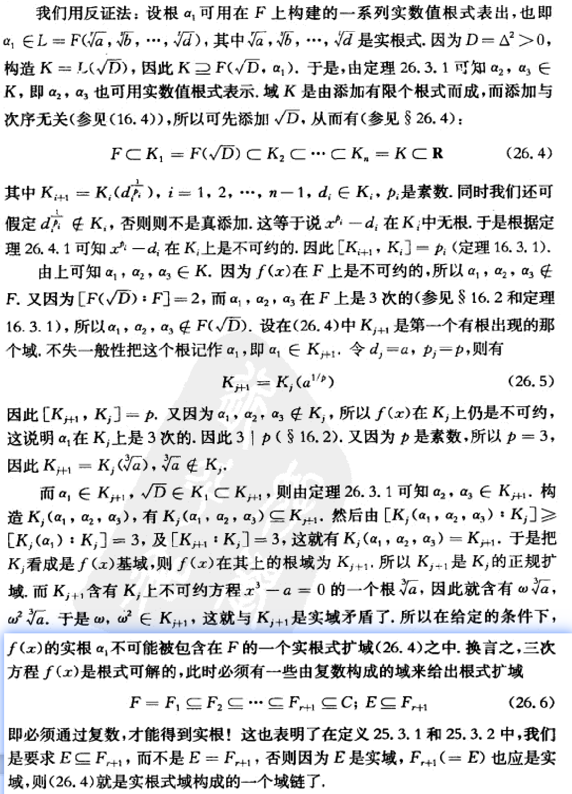

---
tags:
- Algebra
include:
- math
---

# 不可约情形

> 内容来自冯承天著，《从一元一次方程到伽罗瓦理论》，华东师范大学出版社

不可约情形（[Casus irreducibilis](https://en.wikipedia.org/wiki/Casus_irreducibilis)）可以回答一个至关重要的问题：我们为什么需要引入复数？

## 现象

具体来说，不可约情形指的是对于**三次不可约多项式**，如果它有三个不相等的实数根，那么这些根**无法用实数的有限次加减乘除和开方运算**得到，必须要使用复数！

例如：
$$
\cos 20^o =\frac{1}{2}\left(\sqrt[3]{\frac{1+\sqrt{3}i}{2}}+\sqrt[3]{\frac{1-\sqrt{3}i}{2}}\right)
$$

对应的域扩张路径如下：

```
        Q
       / \
      /   \
 Q(zeta_3)  Q(cos(pi/9))
      \       /
       \     /
      Q(zeta_9)
```

这个现象是实数在代数上不完美的一种体现。

## 证明

定理如下：

!!! theorem
    设$f(x) = x^3+px+q \in F(x)$, $F = \mathbb{Q}(p,q) \subseteq \mathbb{R}$，并且$f$在$F$上不可约，并且判别式
    $$
    D = \left[(x_1-x_2)(x_2-x_3)(x_3-x_1)\right]^2 = -4p^3 - 27q^2 \gt 0
    $$
    也就是有三个不等的实根。那么不存在$F$上的一系列实数值根式来得出$f(x)$的求根公式。

证明过程使用反证法，假设方程的根可以用实数的有限次加减乘除和开方运算得到：

<figure markdown>

{width=400}

</figure>

证明的核心是分裂域的性质：

!!! theorem
    分裂域是基域的正规扩张。

而**正规扩张**的另外一个等价刻画是：

!!! theorem
    对基域上任何一个不可约多项式，如果一个根在正规扩张域中，那么所有根都在。
