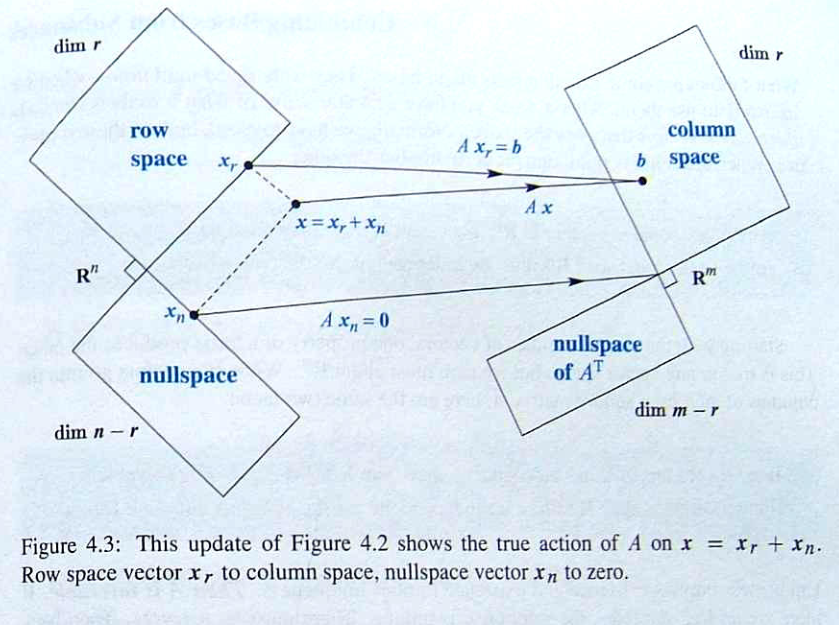
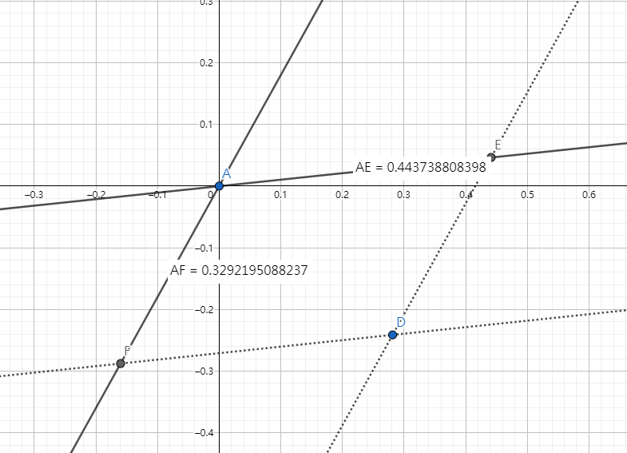

---
tags:
- Algebra
include:
- math
---

# 正交子空间

正交子空间这个概念很重要, 但是我本人上线性代数课的时候老师没怎么提. 最近复习又遇到了它, 遂重新梳理一下.

## 线性子空间

!!! definition "线性子空间"
    一个线性空间$W$的子集$U$如果满足下面三个条件, 那么$U$为$W$的一个线性子空间

    - $0\in U$
    - $x,y \in U \Rightarrow x+y\in U$
    - $x\in U \Rightarrow kx\in U$ 其中$k$是一个标量

以下我们所言空间都是线性空间, 线性二字略去. 并且以下讨论默认所有矩阵都是实矩阵.

## 正交子空间

!!! definition "正交子空间"
    如果$W$的两个子空间$U$和$V$满足
    $$
    v\in V, u\in U \Rightarrow v\perp u
    $$
    那么就称这两个子空间是正交子空间, 记作$U\perp V$.

下面给出几个正交子空间的例子。

### 过原点的垂直直线

也就是
$$
\{(x,ax):x\in R\}
$$
和
$$
\{(-ay,y):y\in R\}
$$
是$R^2$的正交子空间.

值得注意的是, 根据线性空间的公理, 一个线性空间必须包含**零点**, 所以并非任意两个垂直的直线都能成为正交子空间的。

### 行空间和零空间

一个矩阵$A\in R^{m\times n}$, 可以生成下面两个$R^n$的子空间:

- 零空间（null space）, 就是$Ax=0$的解构成的线性空间
    $$
    N(A)=\left\\{x:Ax=0\right\\}
    $$
- 行空间（column space）, 就是$A$的行向量所有可能的线性组合构成的线性空间
    $$
    C(A^T)=\left\\{y:y=A^Tc,c\in R^{m\times 1}\right\\}
    $$

显然对于任意的$x\in N(A), y \in C(A^T)$都有：

$$y^Tx=c^TAx=0$$

满足正交子空间的定义. 同理$A$的列空间和左零空间也是正交子空间.

这四个子空间之间的关系非常发人深省.  下图来自展示了他们的关系：

> 详见Gilbert Strang, [*Introduction to Linear Algebra*](https://math.mit.edu/~gs/linearalgebra/).

### 实对称矩阵的特征子空间

已知实对称矩阵$A\in R^{n\times n}$的属于不同特征值的特征向量是正交的, 那么各个**特征子空间**（加入零向量之后）成为正交子空间.

其中对应于特征值$\lambda$的特征子空间是
$$
V_\lambda =\left\\{x:Ax=\lambda x\right\\}
$$

注意, 这些特征子空间不仅仅包含了属于该特征值的所有特征向量, 还加入了零向量. 否则不成为一个线性空间.

## 直和与直积

!!! definition "直和"
    如果$W$和 $U$,$V$之间存在下述关系
    $$
    \forall w \in W, \exists! u\in U,v\in V \quad s.t.\quad w=u+v
    $$
    那么我们称$W$是$U$和$V$的直和, 记作$W=U\oplus V$

    > 其中注意符号 $\exists!$表示**存在且唯一**, 唯一性是区别直和和普通和的关键

类似的我们有直积的定义:

!!! definition "直积"
    如果$W$和 $U$,$V$之间存在下述关系
    $$
    \forall w \in W, \exists! u\in U,v\in V \quad s.t.\quad w=\begin{pmatrix}u\\\\v\end{pmatrix}
    $$
    那么我们称$W$是$U$和$V$的直积, 记作$W=U\times V$.

直积这个概念我们实际上经常遇到, 例如二维空间$R^2=R\times R$, 就是直积的结果.

注意区分直和和直积, 两个都可以生成新的线性空间, 但是前者不改变维度, 后者在原有维度的基础上增加维度.

直和有这样一个重要的性质:
$$
W=U\oplus V \Rightarrow \dim(W)=\dim(U)+\dim(V)
$$

!!! note "直和与普通和的关系"
    $$
    U+V=\{u+v:u\in U,v\in V\}
    $$
    上述即为普通和. 直和是特殊的普通和, 可以通过**普通和+分解的唯一性**来定义直和.

    特别的, 在$R^n$中, 如果$U\cap V=\\{0\\}$, 那么$W=U+V$就是直和, 也就是$W$中任意元素的分解是唯一的.

### 一个例子

平面直角坐标系中,通过原点的两条直线的直和是整个平面.

如图, 空间任何一个向量(如AD)都可以分解为两个子空间内向量的和(如AD=AE+AF), 并且这样的分解是唯一的.

## 正交补

!!! definition "正交补"
    如果$W$的两个子空间$U$和$V$满足
    $$
    U\perp V,U\oplus V=W
    $$
    那么我们称$U$是$V$的正交补, 记作$U=V^\perp$. 同时我们称$U$和$V$是$W$的**正交直和分解**.

上面的正交补定义和下面的定义等价
$$
V^\perp=\\{x:x\perp v, \quad \forall v \in V\\}
$$

$V$的正交补中任何一个向量都和$V$中所有向量正交。

### 一个例子

根据「秩-零化度定理」(Rank-Nullity Theorem)，我们有：
$$
\dim{N(A)}+\mathrm{rank}(A)=n
$$
再结合：**行秩等于列秩等于矩阵的秩**
$$
\dim(C(A^T))=\mathrm{rank}(A)
$$
可以得到
$$
\dim(N(A))+\dim(C(A^T))=n
$$
那么这两个空间的之和就是全空间, 也就是
$$
N(A)\oplus C(A^T)=R^{n}
$$
这样, 我们知道任何一个矩阵生成的零空间和行空间是全空间的**正交直和分解**.

值得注意的是, 虽然这样的正交直和分解和秩-零化度定理看起来很融洽,  但是[该定理的证明](https://zh.wikipedia.org/wiki/%E7%A7%A9%E2%80%94%E9%9B%B6%E5%8C%96%E5%BA%A6%E5%AE%9A%E7%90%86)并非利用了这个分解, 实际上定理中的$\text{rank}(A)$来自$A$的列空间, 这再度展现了四个子空间的魔力。

## 最后

> 就是为了这顿饺子包的这碟醋

我们来做一个题：

!!! question
    设$A\in R^{n\times n}$，并且$A^T=A$。已知$A$的三个特征值分别为$\lambda_1=6,\lambda_2=\lambda_3=3$，以及属于$\lambda_1$的一个特征向量$\alpha_1=(1,1,1)^T$满足$A\alpha_1=6\alpha_1$，求$A$。

### 题解

这题考察了特征子空间的正交补。

**根据实对称矩阵的相关理论**, $V_{\lambda=6}$和$V_{\lambda=3}$的维度(几何重数)分别为对应特征值的代数重数1、2。

这里已知一个**1维**特征子空间$V_{\lambda=6}$内一个向量, 那么整个子空间为其所有的线性伸缩：

$$
V_{\lambda=6}=\\{x:x=k(1,1,1)^T,k\in R\\}
$$
进而根据上述的理论另外一个子空间就是它的正交补.

也就是
$$
V_{\lambda=3}=\\{x:k(1,1,1)^Tx=0,\quad \forall k\\}=N\left((1,1,1)^T\right)
$$
**根据线性方程组的理论**, 我们可以求得该子空间的一组基为
$$
(1,0,-1)^T,(0,1,-1)^T
$$
这样一来我们就有了$A$的三个**线性无关**的特征向量:
$$
(1,1,1)^T,(1,0,-1)^T,(0,1,-1)^T
$$
把他们排列成一个矩阵就有
$$
AP=\Lambda P
$$
其中$P$**满秩**,
$$
P=\begin{pmatrix}1&1&0\\\\1&0&1\\\\1&-1&-1\end{pmatrix}
$$

$$
\Lambda=\mathrm{diag}(6,3,3)
$$

那么可以求得
$$
A=P^{-1}\Lambda P=\begin{pmatrix}4&1&1\\\\1&4&1\\\\1&1&4\end{pmatrix}
$$
这个题有了前面的铺垫解起来很轻松, 但是背后的实对称矩阵的理论以及线性方程组的理论还是很艰深的, 以后有时间再唠.

此致.
