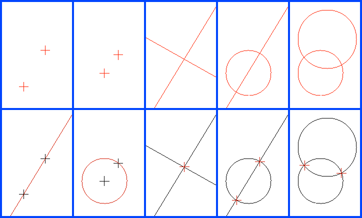
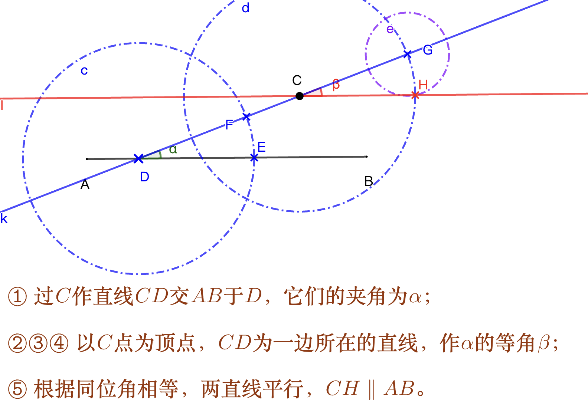
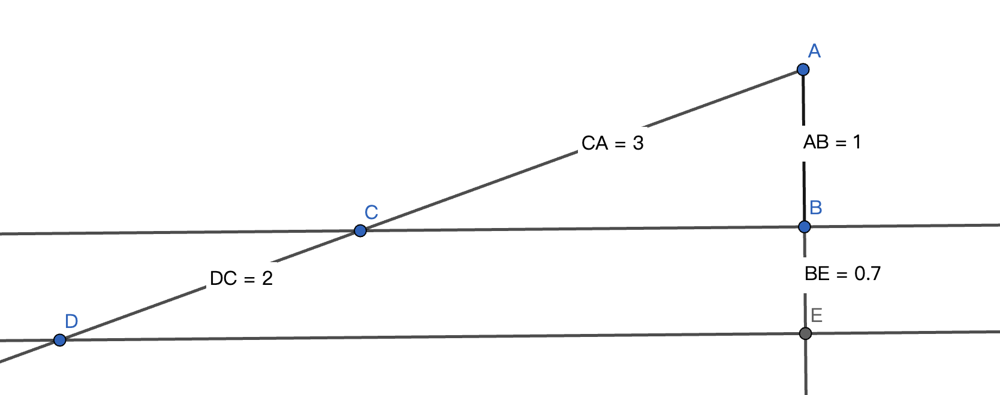
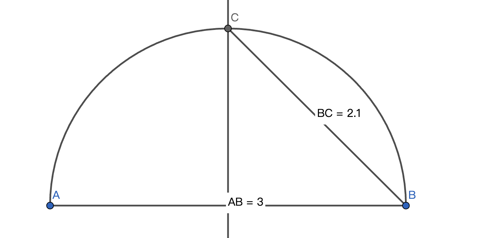

# 规矩数

上一篇文章我们在介绍复数的来历时提出了一个概念：规矩数。并且我们说$\cos(\pi/9)$不是一个规矩数，所以它必须用复数才能表示。

**很抱歉这个说法是错误的。**

$\cos(\pi/9)$确实是规矩数，但规矩数只是表明它是无法用实数的有限次的加减乘除和**开二次方运算**来表示。如果想要证明它不能用实数的加减乘除**乘方运算**表示（从而引出复数的必要性），还需要进一步的证明（等我研究明白了再来分享）。

> 举例来说，$\sqrt[3]{2}$不是规矩数，但是它显然可以用实数（的加、减、乘、除、乘方）来表示。

今天我们来补充介绍一下规矩数。首先给出一个几何上的定义：

>  定义（规矩数，constructible number）：
>
> 如果一个数字$r$，它的绝对值$|r|$是在平面上可以用**尺规**作图作出的线段长度，那么$r$是规矩数。

## 什么是尺规作图

提到尺规作图大家应该是不陌生的，小学的时候大家都学过如何作角分线、垂直平分线等。一般而言尺规作图有五个作图公法（最基本的操作）：

1. 通过两个已知点可作一直线。
2. 已知圆心和半径可作一个圆。
3. 若两已知直线相交，可求其交点。
4. 若已知直线和一已知圆相交，可求其交点。
5. 若两已知圆相交，可求其交点。

在图上看来就是：

> 图源：https://www.geogebra.org/m/qb3jfzmy，文中较为详细的介绍了各种尺规作图的方法，还有动画演示！下面平行线的作法也是这篇文章里截图的！

在此基础之上衍生出了一些其他的作图方法。

### 尺规作平行线

平行线的作法比较重要，我们放张图在这里，大家可以比划比划：

其他的操作：作角分线，作垂直平分线等这里就不再赘述。

### 有理数都是规矩数

不难证明，所有的整数都是规矩数，我们很容易从单位长度1的线段（通过延长线段）得到长度为任意整数的线段。

然后利用平行线的作法，我们就可以从$m,n$得到$n/m$，具体如下图（或许叫**平行线分线段成比例定理**）：

图中$AC=3$，$CD=2$，如果$AB=1$那么就得到$BE=2/3$

> 作图的顺序是：
>
> 1. 先作线段$AB$，长度作为1
> 2. 作过$B$和$AB$垂直的直线$l$
> 3. 用圆规在直线$l$上找一点$C$使得$AC=3$
> 4. 延长$AC$到$D$使得$CD=2$
> 5. 过$D$作$CB$的平行线$k$
> 6. 延长$AB$交直线$k$于$E$点

## 规矩数域

### 尺规开二次方

上一节我们说明了所有的有理数都是规矩数，但规矩数远不止于此。例如$\sqrt{2}$就是一个典型的无理数，但它是一个规矩数：我们很容易作出一个直角边为$1$的等腰直角三角形，那么它的斜边长度就是$\sqrt{2}$。

更进一步的，我们还可以在尺规作图中实现**开二次方的运算**：

> 作图的顺序是：
>
> 1. 作定长线段$AB=3$
> 2. 作$AB$的垂直平分线，和以$AB$为直径的圆相交于点$C$
> 3. 得到$BC=\sqrt{3}$

那么，所有的规矩数构成的集合有什么特点呢？？在代数学中我们有一个结构刚好可以描述它，那就是域。

> **域**是在集合上定义了加法和乘法两个二元运算的代数结构：$(\mathbb{F},+,\times)$，满足：
>
> - 它在加法下是交换群
> - 它在乘法下除了零元外构成交换群（也即是非零元都可逆）
> - 乘法和加法相容（有乘法分配律）：$a\times(b+c)=a\times b+a\times c$

那么你可能又要问，什么是交换群？

> **交换群**是特殊的**群**，如果在一个集合$\mathbb{G}$上定义了二元运算（例如加法），满足：
> - 结合律：$(a+b)+c = a+(b+c)$
>
> - 有单位元：$\exists 0 \in G$，使得$\forall a\in G$都有$a+0=a$
>
> - 有逆元：$\forall a\in G, \exists -a\in G \quad a+(-a)=0$
>
> - 交换律：$a+b=b+a$
>
> 那么$\mathbb{G}$是一个交换群。

大家可以自行验证上面的各条性质。我这里验证比较重要的一条：

### 规矩数域的封闭性

- **对加减乘除封闭**是交换群的要求，显然如果$a,b$都是规矩数，那么$a\pm b$、$a*b$和$a/b$都是规矩数。
  - 加减法自然不必说，尺规作图中只要延长或者截断即可。除法我们之前用平行线实现了，乘法类似：$a*b$相当于$a*(1/b)$，那么我们只需要先作出$1/b$，然后再和$a$做一次除法即可。

- **（非负元）对开二次方封闭**是规矩数域特有的一个性质，如果$a$是（非负的）规矩数，那么$\sqrt{a}$也是规矩数。
  - 前面我们展示了尺规作图如何对任何的长度开二次方

### 规矩数的一个子域
$$
\mathbb{Q}(\sqrt{2})=\\left\\{x\mid x=a+b\sqrt{2}\quad a,b\in\mathbb{Q}\\right\\}
$$
这是常见的一个域的例子，大家可以比划比划，验证上面提到的域的各个条件。
## 域的扩张

不难发现，$\mathbb{Q}(\sqrt{2})$其实就是在**有理数域**中添加了一个元素$\sqrt{2}$得到的域，我们把这种操作叫做域的**扩张**。

> 在尺规作图中，我们一旦作出了一个长度，就可以在以后的作图中继续使用这个长度。
>
> 例如，我们作出了$\sqrt{2}$的长度，那么后续可以作$1+3\sqrt{2}$等，“我们能作出的长度”一下子增加了很多。
>
> 我们就说：作$\sqrt{2}$引起了域的**扩张**。

根据线性代数的知识，可以验证$\mathbb{Q}(\sqrt{2})$是$\mathbb{Q}$上的一个线性空间，并且$\{1,\sqrt{2}\}$恰可以成为这个域上的一个基（也就是说该域中的所有元素都可以表示为它们的线性组合$a*1+b*\sqrt{2}$），所以它的维度
$$
\dim \mathbb{Q}(\sqrt{2})=2
$$

故称它是有理数域的**二次**扩张，记作$\mathbb{Q}(\sqrt{2})/\mathbb{Q}$，扩张次数记作$[\mathbb{Q}(\sqrt{2}):\mathbb{Q}]=2$。值得一提的事，有理数域是“最小的”数域，它是任何其他数域的子集。或者说任何其他数域都是它的扩张。

> 在尺规作图中，如果你作出了$\sqrt{2}$这个长度，就会引起**域的二次扩张**。

## 到坐标系中

下面我们建立平面直角坐标系，用**解析几何**来回答：哪些数是规矩数，规矩数有什么特点？

不难证明：坐标系中一个点$(a,b)$是规矩的（可以尺规作图），当且仅当他的每个坐标都是规矩数。

>  如果$a,b$是规矩数，那么这个点可以通过$y$轴平行线$x=a$和$x$轴平行线$y=b$的交点来确定的。
>
>  反之如果已知这个点的位置，也可以作垂线来确定$a,b$在坐标轴上的位置，那么$a,b$是规矩数。

而根据我们前面所说的五条作图公法，尺规作图中产生点有以下几个方法：

- 在直角坐标系中直接点出来（需要坐标都是规矩数）
- 直线和直线的交点
- 直线和圆的交点
- 圆和圆的交点

下面我们来研究这几个操作的后果。

### 尺规作图画出的直线和圆

尺规作图用两点确定一个直线，设$l$过两点$(x_1,y_1)$和$(x_2,y_2)$，那么它的方程为
$$
(y-y_1)(x_2-x_1)-(x-x_1)(y_2-y_1)=0
$$
其中$x_{1,2}$和$y_{1,2}$都是规矩数。稍作整理：
$$
(y_1-y_2)x+(x_2-x_1)y+y_1(x_1-x_2)+x_1(y_2-y_1)=0
$$
根据前面所说，规矩数对加减乘除都是封闭的，那么上式也就可以表示成：
$$
ax+by+c=0
$$
其中$a,b,c$是规矩数。

类似的，圆的方程：
$$
(x-x_0)^2+(y-y_0)^2=d^2
$$
可以表示成：
$$
x^2+y^2+ax+by+c=0
$$
其中$a,b,c$是规矩数。

### 直线和直线的交点

两条直线联立，得到一个**一次方程**，它的根必然是由系数的加减乘除构成的，而规矩数域是对加减乘除封闭的，所以域没有发生变化。

### 圆和圆的交点
方程：
$$
\\left\\{
\begin{aligned}
&a_1x+b_1y+c_1+x^2+y^2=0\\\\
&a_2x+b_2y+c_2+x^2+y^2=0
\end{aligned}\\right.
$$
相当于直线和圆的交点：
$$
\\left\\{
\begin{aligned}
&(a_1-a_2)x+(b_1-b_2)y+c_1-c_2=0\\\\
&a_2x+b_2y+c_2+x^2+y^2=0
\end{aligned}\\right.
$$
### 直线和圆的交点
方程：
$$
\\left\\{
\begin{aligned}
&a_1x+b_1y+c_1=0\\\\
&a_2x+b_2y+c_2+x^2+y^2=0
\end{aligned}\\right.
$$
是一个二次方程，所得的（实数）根都是：
$$
a\pm b\sqrt{c}
$$
的形式，其中$a,b,c$都是规矩数。

也就是说，直线和圆的交点**最多**会产生一个新的二次根号元素：$\sqrt{c}$，换言之这个操作引起的域扩张是这样的：
$$
\mathbb{Q}
$$
$$
F_1=\mathbb{Q}(\sqrt{a})\quad a>0,a\in\mathbb{Q},\sqrt{a}\notin \mathbb{Q}
$$
$$
F_2=F_1(\sqrt{b})\quad b>0,b\in F_1,\sqrt{b}\notin F_1
$$
依此类推。当然，也有可能解出来的根恰好可以开方，域不会扩张。

不难证明，每次域扩张的次数都是$2$，累计起来，相对于$\mathbb{Q}$的扩张次数为$2^n$

> 举例来说，域$\mathbb{Q}(\sqrt{2})$，添加一个元素$\sqrt{3}$得到$\mathbb{Q}(\sqrt{2},\sqrt{3})$
>
> 那么
> $$
> \mathbb{Q}(\sqrt{2},\sqrt{3})=\{x|x=a+b\sqrt{3}\quad a,b\in\mathbb{Q}(\sqrt{2})\}
> $$
> 显然$\{1,\sqrt{3}\}$是$\mathbb{Q}(\sqrt{2},\sqrt{3})$在$\mathbb{Q}(\sqrt{2})$上作为线性空间的一组基底，所以扩张次数是：
> $$
> [\mathbb{Q}(\sqrt{2},\sqrt{3}):\mathbb{Q}(\sqrt{2})]=2
> $$
> 
>
> 此外不难验证，$\mathbb{Q}(\sqrt{2},\sqrt{3})$中所有的元素都可以写成：
> $$
> a+b\sqrt{2}+c\sqrt{3}+d\sqrt{6}\quad a,b,c,d\in \mathbb{Q}
> $$
> 所以$\{1,\sqrt{2},\sqrt{3},\sqrt{6}\}$是$\mathbb{Q}(\sqrt{2},\sqrt{3})$在$\mathbb{Q}$上作为线性空间的一组基底，所以扩张次数是：
> $$
> [\mathbb{Q}(\sqrt{2},\sqrt{3}):\mathbb{Q}] = 4
> $$
> 实际上可以证明域的扩张次数满足公式：
> $$
> [F_1:F_3] = [F_1:F_2]*[F_2:F_3]
> $$

### 尺规作图的效果

综上所述，尺规作图就是从有理数域开始做一系列**域扩张**，每次扩张的次数都是$2$：
$$
\mathbb{Q}\subset F_1\subset F_2\subset \cdots
$$
所以有
$$
[F_n:\mathbb{Q}]=2^n
$$

## 言归正传

### 求$\mathbb{Q}(\cos(\pi/9))$的维度

设$a=\cos(\pi/9)$，那么
$$
\mathbb{Q}(a)=\{z:z=x+ya^k\quad x,y\in \mathbb{Q}\quad k\in \mathbb{N}\}
$$

> 请注意这里集合的写法，之前我们写的扩张域都是写成：
> $$
> \mathbb{Q}(\sqrt{2})=\{x|x=a+b\sqrt{2}\quad a,b\in \mathbb{Q}\}
> $$
> 这一点其实没有那么直接，因为所谓的扩张域是“把一个元素加入之后，对加减乘除法构成封闭的集合”，只不过很容易验证，它可以写成上面的集合。但是$\cos(\pi/9)$要特殊的多，我们需要写出上述较为一般的形式。

根据三倍角公式，$a$是下述方程的一个根：
$$
8a^3-6a=1
$$
可以证明：
$$
\{1,a,a^2\}
$$
是$\mathbb{Q}(\cos(\pi/9))$的一组基底。所以这个域的扩张次数$[\mathbb{Q}(\cos(\pi/9)):\mathbb{Q}]=3$

>证明基底需要一些**线性代数**的知识，我们先使用反证法来说明它们**线性无关**：
>
>假设$\{1,a,a^2\}$是线性相关的，那么在数域$\mathbb{Q}$上存在不全为0的$k_{1,2,3}$使得：
>$$
>k_1+k_2a+k_3a^2=0
>$$
>如果$k_3=0$，那么
>$$
>a=-\frac{k_1}{k_2}
>$$
>是有理数。
>
>如果$k_3\ne0$，那么可以同除$k_3$：
>$$
>a^2+k_2a/k_3+k_1/k_3=0
>$$
>两边同乘$a$：
>$$
>8a^3+8k_2a^2/k_3+8k_1a/k_3=0
>$$
>代入$8a^3-6a=1$得到：
>$$
>\frac{8k_2}{k_3}a^2+(\frac{8k_1}{k_3}+6)a+1=0
>$$
>再把$a^2+k_2a/k_3+k_1/k_3=0$代入得到：
>$$
>-\frac{8k_2}{k_3}(\frac{k_2}{k_3}a+\frac{k_1}{k_3})+(\frac{8k_1}{k_3}+6)a+1=0
>$$
>显然这是一个系数都是有理数的一次方程，也可以得到$a$是一个有理数。
>
>但是方程：
>$$
>8a^3-6a=1
>$$
>是不存在有理数根的。这一点同样可以用反证法来说明：
>
>假设$a$是一个有理数，他可以表示成既约分数：
>$$
>a=\frac{p}{q}
>$$
>其中是互质的整数，$(p,q)=1$，回代到方程中得到：
>$$
>\frac{8p^3}{q^3}-\frac{6p}{q}=1
>$$
>整理成：
>$$
>8p^2-6q^2=\frac{q^3}{p}
>$$
>等式左侧是一个整数，然而等式右侧一定不是整数，因为$(p,q)=1$，它们没有公因子。
>
>故而矛盾产生，假设不成立，$a$不是有理数。
>
>所以我们最初的假设也不成立，$\{1,a,a^2\}$应该是线性无关的。
>
>并且
>$$
>a^3=\frac{1}{8}+\frac{3}{4}a
>$$
>是可以被线性表出的。
>
>以此类推，更高的次幂可以不断降幂，从而：
>$$
>\forall z\in\mathbb{Q}(a)=\{z:z=x+ya^k\quad x,y\in \mathbb{Q}\quad k\in \mathbb{N}\}
>$$
>都可以被$\{1,a,a^2\}$线性表出。
>
>所以$\{1,a,a^2\}$是一组基底，空间的维度为：
>$$
>\dim \mathbb{Q}(\cos(\pi/9)) =3
>$$

### 最终答案

至此，我们大概就能说明$\cos(\pi/9)$不是规矩数了，域$\mathbb{Q}(\cos(\pi/9))$的扩张次数为：
$$
[\mathbb{Q}(\cos(\pi/9)):\mathbb{Q}]=3
$$
然而尺规作图生成的域$F_n$的扩张次数为：
$$
[F_n,\mathbb{Q}]=2^n
$$
所以$\cos(\pi/9)$的长度不可能通过尺规作图得到，所以它不是规矩数。

