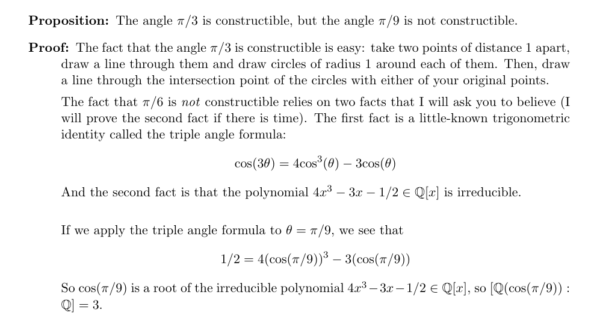
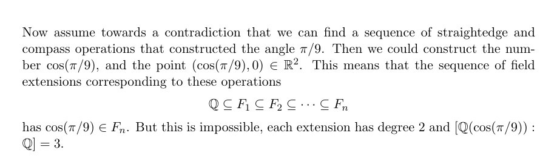

---
tags:
- 复分析
- 647老师
- 抽象代数
---

# 我们为什么需要复数

最近断断续续听了647老师(B站UP我真的不懂分析)的复分析, 受益匪浅. 本系列推文作为笔记, 总结一些我认为复分析中有意思的内容.

## 复数的引入
有人会觉得, 我们是为了解方程
$$
x^2=-1
$$
才引入复数
$$
i=\sqrt{-1}
$$
但是这个说法本身就很不合理: **我们为什么要去解一个根本不存在的东西? 实际的意义是什么?**

负数的引入在当初都引发了巨大的争议, $\sqrt{-1}$这样一个"Imaginary"的数, 如果没有十足的动力和广泛的应用是断然不会被广泛接受的. 

此外这个说法和历史上复数的真实来历也有出入.

真实的历史情景是, 我们想要某些三次方程, 但是我们无法用实数的代数组合表示这个三次方程的解.

举例来说, 我们知道倍角公式：
$$
\cos\theta=4\cos^3\frac{\theta}{3}−3\cos\frac{\theta}{3}
$$
那么如果我们想求(这是非常有用的)：
$$
\cos 20^o
$$
只需要解三次方程：
$$
\frac{1}{2}=4x^3-3x
$$
也就是：
$$
8x^3-6x-1=0
$$
这是一个缺项的三次方程, 我们可以通过一些技巧写出解析解.

### 卡尔丹诺公式（Cardano's formula）

对于缺项三次方程：
$$
x^3+px+q=0
$$
做换元：
$$
\begin{aligned}
p &= -3mn\\\\
q &=-(m^3+n^3)
\end{aligned}
$$
其中$m$和$n$的地位等同，不妨假设$m>n$。

!!! question "为什么要做这样的换元？？"
    我们的目的是为了让原方程的其中一个根变得容易求解！！
    我们假设$x=m+n$是原方程的一个根：
    $$
    (m+n)^3+p(m+n)+q=0
    $$
    稍加整理得到：
    $$
    (m^3+n^3+q) + (m+n)(3mn+p)=0
    $$
    那么只要
    $$
    \begin{aligned}
    p &= -3mn\\\\
    q &=-(m^3+n^3)
    \end{aligned}
    $$
    即可满足我们的假设。

稍加整理得到：
$$
\begin{aligned}
m^3n^3&={\left(-\frac{p}{3}\right)}^3\\\\
m^3+n^3&=-1
\end{aligned}
$$
根据韦达定理，$m^3$和$n^3$是下述方程的两个根：
$$
t^2+qt+{\left(-\frac{p}{3}\right)}^3=0
$$
进而可以使用求根公式得到：
$$
\begin{aligned}
m^3 &= \frac{-q+\sqrt{q^2-4{\left(-\frac{p}{3}\right)}^3}}{2}\\\\
&=-\frac{q}{2}+\sqrt{{\left(\frac{q}{2}\right)}^2+{\left(\frac{p}{3}\right)}^3}\\\\
\\\\
n^3 &= \frac{-q-\sqrt{q^2-4{\left(-\frac{p}{3}\right)}^3}}{2}\\\\
&=-\frac{q}{2}-\sqrt{{\left(\frac{q}{2}\right)}^2+{\left(\frac{p}{3}\right)}^3}\\\\
\end{aligned}
$$
也就是
$$
\begin{aligned}
m &=\sqrt[3]{\frac{q}{2}+\sqrt{{\left(\frac{q}{2}\right)}^2+{\left(\frac{p}{3}\right)}^3}}\\\\
\\\\
n &=\sqrt[3]{-\frac{q}{2}-\sqrt{{\left(\frac{q}{2}\right)}^2+{\left(\frac{p}{3}\right)}^3}}\\\\
\end{aligned}
$$
记：
$$
\Delta = {\left(\frac{q}{2}\right)}^2+{\left(\frac{p}{3}\right)}^3
$$
那么
$$
\begin{aligned}
m &=\sqrt[3]{-\frac{q}{2}+\sqrt{\Delta}}\\\\
\\\\
n &=\sqrt[3]{-\frac{q}{2}-\sqrt{\Delta}}\\\\
\end{aligned}
$$
回到最初换元之后的方程：
$$
x^3-3mnx-(m^3+n^3)=0
$$
那么根据方程已有的有一个根：
$$
x=m+n
$$
可以做出如下的因式分解：
$$
\left[x-(m+n)\right]\left[x^2+(m+n)x+m^2-mn+n^2\right]=0
$$
于是方程的三个根为：
$$
x_1 = m+n
$$
和
$$
x_{2,3} = \frac{-(m+n)\pm \sqrt{-3(m-n)^2}}{2}
$$
这里面就出现了$i=\sqrt{-1}$这样的虚数，我们先暂时接受他，写成：
$$
\begin{aligned}
x_{2,3} &= \frac{-(m+n)\pm (m-n)\sqrt{3}i}{2}\\\\
&=\frac{-1\pm\sqrt{3}i}{2}m+\frac{-1\mp \sqrt{3}i}{2}n
\end{aligned}
$$
记：
$$
\omega =\frac{-1+\sqrt{3}i}{2}
$$
那么
$$
x_2 = \omega m+ \bar \omega n
$$
$$
x_3 = \bar\omega m+ \omega n
$$
综上所述，原方程
$$
x^3+px+qx=0
$$
的解为：
$$
\begin{aligned}
x_1 =&\sqrt[3]{-\frac{q}{2}+\sqrt{{\left(\frac{q}{2}\right)}^2+{\left(\frac{p}{3}\right)}^3}}\\\\
&+\sqrt[3]{-\frac{q}{2}-\sqrt{{\left(\frac{q}{2}\right)}^2+{\left(\frac{p}{3}\right)}^3}}
\end{aligned}
$$
$$
\begin{aligned}
x_2  = & \frac{-1+\sqrt{3}i}{2} \sqrt[3]{-\frac{q}{2}+\sqrt{{\left(\frac{q}{2}\right)}^2+{\left(\frac{p}{3}\right)}^3}}\\\\
&+ \frac{-1-\sqrt{3}i}{2}\sqrt[3]{-\frac{q}{2}-\sqrt{{\left(\frac{q}{2}\right)}^2+{\left(\frac{p}{3}\right)}^3}}
\end{aligned}
$$
$$
\begin{aligned}
x_3 =& \frac{-1-\sqrt{3}i}{2}\sqrt[3]{-\frac{q}{2}+\sqrt{{\left(\frac{q}{2}\right)}^2+{\left(\frac{p}{3}\right)}^3}} \\\\
&+\frac{-1+\sqrt{3}i}{2} \sqrt[3]{-\frac{q}{2}-\sqrt{{\left(\frac{q}{2}\right)}^2+{\left(\frac{p}{3}\right)}^3}}
\end{aligned}
$$
## 不规矩数

回到我们最开始的问题：
$$
\cos 20^o
$$
也就是解方程：
$$
x^3-\frac{3}{4}x-\frac{1}{8}=0
$$
把
$$
\begin{aligned}
p&=-\frac{3}{4}\\\\
q&=-\frac{1}{8}
\end{aligned}
$$
带入卡尔丹诺公式得到：
$$
\Delta ={\left(\frac{q}{2}\right)}^2+{\left(\frac{p}{3}\right)}^3=\frac{-3}{256}
$$
所以：
$$
m=\sqrt[3]{-\frac{q}{2}+\sqrt{\Delta}}=\sqrt[3]{\frac{1}{16}+\frac{\sqrt{3}i}{16}}
$$
$$
n=\sqrt[3]{-\frac{q}{2}-\sqrt{\Delta}}=\sqrt[3]{\frac{1}{16}-\frac{\sqrt{3}i}{16}}
$$
也即是
$$
m=\frac{1}{2}\sqrt[3]{\frac{1+\sqrt{3}i}{2}}
$$
$$
n=\frac{1}{2}\sqrt[3]{\frac{1-\sqrt{3}i}{2}}
$$
所以原方程的解为：
$$
x_1 = m+n
$$
$$
x_2 = \omega m+ \bar \omega n
$$
$$
x_3 = \bar\omega m+ \omega n
$$
事实上，第一个根就是我们要的（后面两个则是$\cos 140^o$和$\cos 260^o$）：
$$
\cos 20^o =\frac{1}{2}\left(\sqrt[3]{\frac{1+\sqrt{3}i}{2}}+\sqrt[3]{\frac{1-\sqrt{3}i}{2}}\right)
$$
在python中很容易就可以检验这个答案：

```python
from math import sqrt,cos,pi

w = (1+sqrt(3)*1j)/2
print(w**(1/3)/2+w.conjugate()**(1/3)/2)
# 输出(0.9396926207859084+0j)

print(cos(pi/9))
# 0.9396926207859084
```

## 为什么？

这大概是一个代数练习题。

我在网上找到了一份多伦多大学的Geoffrey Scott同学写的[代数笔记](https://www.math.toronto.edu/gscott/oct28_2015.pdf)，相关部分截图如下：





这里面**constructible**就是**规矩的**的意思。笔记证明了，$\cos(\pi/9)$这个数是不可以尺规作图的。这也就证明了，这个数不能在实数范围内用有限次的加减乘除开方表示。

证明的方法是：

1. 说明规矩数都属于有理数的某个代数扩域$F_n$
2. 说明上述的扩域$F_n$的次数是2
3. 说明扩域$\mathbb{Q}[\cos 20^o]$的次数是3
4. 从而说明了$\cos 20^o$不是规矩数
