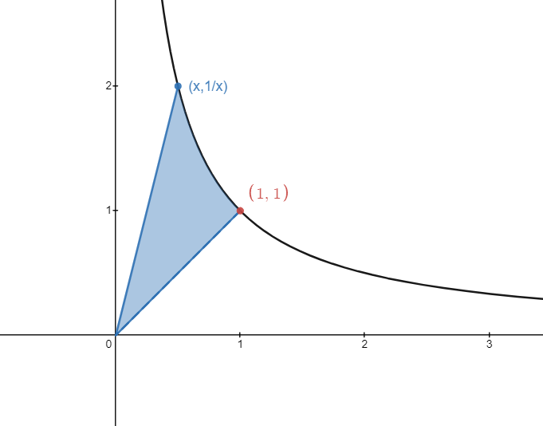
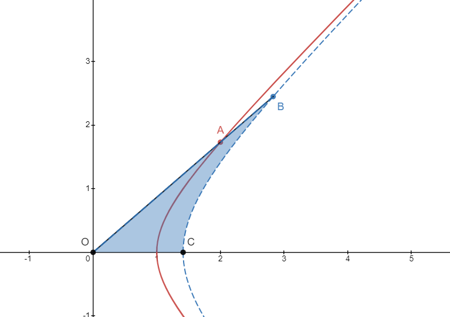
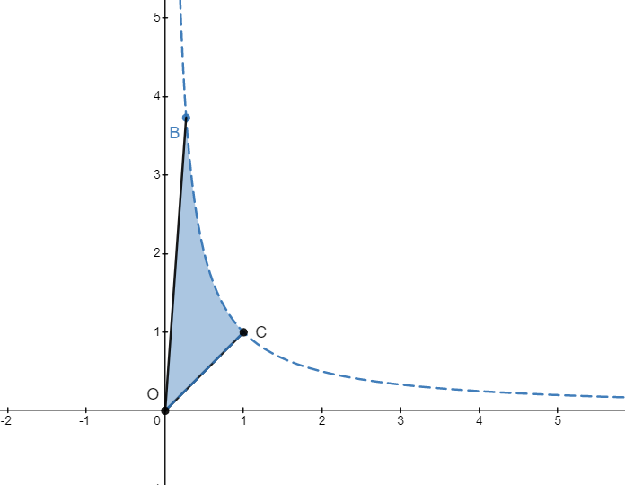
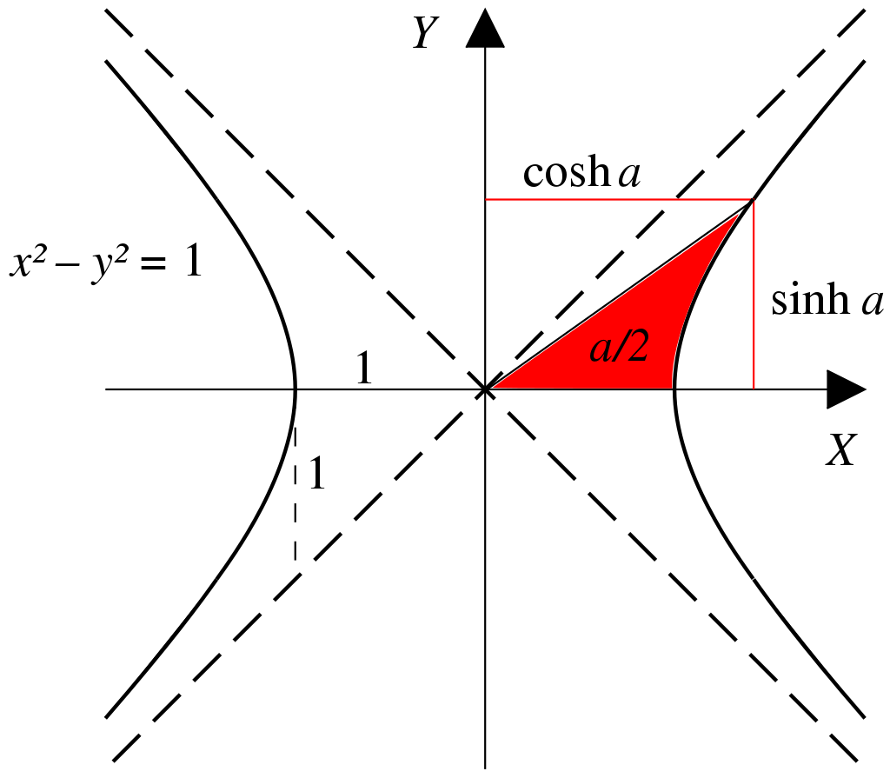

---
tags:
- 数学分析
---
## 类比着来定义

双曲函数（Hyperbolic Functions），其中的双曲意为**双曲线**（Hyperbola），这个概念相对于**圆**函数（也就是我们熟知的三角函数）。

众所周知任意角的三角函数定义在一个**单位圆**之上，那么类似的双曲函数定义在一个**单位等轴双曲线**上。

或者换个视角来说，圆有三角函数形式的参数方程，而双曲线有双曲函数形式的参数方程。

### 单位圆的参数方程

$$
\begin{aligned}
&x^2+y^2=1\\
&\Rightarrow\\
&\theta \in [0,2\pi]\\
&x=\cos \theta\\
&y=\sin \theta
\end{aligned}
$$

其中参数$\theta$ 称为圆角，它有很直观的几何定义：在弧度制下恰为旋转角的大小。

### 双曲线（右半支）的参数方程

$$
\begin{aligned}
&x^2-y^2=1\quad (x>0)\\
&\Rightarrow\\
&\alpha \in [-\infty,+\infty]\\
&x=\cosh \alpha\\
&y=\sinh \alpha
\end{aligned}
$$

其中参数$\alpha$ 称为双曲角，注意到它的取值范围可以到正负无穷，它的量级定义为**某个双曲扇形的面积**（至于为什么这么定义就得去问约翰·海因里希·兰伯特了，后续我们会看到事实上这样定义出来的双曲函数非常工整）。

注：$\sinh$有的时候也写成$\mathrm{sh}$，其中的$h$都是源自双曲线的英文$\mathrm{Hyperbola}$

### 双曲角

下图黑色的曲线为$xy=1$，双曲扇形的三个顶点为$(x,1/x),(1,1),(0,0)$，那么很容易可以计算蓝色阴影区域的面积为$-\ln x$，也就是说图中的双曲角大小为$-\ln x$

<figure markdown>
{width=500}
</figure>

注意，我们定义的双曲角是有正负的，当$x>1$的时候认为双曲角是负的，所以当$x>1$时双曲角大小仍然是$-\ln x$。

### 代数结果

我们更经常看见下面的结果
$$
\cosh x = \frac{e^x+e^{-x}}{2}
$$
接下来我们来证明在上述双曲角的定义下确实有这样的关系。

图中红色曲线为$x^2-y^2=1$，蓝色曲线为$x^2-y^2=2$，设$A=(t,\sqrt{t^2-1})$，可求$B=(\sqrt{2}t,\sqrt{2t^2-2})$。

那么蓝色阴影区域就是双曲$\angle AOC$ 的大小。
<figure markdown>
{width=500}
</figure>
这是因为$x^2-y^2=2$逆时针旋转$\pi/4$之后恰好就是$xy=1$：
<figure markdown>
{width=500}
</figure>

这样一来按照定义双曲角的大小就是
$$
\alpha = -\ln x_B
$$
其中$x_B$是旋转后图中B的横坐标，也就是原图中$\vec{OB}=(\sqrt{2}t,\sqrt{2t^2-2})$在$y=-x$上投影的长度，可以求得
$$
\alpha = - \ln [\frac{\sqrt 2}{2}(\sqrt2 t - \sqrt{2t^2-2})]
$$
也就是
$$
t-\sqrt{t^2-1}=e^{-\alpha}
$$
那么反解$t$得到
$$
t=\frac{e^{\alpha}+e^{-\alpha}}{2}=\cosh \alpha
$$
至此我们就导出了常见的双曲函数形式。

### 参数方程的图示

注意到$x^2-y^2=1$可以由$x^2-y^2=2$横向、纵向分别压缩$\sqrt{2}$得到，也就是说图中红色区域的面积应该恰是双曲角大小的一半。

<figure markdown>
{width=400}
<figcaption>(图源 WIKI)</figcaption>
</figure>

由此可以得出一个重要的面积公式：
$$
\begin{aligned}
&\int_1^{t} \sqrt{x^2-1} \ \mathrm{d}x\\\\
=& \frac{1}{2}t\sqrt{t^2-1}-\frac{1}{2}\alpha
\end{aligned}
$$
其中第一个等式中的$\alpha$ 就是$(t,\sqrt{t^2-1})$这一点的双曲角，后面我们会进一步求得具体的值。

## 双曲函数的性质

利用前面求得的代数结果，我们来推导一系列常见的双曲函数性质。

### 一堆函数

已经证明了

- 双曲余弦

$$
\cosh x=\frac{e^x+e^{-x}}{2}
$$
那么根据定义
$$
\cosh^2 x-\sinh^2x=1
$$
可以求得。

- 双曲正弦
$$
\sinh x=\frac{e^x-e^{-x}}{2}
$$
类似三角函数，我们也定义

- 双曲正切
$$
\tanh x = \frac{\sinh x}{\cosh x}=\frac{e^x-e^{-x}}{e^x+e^{-x}}
$$
- 双曲余切（$x\ne0$）
$$
\mathrm{coth}{x}=1/\tanh{x}
$$
- 双曲正割
$$
\mathrm{sech} x = 1/\cosh x
$$
- 双曲余割
$$
\mathrm{csch} x=1/\sinh x
$$
### 初等性质

- 单调性

$\sinh x$在$R$上单调增

$\cosh x$在负半轴单调减，在正半轴单调增

$\tanh x$在$R/\{0\}$上单调增

- 奇偶性

显然$\cosh x$是偶函数，$\sinh x$是奇函数，$\tanh x$是奇函数。

- 和三角函数的联系

看到$e^x$我们不免想到欧拉公式，如果带入$\cosh ix$就有
$$
\begin{aligned}
&\cosh ix \\\\
=&\frac{1}{2}(e^{ix}+e^{-ix})\\\\
=&\frac{1}{2}(\cos x+i\sin x+\cos x-i\sin x)\\\\
=&\cos x
\end{aligned}
$$
可见双曲函数和三角函数在复平面上仅仅差一个正交旋转（逆时针$\pi/4$）。

类似的
$$
\sinh ix=i\sin(x)
$$

$$
\tanh ix=i\tan x
$$

- 双曲三角恒等式

$$
\cosh^2x-\sinh^2x=1
$$

根据代数形式，很容易验证

- 加法公式

$$
\cosh(x+y)=\cosh x\cosh y+\sinh x\sinh y
$$

$$
\sinh (x+y)=\sinh x\cosh y+\cosh x\sinh y
$$

$$
\tanh (x+y)=\frac{\tanh x+\tanh y}{1+\tanh x\tanh y}
$$

- 倍角公式

$$
\cosh 2x=\cosh^2x+\sinh^2x
$$

$$
\sinh 2x=2\sinh x\cosh x
$$

- 半角公式

$$
\cosh^2x=\frac{\cosh x+1}{2}
$$

$$
\sinh^2x = \frac{\cosh x-1}{2}
$$

### 反函数

这部分我们来求反函数，也就是给定双曲函数值求双曲角的大小。

设
$$
x=\cosh y \ge 1
$$
那么
$$
e^y+\frac{1}{e^y}-2x=0
$$
可以反解$y$得到
$$
e^y={x\pm\sqrt{x^2-1}}
$$
舍去一根（因为$\cosh x$不是单调函数，我们取正半轴这一单调区间做反函数，为了使$x\to +\infty$时$y\to +\infty$），得到
$$
y=\ln(x+\sqrt{x^2-1})
$$
由此我们得到了

- 反双曲余弦（$x\ge 1$）
$$
\cosh^{-1}x = \ln(x+\sqrt x^2-1)
$$
类似的，有

- 反双曲正弦
$$
\sinh^{-1}x=\ln(x+\sqrt x^2+1)
$$
- 反双曲正切

$$
\tanh^{-1}x=\frac{1}{2}\ln\left(\frac{1+x}{1-x}\right)
$$
- 面积公式

这时候我们就可以解决前面遗留的问题了
$$
\begin{aligned}
&\int_1^{t} \sqrt{x^2-1} \ \mathrm{d}x\\\\
=& \frac{1}{2}t\sqrt{t^2-1}-\frac{1}{2}\alpha\\\\
=&\frac{1}{2}t\sqrt{t^2-1}-\frac{1}{2}\cosh^{-1}t\\\\
=&\frac{1}{2}t\sqrt{t^2-1}-\frac{1}{2}\ln(t+\sqrt{t^2-1})
\end{aligned}
$$
如果不从几何意义的角度来看，这个问题也可以使用三角换元/双曲换元来处理，都可以导出等价的结果。

### 求导

- 双曲函数的导数
$$
\frac{d}{dx}\cosh x=\sinh x
$$
$$
\frac{d}{dx}\sinh x=\cosh x
$$
$$
\frac{d}{dx}\tanh x=\mathrm{sech}^2x
$$
- 反双曲函数的导数
$$
\frac{d}{dx}\cosh^{-1} x=\frac{1}{\sqrt{x^2-1}}
$$
$$
\frac{d}{dx}\sinh^{-1} x=\frac{1}{\sqrt{x^2+1}}
$$
$$
\frac{d}{dx}\tanh^{-1} x=\frac{1}{1-x^2}
$$
### 积分

- 从上述三个导数，我们也可以看到几个**重要的积分公式**：

$$
\int\frac{1}{\sqrt{x^2-1}}dx=\cosh^{-1}x+C
$$

$$
\int\frac{1}{\sqrt{x^2+1}}dx=\sinh^{-1}x+C
$$

$$
\int\frac{1}{1-x^2}dx=\tanh^{-1}x+C
$$

这三个公式和反三角函数那里的结论高度重合，实际上可以看作是一种**复换元**：
$$
\begin{aligned}
&\int\frac{1}{1-x^2}dx\\\\
(x=it)=&\int \frac{i}{1+t^2}dt\\\\
=&i\arctan t+C\\\\
=&i\arctan (-ix)+C
\end{aligned}
$$
而我们知道
$$
\begin{aligned}
&\tanh ix = i\tan x\\\\
\Rightarrow\quad&-i\tanh ix = \tan x\\\\
\Rightarrow\quad&\arctan (-i\tanh ix) = x\\\\
\Rightarrow\quad&\arctan(i\tanh x)=ix\\\\
\Rightarrow\quad&\arctan(ix)=i\tanh^{-1}x
\end{aligned}
$$
也就是说
$$
\arctan (-ix)=-i\tanh^{-1} x
$$
回代得到
$$
\begin{aligned}
&\int\frac{1}{1-x^2}dx\\\\
(x=it)=&\int \frac{i}{1+t^2}dt\\\\
=&i\arctan t+C\\\\
=&i\arctan (-ix)+C\\\\
=&\tanh^{-1}x+C
\end{aligned}
$$
虽然看起来很麻烦，但是背后的思想很深刻。

- 双曲函数自身的积分
$$
\begin{aligned}
&\int \sinh cx\mathrm{~d}x=\frac{1}{c} \cosh c x+C \\\\
&\int \cosh c x \mathrm{~d} x=\frac{1}{c} \sinh c x+C \\\\
&\int \tanh c x \mathrm{~d} x=\frac{1}{c} \ln(\cosh cx)+C \\\\
&\int \operatorname{coth} c x \mathrm{~d} x=\frac{1}{c} \ln|\sinh cx|+C \\\\
&\int \operatorname{sech} c x \mathrm{~d} x=\frac{1}{c} \arctan (\sinh c x)+C \\\\
&\int \operatorname{csch} c x \mathrm{~d} x=\frac{1}{c} \ln \left|\tanh \frac{c x}{2}\right|+C
\end{aligned}
$$
### 泰勒级数
- 常见

$$
\begin{aligned}
&\sinh x=x+\frac{x^{3}}{3 !}+\frac{x^{5}}{5 !}+\frac{x^{7}}{7 !}+\cdots=\sum_{n=0}^{\infty} \frac{x^{2 n+1}}{(2 n+1) !} \\\\
&\cosh x=1+\frac{x^{2}}{2 !}+\frac{x^{4}}{4 !}+\frac{x^{6}}{6 !}+\cdots=\sum_{n=0}^{\infty} \frac{x^{2 n}}{(2 n) !} \\\\
&\tanh x=x-\frac{x^{3}}{3}+\frac{2 x^{5}}{15}-\frac{17 x^{7}}{315}+\cdots=\sum_{n=1}^{\infty} \frac{2^{2 n}\left(2^{2 n}-1\right) B_{2 n} x^{2 n-1}}{(2 n) !},|x|<\frac{\pi}{2} \\\\
\end{aligned}
$$
- 不常见

$$
\begin{aligned}
\operatorname{coth} x&=\frac{1}{x}+\frac{x}{3}-\frac{x^{3}}{45}+\frac{2 x^{5}}{945}+\cdots\\\\
&=\frac{1}{x}+\sum_{n=1}^{\infty} \frac{2^{2 n} B_{2 n} x^{2 n-1}}{(2 n) !}, 0<|x|<\pi\text { (洛朗级数) } \\\\
\operatorname{sech} x&=1-\frac{x^{2}}{2}+\frac{5 x^{4}}{24}-\frac{61 x^{6}}{720}+\cdots\\\\
&=\sum_{n=0}^{\infty} \frac{E_{2 n} x^{2 n}}{(2 n) !},|x|<\frac{\pi}{2} \\\\
\operatorname{csch} x&=\frac{1}{x}-\frac{x}{6}+\frac{7 x^{3}}{360}-\frac{31 x^{5}}{15120}+\cdots\\\\
&=\frac{1}{x}+\sum_{n=1}^{\infty} \frac{2\left(1-2^{2 n-1}\right) B_{2 n} x^{2 n-1}}{(2 n) !}, 0<|x|<\pi \text { (洛朗级数) }
\end{aligned}
$$
其中洛朗级数是复分析的内容，$B_n$是伯努利数，$E_n$是欧拉数。

## 总结

双曲函数和三角函数一样也是非常使用的一类函数，尤其微积分运算中，作为三角换元的一个补充，双曲函数换元可以让我们处理更多的积分情况。

例如
$$
\int \sqrt{x^2-1} \ \mathrm{d}x\\\\
$$
如果用常规的三角换元
$$
x=\csc \alpha
$$
处理起来就很麻烦。

更自然地是用双曲函数换元
$$
x=\cosh \theta
$$
那么就转化为
$$
\int \sinh^2 \theta \ d\theta
$$
进而使用二倍角公式等，可以很容易求得结果，过程列在下面
$$
\begin{aligned}
&\int\sqrt{x^2-1}dx\\\\
=&\int \sinh^2\theta \ d\theta\\\\
=&\frac{1}{2}\int (\cosh 2\theta-1) \ d\theta\\\\
=&\frac{1}{4}\sinh 2\theta-\frac{1}{2}\theta+C
\end{aligned}
$$
最后回代的时候注意
$$
\theta = \cosh^{-1}x
$$
一般人不知道这个，需要写成
$$
\theta=\ln(x+\sqrt{x^2-1})
$$
也就是
$$
\begin{aligned}
&\int \sqrt{x^2-1} \ dx\\\\
=&\frac{x\sqrt{x^2-1}}{2}-\frac{1}{2}\ln(x+\sqrt{x^2-1})+C
\end{aligned}
$$
