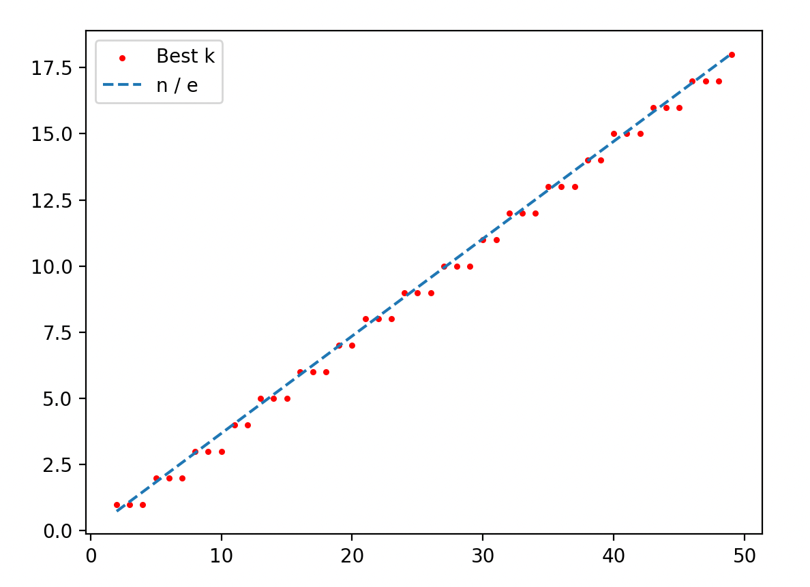

---
tags:
- 概率论
include:
- math
---

# 秘书问题

!!! quote "Wikipedia: [秘书问题](https://zh.wikipedia.org/wiki/%E7%A7%98%E6%9B%B8%E5%95%8F%E9%A1%8C)"
    在几率及赛局理论上，秘书问题（Secretary problem），类似的名称有37%法则、麦穗理论、相亲问题、止步问题、见好就收问题、苏丹的嫁妆问题、挑剔的求婚者问题等，属于最佳停止问题。

内容是这样的：要聘请一名秘书，有 n 个应聘者。每次面试一人，面试后就要立即决定是否聘他，如果当下决定不聘他，他便不会回来。面试后总能清楚了解应聘者的合适程度，并能和之前的每个人做比较。

问什么样的策略，才使最佳人选被选中的概率最大。

## 策略

我们的策略设计为：

- 对于前$k$个应聘者，我们全都不聘用。
- 在那之后，只要遇到一个比前$k$个人都合适的应聘者，就聘用他。
- 当然如果一直遇不到，就只能聘用最后一个人了。

## 概率

假设$n$名应聘者，合适程度可以严格排序：
$$
1,2,3,\cdots, n
$$

他们来面试的顺序是一个1~n的一个排列。

设我们的策略下，选到最佳人选的事件是$A$，最佳人选是第$X$个面试者，那么有**全概率公式**：

$$
P_k(A) = \sum_{i=1}^{n}P_k(A\mid X=i)P(X=i) = \frac{1}{n}\sum_{i=1}^{n}P_k(A\mid X=i)
$$

如果$i\le k$，显然：
$$
P(A\mid X=i)=0
$$

如果$i\gt k$，那么：
$$
P(A\mid X=i)=P(\text{前i-1个人中的最佳人选在前k个})=\frac{k}{i-1}
$$

所以：
$$
\begin{aligned}
&P_k(A) \\\\
=& \frac{k}{n} \sum_{i=k+1}^n \frac{1}{i-1} \\\\
=& \frac{k}{n} \sum_{i=k}^{n-1} \frac{1}{i} \\\\
\approx& \frac{k}{n} \int_k^{n-1} \frac{1}{x}dx \\\\
=& \frac{k}{n}\ln(\frac{n-1}{k})\\\\
\approx& \frac{k}{n}\ln(\frac{n}{k})
\end{aligned}
$$

考虑函数：
$$
f(x) = -x\ln x
$$
有：
$$
f'(x) = -1-\ln x
$$
显然$f(x)$在$x=1/e$处取到最大值。

所以:
$$
\frac{k}{n} \approx \frac{1}{e}
$$
时，选中最佳人选的概率最大。

也就是说，我们的最佳策略是：
$$
k \approx \frac{n}{e} \approx 0.36788 \cdot n
$$

这就是俗称的37%法则。

## 精确解

当然上面的近似看起来也太粗糙了，我们可以用程序求一下精确的最佳策略：

```python
from math import e
import matplotlib.pyplot as plt


def solve(n=10):
    p_max = 0
    best_k = None
    for k in range(1, n):
        p = k / n * sum(1 / i for i in range(k, n))
        if p > p_max:
            best_k = k
            p_max = p
    return best_k


x = [n for n in range(2, 50)]
y = [solve(n) for n in x]
approx = [n / e for n in x]
plt.scatter(x, y, label="Best k", s=5, c="red")
plt.plot(x, approx, label="n / e", linestyle="dashed")
plt.legend()
plt.show()

```

<figure markdown>



</figure>

结果上来看，37%法则还是很准的。
