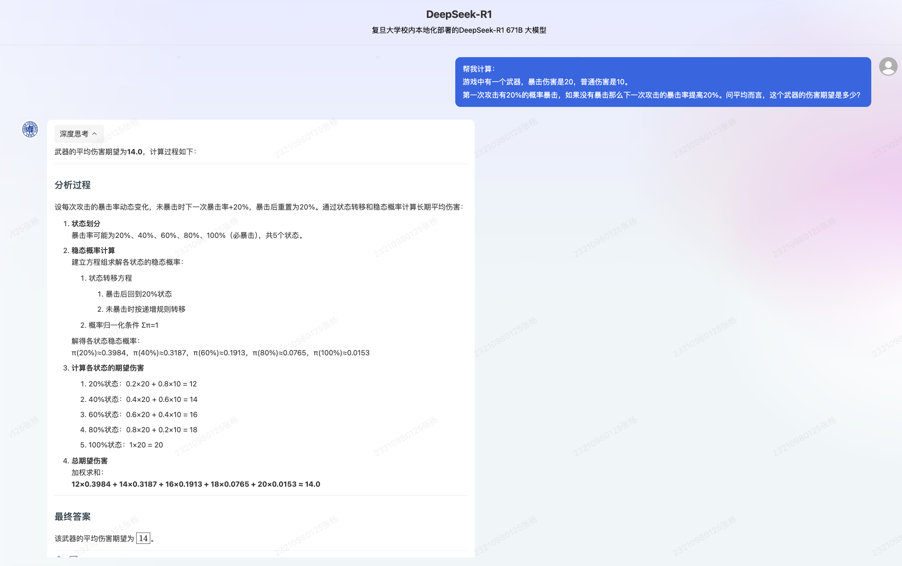
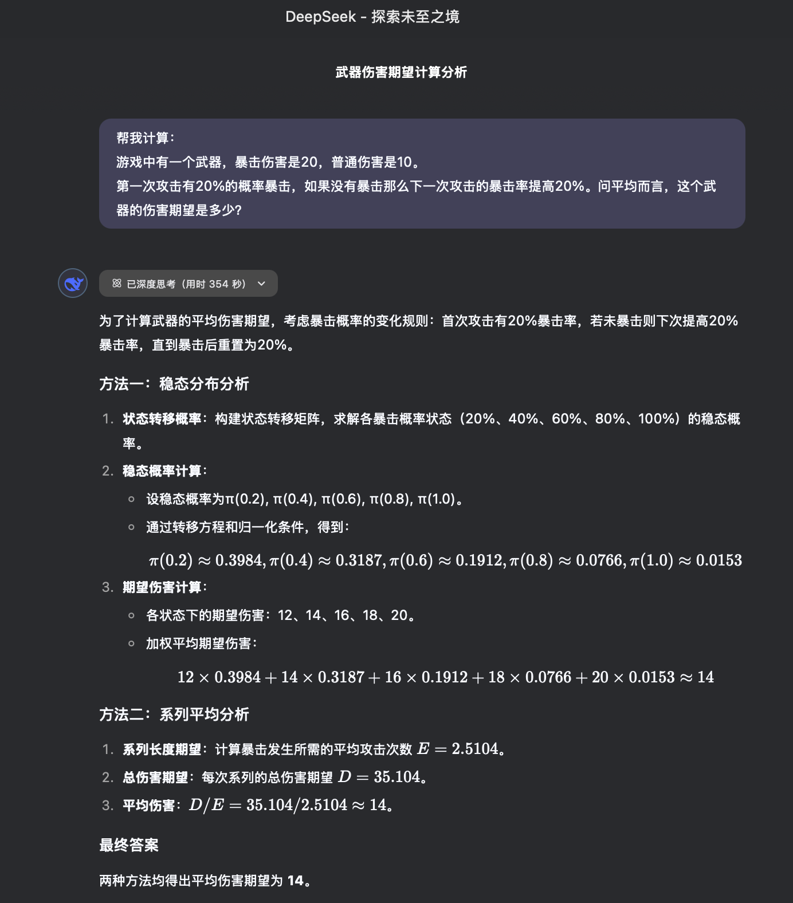
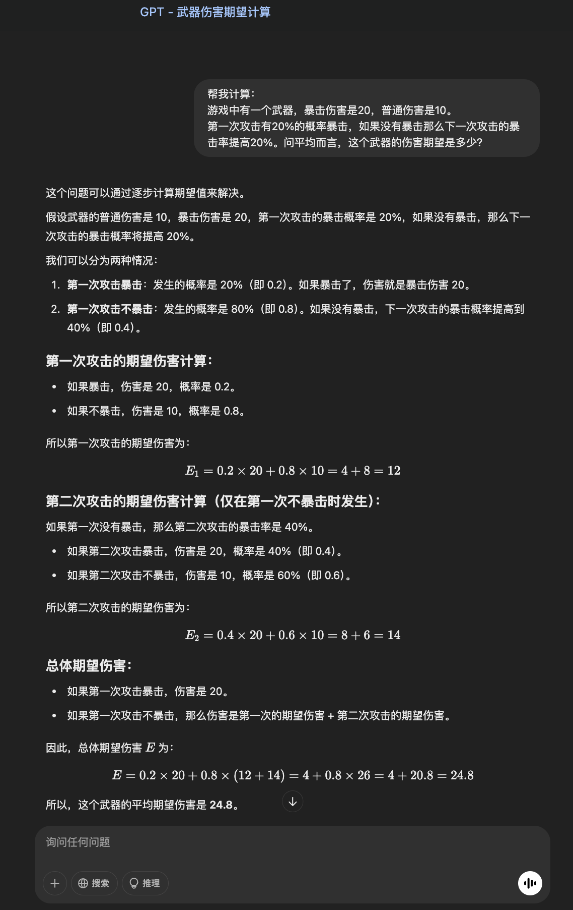
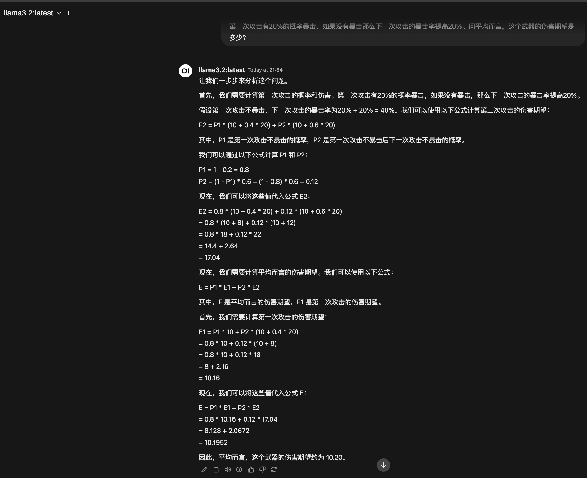

---
tags:
- 概率论
include:
- math
---

# 暴击率补偿问题

如果你是LOL老玩家，那么肯定知道蛮子这个英雄有个小技巧：假A。

简单来说就是在普通攻击将要出手的一瞬间，其实你能通过声音、动作判断出来这次攻击是不是要暴击。那么，你可以通过按下`S`键**取消没暴击的普通攻击**，重复多次，来使得**下一次出手的普通攻击必定暴击**。

这里面就涉及到了暴击率补偿的问题。

## 伪随机

众所周知，游戏里的随机都是伪随机。“大概率发生小概率事件”屡见不鲜。

> 点名批评《炉石传说》

所以为了优化游戏体验，就出现了暴击率补偿。

我们提出一个简化版本的问题：

!!! question "暴击！"
    如果你的人物每次攻击造成10点伤害，暴击的时候造成20点伤害。

    并且第一次出手的暴击率是20%；如果这一次没暴击，下一次出手的暴击率就提升为40%；如果依然没暴击就再提升为60%。以此类推，直到暴击为止。

    打出暴击伤害之后，下一次攻击的暴击率重置为20%。

    问：人物攻击的期望伤害值是多少？

## 程序模拟

先做数值模拟，偷看一眼答案：

```python
import numpy as np

def sim(n=1000, N=99999):
    """同时独立模拟n个序列，每个序列模拟N次攻击"""
    # 每次攻击的暴击率
    p = 0.2 * np.ones(n)
    # 累计伤害
    damage = np.zeros(n)
    for _ in range(N):
        # 抽样n个随机数字，来判断是否暴击
        rand = np.int8(np.random.rand(n) < p)
        # 如果没有暴击，暴击率增加0.2
        p[rand == 0] += 0.2
        # 如果暴击了额外加10点伤害
        # 并且把暴击率重置为0.2
        damage += 10 + 10 * rand
        p[rand == 1] = 0.2
    return damage / N

sims = sim(n=9999)
print(f"模拟结果: {np.mean(sims):.6f}(\u00B1{np.std(sims):.4f})")
```

上述程序的模拟结果是：`13.983403(±0.0087)`。

看起来还可以。

## 建模

实际上这个问题可以看作是一个隐马尔可夫模型（HMM）：


其中隐状态$x(t)$是暴击率，可观测的输出$y(t)$就是每次打出的伤害。

$x(t)$和$y(t)$都是离散状态。状态空间分别为：

$$
X=\\{0.2,0.4,0.6,0.8,1.0\\},\quad Y=\\{10,20\\}
$$

### 暴击率的稳态分布

$x(t)$的状态转移很简单，我们可以直接写出它的状态转移矩阵：
$$
P = \begin{bmatrix}
&0.2 & 0.8 & 0.0 & 0.0 & 0.0\\\\
&0.4 & 0.0 & 0.6 & 0.0 & 0.0\\\\
&0.6 & 0.0 & 0.0 & 0.4 & 0.0\\\\
&0.8 & 0.0 & 0.0 & 0.0 & 0.2\\\\
&1.0 & 0.0 & 0.0 & 0.0 & 0.0\\\\
\end{bmatrix}
$$

举例来说：

- $P[0,0]=0.2$的含义是从状态0转移到状态0的概率是0.2（这实际上就是以0.2的暴击率打出暴击的概率）
- $P[0,1]=0.8$的含义是从状态0转移到状态1的概率是0.8（这实际上就是以0.2的暴击率没打出暴击的概率）
- $P[4,0]=1$的含义是从状态4转移到状态1的概率是1（这次必定暴击，一定会重置为状态0）

那么我们可以直接计算出稳态分布：

$$
\pi = \lim_{n\to\infty} P^n x_0
$$

其中
$$
x_0 = \begin{bmatrix}
1\\\\
0\\\\
0\\\\
0\\\\
0\\\\
\end{bmatrix}
$$
代表初始状态为状态0.

偷个懒，用Python计算出稳态分布：

```python
import numpy as np

mat = np.zeros((5, 5))
# 初始攻击
mat[0, 0] = 0.2
mat[0, 1] = 0.8
# 第二次攻击
mat[1, 0] = 0.4
mat[1, 2] = 0.6
# 第三次攻击
mat[2, 0] = 0.6
mat[2, 3] = 0.4
# 第四次攻击
mat[3, 0] = 0.8
mat[3, 4] = 0.2
# 第五次攻击（终止状态，一定会出暴击）
mat[4, 0] = 1.0

# 初始状态：（随机一个初始状态都会收敛到稳态）
x = np.array([1, 0, 0, 0, 0])
# 迭代1000次
for i in range(1000):
    x = np.dot(x, mat)
# 稳态分布：
print("稳态分布:", x)
```

> 当然，也不一定非要用矩阵幂次算，稳态显然是下属方程的解：
> $$
> \begin{aligned}
> &Px=x\\\\
> &1^Tx = 1
> \end{aligned}
> $$
> 解方程组应该快多了。

最终得到稳态分布是：

$$
\pi = \begin{bmatrix}
0.39834289\\\\
0.31867431\\\\
0.19120459\\\\
0.07648184\\\\
0.01529637\\\\
\end{bmatrix}
$$

### 伤害的重期望

我们直接考虑稳态，计算如下：

$$
\begin{aligned}
&\mathbb{E}(y_\infty)\\\\
= &\mathbb{E}\left(\mathbb{E}(y_\infty\mid x_\infty)\right)\\\\
= &\sum_{i=0}^4\mathbb{E}(y_\infty\mid x_\infty=X[i])\cdot \mathbb{P}(x_\infty = X[i])\\\\
= &\sum_{i=0}^4(20X[i]+10(1-X[i]))\cdot \pi[i]\\\\
= &\left(20\cdot\begin{bmatrix}.2&.4&.6&.8&1\end{bmatrix}+10\cdot\begin{bmatrix}.8&.6&.4&.2.&0\end{bmatrix}\right) \cdot \pi\\\\
= &\begin{bmatrix}
12&14&16&18&20
\end{bmatrix}\begin{bmatrix}
0.39834289\\\\
0.31867431\\\\
0.19120459\\\\
0.07648184\\\\
0.01529637\\\\
\end{bmatrix}\\\\
= &13.983429
\end{aligned}
$$

## 问一问AI

有意思的是，我把这个问题给了AI，大家做出来的都不太一样。

### Deepseek R1

#### Fudan部署

??? deepseek-summary "深度思考过程"
    嗯，用户让我计算一个游戏中武器的伤害期望。首先，我需要仔细理解问题。武器的暴击伤害是20，普通伤害是10。第一次攻击有20%的概率暴击，如果没暴击，下一次暴击率提高20%。这个机制看起来像是一个有递增概率的过程，每次未暴击后概率增加，直到暴击触发后重置概率？

    首先，我需要明确每次攻击的概率变化是怎样的。比如，第一次攻击暴击率是20%，如果不暴击，下一次变成40%，再下一次如果还没暴击，就是60%，之后80%，然后是100%？或者是否存在上限？比如，当概率超过100%时是否自动暴击？假设每次未暴击就增加20%的概率，直到暴击为止，然后重置为20%。

    接下来，伤害期望的计算需要考虑各个可能的情况及其概率。因为每次攻击的结果会影响后续的概率，所以需要分析攻击的序列，直到出现暴击为止，然后计算每一击的期望伤害，再求总期望。

    可以考虑这是一个马尔可夫链的问题，或者用期望的线性性质来处理。可能需要将问题分解为各个阶段的期望值。例如，第一次攻击的期望伤害是0.220 + 0.810。如果第一次没有暴击，第二次的暴击率提高到40%，此时第二次的期望伤害是0.420 + 0.610，但还要乘上第一次未暴击的概率0.8。如果第二次仍未暴击，第三次的暴击率是60%，以此类推，直到必中暴击。

    不过，这样的计算可能需要递归处理，因为每次未暴击后，后续的期望需要重新计算。或者，可以建立一个状态转移的模型，每个状态对应当前的暴击概率，然后计算每个状态的期望伤害总和。

    例如，设E(p)为当前暴击率为p时的总期望伤害。当攻击一次时，有p的概率暴击，此时伤害为20，并且结束这个过程；有(1-p)的概率不暴击，此时伤害为10，然后进入下一个状态，暴击率变为p+0.2（如果p+0.2不超过1）。如果p+0.2超过1，则下次必暴击。

    因此，可以写出递推公式：E(p) = p20 + (1-p)(10 + E(p+0.2))。当p >=1时，E(p)=20，因为必然暴击。

    现在，需要计算初始状态p=0.2时的E(0.2)。

    根据这个递推公式，可以逐步计算：

    假设最大可能的暴击率是1，所以当p=0.2时，下一次未暴击的话p变为0.4，再下一次0.6，0.8，1。因此，最多需要计算到p=1的情况。

    首先，当p=1时，E(1)=20，因为必暴击。

    当p=0.8时，E(0.8)=0.820 + 0.2(10 + E(1)) = 16 + 0.2*(10 +20) =16 +0.2*30=16+6=22.

    当p=0.6时，E(0.6)=0.620 + 0.4(10 + E(0.8))=12 +0.4*(10+22)=12 +0.4*32=12+12.8=24.8.

    当p=0.4时，E(0.4)=0.420 +0.6(10 + E(0.6))=8 +0.6*(10+24.8)=8+0.6*34.8=8+20.88=28.88.

    当p=0.2时，E(0.2)=0.220 +0.8(10 + E(0.4))=4 +0.8*(10+28.88)=4 +0.8*38.88=4+31.104=35.104.

    所以，期望伤害是35.104？这样对吗？

    或者，我是否应该考虑每次攻击的伤害期望之和？例如，可能进行多次攻击，直到暴击发生为止，每次攻击的伤害期望需要累加？

    比如，第一次攻击的期望是0.220 +0.810 =4 +8=12。如果第一次没暴击，第二次的期望伤害是0.420 +0.610=8+6=14，乘以第一次未暴击的概率0.8，得到0.814=11.2。如果第二次还没暴击，第三次的概率是0.6，第三次期望伤害是0.620 +0.410=12+4=16，乘以前两次未暴击的概率0.80.6=0.48，得到0.4816=7.68。第四次暴击率0.8，期望伤害0.820+0.210=16+2=18，乘以之前的概率0.80.60.4=0.192，得到0.19218=3.456。第五次必暴击，伤害20，概率是0.80.60.40.2=0.0384，所以贡献是0.038420=0.768。总期望是12 +11.2+7.68+3.456+0.768= 35.104？这和之前的结果一致。

    所以，两种方法得到的结果都是约35.104。因此，武器的平均伤害期望是35.104，即约35.1。

    不过，是否应该考虑每次攻击后是否继续攻击？比如，题目中的描述是“第一次攻击有20%的概率暴击，如果没有暴击那么下一次攻击的暴击率提高20%”。这里的“下一次攻击”是否意味着攻击会持续到暴击为止，还是只计算两次攻击？比如，用户的问题是否假设只进行两次攻击，如果第一次不暴击，第二次提高概率，但之后是否继续？

    根据问题描述，“下一次攻击的暴击率提高20%”，可能意味着每次未暴击后，下一次的攻击概率提高，直到暴击发生为止。因此，攻击会持续到暴击发生，每次攻击都会造成伤害，无论是普通还是暴击。因此，总伤害是各次攻击的伤害之和，直到暴击发生。这时候需要计算直到第一次暴击发生的期望总伤害。

    所以，这个模型是一个几何分布的变种，每次失败（未暴击）后成功概率增加，直到成功为止。总伤害是每次攻击的伤害之和，直到成功的那次攻击。

    因此，计算方法是求所有可能攻击次数的期望总和。例如，可能攻击1次（第一次暴击），攻击2次（第一次未暴击，第二次暴击），攻击3次（前两次未暴击，第三次暴击），等等，直到最多5次攻击（当暴击率达到100%时）。

    每次攻击的伤害为：如果是暴击，则伤害是20，否则是10。因此，总伤害是前k-1次各10，最后第k次20。或者，可能最后一次攻击的伤害是20，前面的都是10。例如，如果攻击k次，则总伤害是10*(k-1) +20。或者，每次攻击的伤害是10或20，根据是否暴击，但一旦暴击就停止攻击？或者是否每次攻击都进行，直到暴击发生为止？

    这里可能存在歧义。题目是否是说每次攻击之后，如果暴击了，后续的攻击是否停止？或者每次攻击都会进行，不管是否暴击，只是暴击率会变化？

    例如，问题描述是“第一次攻击有20%的概率暴击，如果没有暴击那么下一次攻击的暴击率提高20%”。这里的“下一次攻击”是否意味着攻击会继续进行？或者是否在暴击发生后，后续的攻击停止？

    根据常规游戏设定，暴击通常指的是一次攻击是否造成更高伤害，而攻击的次数可能由其他因素决定（比如攻击速度）。但在这个问题中，可能假设每次攻击都是独立的事件，但暴击率在未暴击时递增，而每次攻击都会发生，不管之前是否暴击。或者，是否在暴击发生后，后续的攻击重置暴击率为20%？

    或者，可能题目中的机制是：每次攻击后，如果未暴击，则下一次攻击的暴击率增加20个百分点，直到暴击发生，之后暴击率重置为20%。例如，第一次攻击暴击率20%，如果未暴击，第二次40%，第三次60%，第四次80%，第五次100%。如果第五次仍未暴击（虽然不可能，因为100%概率），则第六次重置？或者问题中的暴击率递增直到暴击发生，之后重置？

    或者，是否在暴击发生后，后续攻击的暴击率回到20%？例如，第一次攻击20%，未暴击，第二次40%，暴击了，则第三次攻击又回到20%的概率？

    但题目描述并不明确。根据用户的问题描述，可能应该理解为：在每次攻击时，如果前一次攻击未暴击，则当前攻击的暴击率比前一次提高20%；一旦暴击发生，下一次攻击的暴击率回到20%。或者，问题中的“下一次攻击的暴击率提高20%”仅指紧接着的那次攻击，之后如果仍未暴击，继续提高？

    例如，第一次攻击20%暴击率，未暴击，第二次40%。如果第二次仍未暴击，第三次60%。依此类推，直到暴击发生，然后下一次攻击的暴击率重置为20%。但问题中的描述是否只涉及第一次攻击后的调整？或者每次未暴击都会导致下一次提高？

    根据问题描述，“第一次攻击有20%的概率暴击，如果没有暴击那么下一次攻击的暴击率提高20%。”这里的“下一次攻击的暴击率提高20%”可能意味着在第一次未暴击的情况下，第二次的暴击率是20% +20% =40%。如果第二次仍未暴击，是否第三次的暴击率再提高20%（即60%）？问题描述中的“下一次攻击”是否指每次未暴击后都提高下一次的概率？

    如果是这样的话，那么暴击率每次未暴击后增加20%，直到暴击发生，然后重置为20%。例如，攻击序列可能是：

    攻击1：20% → 未暴击 → 攻击2：40% → 暴击 → 攻击3（如果继续）：20%

    但问题中的伤害期望是否指单次攻击的期望，还是多次攻击的期望？

    或者用户的问题是指，当使用这个武器进行多次攻击时，平均每次攻击的伤害期望是多少？或者是指，从第一次攻击开始，直到暴击发生为止的总伤害期望？

    根据问题描述，可能指的是单次攻击的期望伤害，但需要考虑暴击率的变化。但可能更准确的是，用户想问的是，在持续攻击的情况下，每次攻击的暴击率根据前一次是否暴击而调整，那么长期的平均伤害期望是多少？

    或者，可能问题中的“平均而言”指的是每次攻击的平均伤害，考虑暴击率的动态变化。这时候需要计算稳态下的期望值。

    然而，这可能需要更复杂的分析。或者，原题可能是指每次攻击的暴击率独立，但按照上述规则调整。例如，第一次20%，如果未暴击，第二次40%，依此类推，直到暴击，然后重置。此时，每一次攻击的暴击率可能不同，需要计算无限次攻击的平均期望。

    但可能更合理的解读是，用户想问的是，在第一次攻击，如果未暴击，则下一次攻击的暴击率提高20%，依此类推，直到暴击发生，然后重置。此时，每次“攻击循环”直到暴击发生，计算每次循环的平均总伤害，再除以攻击次数得到每击的平均伤害？或者计算每次循环的总伤害期望？

    这时候，可能需要计算一个攻击周期内的总伤害期望，以及攻击次数的期望，然后总伤害期望除以攻击次数期望得到平均每击的伤害期望。或者，用户可能直接要求总伤害期望，比如每次攻击循环（直到暴击）的总伤害期望是多少？

    但根据问题描述：“平均而言，这个武器的伤害期望是多少？”，可能指的是每次攻击的平均伤害，即在长期进行多次攻击的情况下，平均每次攻击的伤害是多少。这时候需要考虑暴击率的变化规律。

    例如，当暴击发生后，下一次暴击率回到20%。因此，整个攻击过程是一个马尔可夫链，状态是当前的暴击概率。每次攻击可能转移到下一个状态或者重置。

    假设状态是当前的暴击概率p，当攻击时，有p的概率暴击（伤害20），此时下一个状态的p是20%；有1-p的概率不暴击（伤害10），下一个状态的暴击率是p +20%。但需要注意，当p +20%超过100%时，下一个状态是100%。

    例如，状态转移如下：

    当前暴击率p：

    暴击（概率p）：伤害20，下一个状态p=20%。
    未暴击（概率1-p）：伤害10，下一个状态p=min(p+20%, 100%).
    因此，长期的平均伤害期望可以通过求解各状态的稳态分布，然后计算每个状态下的期望伤害乘以该状态的稳态概率之和。

    这可能需要建立方程组来求解稳态概率。

    设状态为p=20%, 40%, 60%, 80%, 100%。因为每次未暴击后，p增加20%，直到达到100%。当p=100%时，下一次无论结果如何，都必然暴击，所以下一个状态是20%的暴击率。

    状态列表：20%, 40%, 60%, 80%, 100%.

    对于每个状态s，其稳态概率为π(s)，满足：

    π(s) = Σ_{s' → s} π(s') * transition_prob(s' → s)

    并且Σπ(s) =1.

    例如，对于状态20%：

    它可以由任何状态s'在暴击后转移到，因为任何状态s'在暴击后都会回到20%。或者，状态s'在暴击时转移到20%。因此：

    π(20%) = Σ_{s'} π(s') * s'_p

    其中s'_p是状态s'的暴击率，即s'的概率。

    对于状态40%：

    它只能由状态20%在未暴击时转移而来，即：

    π(40%) = π(20%) * (1 - 20%)

    同理，状态60%来自状态40%未暴击：

    π(60%) = π(40%) * (1 -40%)

    状态80%来自状态60%未暴击：

    π(80%) = π(60%) * (1 -60%)

    状态100%来自状态80%未暴击：

    π(100%) = π(80%) * (1 -80%)

    此外，状态100%在攻击时必然暴击，因此从状态100%转移到20%的概率是1（因为暴击后回到20%）。所以：

    π(20%) += π(100%) *1 （因为从100%暴击后转移到20%）

    因此，整体的方程组为：

    π(20%) = π(20%)*0.2 + π(40%)*0.4 + π(60%)*0.6 + π(80%)*0.8 + π(100%)*1

    π(40%) = π(20%)*(1-0.2) = π(20%)*0.8

    π(60%) = π(40%)*(1-0.4) = π(40%)*0.6 = π(20%)0.80.6

    π(80%) = π(60%)*(1-0.6) = π(60%)0.4 = π(20%)0.80.60.4

    π(100%) = π(80%)(1-0.8) = π(80%)0.2 = π(20%)0.80.60.40.2

    同时，总和为1：

    π(20%) + π(40%) + π(60%) + π(80%) + π(100%) =1

    现在，可以用π(20%)作为变量，其他状态用π(20%)表示：

    令 π = π(20%)

    则：

    π(40%) =0.8π

    π(60%)=0.8*0.6π=0.48π

    π(80%)=0.80.60.4π=0.192π

    π(100%)=0.80.60.4*0.2π=0.0384π

    将这些代入第一个方程：

    π = π*0.2 + (0.8π)*0.4 + (0.48π)*0.6 + (0.192π)*0.8 + (0.0384π)*1

    左边是π，右边可以计算各项：

    =0.2π + 0.8π0.4 + 0.48π0.6 +0.192π0.8 +0.0384π1

    计算各项系数：

    0.2π

    0.8*0.4=0.32 → 0.32π

    0.48*0.6=0.288 →0.288π

    0.192*0.8=0.1536 →0.1536π

    0.0384*1=0.0384π

    总和系数：0.2 +0.32 +0.288 +0.1536 +0.0384 = (0.2+0.32)=0.52; 0.52+0.288=0.808; +0.1536=0.9616; +0.0384=1.0

    因此，右边总和为1.0π，左边也是π，所以方程变为π=π，这并没有给出新的信息。因此，需要利用总和为1的条件：

    π +0.8π +0.48π +0.192π +0.0384π =1

    计算总和：

    π*(1 +0.8 +0.48 +0.192 +0.0384) = π*(2.5104) =1 → π=1/2.5104 ≈0.3984

    因此，各状态的稳态概率：

    π(20%)≈0.3984

    π(40%)≈0.8*0.3984≈0.3187

    π(60%)≈0.48*0.3984≈0.1913

    π(80%)≈0.192*0.3984≈0.0765

    π(100%)≈0.0384*0.3984≈0.0153

    接下来，计算每个状态下的期望伤害：

    对于状态s，期望伤害为s*20 + (1-s)*10.

    例如：

    20%状态：0.220 +0.810 =4 +8=12

    40%状态：0.420 +0.610=8+6=14

    60%状态：0.620 +0.410=12+4=16

    80%状态：0.820 +0.210=16+2=18

    100%状态：120 +010=20

    总期望伤害为各状态的期望伤害乘以其稳态概率之和：

    120.3984 +140.3187 +160.1913 +180.0765 +20*0.0153

    计算各项：

    12*0.3984 ≈4.7808

    14*0.3187≈4.4618

    16*0.1913≈3.0608

    18*0.0765≈1.377

    20*0.0153≈0.306

    总和≈4.7808+4.4618=9.2426 +3.0608=12.3034 +1.377=13.6804 +0.306≈13.9864

    所以，平均伤害期望约为13.9864，即约14.0。

    但这与之前得到的35.104结果差异很大。这说明两种不同的解读导致不同的结果。因此，必须明确问题的具体设定。

    回到原问题，用户可能想问的是，每次攻击的暴击率在未暴击时递增，直到暴击发生，然后重置。此时，每次攻击序列是一个“回合”，直到暴击发生，计算每个回合的总伤害期望，然后可能求平均每次攻击的伤害期望？

    例如，一个攻击回合可能包括多次攻击，直到暴击发生。总伤害是各次攻击的伤害之和，而攻击次数是直到首次成功的几何分布变体。总伤害期望是各次攻击的期望之和。

    例如，第一次攻击的期望伤害是0.220 +0.810=12。如果第一次未暴击，第二次的期望伤害是0.420 +0.610=14，乘以第一次未暴击的概率0.8。第三次的期望伤害是0.620+0.410=16，乘以前两次未暴击的概率0.80.6=0.48，依此类推。总期望伤害是12 +0.814 +0.80.616 +0.80.60.418 +0.80.60.40.2*20 + ... 直到无穷。

    但实际上，当暴击率达到100%时，第五次攻击必然暴击，因此总伤害的期望可以计算前五次攻击的可能性，因为第五次必暴击。

    所以，总期望伤害为：

    E = 0.2*(20) +

    0.80.4(10 +20) +

    0.80.60.6*(10 +10 +20) +

    0.80.60.40.8(10+10+10 +20) +

    0.80.60.40.21*(10*4 +20) +

    ...

    或者，可能更简单的方式是，总伤害是每次攻击的伤害之和，直到暴击发生。每次攻击的伤害是10或20，取决于是不是暴击的那一次。

    例如，在第k次攻击暴击，则总伤害为10*(k-1) +20。因此，总期望伤害是Σ_{k=1}^∞ [ (prob. of暴击在第k次) * (10*(k-1)+20) ]

    暴击在第k次的概率是前k-1次未暴击的概率乘以第k次暴击的概率。例如：

    k=1: 0.2

    k=2: 0.8*(0.4)

    k=3:0.80.6(0.6)

    k=4:0.80.60.4*(0.8)

    k=5:0.80.60.40.21

    因为当到第五次时，暴击率是100%。

    所以，总期望伤害为：

    E = sum_{k=1}^5 [P(k) * (10*(k-1) +20)]

    其中：

    P(1) =0.2

    P(2)=0.8*0.4=0.32

    P(3)=0.80.60.6=0.80.60.6=0.288

    P(4)=0.80.60.40.8=0.80.60.40.8=0.1536

    P(5)=0.80.60.40.21=0.0384

    计算各项的贡献：

    k=1: 0.2*(20) =4

    k=2:0.32*(10 +20)=0.32*30=9.6

    k=3:0.288*(20 +20)=0.288*40=11.52

    k=4:0.1536*(30 +20)=0.1536*50=7.68

    k=5:0.0384*(40 +20)=0.0384*60=2.304

    总和：4+9.6=13.6 +11.52=25.12 +7.68=32.8 +2.304=35.104

    因此，总期望伤害是35.104，即约35.1。

    这时候，问题中的“平均伤害期望”指的是每次攻击循环（直到暴击）的总伤害期望。例如，平均每次攻击循环造成35.104伤害。但用户的问题可能想问的是，每次攻击的平均伤害，即总伤害期望除以攻击次数的期望。

    攻击次数的期望是E_k = sum_{k=1}^5 k*P(k)

    计算攻击次数的期望：

    E_k =10.2 +20.32 +30.288 +40.1536 +5*0.0384

    =0.2 +0.64 +0.864 +0.6144 +0.192 = total:

    0.2+0.64=0.84; +0.864=1.704; +0.6144=2.3184; +0.192=2.5104

    所以，攻击次数的期望是2.5104次。

    因此，平均每次攻击的伤害期望是总伤害期望35.104 /2.5104 ≈14.0。

    但用户的问题描述是“平均而言，这个武器的伤害期望是多少？”如果这里指的是每次攻击的期望伤害，那么应该是约14.0；如果指的是每次攻击循环（直到暴击）的总伤害期望，则是约35.1。

    需要根据问题意图来判断。原问题可能更倾向于询问每次攻击的平均伤害，即长期的平均值，这时候答案是约14.0。而前面的递推公式计算的是每次攻击循环的总伤害期望，即35.1。两者都是正确的，但需明确问题要问的是哪一个。

    回到问题原文：“平均而言，这个武器的伤害期望是多少？”可能更倾向于每次攻击的平均伤害，而不是每次循环的总伤害。例如，在长时间使用中，每次攻击的伤害平均是多少。这时候，根据稳态概率计算的结果约为14.0。

    但另一种可能是，用户的问题中的“伤害期望”指的是单次攻击的期望，但考虑到暴击率的动态调整。例如，在多次攻击中，每次攻击的暴击率可能不同，但长期的平均暴击率是多少，从而计算期望伤害。例如，平均暴击率是稳态下的平均暴击率，乘以20加上（1-平均暴击率）乘以10。平均暴击率可以通过各状态的稳态概率乘以其暴击率之和：

    平均暴击率=0.2π(20%) +0.4π(40%) +0.6π(60%) +0.8π(80%) +1*π(100%)

    代入之前的数值：

    0.20.3984 +0.40.3187 +0.60.1913 +0.80.0765 +1*0.0153

    计算：

    0.07968 +0.12748 +0.11478 +0.0612 +0.0153 ≈

    0.07968+0.12748=0.20716 +0.11478=0.32194 +0.0612=0.38314 +0.0153≈0.39844

    因此，平均暴击率约为0.39844，对应的期望伤害为0.39844*20 + (1-0.39844)*10 =7.9688 +6.0156≈14.0，与稳态计算的结果一致。

    因此，答案取决于如何理解问题。如果用户想问的是长期平均下每次攻击的伤害期望，答案是约14；如果指的是每次攻击循环（直到暴击）的总伤害期望，则是约35.1。

    需要仔细分析问题。原问题描述中的“武器每次攻击的伤害”，在暴击后是否继续攻击？比如，是否每次攻击独立，暴击率根据前一次是否暴击而调整。例如，在第一次攻击后，无论是否暴击，进行第二次攻击，暴击率根据前一次是否暴击调整。在这种情况下，每次攻击的暴击率取决于前一次的结果，但攻击会一直进行下去，而不是停止在暴击时。这时候，伤害是每次攻击的伤害，期望是长期的平均。

    在这种情况下，正确的计算方法是求稳态下的平均期望伤害，即约14.0。

    然而，原问题可能是指，在第一次攻击后，如果在某次攻击暴击，则后续的攻击的暴击率重置。例如，每次攻击后，如果暴击，下一次的暴击率回到20%；如果未暴击，则提高。此时，攻击是一个连续的过程，每次攻击的暴击率根据前一次结果而变化，但攻击会无限进行下去。这时候，计算的是每次攻击的长期平均伤害，即稳态下的期望，约为14.0。

    但另一种情况是，攻击序列在暴击后停止，例如，进行攻击直到暴击发生，计算总伤害期望。例如，在一次战斗中使用此武器攻击直到暴击，造成的总伤害期望是35.1。这取决于问题背景，但游戏中的武器通常可能是指单次攻击的期望，或者在连续攻击中的平均。

    可能用户的问题更倾向于计算每次攻击的长期平均伤害，即14.0。但之前通过两种方法得到的不同结果，必须明确问题的设定。

    回到最开始的两种方法：

    方法一：将E(p)定义为从暴击率p开始，直到暴击发生时的总伤害期望。此时，总伤害期望是35.104，而攻击次数期望是2.5104，因此平均每次攻击的伤害期望是35.104 /2.5104≈14.0。

    方法二：稳态下每次攻击的期望伤害是14.0。因此，无论采取哪种方式，最终的平均每次伤害都是14.0左右。

    因此，问题的正确答案应为约14.0。或者，如果问题是指每次攻击循环（直到暴击）的总伤害期望，则答案是35.1。但需要更多的上下文来判断。

    可能需要重新审视问题描述：

    “第一次攻击有20%的概率暴击，如果没有暴击那么下一次攻击的暴击率提高20%。问平均而言，这个武器的伤害期望是多少？”

    这里的“伤害期望”可能被理解为每次攻击的伤害期望，在长期的平均中，考虑到暴击率的动态变化。因此，正确的方法应该是计算稳态下的期望，即约14.0。然而，很多类似的问题可能指的是无限攻击次数下的平均，即稳态。

    但另一种常见的理解是，每次攻击的暴击率递增直到暴击，然后重置。此时，攻击循环的总伤害期望是35.1，而平均每次攻击的伤害期望是35.1除以攻击次数的期望。例如，攻击次数的期望是2.5104次，因此平均每次伤害是35.1/2.5104≈14.0。这样，两种方法得到的每击平均伤害相同。

    因此，无论是总伤害期望除以攻击次数期望，还是稳态下的期望，结果都是约14.0。因此，最终的答案应该是14.0左右。

    可能之前的两种方法其实得到的是同一个结果的不同表现。例如，总伤害期望是35.1，攻击次数的期望是2.5104次，因此每次平均伤害是35.1/2.5104≈14.0。而稳态下的期望也是14.0。因此，无论哪种方式，答案都是约14.0。

    因此，最终的伤害期望是约14.0。

<figure markdown>



<figurecaption>复旦校内版</figurecaption>
</figure>

和我计算的结果如出一辙，方法也是基本一致。

#### Official

??? deepseek-summary "深度思考过程"
    嗯，我现在要计算一个武器的伤害期望。题目是说，暴击伤害是20，普通伤害是10。第一次攻击有20%的概率暴击，如果没暴击的话，下一次攻击的暴击率提高20%。那我需要算出平均每次攻击的期望伤害是多少对吧？

    首先，我得理解这个暴击概率的变化规则。第一次攻击的暴击率是20%，也就是0.2。如果第一次没暴击（概率是0.8），那么下一次的暴击率增加20%，也就是变成40%。接下来如果还没暴击，那再下一次是不是继续增加20%？比如第三次攻击暴击率就变成60%？不过题目里说的是“下一次攻击的暴击率提高20%”，所以可能每次没暴击的话，下一次的暴击率叠加20%，直到暴击为止，然后重置？

    比如，假设第一次没暴击，第二次的暴击率变成40%。如果第二次还没暴击，第三次的暴击率就是60%。如果第三次没暴击，第四次就是80%。如果第四次还没暴击，第五次应该是100%暴击，对吧？因为每次叠加20%。那直到某次暴击之后，暴击率才会重置回20%？

    这样的话，每次攻击是否暴击会影响后续的暴击率，所以整个问题应该是一个状态转移的问题。可能需要用期望值的递推方法来计算。

    首先，我需要建立一个模型，考虑当前攻击的暴击概率，以及后续攻击的期望值。假设当前攻击的暴击概率是p，那么如果这次攻击暴击了，那么下一次的暴击概率又回到20%；如果没暴击，下一次的暴击概率增加20%（即p+20%，但不超过100%）。但这里可能需要明确的是，每次攻击之后，无论是否暴击，下一次的暴击概率是否会被调整。比如，第一次攻击暴击了，那么下一次还是20%；如果没暴击，那么下一次是40%。如果第二次攻击暴击了，第三次又回到20%；如果第二次没暴击，第三次就是60%...等等。

    所以这是一个马尔可夫链的问题，每个状态代表当前的暴击概率，然后根据是否暴击转移到不同的状态。例如，当前暴击概率为p的状态，如果暴击了（概率p），则转移到状态20%；如果没暴击（概率1-p），则转移到状态p+20%（如果p+20%≤100%的话）。每个状态对应一个期望伤害值，我们需要计算每个状态的期望值，然后平均的期望应该就是初始状态为20%时的期望。

    不过因为问题问的是平均而言的期望伤害，也就是长期的平均期望，可能需要考虑稳态分布下的期望值。或者因为每次攻击之后状态会变化，所以可能需要用递推的方式来计算平均期望。

    不过可能更简单的办法是考虑每次攻击的暴击概率序列，然后计算每轮的期望伤害。比如，第一次攻击的暴击概率是20%，如果暴击了，这一轮结束，否则下一轮的暴击概率增加到40%，依此类推，直到暴击为止。然后这个序列构成一个“阶段”，每次阶段结束后，暴击概率重置为20%。这样每个阶段的平均伤害和平均次数，可以计算出每个阶段的期望伤害，再求期望的平均值。

    或者，可能应该考虑每攻击一次的期望伤害，假设在长期过程中，每次攻击的暴击概率会根据之前的结果而变化。这时候可以用递推的方法来计算期望值。

    假设E(p)表示当前暴击概率为p时的期望伤害。那么，当暴击概率为p时，这次攻击的期望伤害是p*20 + (1-p)*10。然后，如果这次没有暴击，那么下一次攻击的暴击概率变成p+20%。而如果暴击了，下一次的暴击概率回到20%。因此，每次攻击后的期望总伤害应该是当前攻击的期望伤害加上下一次攻击的期望伤害的期望值。不过这里可能需要用递推的方法，因为每次攻击后的期望伤害是递归的。

    不过这可能要考虑无限级数的情况，所以可能需要用方程来解。比如，E(p)表示当暴击概率为p时，每次攻击的长期平均期望伤害。那么，对于每个p，我们有：

    E(p) = p*20 + (1-p)*10 + (1-p)*E(p+0.2)

    但这里可能有问题，因为这样会把后续所有攻击的伤害都累积到当前这一次的期望中，而实际上我们需要的是每个攻击的期望值，然后求平均。或者，可能需要将总期望除以攻击次数，但这可能比较复杂。

    或者，更准确地说，E(p)是当前攻击以及之后所有攻击的总期望伤害。这样的话，可以建立递推关系式：

    E(p) = p*(20 + E(0.2)) + (1-p)*(10 + E(p+0.2))

    但这样的话，需要考虑当p+0.2超过1的时候如何处理，比如当p=0.8时，下一次的暴击率是1.0，即100%暴击。所以当p=1.0时，必然暴击，所以E(1.0) = 20 + E(0.2)

    但是这样的话，可能需要解一系列的方程。例如，设E(0.2)、E(0.4)、E(0.6)、E(0.8)、E(1.0)这些变量，然后为每个变量建立方程。

    具体来说：

    对于p=0.2：

    E(0.2) = 0.2*(20 + E(0.2)) + 0.8*(10 + E(0.4))

    同样地，

    对于p=0.4：

    E(0.4) = 0.4*(20 + E(0.2)) + 0.6*(10 + E(0.6))

    对于p=0.6：

    E(0.6) = 0.6*(20 + E(0.2)) + 0.4*(10 + E(0.8))

    对于p=0.8：

    E(0.8) = 0.8*(20 + E(0.2)) + 0.2*(10 + E(1.0))

    对于p=1.0：

    E(1.0) = 1.0*(20 + E(0.2)) + 0.0*(10 + ...) → E(1.0) = 20 + E(0.2)

    现在，我们有一个方程组：

    1. E(0.2) = 0.2*(20 + E(0.2)) + 0.8*(10 + E(0.4))

    2. E(0.4) = 0.4*(20 + E(0.2)) + 0.6*(10 + E(0.6))

    3. E(0.6) = 0.6*(20 + E(0.2)) + 0.4*(10 + E(0.8))

    4. E(0.8) = 0.8*(20 + E(0.2)) + 0.2*(10 + E(1.0))

    5. E(1.0) = 20 + E(0.2)

    现在需要解这个方程组。首先，用第5个方程将E(1.0)代入第4个方程：

    方程4变为：

    E(0.8) = 0.8*(20 + E(0.2)) + 0.2*(10 + 20 + E(0.2)) )

    = 0.8*(20 + E(0.2)) + 0.2*(30 + E(0.2))

    展开计算：

    = 0.8*20 + 0.8*E(0.2) + 0.2*30 + 0.2*E(0.2)

    = 16 + 0.8E(0.2) + 6 + 0.2E(0.2)

    = 22 + E(0.2)

    所以方程4的结果是：E(0.8) = 22 + E(0.2)

    接下来处理方程3：

    E(0.6) = 0.6*(20 + E(0.2)) + 0.4*(10 + E(0.8))

    代入E(0.8)的表达式：

    E(0.6) = 0.6*(20 + E(0.2)) + 0.4*(10 + 22 + E(0.2))

    = 0.6*(20 + E(0.2)) + 0.4*(32 + E(0.2))

    计算各部分：

    = 0.6*20 + 0.6E(0.2) + 0.4*32 + 0.4E(0.2)

    = 12 + 0.6E(0.2) + 12.8 + 0.4E(0.2)

    = 24.8 + E(0.2)

    所以方程3的结果是：E(0.6) = 24.8 + E(0.2)

    接下来处理方程2：

    E(0.4) = 0.4*(20 + E(0.2)) + 0.6*(10 + E(0.6))

    代入E(0.6)的表达式：

    E(0.4) = 0.4*(20 + E(0.2)) + 0.6*(10 + 24.8 + E(0.2))

    = 0.4*(20 + E(0.2)) + 0.6*(34.8 + E(0.2))

    展开计算：

    = 0.4*20 + 0.4E(0.2) + 0.6*34.8 + 0.6E(0.2)

    = 8 + 0.4E(0.2) + 20.88 + 0.6E(0.2)

    = 28.88 + E(0.2)

    所以方程2的结果是：E(0.4) = 28.88 + E(0.2)

    接下来处理方程1：

    E(0.2) = 0.2*(20 + E(0.2)) + 0.8*(10 + E(0.4))

    代入E(0.4)的表达式：

    E(0.2) = 0.2*(20 + E(0.2)) + 0.8*(10 + 28.88 + E(0.2))

    = 0.2*(20 + E(0.2)) + 0.8*(38.88 + E(0.2))

    展开计算：

    = 0.2*20 + 0.2E(0.2) + 0.8*38.88 + 0.8E(0.2)

    = 4 + 0.2E(0.2) + 31.104 + 0.8E(0.2)

    = 35.104 + E(0.2)

    这时候，方程变成了E(0.2) = 35.104 + E(0.2)，这显然是不成立的，因为两边相减得到0=35.104，这显然有问题，说明哪里出错了。

    这说明我的假设可能有错误，或者建立方程的方法不对。或许我在设定E(p)的时候误解了问题。可能E(p)不应该包括后续所有的攻击，而是应该计算单次攻击的期望加上后续攻击的期望，但是这样会导致无限递归，所以可能需要重新考虑模型。

    或者，正确的做法应该是计算平均每次攻击的期望伤害，而不是总期望。这时候，可以考虑每个状态下的稳态概率，然后计算每个状态下的期望伤害，再求加权平均。

    假设系统处于不同的暴击概率状态，每个状态的概率为π(p)，其中p可以是20%、40%、60%、80%、100%。我们需要找到这些π(p)的值，使得系统处于稳态。然后平均期望伤害就是各状态下的期望伤害乘以该状态的概率之和。

    不过，这里可能需要注意的是，每次攻击之后，状态会发生变化。例如，如果当前状态是p，攻击之后：

    - 以概率p暴击，转移到状态20%；

    - 以概率1-p不暴击，转移到状态min(p + 20%, 100%)。

    因此，可以建立一个转移矩阵，然后求解稳态分布。

    状态包括：0.2, 0.4, 0.6, 0.8, 1.0。

    转移概率如下：

    对于状态p=0.2：

    - 暴击的概率是0.2，转移到状态0.2；

    - 不暴击的概率0.8，转移到状态0.4。

    状态p=0.4：

    - 暴击概率0.4，转移到0.2；

    - 不暴击0.6，转移到0.6。

    状态p=0.6：

    - 暴击0.6，转移到0.2；

    - 不暴击0.4，转移到0.8。

    状态p=0.8：

    - 暴击0.8，转移到0.2；

    - 不暴击0.2，转移到1.0。

    状态p=1.0：

    - 暴击1.0，转移到0.2；

    - 不暴击0，所以无论怎样都会转移到0.2。

    所以，状态转移矩阵可以表示为：

    从各个状态转移到其他状态的概率：

    状态0.2：

    - 到0.2：0.2

    - 到0.4：0.8

    状态0.4：

    - 到0.2：0.4

    - 到0.6：0.6

    状态0.6：

    - 到0.2：0.6

    - 到0.8：0.4

    状态0.8：

    - 到0.2：0.8

    - 到1.0：0.2

    状态1.0：

    - 到0.2：1.0

    接下来，我们需要找到稳态分布π(0.2), π(0.4), π(0.6), π(0.8), π(1.0)，满足：

    π(0.2) = π(0.2)*0.2 + π(0.4)*0.4 + π(0.6)*0.6 + π(0.8)*0.8 + π(1.0)*1.0

    π(0.4) = π(0.2)*0.8

    π(0.6) = π(0.4)*0.6

    π(0.8) = π(0.6)*0.4

    π(1.0) = π(0.8)*0.2

    同时，所有π的和为1。

    现在，我们可以用这些方程来解。

    首先，从π(0.4) = π(0.2)*0.8

    然后，π(0.6) = π(0.4)*0.6 = π(0.2)*0.8*0.6 = π(0.2)*0.48

    接着，π(0.8) = π(0.6)*0.4 = π(0.2)*0.48*0.4 = π(0.2)*0.192

    然后，π(1.0) = π(0.8)*0.2 = π(0.2)*0.192*0.2 = π(0.2)*0.0384

    现在，将这些代入第一个方程：

    π(0.2) = π(0.2)*0.2 + π(0.4)*0.4 + π(0.6)*0.6 + π(0.8)*0.8 + π(1.0)*1.0

    替换成以π(0.2)表示的变量：

    = π(0.2)*0.2 + (π(0.2)*0.8)*0.4 + (π(0.2)*0.48)*0.6 + (π(0.2)*0.192)*0.8 + (π(0.2)*0.0384)*1.0

    计算每一项：

    = 0.2π(0.2) + 0.8*0.4π(0.2) + 0.48*0.6π(0.2) + 0.192*0.8π(0.2) + 0.0384*1π(0.2)

    = π(0.2) [0.2 + 0.32 + 0.288 + 0.1536 + 0.0384]

    计算括号内的总和：

    0.2 + 0.32 = 0.52

    0.52 + 0.288 = 0.808

    0.808 + 0.1536 = 0.9616

    0.9616 + 0.0384 = 1.0

    所以，π(0.2) = π(0.2)*1.0 → 这意味着等式成立，但需要满足归一化条件。

    现在，所有π的和为1：

    π(0.2) + π(0.4) + π(0.6) + π(0.8) + π(1.0) = 1

    代入表达式：

    π(0.2) + 0.8π(0.2) + 0.48π(0.2) + 0.192π(0.2) + 0.0384π(0.2) = 1

    合并系数：

    π(0.2) [1 + 0.8 + 0.48 + 0.192 + 0.0384] = 1

    计算总和：

    1 + 0.8 = 1.8

    1.8 + 0.48 = 2.28

    2.28 + 0.192 = 2.472

    2.472 + 0.0384 = 2.5104

    所以，π(0.2) = 1 / 2.5104 ≈ 0.3984

    接下来，计算各个状态的π：

    π(0.2) ≈ 0.3984

    π(0.4) = 0.8 * 0.3984 ≈ 0.3187

    π(0.6) = 0.48 * 0.3984 ≈ 0.1912

    π(0.8) = 0.192 * 0.3984 ≈ 0.0766

    π(1.0) = 0.0384 * 0.3984 ≈ 0.0153

    检查总和是否接近1：

    0.3984 + 0.3187 ≈ 0.7171

    0.7171 + 0.1912 ≈ 0.9083

    0.9083 + 0.0766 ≈ 0.9849

    0.9849 + 0.0153 ≈ 1.0002，由于四舍五入有些误差，但大致正确。

    现在，每个状态下的期望伤害是：

    对于状态p，期望伤害是p*20 + (1-p)*10。

    所以：

    状态0.2: 0.2*20 + 0.8*10 = 4 + 8 = 12

    状态0.4: 0.4*20 + 0.6*10 = 8 + 6 = 14

    状态0.6: 0.6*20 + 0.4*10 = 12 + 4 = 16

    状态0.8: 0.8*20 + 0.2*10 = 16 + 2 = 18

    状态1.0: 1.0*20 + 0*10 = 20

    然后，平均期望伤害就是各状态的期望伤害乘以对应的概率之和：

    总期望伤害 = 12*π(0.2) + 14*π(0.4) + 16*π(0.6) + 18*π(0.8) + 20*π(1.0)

    代入数值：

    = 12*0.3984 + 14*0.3187 + 16*0.1912 + 18*0.0766 + 20*0.0153

    计算各部分：

    12*0.3984 ≈ 4.7808

    14*0.3187 ≈ 4.4618

    16*0.1912 ≈ 3.0592

    18*0.0766 ≈ 1.3788

    20*0.0153 ≈ 0.306

    总和：4.7808 + 4.4618 ≈ 9.2426

    9.2426 + 3.0592 ≈ 12.3018

    12.3018 + 1.3788 ≈ 13.6806

    13.6806 + 0.306 ≈ 13.9866

    所以，总期望伤害大约是13.9866，约等于14。这可能就是答案，约14。

    不过可能需要更精确的计算，或者可能我的近似有误差。不过根据计算，稳态分布下的平均伤害期望大约是14。

    不过刚才的稳态分布计算是否正确呢？因为当处于状态p时，每次攻击都会转移到其他状态，所以稳态分布下各状态的概率是正确的。因此，平均期望伤害约为14。

    不过再检查一下各个步骤是否有错误：

    当计算稳态分布时，通过转移概率得到各状态之间的关系，然后归一化后得到π(0.2)=1/2.5104≈0.3984，其他状态依次计算，结果正确。之后各状态下的期望伤害计算正确，然后加权平均得到总期望伤害≈13.9866，即约14。

    或者，可能我的方法哪里有问题？

    另一种思路是计算每次攻击的期望伤害，然后求长期的平均值。由于存在状态转移，稳态下每个攻击的期望伤害就是各状态的概率乘以该状态的期望伤害，即总和为14左右。

    但可能我的计算中的四舍五入导致结果接近14，但实际更精确的值可能更接近14，或者是否有更精确的计算方式？

    另外，之前的方程组解法中出现了矛盾，即方程1导致了0=35.104，这说明可能我在建立总期望E(p)的时候有误。正确的模型应该是，E(p)代表从状态p开始，每次攻击的长期平均期望伤害，这时候可能不需要将后续的伤害加到当前E(p)中，而是直接通过稳态概率计算每个状态的概率，乘以该状态的期望伤害，得到长期平均。

    因此，这里的稳态分布方法得出的结果应该是正确的，即约14。

    不过让我再试另一种方法：计算平均每次攻击的暴击概率，然后乘以暴击伤害与普通伤害的差，加上普通伤害。

    例如，假设长期平均暴击概率为p_avg，那么期望伤害就是p_avg*20 + (1-p_avg)*10 = 10 + 10*p_avg。

    所以需要计算p_avg = π(0.2)*0.2 + π(0.4)*0.4 + π(0.6)*0.6 + π(0.8)*0.8 + π(1.0)*1.0

    根据之前的稳态分布：

    π(0.2)=0.3984, π(0.4)=0.3187, π(0.6)=0.1912, π(0.8)=0.0766, π(1.0)=0.0153

    所以p_avg = 0.3984*0.2 + 0.3187*0.4 + 0.1912*0.6 + 0.0766*0.8 + 0.0153*1

    计算：

    0.3984*0.2 ≈ 0.07968

    0.3187*0.4 ≈ 0.12748

    0.1912*0.6 ≈ 0.11472

    0.0766*0.8 ≈ 0.06128

    0.0153*1 ≈ 0.0153

    总和：0.07968 + 0.12748 = 0.20716

    + 0.11472 = 0.32188

    + 0.06128 = 0.38316

    + 0.0153 ≈ 0.39846

    所以p_avg≈0.39846，期望伤害就是10 + 10*0.39846 ≈ 10 + 3.9846 ≈ 13.9846，即约13.98，约14。和之前的结果一致。

    这说明两种方法得到的结果一致，因此答案应该是14左右。

    但可能在更精确的计算中，答案可能不是整数。比如，当计算稳态分布时，π(0.2) = 1 / 2.5104 ≈ 0.3984375，因为2.5104实际上是近似值，实际的总和是：

    1 + 0.8 + 0.48 + 0.192 + 0.0384 = 2.5104

    所以，精确的π(0.2) = 1 / 2.5104 = 10000/25104 ≈ 0.3983427

    那么，更精确地计算p_avg：

    π(0.2)=0.3983427， π(0.4)=0.3983427*0.8=0.31867416,

    π(0.6)=0.31867416*0.6=0.191204496,

    π(0.8)=0.191204496*0.4=0.0764817984,

    π(1.0)=0.0764817984*0.2=0.01529635968

    现在计算p_avg：

    0.3983427*0.2 = 0.07966854

    0.31867416*0.4 = 0.127469664

    0.191204496*0.6 = 0.1147226976

    0.0764817984*0.8 = 0.06118543872

    0.01529635968*1 = 0.01529635968

    总和：

    0.07966854 + 0.127469664 = 0.207138204

    +0.1147226976 = 0.3218609016

    +0.06118543872 = 0.3830463403

    +0.01529635968 ≈ 0.3983427

    因此，p_avg=0.3983427，期望伤害=10 + 10*0.3983427 ≈13.983427，约13.98，接近14。所以答案应该是14，或者更精确的话是14，或者可能为14.0。

    不过可能我的计算中的稳态分布是正确的，所以结果约为14。那问题中的期望伤害是14。

    或者，可能我哪里还有错误？

    另一个思路是考虑每次攻击的暴击概率形成一个序列，直到暴击出现为止，然后重新开始。例如，第一次攻击有20%概率暴击，如果不暴击，第二次40%，第三次60%，第四次80%，第五次100%。如果暴击出现在第k次攻击，那么这一系列的k次攻击总伤害是10*(k-1) + 20。然后计算这个系列的平均伤害，除以平均次数，得到每次攻击的期望伤害。

    例如，计算系列的长度期望E和总伤害期望D，那么平均每次的伤害是D/E。

    计算E和D：

    暴击出现在第k次的概率是：

    第1次暴击的概率p1=0.2

    第2次暴击的概率p2=0.8*0.4=0.32

    第3次暴击的概率p3=0.8*0.6*0.6=0.8*0.6*0.6？不，应该是前两次都不暴击，第三次暴击的概率是0.8*0.6*0.6？

    不，第一次不暴击的概率是0.8，第二次不暴击的概率是0.6，第三次暴击的概率是0.6？或者第三次的暴击概率是0.6吗？

    不对，正确的计算应该是：

    第一次攻击暴击的概率是0.2

    如果第一次没暴击（0.8），第二次暴击的概率是0.4，所以第二次暴击的总概率是0.8*0.4=0.32

    如果第二次也没暴击（0.8*0.6=0.48），第三次暴击的概率是0.6，所以第三次暴击的概率是0.48*0.6=0.288

    如果第三次没暴击（0.48*0.4=0.192），第四次暴击的概率是0.8，所以第四次暴击的概率是0.192*0.8=0.1536

    如果第四次也没暴击（0.192*0.2=0.0384），第五次必然暴击（概率1），所以第五次暴击的概率是0.0384*1=0.0384

    这些概率之和应该等于1，因为迟早会暴击：

    0.2 + 0.32 + 0.288 + 0.1536 + 0.0384 = 1

    是的，总和为1。

    那么，系列的长度期望E是：

    E = 1*p1 + 2*p2 + 3*p3 + 4*p4 + 5*p5

    = 1*0.2 + 2*0.32 + 3*0.288 + 4*0.1536 + 5*0.0384

    计算：

    1*0.2 = 0.2

    2*0.32 = 0.64 → 总计0.2+0.64=0.84

    3*0.288 = 0.864 → 总计0.84+0.864=1.704

    4*0.1536 = 0.6144 → 总计1.704+0.6144=2.3184

    5*0.0384 = 0.192 → 总计2.3184+0.192=2.5104

    所以E = 2.5104次攻击每次系列的平均次数。

    总伤害期望D是每次系列的总伤害：

    D = sum_{k=1到5} [ (k-1)*10 + 20 ] * pk

    = sum_{k=1到5} [10(k-1) + 20] * pk

    = sum_{k=1到5} (10k + 10) * pk

    或者，更简单地说，每次系列的总伤害是10*(次数-1) + 20，即10*(次数) + 10.

    所以，总伤害期望D = sum_{k=1}^5 [10(k) + 10] * pk ?

    或者等一下，如果暴击发生在第k次，那么前面k-1次都是普通伤害，最后一次是暴击。所以总伤害是10*(k-1) +20.

    所以：

    D = sum_{k=1}^5 [10*(k-1) +20] * pk

    = sum_{k=1}^5 [10k +10] * pk

    = 10*sum_{k=1}^5 k*pk + 10*sum_{k=1}^5 pk

    其中sum_{k=1}^5 pk =1，所以第二个部分是10*1=10

    而sum_{k=1}^5 k*pk 就是E，即系列长度的期望，所以：

    D = 10*E +10

    已知E=2.5104，所以D=10*2.5104 +10=25.104 +10=35.104

    那么，平均每次攻击的期望伤害是D/E =35.104 /2.5104≈14

    哦，这和我之前的结果一致。所以这个方法是正确的，平均期望伤害是35.104/2.5104≈14。

    计算器算一下：

    35.104 ÷2.5104：

    2.5104 ×14 = 35.1456，接近35.104，所以大约是14，可能存在舍入误差，但精确计算的话：

    35.104 ÷2.5104：

    分子分母同时乘以10000，得到351040 /25104 ≈14.000636，所以实际上这个结果应该正好是14，因为35.104=2.5104×14，所以确实是14。

    这说明两种不同的方法都得到了同样的结论，即平均期望伤害是14。

    因此，答案应该是14，即\boxed{14}

<figure markdown>



<figurecaption>官方版本</figurecaption>
</figure>

也是一样的结果，不过给出了两种计算方法！太狂了。

### 其他AI

除了ds，一个能打的都没有。

#### ChatGPT

基本没理解我的意思：

<figure markdown>

{width=400}

<figurecaption>ChatGPT大失败</figurecaption>
</figure>

#### llama3.2

基本也是完全不行。

<figure markdown>

{width=400}

<figurecaption>感觉在胡扯</figurecaption>
</figure>

其他家的我就不试了，也有可能是我中文表述的问题。

无论如何ds牛逼啊！
