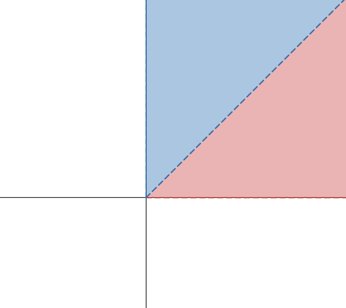
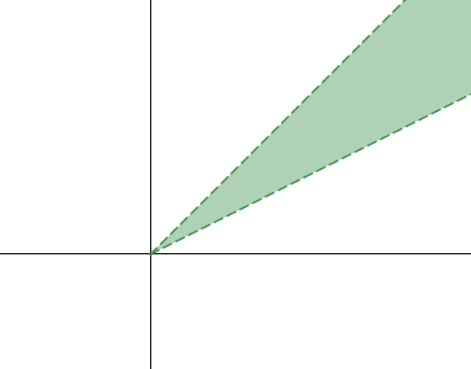
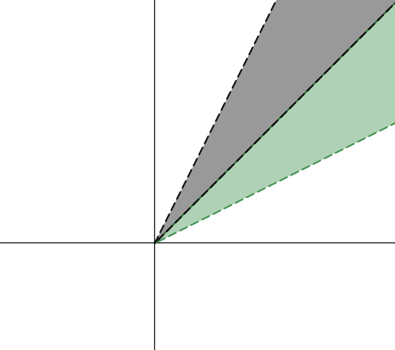
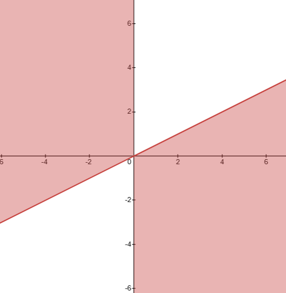
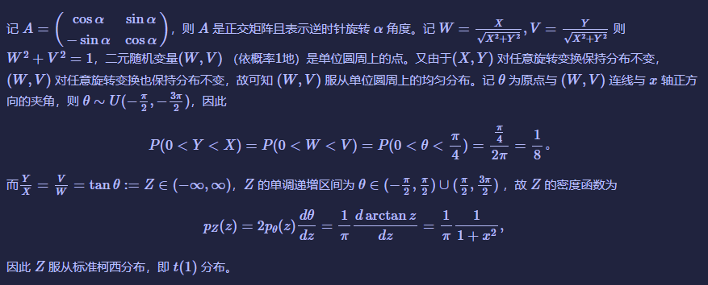

---
tags:
- 概率论
- 考研
include:
- math
---

# 旋转不变随机向量

题目似乎是2022复旦432的考研题

!!! question
    设二维随机向量 $\left[\begin{array}{l}X \\\\ Y\end{array}\right]$ 经过一个正交旋转 $\left(\begin{array}{cc}\cos \rho & \sin \rho \\\\ -\sin \rho & \cos \rho\end{array}\right)\left[\begin{array}{l}X \\\\ Y\end{array}\right]$ 后与 $\left[\begin{array}{l}X \\\\ Y\end{array}\right]$ 同分 布, 其中 $\rho$ 为任意的, 且 $P(X=0, Y=0)=0$.

    1. 求 $P(0<Y<X)$
    2. 求 $\frac{Y}{X}$ 的分布

## 题解

题目描述了一个**旋转不变**的随机向量，注意题目并未明确随机变量是**连续的还是离散的**。

一个比较奇怪的条件是
$$
P(X=Y=0)=0
$$
实际上这个条件是为了排除`(0,0)单点概率累积`这一分布，下面我们正式来解这个题目。

### （1）

不妨设$(X,Y)'$的联合分布为$F$

那么所求概率为下述区域（注意不含顶点和边界）上的概率累计
$$
D_1=\left\\{(x,y):0<y<x\right\\}
$$

也即
$$
P(0<Y<X)=\int_{D_1}\mathrm{d}F
$$

那么根据旋转不变的特性，如果旋转$\pi/4$就有
$$
\left[\begin{array}{l}U \\\\ V\end{array}\right]=
\begin{pmatrix}
\sqrt2\over2& \sqrt2\over2\\\\
-\sqrt2\over2& \sqrt2\over2
\end{pmatrix}\left[\begin{array}{l}X \\\\ Y\end{array}\right]=\left[\begin{array}{l}\frac{\sqrt2}{2}(X+Y) \\\\ \frac{\sqrt2}{2}(-X+Y)\end{array}\right]
$$
和
$$
\left[\begin{array}{l}X \\\\ Y\end{array}\right]
$$
同分布，那么
$$
\begin{aligned}
&P(0<Y<X)\\\\
=&P(0<V<U)\\\\
=&P(0<-X+Y<X+Y)\\\\
=&P(0<X<Y)
\end{aligned}
$$
也就是下图的蓝色区域和红色区域概率相等
$$
D_2=\\{(x,y):0<x<y\\}
$$

$$
\int_{D_2}dF=\int_{D_1}dF
$$

那么依此类推，通过旋转 $i\pi/4\quad i=1,2,\cdots,8$，我们可以说明
$$
\int_{D_1}dF=\int_{D_2}dF=\cdots=\int_{D_8}dF
$$
其中$D_i$是逆时针第$i$个$1/8$平面（不包括原点以及分割线）

并且对于任何一条过原点的直线$L$
$$
\int_LdF = P(Y=kX)=\delta=0
$$
否则，我们总可以通过旋转很小的角度（$\epsilon$），构造足够多的线（$N$个）使得
$$
\begin{aligned}
&\sum_{i=1}^N \int_{L_i}dF\\\\
=&\int_{\cup L_i}dF-(N-1)P(X=Y=0)\\\\
=&\int_{\cup L_i}dF\\\\
=&N\delta>1
\end{aligned}
$$
推出矛盾，其中
$$
N=\lceil\frac{1}{\delta}\rceil\quad\epsilon=\lfloor\frac{2\pi}{N}\rfloor
$$
那么
$$
1=\int_{R^2}dF=8\int_{D_1}dF+4\times0+0
$$
上式是因为平面可以划分为不相交的以下区域

- 八个$1/8$平面：$D_i\quad i=1,2,\cdots,8$
- 四条线：$y=\pm x\quad x=0 \quad y=0$，注意这四条线都需去掉原点
- 原点：$(0,0)$

于是所求概率
$$
P(0<Y<X)=\int_{D_1}\mathrm{d}F=\frac{1}{8}
$$
注：虽然写起来啰嗦了一点，但实际上只要理解了旋转不变的特性，这题可以很快反应过来所求的概率就是$1/8$。但是需要注意区域边界以及原点的处理，如何说明过原点的线上概率累计为0也是一个重点。

### （2）

这题只需要说明在一个夹角为$\theta$扇形区域内概率累计为$\theta/2\pi$即可

利用旋转不变的特性，我们把绿色的区域逆时针旋转$\theta$ 可以得到恰好不相交的灰色区域

以此类推，直到所有的扇形区域夹角加起来恰好是$2\pi$的整数倍。

如果类似$\theta=\pi/3$，则很容易可以做到上述过程，但是如果类似$\theta=1$，则无论旋转多少圈都无法凑出$2\pi$的整数倍。

!!! warning
    > 理论上，$\theta=1$这种情况相当于是$\pi$的无理数倍：$\frac{1}{\pi}$，因此我们只需要通过一个有理数近似来逼近就可以了。但是这种逼近需要说明**连续性！**

    我做到这里就做不下去了，旋转不变的特性似乎走不下去了。

    当然，我们也可以假装不知道$\theta=1$这种情况，**糊弄一下**直接认为夹角为$\theta$扇形区域内概率累计为$\theta/2\pi$（换言之，概率分布对这个夹角是均匀的）。接着往下计算也可以搞出答案。

    直接来干分布函数：

    $$
    \begin{aligned}
    &P(\frac{Y}{X} \le t)\\\\
    = &P(Y \le tX\mid X\gt 0)+P(Y \ge tX\mid X\lt 0) \\\\
    = &\frac{2\arctan t + \pi}{2\pi}\\\\
    = &\frac{\arctan t}{\pi} + \frac{1}{2}
    \end{aligned}
    $$

    第三行这里的角度很容易计算，就是**两个斜率$t$的反正切角外加两个直角**，画个图更直观：

    {width=300}

    最后这个函数显然是柯西分布的分布函数。

!!! quote "标答？"
    [网上](https://www.cnblogs.com/yecheng97/p/15823058.html)找了个（标准）题解，如果没见过这个套路怕是很难做出来了：

    

[Box–Muller transform](https://en.wikipedia.org/wiki/Box%E2%80%93Muller_transform)和这个结论有些神似，不过Box–Muller的目的是用独立的均匀分布生成独立的标准正态分布，读者有兴趣可以看一眼。

不得不说，复旦这个题还是非常有意思的。
