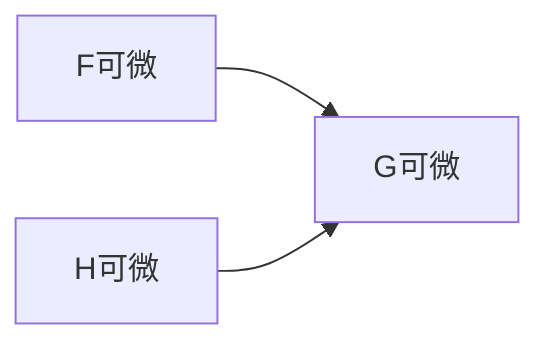

---
tags:
- Calculus
include:
- math
---

# 导数漫谈

> 内容来自群友分享，具体出处已难寻～

导数就是**线性**近似！！

## 一阶导数
### 一元数值函数
$$
f: \mathbb{R} \to \mathbb{R}
$$
对于这样的函数，如果存在一个常数$a\in \mathbb{R}$使得
$$
f(x_0+t) = f(x_0)+a \cdot t+o(t)
$$
我们就说$a=f'(x_0)$是$f$在$x_0$处的导数。

### 多元数值函数
$$
f: \mathbb{R}^n \to \mathbb{R}
$$
对于这样的函数，如果存在一个常向量$a\in \mathbb{R}^n$使得
$$
f(x_0+h) = f(x_0)+ \langle a,h \rangle +o(\lVert h \rVert_2)
$$
我们就说$a=\nabla f(x_0) = (\frac{\partial}{\partial x_0^1}f(x_0),\frac{\partial}{\partial x_0^2}f(x_0),\cdots, \frac{\partial}{\partial x_0^n}f(x_0))^T$是$f$在$x_0$处的导数（也常称为梯度）。

### 多元向量值函数
$$
F: \mathbb{R}^n \to \mathbb{R}^m
$$
对于这样的函数，如果存在一个常矩阵$A\in \mathbb{R}^{m\times n}$使得
$$
F(x_0+h) = F(x_0)+ Ah +o(\lVert h \rVert_2)
$$
我们就说$A=\mathrm{J} F(x_0) = \left(\frac{\partial}{\partial x_0^j}f_i(x_0)\right)_{m\times n}$是$F$在$x_0$处的导数（也常称为Jacobi矩阵）。

至此矩阵完美地诠释了**线性近似**这一想法，并且此前的导数都可以视为此种情形的特例。

### 半正定锥上的导数
$$
G: \mathbb{R}^n \to \mathcal{S}^p
$$
这类函数就有些特殊了，陪域$\mathcal{S}^p$是一个特殊的线性空间。

例如
$$
G(x,y) = \begin{pmatrix}
x^2&2&1\\\\
2&y^3&\cos x\\\\
1&\cos x&xy
\end{pmatrix}
$$

我们照葫芦画瓢给出一个定义：

若存在$A\in \mathrm{L}(\mathbb{R}^n, \mathcal{S}^p)$（**有界线性算子**）满足
$$
G(x_0+h)=G(x_0)+A(h)+o(\lVert h \rVert_2)
$$
我们就说$A=\mathrm{D}G(x_0)$是$G$在$x_0$处的导数。

### Fréchet导数

$$
f: U\to W
$$
其中$V,W$是赋范空间，$U$是$V$上的开集。那么如果存在**有界线性算子**
$$
A: V\to W
$$
满足：
$$
\lim_{\lVert h \rVert_V \to 0} \frac{\lVert f(x+h)-f(x)-Ah \rVert_W}{\lVert h \rVert_V} = 0
$$

就称$A$是$f$的Fréchet导数，称$f$在$U$附近可微。

当然类似的泛函分析中还有Gateaux导数（方向导数，沿着某个向量取极限）、Hadamard导数（离散化的极限）。他们之间存在如下关系：

## 二阶导数

众所周知，二阶导数就是导数的导数。

例如一元函数的二阶导依然是函数：
$$
f''(x) = (f'(x))' \in \mathbb{R}
$$
多元函数的二阶导是一个矩阵（Hessian）：
$$
\nabla ^2 f(x) = \nabla(\nabla f(x)) \in \mathbb{R^{n\times n}}
$$

多元向量值函数（$f:\mathbb{R}^n \to \mathbb{R}^m$）的导数就比较难表示了（是一个张量，尺寸是$(m\times n) \times n$）。

$$
f(x+h) \approx f(x)+ Df(x) h + \frac{1}{2} \begin{pmatrix}h^T\nabla^2f_1(x)h\\h^T\nabla^2f_2(x)h\\\vdots\\h^T\nabla^2f_m(x)h\end{pmatrix}
$$

换言之，它的导数可以写成：
$$
\begin{pmatrix}\nabla^2f_1(x)\\\nabla^2f_2(x)\\\vdots\\\nabla^2f_m(x)\end{pmatrix} \in \mathbb{R}^{(m\times n) \times n}
$$
