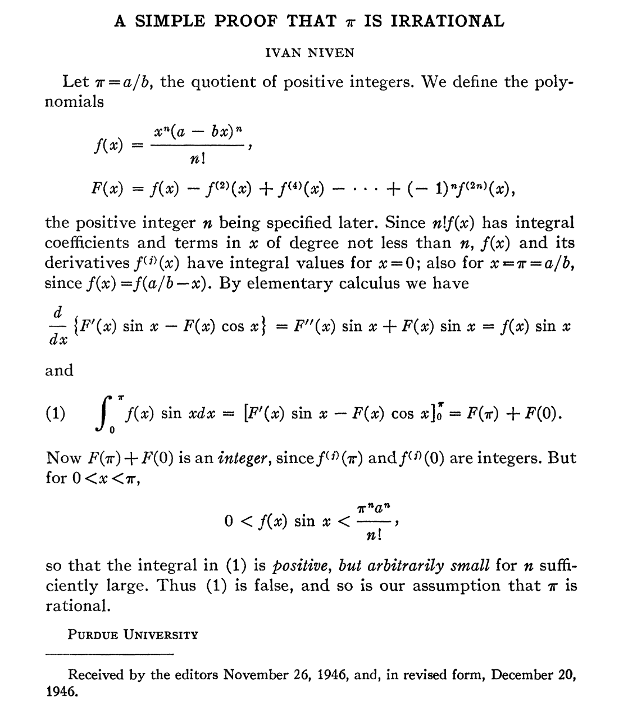

---
tags:
- Calculus
include:
- math
title: pi的无理性
---

# $\pi$的无理性

众所周知，$\pi$是无理数。那么到底为什么呢？如何证明？

!!! quote "Wikipedia:[证明$\pi$是无理数](https://zh.wikipedia.org/wiki/%E8%AF%81%E6%98%8E%CF%80%E6%98%AF%E6%97%A0%E7%90%86%E6%95%B0)"
    18世纪60年代，约翰·海因里希·朗伯首先证明出圆周率为无理数，即不能表示成两个整数之比。

    在19世纪，夏尔·埃尔米特给出了不需要微积分以外的预备知识的证明方法，此后又有玛丽·卡特赖特、伊万·尼云以及尼古拉·布尔巴基等人给出更为简洁的证明。

    另外由拉茨科维奇·米克洛什的证明方法简化了朗伯的证明方法。

    这些所给出证明方法都基于反证法。

    1882年，费迪南德·冯·林德曼进一步给出圆周率不仅为无理数，而且为超越数的证明。

看来这个问题还是比较困难，十八世纪微积分发展较为成熟了之后才有证明出现。

## 最早的证明

最早在1761年，约翰·海因里希·朗伯（Lambert）使用$\tan x$的连分数表示证明了$\pi$是无理数。

这个法子太难了，需要额外的连分数知识。

## 最短的证明

尼云（Niven）于1947年发表了一个简短的证明：

> Niven, Ivan (1947), "A simple proof that π is irrational", Bulletin of the American Mathematical Society, vol. 53, no. 6, p. 509

假设：
$$
\pi = \frac{a}{b}
$$
是有理数。

构造：
$$
f(x) = \frac{x^n(a-bx)^n}{n!}
$$
以及
$$
F(x) = \sum_{k=0}^n (-1)^kf^{(2k)}(x)
$$

由于$f(x)$是次数为$2n$的多项式函数，所以：
$$
F''(x) = \sum_{k=1}^n (-1)^{k-1}f^{(2k)}(x)
$$
所以：
$$
F''(x)+F(x)=f(x)
$$

所以：
$$
F''(x)\sin x+F(x)\sin x = f(x)\sin x
$$
而：
$$
\frac{d}{dx} \left[ F'(x)\sin x-F(x)\cos x \right] = F''(x)\sin x+F(x)\sin x 
$$

所以：
$$
f(x)\sin x = \frac{d}{dx} \left[ F'(x)\sin x-F(x)\cos x \right]
$$

积分得到：
$$
\int_0^\pi f(x)\sin x  \mathrm{d}x  =\left[ F'(x)\sin x-F(x)\cos x \right]\mid_0^\pi = F(0)+F(\pi)
$$

考虑$f(x)$在$x=0$处的泰勒级数：
$$
f(x) = \frac{x^n(a-bx)^n}{n!} = \sum_{k=0}^{2n} \frac{f^{k}(0)}{k!}x^k
$$
所以：
$$
x^n(a-bx)^n = \sum_{k=0}^{2n} \frac{n!}{k!}f^{k}(0)x^k
$$
对比$x^k$的系数发现，对于$k\lt n$，左侧的系数都是0，所以：
$$
f^{(k)}(0) = 0 \quad 0\le k\lt n
$$

对于$k\ge n$，左侧的系数都是整数，所以：
$$
\frac{n!}{k!}f^{(k)}(0)\in \mathbb{Z} \quad n\le k\le 2n
$$
综上，$f^{(k)}(0),\quad 0\le k \le 2n$全是整数。

而$f(x)=f(a/b-x)$是关于$\frac{\pi}{2}$对称的，所以$f^{(k)}(\pi),\quad 0\le k \le 2n$，也是全是整数。

那么$F(0)+F(\pi)$是整数。

显然，在$(0,\pi)$上：

$$
0\lt f(x)=\frac{x^n(a-bx)^n}{n!}\lt \frac{b^n \pi^{2n}}{n!4^n} \lt \frac{b^n \pi^{n}}{n!} = \frac{a^n}{n!}
$$

所以：
$$
0 < \int_0^\pi f(x)\sin x  \mathrm{d}x \le \int_0^\pi f(x)  \mathrm{d}x \lt \frac{a^n}{n!}\pi \to 0
$$
$n$足够大时，有：
$$
0 < \int_0^\pi f(x)\sin x <1
$$
所以：
$$
0 < F(0)+F(\pi) < 1
$$

这和$F(0)+F(\pi)$是整数矛盾。