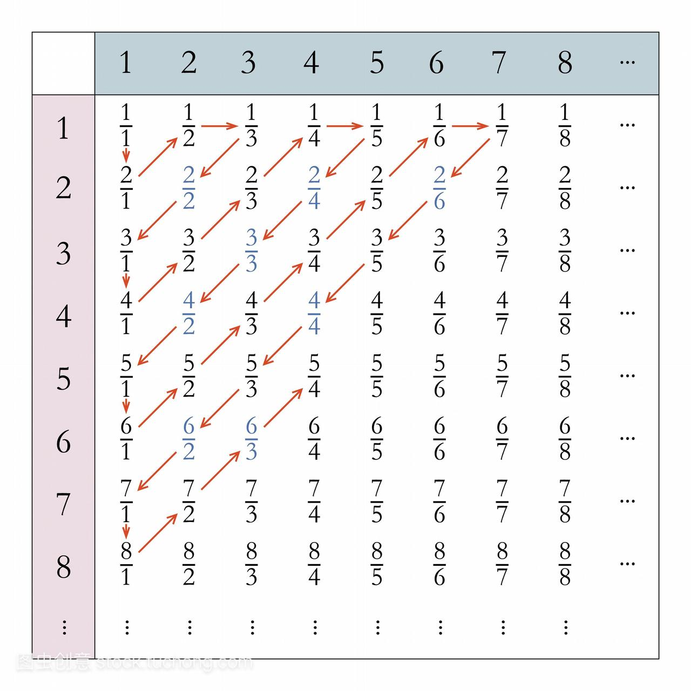
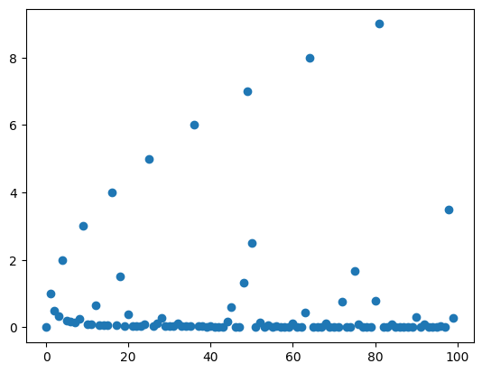

---
tags:
- Calculus
include:
- math
---

# 有理数集是可数的
直觉上有理数是无穷无尽的，在数轴上是稠密的，不太可数的样子。

但实际上我们可以构造一个有理数到自然数的双射，从而非常直观地说明有理数是**可数的**。
## 双射(bijection)
既单又满的映射是双射。

所谓单射(injection)就是指将不同的变量映射到不同的值的映射：
$$
f:A\to B \quad s.t. \quad \forall a,b \in A \quad a\ne b\implies f(a)\ne f(b)
$$
所谓满射(surjection)就是指陪域等于值域的映射：
$$
f:A\to B \quad s.t. \quad \forall y\in B \quad \exists x\in A \quad f(x)=y
$$

> 对于映射$f:A\to B$，我们说$A$是定义域，$B$是陪域，$f(A)$是值域。
## 基数(cardinality)
所谓的基数（或者叫势）直观来说就是衡量集合中元素数量的一个度量。集合$S$的基数记作$|S|$。

我们定义

- 如果存在一个单射$f:A\to B$，那么：
$$
|A|\le |B| 
$$

- 如果存在一个满射$f:A\to B$，那么：
$$
|A|\ge |B| 
$$


如果存在一个双射$f:A\to B$，那么：
$$
|A|= |B| 
$$
这时候我们说$A$和$B$是等势的。

## 可数

如果一个集合$S$和自然数集合$\mathbb{N}$是等势的，那么称这个$S$是可数的。

一个简单的例子是：
$$
f:\\{2k:k\in \mathbb{N}\\} \to \mathbb{N}
$$
其中$f(2k)=k$。

不难发现这个映射是一个双射

- 单：任何两个不想等的偶数除以二之后还是不相等
- 满：任何一个自然数(n)都在值域中，因为有一个对应的偶数(2n)作为原象
## 有理数可数（好实现的）
> 这个映射非常炫酷，但是没那么直观

定义映射 $f:\mathbb{Q} \to \mathbb{N}$：
$$
f(x) = q_1^{2r_1}q_2^{2r_2}\cdots q_M^{2r_M}\times p_1^{2s_1-1}p_2^{2s_2-1}\cdots p_N^{2s_N-1}
$$

其中**互相不相等的**质数 $q_i,p_j$以及正整数$r_i$,$s_j$通过$x$分数表示的质因数分解定义为：
$$
x = \frac{m}{n} = \frac{q_1^{r_1}q_2^{r_2}\cdots q_M^{r_M}}{p_1^{s_1}p_2^{s_2}\cdots p_N^{s_N}}
$$

> 这么定义的合理性在于算数基本定理：$m,n$可以质因数分解，并且分解唯一。

例如：

$$
f(3.2) = f(\frac{16}{5})=f(\frac{2^4}{5})=2^{2\times 4}\times 5^{2\times 1-1}=2^8\times 5=1280
$$

下面证明$f$是一个双射。

### Step 1 f是单射
也就是要证明$x_1\ne x_2 \implies f(x_1)\ne f(x_2)$

设
$$
x_1 = \frac{q_{1,1}^{r_{1,1}}q_{1,2}^{r_{1,2}}\cdots q_{1,M}^{r_{1,M}}}{p_{1,1}^{s_{1,1}}p_{1,2}^{s_{1,2}}\cdots p_{1,N}^{s_{1,N}}}
$$
$$
x_2 = \frac{q_{2,1}^{r_{2,1}}q_{2,2}^{r_{2,2}}\cdots q_{2,M}^{r_{2,M}}}{p_{2,1}^{s_{2,1}}p_{2,2}^{s_{2,2}}\cdots p_{2,N}^{s_{2,N}}}
$$

那么
$$
\begin{aligned}
&f(x_1)\\\\
=&q_{1,1}^{2r_{1,1}}q_{1,2}^{2r_{1,2}}\cdots q_{1,M}^{2r_{1,M}}\times p_{1,1}^{2s_{1,1}-1}p_{1,2}^{2s_{1,2}-1}\cdots p_{1,N}^{2s_{1,N}-1}\\\\
&f(x_2)\\\\
=&q_{2,1}^{2r_{2,1}}q_{2,2}^{2r_{2,2}}\cdots q_{2,M}^{2r_{2,M}}\times p_{2,1}^{2s_{2,1}-1}p_{2,2}^{2s_{2,2}-1}\cdots p_{2,N}^{2s_{2,N}-1}
\end{aligned}
$$
其中$q_{1,i}, p_{1,j}$互不相等，$q_{2,i}, p_{2,j}$互不相等。

假设$f(x_1)=f(x_2)$，那么根据自然数质因数分解（**按照指数的奇偶分开，按照底数从小到大排列**）的唯一性
$$
q_{1,i}=q_{2,i},\quad r_{1,i}=r_{2,i}\quad \forall i
$$
并且
$$
p_{1,j}=p_{2,j},\quad s_{1,j}=s_{2,j}\quad \forall j
$$
于是$x_1=x_2$，与条件矛盾。

所以假设不成立，$f(x_1)\ne f(x_2)$

所以$f$是单射。
### Step 2 f是满射
也就是要证明$\forall y \in \mathbb{N} \quad \exists x \in \mathbb{Q} \quad s.t.\quad f(x)=y$

根据算数基本原理，$\forall y \in \mathbb{N}$，存在质因数分解（**按照指数的奇偶分开，按照底数从小到大排列**）
$$
y=q_1^{2r_1}q_2^{2r_2}\cdots q_M^{2r_M}\times p_1^{2s_1-1}p_2^{2s_2-1}\cdots p_N^{2s_N-1}
$$
从而存在一个这样的有理数
$$
x = \frac{q_1^{r_1}q_2^{r_2}\cdots q_M^{r_M}}{p_1^{s_1}p_2^{s_2}\cdots p_N^{s_N}}
$$
使得$f(x)=y$

所以$f$是满射。
## 有理数可数（好理解的）
> 这个映射非常直观，但是很难写出具体的形式。因为中间有大量的可约分数需要跳过。

更加广为流传的版本是对角线排列的方法：

如图所示，每一行的分子都是相同的，每一列的分母都是相同的，通过这样一种方式我们把所有的有理数（除了0，这不影响我们的结论）放到了一个矩阵当中。

接下来，按照箭头所指的方向来数数即可，遇到可约分数就跳过。

最终我们得到这样一个映射：
$$
\begin{aligned}
&f(1/1)=1,\quad f(2/1)=2,\quad f(1/2)=3\\\\
&f(1/3)=4,\quad f(3/1)=5,\quad \cdots
\end{aligned}
$$
补充定义$f(0)=0$即可把所有的有理数一一映射到自然数了。
## 编程实现
最后我们用python写一个小程序实现前面提到的第一个双射：

```python
from sympy.ntheory import factorint
from fractions import Fraction

def f(x: Fraction|float) -> int:
    if isinstance(x, float):
        # 取最近的有理数
        x = Fraction(x).limit_denominator()
        print(f"f({x}) = ", end='')
    m = x.numerator # 分子
    n = x.denominator # 分母
    y = 1
    for q,r in factorint(m).items():
        y *= q**(2*r)
    for p,s in factorint(n).items():
        y *= p**(2*s-1)
    print(y)
    return y
```

这个函数可以把有理数映射到自然数：
```python
>>> f(16/5)
f(16/5) = 1280
```

它的逆映射是：
```python
def f_inverse(x: int) -> Fraction:
    if x==0:
        res = Fraction(0)
    else:
        prime_factorization = factorint(x)
        m,n = 1,1
        for prime, power in prime_factorization.items():
            if power%2 == 0:
                m *= prime**(power//2)
            else:
                n *= prime**((power+1)//2)
        res = Fraction(m,n)
    print(f"f_inverse({x}) = {res}")
    return res
```
可以输出第$n$个有理数：
```python
>>> for i in range(20):
...     f_inverse(i)
f_inverse(0) = 0
f_inverse(1) = 1
f_inverse(2) = 1/2
f_inverse(3) = 1/3
f_inverse(4) = 2
f_inverse(5) = 1/5
f_inverse(6) = 1/6
f_inverse(7) = 1/7
f_inverse(8) = 1/4
f_inverse(9) = 3
f_inverse(10) = 1/10
f_inverse(11) = 1/11
f_inverse(12) = 2/3
f_inverse(13) = 1/13
f_inverse(14) = 1/14
f_inverse(15) = 1/15
f_inverse(16) = 4
f_inverse(17) = 1/17
f_inverse(18) = 3/2
f_inverse(19) = 1/19
```
这个函数的图像大概长这个样子：



它恰好被$y=\sqrt{x}$包络住。