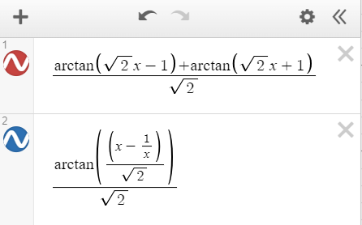
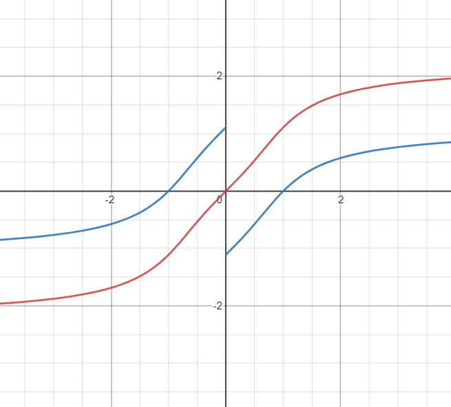

---
tags:
  - 数学分析
---
## 问题

求解不定积分如下：
$$
F(x) = \int \frac{x^2+1}{x^4+1}dx
$$

## 存疑

有这样一种解法：
考虑 $x \ne 0$ 的情况，作变形如下：
$$
F(x) = \int \frac{1+\frac{1}{x^2}}{x^2+\frac{1}{x^2}}dx
$$
可以换元，令 $u = x-\frac{1}{x}$，带入得到：
$$
F(x) = \int \frac{du}{u^2+2}
$$
利用常见积分公式，这时很容易求得：
$$
\int \frac{du}{u^2+2}=\frac{1}{\sqrt{2}}\arctan(\frac{u}{\sqrt{2}})+C
$$
于是有：
$$
F(x)=\frac{1}{\sqrt{2}}\arctan(\frac{x-\frac{1}{x}}{\sqrt{2}})+C
$$
容易验证：
$$
F'(x) = \frac{x^2+1}{x^4+1}
$$
但是这样求得的 $F(x)$ 是不连续的：

$$
\begin{align*}
\lim_{x\to 0^-}F(x)&=C+\frac{\pi}{2\sqrt{2}}\\
&\ne\\
\lim_{x\to 0^+}F(x)&=C-\frac{\pi}{2\sqrt{2}}
\end{align*}
$$

可是我们又知道**连续函数的原函数必然也是连续函数**，出现了矛盾。

不难发现，这种做法最让人注意的地方就是 $x\ne 0$ 这个条件，原函数在 0 点是有定义的，然后我们求解积分的时候去掉了这一点，进而求解出了错误的答案。即使求出的函数在非 0 点都是吻合 F(x)的。

## 正解

考虑 $x^4+1$ 的“因式分解”：
$$
x^4+1=(x^2-\sqrt{2}x+1)(x^2+\sqrt{2}x+1)
$$
于是我们有：
$$
F(x)=\int \frac{(x^2+1)dx}{(x^2-\sqrt{2}x+1)(x^2+\sqrt{2}x+1)}
$$
实际上可以拆分为：

$$
\begin{align*}
F(x)=&\frac{1}{2}\int \frac{dx}{x^2-\sqrt{2}x+1}+\\
&\frac{1}{2}\int\frac{dx}{x^2+\sqrt{2}x+1}
\end{align*}
$$

配方：

$$
\begin{align*}
F(x)=&\frac{1}{2}\int \frac{dx}{(x-\frac{\sqrt{2}}{2})^2+\frac{1}{2}}+\\
&\frac{1}{2}\int\frac{dx}{(x+\frac{\sqrt{2}}{2})^2+\frac{1}{2}}
\end{align*}
$$

调整系数：

$$
\begin{align*}
F(x)=&\int \frac{dx}{(\sqrt{2}x-1)^2+1}+\\
&\int\frac{dx}{(\sqrt{2}x+1)^2+1}
\end{align*}
$$

利用常见积分公式得到：

$$
\begin{align*}
F(x)=&\frac{1}{\sqrt{2}}\arctan(\sqrt{2}x-1)+\\
&\frac{1}{\sqrt{2}}\arctan(\sqrt{2}x+1)+C
\end{align*}
$$

在此求解过程中，分母始终不为零，没有前一种做法的问题。

## 图示
两个函数分别作图（作图工具为在线网站Desmos）：
<figure markdown>
{width=400}
</figure>
结果如下：
<figure markdown>
{width=400}
</figure>
可以看到两种做法求出的结果除了在零点处的斜率有差异，其余地方的斜率完全相同。

此致。