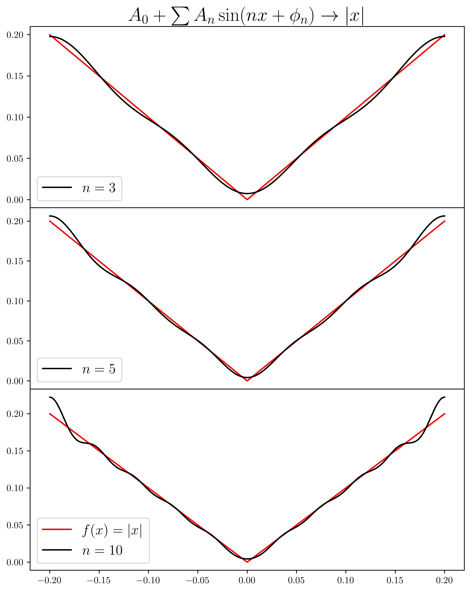
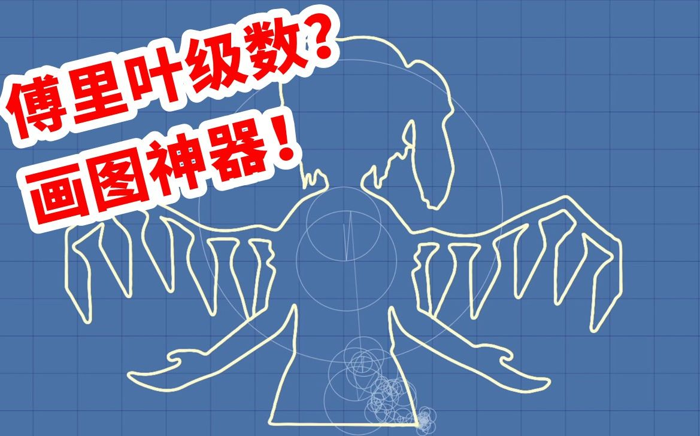
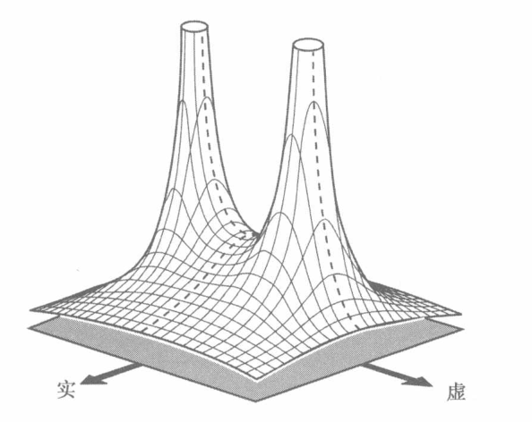
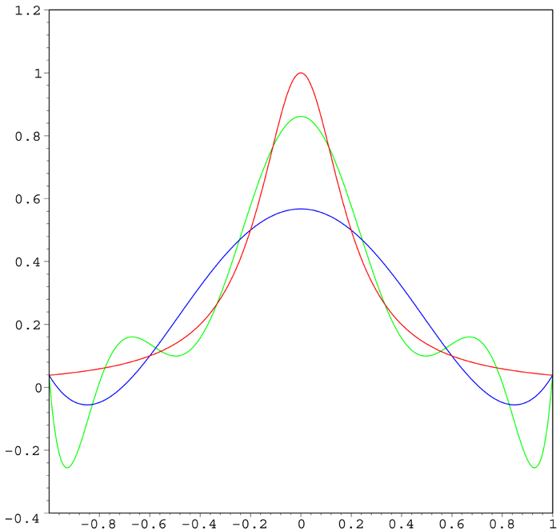
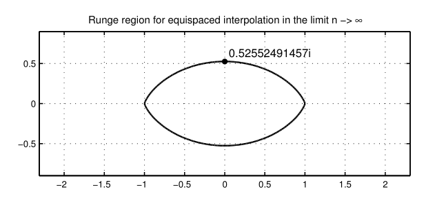

---
tags:
  - 数学分析
---
本文梳理泰勒展开(Taylor expansion)及其相关内容，罗列一些常用的性质和公式以备不时之需。

主要内容如下:

- 泰勒定理及其余项
- 一点点傅里叶级数
- 魏尔斯特拉斯逼近定理
- 泰勒级数
- 更高观点: 复分析中的泰勒级数
- 一点点数值分析: 龙格现象

## 泰勒定理及其余项
!!! cite "泰勒定理"
    设$n$是一个正整数, 若定义在$a$的一个邻域上的函数$f$在$a$点$n+1$阶可微, 那么对于该邻域上任意一点$x$都有
    $$
    f(x)=f(a)+\frac{f'(a)}{1!}(x-a)+\frac{f^{(2)}(a)}{2!}(x-a)^2+\cdots+\frac{f^{(n)}(a)}{n!}(x-a)^n+R_n(x)
    $$
    注意, 定理中要求$n+1$阶可微性这个条件在特定的余项下可以放宽或者需要收紧, 其中$R_n(x)$称为泰勒公式的余项.
    另外提一嘴, 泰勒全名Brook Taylor(1685-1731), 如果你直接在搜索引擎键入`taylor`, 恐怕会出现大量另外一位Taylor, 歌唱的不错的那位.

泰勒展开的想法非常简单, 就是寻找一个合适的多项式$P_n(x)$来近似函数的值. 那么我们自然产生下面两个问题:
### 为什么这样的多项式近似(总是)存在?
我们知道$\left\{1,x,x^2,x^3,\cdots\right\}$作为(有某些正则条件的,奇怪的函数不在考虑之列)函数空间这一**无穷维线性空间**的一组**基**, 它的**近似能力**或者说**表示能力**是无限的, 也就是说空间中任何一个函数都可以在这组基下找到一个线性表示.

特别的, 如果函数高阶可微的话, 那么表示系数正比于函数的各阶导数.

注意我说的是(空间内)任何一个函数, 并不要求函数的可微性. 只不过, 对于那些不可微的函数, 系数不能依靠导数来确定.

严格的来说, 有魏尔斯特拉斯第一逼近定理(多项式表述, 可以证明与三角函数的表述等价):
!!! cite "维尔斯特拉斯定理"
    对于定义在区间$[a,b]$上的每个连续函数$f(x)$，存在一组多项式函数$P_{n}(n=0,1,2,...)$，当n趋向于无穷大时，近似于$[a,b]$上具有一致收敛的$f(x)$，也就是说:

    $$
    \lim_{n\rightarrow \infty }\left(\max _{a\leq x\leq b}\left|f(x)-P_{n}(x)\right|\right)=0.
    $$

举一个特殊的例子
$$
f(x)=|x|=\max\{-x,x\}
$$
我们考虑这个函数在$x=0$附近的多项式近似, 显然$f$在$x=0$不可微. 但是我们知道这样一个事实
$$
\lim_{n\to\infty}\sqrt[n]{x^n+(-x)^n}=\max\{x,-x\}=|x|
$$
那么我们就可以用一个光滑函数
$$
\sqrt[n]{x^n+(-x)^n}
$$
来近似$f$, 而这个光滑函数又可以用泰勒定理来展开. 我们就间接找到了一个多项式近似(渐进无偏的), 逼近过程如图：
<figure markdown>
.jpg){width=500}
</figure>
作为类比, 我们可以用三角函数基$\{1,\sin x, \cos x, \sin 2x, \cdots\}$来表示任何一个函数(魏尔斯特拉斯第二逼近定理给出了这个结论), 这就成为常见的傅里叶级数, 逼近过程如图:
<figure markdown>
{width=500}
</figure>
不过多项式基下的线性表示比起三角函数基要难求得多, 因为三角函数基具有**正交性**, 但是多项式基没有正交性. 在特定区间上我们可以进行**施密特正交化**从而得到一组正交基, 进而使用和傅里叶级数类似的方法求得各个基上的系数, 细节如下:

- $(-1,1)$上的正交基(勒让德多项式)
$$
\begin{aligned}
\left\\\{P_n(x)\right\\\}_{n=0}^\infty=\left\\\{1,x,\frac{1}{2}(x^2-1),\frac{1}{2}(5x^3-3x),\cdots\right\\\}
\end{aligned}
$$
- 可以验证其中的多项式满足正交性且本身模非$0$
$$
\int_{-1}^1P_m(x)P_n(x)dx=\frac{2}{2n+1}I(m=n)
$$
- 对于特定函数$f$, 求他和每个基的内积从而求得线性表示系数
$$
a_n = \int_{-1}^1P_n(x)f(x)dx
$$
不过似乎没人这么做. 一般我们只在高阶可微的函数上使用多项式基的线性表示, 也就是泰勒展开. 毕竟傅里叶级数更加好用!

没有什么是傅里叶画不出来的^.^

简单描述一下上面这个图的原理. 我们知道复数
$$
re^{i\theta}=r[\cos\theta + i\sin\theta]
$$
可以表示周长为$r$的圆周上的某一点,$\theta$表示从实轴正半轴逆时针旋转的角度, 在复平面上就是一个向量. 那么我们考虑若干个向量的线性组合
$$
r_1e^{i\theta_1(x)}+r_2e^{i\theta_2(x)}+r_3e^{i\theta_3(x)}+\cdots
$$
这可以视为一个参数曲线
$$
z=f(x)+ig(x)
$$
实部, 虚部分别求傅里叶级数表示.

$x$不断变化的过程中, 若干个向量的线性组合类似**机械臂**可以形成非常复杂的轨迹(从这一点可以看出傅里叶在工程领域一个重要的运用):
<figure markdown>

</figure>
通过调整一系列的参数, 就可以拟合绝大多数的曲线了. 机械臂的节点越多, 自由度越高, 拟合能力越强, 对应于傅里叶级数的阶数越高, 近似程度越高.

有些跑题, 我们回到泰勒展开.
### 近似的程度如何?
泰勒展开的近似程度用余项(残差项)来描述, 常见的余项有三种。
### Peano余项
$$
R_n(x)=o\left[(x-a)^n\right]
$$
其中$o(\cdot)$表示高阶无穷小. 这是粗略的一种余项.
### 证明
依据定义
$$
R_n(x) = f(x)-\sum_{i=1}^n \frac{f^{(i)}(a)}{i!}(x-a)^i
$$
显然$R_n(a)=0$并且$R_n(x)$在$a$的邻域上$n$次可微, 只要按照高阶无穷小的定义验证
$$
\lim_{x\to a}\frac{R_n(x)}{(x-a)^n}=0
$$
使用$n$次洛必达法则立得
$$
\begin{aligned}
&\lim_{x\to a}\frac{R_n(x)}{(x-a)^n}\\\\
\overset{n次}{==}&\lim_{x\to a}\frac{f^{(n)}(x)-f^{(n)}(a)}{n!}
\end{aligned}
$$
$f$ 的$n+1$次可微性, 保证了$f^{(n)}$在$a$处的连续性, 因此上式为0. 

实际上在Peano余项下, 定理的条件可以放宽至$f$满足$n$次可微, 这时候只能用$n-1$次洛必达法则(若用$n$次得到上面的式子, 无法求得极限):
$$
\begin{aligned}
&\lim_{x\to a}\frac{R_n(x)}{(x-a)^n}\\\\
\overset{n-1次}{==}&\lim_{x\to a}\frac{f^{(n-1)}(x)-f^{(n-1)}(a)-f^{(n)}(a)(x-a)}{n!(x-a)}\\\\
=&\frac{1}{n!}\lim_{x\to a}\left[\frac{f^{(n-1)}(x)-f^{(n-1)}(a)}{(x-a)}-f^{(n)}(a)\right]
&
\end{aligned}
$$
则根据导数的定义以及$f$的$n$阶可微性可得上式为0.
### Lagrange余项
$$
R_n(x)=\frac{f^{(n+1)}(\theta)}{(n+1)!}(x-a)^{(n+1)}
$$
其中$\theta\in (a,x)$(当$x$小于$a$的时候换一下区间限即可, 所以我们不妨设$a\lt x$)
### 证明
依据定义
$$
R_n(x) = f(x)-\sum_{i=1}^n \frac{f^{(i)}(a)}{i!}(x-a)^i
$$
考虑$g(x)=(x-a)^{(n+1)}$,注意到$g^{(i)}(a)=R_n^{(i)}(a)=0, \quad i=1,2,\cdots,n$

那么由Cauchy中值定理
$$
\begin{aligned}
&\frac{R_n(x)}{g(x)}\\\\
=&\frac{R_n(x)-R_n(a)}{g(x)-g(a)}\\\\
=&\frac{R^{(1)}_n(\theta_1)}{g^{(1)}(\theta_1)}\\\\
=&\frac{R^{(1)}_n(\theta_1)-R^{(1)}_n(a)}{g^{(1)}(\theta_1)-g^{(1)}(a)}\\\\
\vdots\\\\
=&\frac{R_n^{(n+1)}(\theta)}{g^{(n+1)}(\theta)}\\\\
=&\frac{f^{(n+1)}(\theta)}{(n+1)!}
\end{aligned}
$$
其中$(a,x)\supset(a,\theta_1)\cdots\supset(a,\theta)$, 也即$\theta \in (a,x)$.
### 积分余项
$$
R_n(x)=\int_a^x \frac{f^{(n+1)}(t)}{n!}(x-t)^ndt
$$
显然这个余项对$f^{(n+1)}$的可导性有一些要求.
### 证明
使用牛顿莱布尼茨公式:
$$
\begin{aligned}
&f(x)\\\\
=&f(a)+f(x)-f(a)\\\\
=&f(a)+\int_a^xf'(t)dt\\\\
\end{aligned}
$$
多次使用恒等式(分部积分)
$$
\begin{aligned}
&\int_a^xf'(t)dt\\\\
=&\int_a^xf'(t)d(t-x)\\\\
=&\left[(t-x)f'(t)\right]\mid_a^x-\int_a^x(t-x)f''(t)dt\\\\
=&(x-a)f'(a)+\int_a^x(x-t)f''(t)dt
\end{aligned}
$$
即可证明.

显然对于那些只有有限阶可微性的函数, 可以有穷阶的泰勒展开. 

那些无穷阶可微的函数,是否可以做"无穷阶"泰勒展开, 从而形成一个无穷级数呢? 

答案是肯定的, 根据我们前面的函数空间的说法, 在多项式基下这样一个无穷级数总是存在的. 特别地, 当$f$无穷阶可微, 这个级数称为泰勒级数, 线性表示系数正比于该点各界导数.
## 泰勒级数
泰勒级数是一类特殊的函数项无穷级数---幂级数.

也即
$$
\sum_{n=0}^\infty \frac{f^{(n)}(a)}{n!}(x-a)^n
$$
众所周知幂级数拥有优良的性质---内闭一致收敛.

由此可以证明它在收敛域(除去边界点)$(a-R,a+R)$内
- 和函数连续
- 和函数有连续的导数
- 和函数黎曼可积
- 级数可以逐项求导, 求导后收敛半径不变
- 级数可以逐项积分, 积分后收敛半径不变

需要特别注意边界点的收敛性.

下面这个定理正是泰勒定理在幂级数中的运用, 用余项的处处收敛性阐述了级数的收敛性
!!! cite "定理"
    若$f:(a-R,a+R)\to\mathbb{R}$ 满足$f\in C^\infty$,则$f$在$(-R,R)$内能展开为幂级数的充分必要条件为
    $$
    \lim_{n\to \infty}R_n(x)=0,\quad \forall x\in(a-R,a+R)
    $$
    此处$R$即是收敛半径.

此外不难验证, **泰勒级数的系数是唯一的**, 利用这一点我们可以完成某些证明.

特别的如果是在$a=0$展开的泰勒级数, 我们称之为麦克劳林级数, 一些常用的基本初等函数的麦克劳林级数列举如下:

- $x\in(-1,1)$
$$
\frac{1}{1-x}=1+x+x^2+x^3+\cdots
$$
- $x\in \mathbb{R}$
$$
e^x=1+x+\frac{x^2}{2!}+\frac{x^3}{3!}+\cdots
$$
- $x\in \mathbb{R}$
$$
\sin x =x -\frac{x^3}{3!}+\frac{x^5}{5!}-\cdots
$$
- $x\in \mathbb{R}$
$$
\cos x=1-\frac{x^2}{2!}+\frac{x^4}{4!}-\cdots
$$
- $x\in (-1,1]$
$$
\ln(1+x) = x-\frac{x^2}{2}+\frac{x^3}{3}-\frac{x^4}{4}+\cdots
$$
- $x\in(-1,1)$
$$
(1+x)^a = 1+ax+\frac{a(a-1)}{2!}x^2+\frac{a(a-1)(a-2)}{3!}x^3+\cdots
$$
- $x\in(-1,1)$
$$
\arctan x = x-\frac{1}{3}x^3+\frac{1}{5}x^5-\cdots
$$
- $x\in(-1,1)$
$$
\arcsin x = x+\frac{1}{2}\frac{x^3}{3}+\frac{3!!}{2^33!}\frac{x^5}{5}+\cdots
$$
利用幂级数的逐项可导,逐项可积和上面这些公式. 我们还可以求出各种五花八门的级数.
## 复分析中的泰勒级数
我们再来看一下复数域下的泰勒级数. 
$$
f(z)=\sum_{n=0}^\infty\frac{f^{(n)}(z_0)}{n!}(z-z_0)^n
$$
以下给出几个论断
- 复变量函数的函数项幂级数和实数的幂级数性质类似, 都有很好的性质(Abel定理)
- 幂级数的收敛半径就是展开点和最近的奇点之间的距离
- 所有的全纯函数无穷阶可微, 因而存在泰勒级数

我们重点来看**收敛半径**, 半径这个词在实数域内非常地别扭, 勉强理解为收敛区间$(a-R,a+R)$的半径. 但还是不够自然.

如果在复数域内来看, 一切就顺理成章了, 还可以解释一些现象.

例如
$$
\begin{aligned}
f(x)&=\frac{1}{1-x^2}=\sum_{n=0}^\infty x^{2n}\\\\
g(x)&=\frac{1}{1+x^2}=\sum_{n=0}^\infty (-1)^nx^{2n}
\end{aligned}
$$
这两个泰勒级数的收敛半径都是$1$.

$f(x)$非常的自然, 因为这个函数在$\pm 1$是间断点, 级数没法越过这个点收敛. 

但是$g(x)$就很反常, 这个函数在整个实轴上都是良好定义的, 展开的级数却只在$(-1,1)$内收敛.

这个现象只有在复平面上才能得到合理的解释:
$$
g(\pm i) = \frac{1}{1+i^2}=\infty
$$
所以
$$
i,\quad -i
$$
是$g$的奇点(不解析点). 收敛圆周不能越过这个两个点, 换言之收敛半径被这个两个点控制, 所以收敛半径才是1.

更进一步, $f$和$g$在复变函数的观点下, 只是做了一个旋转变换$g(z)=f(iz)$, 整个函数逆时针旋转$\pi/4$.

他们的图像是同一个曲面, 收敛域被同一个**尖尖**控制.
<figure markdown>

</figure>
如此一来, 我们在复平面上看到了一切的原因. 

我们再给出一个通过复分析方法解决实数问题的例子, 来说明这种观点的启发性.

## 龙格现象
前面介绍了魏尔斯特拉斯逼近定理, 此定理一个重要的实践就是多项式**插值**. 和我们前面做的多项式**逼近**略有不同. 

很像统计学里面总体模型和样本的差别. $f$的多项式逼近是总体的模型, 是直接从函数本身下手, 而如果我们拿到了$f$一些特定点的函数值, 则可以用这些点进行多项式插值, 用拟合的多项式来估计$f$.

而龙格现象描述的就是在插值的过程中的一种错误行为导致的现象.

考虑以下龙格函数：
$$
f(x)={\frac {1}{1+25x^{2}}}
$$
龙格发现如果使用$\le n$阶多项式$P_{n}(x)$在$−1$与$1$之间按照
$$
x_{i}=-1+(i-1){\frac{2}{n}},\quad i\in \left\\\{1,2,\dots ,n+1\right\\\}
$$
这样的等距点$x_i$进行插值, 那么在接近端点$−1$与$1$的地方插值结果就会出现大幅度的震荡.

可以证明，在多项式的阶数增高时插值误差甚至会趋向无限大：

$$
\lim_{n\to\infty}\left(\max_{-1\leq x\leq 1}\left|f(x)-P_{n}(x)\right|\right)=\infty
$$

下图红色为龙格函数,蓝色为5次多项式插值, 绿色为9次多项式插值.

<figure markdown>
{width=500}
</figure>

这个现象乍看非常的诡异, 在实数范围内依然无法解释. 因为龙格函数是一个良好定义,处处光滑的函数, 这样一个好函数都不能在等距插值下收敛, 那么这个方法是不是完全错误了?

我们切换到复平面考虑这个问题.

可以证明, 当且仅当$f$在龙格区域解析的时候上述误差收敛到0, 龙格区域的边界满足方程
$$
\log4=\Re[(z+1)\log(z+1)-(z-1)\log(z-1)]
$$
也就是下图所示区域
<figure markdown>

</figure>
所以龙格函数不能被等距插值多项式很好的逼近, 原因在于解析域不够大, 在龙格区域内有奇点$\pm 0.2i$.

> 参考文献:  
> 1、维基百科  
> 2、王绵森编著《工科数学分析基础》第二版，高等教育出版社，【第四章】泰勒定理、函数项级数、无穷维分析等内容  
> 3、齐民友译著《复分析可视化方法》，人民邮电出版社，【第二章】复变函数幂级数  
> 4、*Approximation Theory and Approximation
Practice* By Lloyd N. Trefethen，【Chapter 11-13】龙格现象及其详细解释
> 5、在B站看到过一个视频，讲过龙格现象的解释，内容也是参考上面这本书的：https://www.bilibili.com/video/BV1R44y177Jp  
> 6、除了$f(x)=|x|$这个例子的两个插图是我本人绘制，其他都是网络截图。

此致。