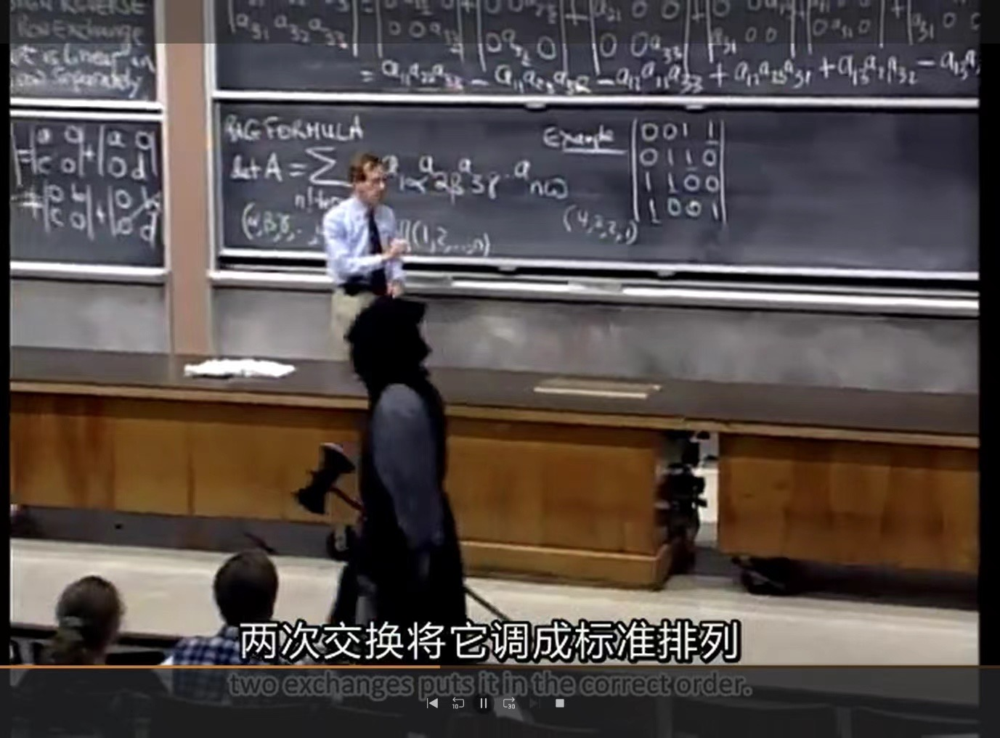

---
tags:
- 统计基础课
---

# 线性代数
> MATH120044，线性代数，吴肖乐

魅力无穷的一门课，每次听都要长一点脑子。

## 主要内容

- 行列式
- 矩阵
- 线性空间和线性映射
- 多项式空间
- 特征值
- 相似标准形
- 二次型

## 参考书
当初我们上课的时候用的是清华大学出版社居余马编著的《线性代数》，听的是山东大学的公开课（虽然疫情线上课真的烦，但山大的公开课是真不错）。后来我也看过闻名在外的Gilbert Strang的公开课，书写的也不错。另外还看过复旦出版社姚慕生主编的高等代数学，也是不错的书。
## 体会
线性代数是一门很有趣同时很实用的课程。从这里出发会引发很多的疑问进而发现更广阔的天地。

## 公开课
### [山东大学MOOC 线性代数](https://www.icourse163.org/course/SDU-55001)
当初疫情时期我们看的就是这个网课（哭），但课也确实是好课，山大牛B。

### [MIT 18.06 | Spring 2010 | Undergraduate](https://ocw.mit.edu/courses/18-06-linear-algebra-spring-2010/)
Gilbert Strang的公开课，算是世界闻名了。讲的内容和国内的略有差别，会涉及一些“高级内容”，比如FFT、Jordan标准型。我是有了基础再去看的，感觉很有趣，顺带学一学英文线性代数了。

<figure markdown>
{width=500}
<caption>圣诞节MIT刀斧手</caption>
</figure>