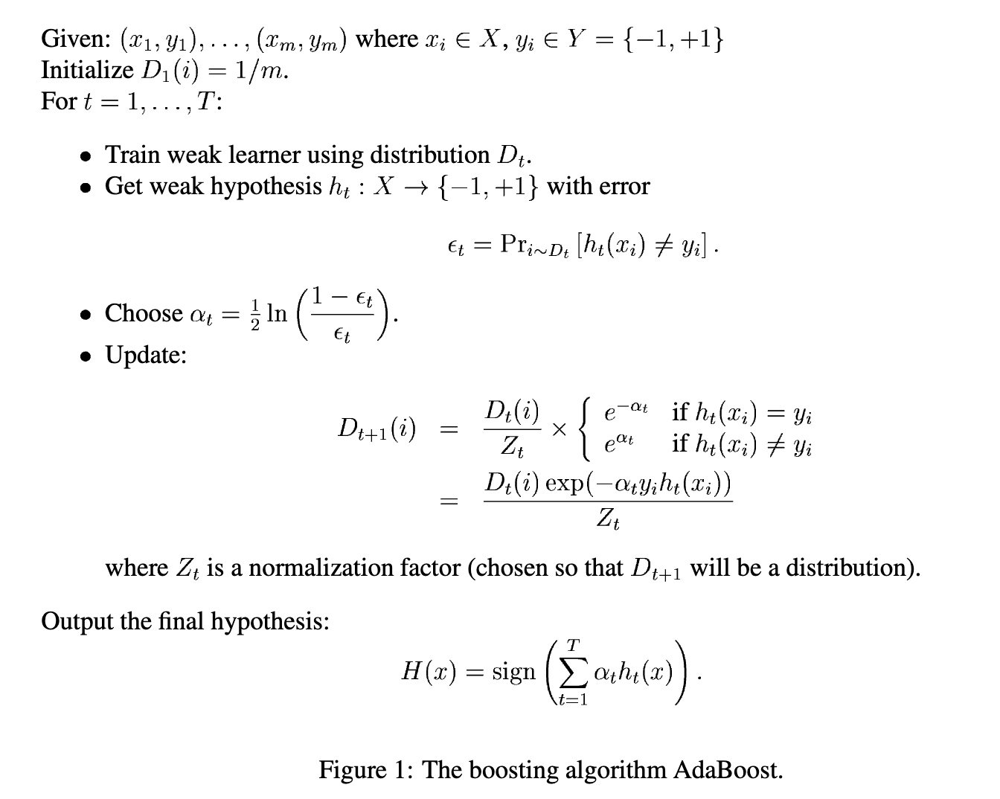
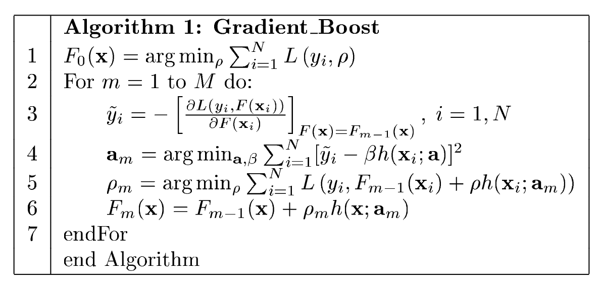
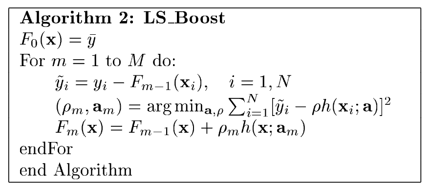
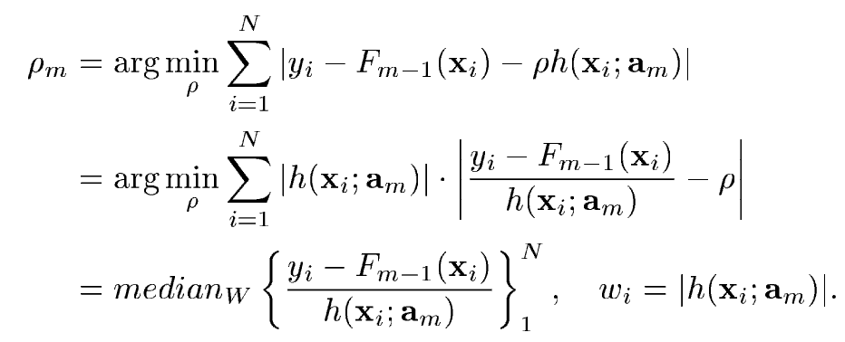
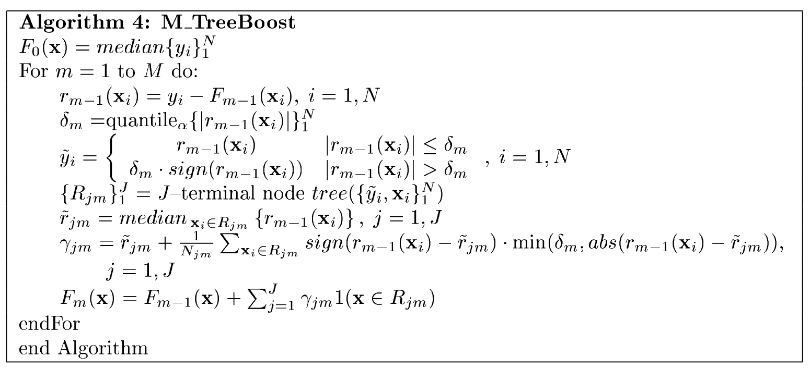
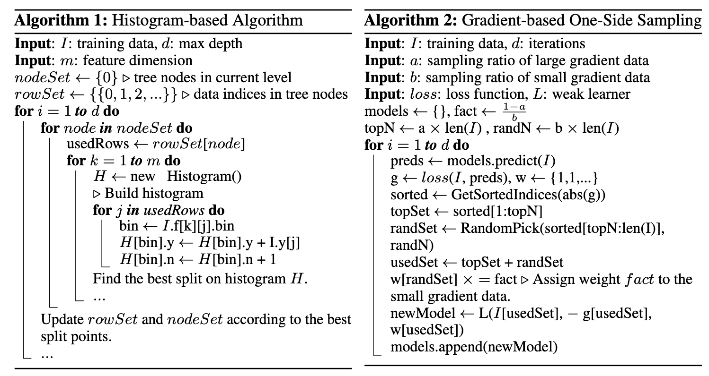
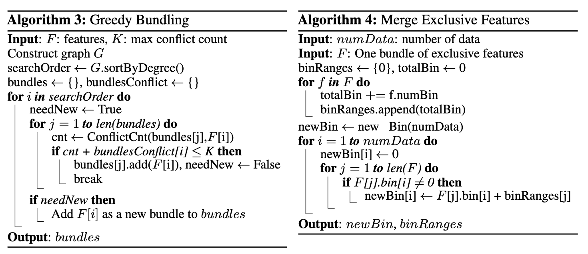

---
tags:
- ML
include:
- math
---

# Bagging & Boosting

集成学习（Ensemble learning）方法通过组合多种学习算法来获得比单独使用任何一种算法更好的预测性能。我们在介绍[树模型](./tree.md)的时候已经介绍了：

- Bagging
- Boosting
- Stacking
- Blending
- Voting

这五种集成方法，不过都是在树模型的语境下。实际上这些方法不仅仅可以用在树模型上，线性模型、SVM甚至是神经网络都可以使用集成学习方法来增强。

GPT帮我生成了一个简介：

|方法|核心思想|代表模型|优点|适合解决的问题|
|--|--|--|--|--|
|Bagging|并行训练多个模型+投票/平均|随机森林|减少方差|高方差、过拟合问题|
|Boosting|顺序训练，关注前一模型错误|AdaBoost, XGBoost|减少偏差|高偏差、欠拟合问题|
|Stacking|多模型组合+元学习器融合输出|自定义堆叠模型|融合多模型优点|提高泛化能力|
|Voting|多模型投票或概率平均|硬投票/软投票模型|简单快速|提高稳定性、粗略融合预测|

这里面最常用的就是接下来详细介绍的Bagging和Boosting。

## Bagging

> Bootstrap Aggregating

思想：通过对数据集进行有放回的抽样，生成多个训练子集，分别训练多个基学习器（通常是强方差、低偏差模型，如决策树），最后进行投票或平均。

### Random Forest

[随机森林](https://en.wikipedia.org/wiki/Random_forest)是最具代表的Bagging模型，其主要步骤是：

1. 数据采样（Bagging）：
    - 对训练集进行有放回的抽样（Bootstrap），生成多个不同的子训练集；
    - 每个子集用于训练一棵决策树。
2. 特征采样（Random Subspace）：
    - 在每棵树节点划分时，**随机选取部分特征**进行最佳划分选择（而不是使用全部特征）
3. 集成预测：
    - 分类问题：多数投票；
    - 回归问题：平均所有树的预测值。

!!! note
    👉 关键：随机性 + 多样性 提高了模型的泛化能力，减少了过拟合。

## Boost

思想：顺序训练多个基学习器，每一个新模型都在前一个模型基础上纠正其错误。适用于减少偏差。

Boost方法非常多样，最具代表性的两类就是：

- AdaBoost
- Gradient Boosting

### AdaBoost

[Adaptive Boost](https://www.face-rec.org/algorithms/Boosting-Ensemble/decision-theoretic_generalization.pdf)是1995年Freund和Schapir提出的算法。下面这张图（来自[这里](https://cseweb.ucsd.edu/~yfreund/papers/IntroToBoosting.pdf)）比较清晰地展示了AdaBoost的算法流程：

其中的核心就是给每个样本赋予**权重**，在迭代的过程中**重点关注那些被分类错误的样本**。

!!! question "权重怎么用？"
    这里有个细节：如何用加权的样本进行训练？

    一般情况下，我们只需要把权重引入到损失函数中即可：
    $$
    \text{Loss} = \sum_{i=1}^m D_t(i) \cdot \text{loss}(h(x_i), y_i)
    $$

    如果在某些模型/数据上做不到，还可以利用迭代的权重$D_t$对样本做重抽样。
    

### Gradient Boosting

[Gradient Boosting](https://jerryfriedman.su.domains/ftp/trebst.pdf)是1999年Friedman提出来的算法。核心步骤如下：

<figure markdown>
{width=600}
</figure>

本质上是在函数空间上的数值优化。每次我们寻找一个优化方向$h(x;a_m)$以及最佳的步长$\rho_m$.

注意，这里的损失函数可以取很多种形式，从而导出不同的梯度提升方法。

??? note "L2 Loss: LS Boost"
    最简单的情形是L2损失（Least square），此时负梯度为：
    $$
    -\frac{\partial L(y, F(x))}{\partial F(x)} = -\frac{\partial (y-F(x))^2}{\partial F(x)} = 2(y-F(x))
    $$

    > 注意，这是一个函数，而不是数值。忽略掉2这个缩放系数～

    然后，我们用另外一个基模型来拟合它：

    {width=500}

    不难发现，这实际上就是在不断**拟合残差**！

??? note "L1 Loss: LAD Boost"
    如果使用L1损失（Least absolute deviation），此时负梯度为：
    $$
    -\frac{\partial L(y, F(x))}{\partial F(x)} = -\frac{\partial |y-F(x)|}{\partial F(x)} = -\mathrm{sign}(y-F(x))
    $$

    依然，我们用一个基模型来拟合它。

    这里比较有意思的是，在L1损失下，最佳的步长有一个漂亮的形式（加权中位数）：

    <figure markdown>
    {width=500}
    </figure>

??? note "Huber Loss: M-Regression"
    为了处理长尾数据以及异常值，可以使用Huber Loss：
    $$
    L(y,F) = \begin{cases}
    0.5(y-F)^2&|y-F|\le \delta\\\\
    \delta(|y-F|-\delta / 2)&|y-F|\gt \delta\\\\
    \end{cases}
    $$

    此时可以导出：
    

### XGBoost

{width=300}

XGBoost（eXtreme Gradient Boosting）是2016年陈天奇等人提出的针对树算法的梯度提升框架。

算法的本质上和Gradient Boost没多大区别，Gradient Boosting 是算法思想，而 XGBoost 是该思想的一个高效实现，加入了正则、二阶导数、并行优化等工程改进。更多细节建议去看官方库的[文档](https://xgboost.readthedocs.io/en/stable/tutorials/model.html#)和[原始论文](https://arxiv.org/abs/1603.02754)。

我这里叙述一个简易版本：

??? note "XGBoost推导"
    设数据集$(x_i, y_i) \in (R^d, R)\quad \forall i\in \\{1,2,\cdots,n\\}$

    对于一个树模型$f(\cdot)$，可以做如下的reformulation：

    $$
    f_t(x) = w_{q(x)}
    $$

    其中$q: R^d\to \\{1,2,3,\cdots, T\\}$，把输入的特征映射到某一个叶子结点，$w_j$就是每个叶子结点的最终预测。

    在这个记号下引入$l_p$正则化：

    $$
    \Omega_p(f_t) = \gamma T + \frac{1}{2} \lambda \sum_{j=1}^T \mathcal{L}_p (w_j)
    $$

    在Boosting迭代的过程中，我们的目标函数是：

    $$
    \mathrm{obj_t}= \sum_{i=1}^n l(y_i, \hat{y_i}^{(t)}) + \Omega_p(f_t)
    $$

    其中
    $$
    \hat{y_i}^{(t)} = \hat{y_i}^{(t-1)} + f_t(x_i)
    $$
    是通过多个学习器累加得到的。换言之$f_t(x_i)$每次都会拟合残差。

    我们把损失函数做二阶展开：
    $$
    l(u, v) \approx l(u, v_0) + \frac{\partial l(u, v)}{\partial v}\mid_{v=v_0} (v-v_0) + \frac{1}{2}\frac{\partial^2 l(u, v)}{\partial v^2}\mid_{v=v_0} (v-v_0)^2
    $$
    记：
    $$
    \begin{aligned}
    &g_i = \frac{\partial l(u, v)}{\partial v}\mid_{v=v_0}\\\\
    &h_i = \frac{\partial^2 l(u, v)}{\partial v^2}\mid_{v=v_0}
    \end{aligned}
    $$

    代入$u=y_i, v=\hat{y_i}^{(t)}, v_0=\hat{y_i}^{(t-1)}$，得到：
    $$
    \begin{aligned}
    &\mathrm{obj_t} \\\\
    \approx& \sum_{i=1}^n \left [l(y_i, \hat{y_i}^{(t-1)}) +g_i (\hat{y_i}^{(t)} - \hat{y_i}^{(t-1)}) +\frac{1}{2} h_i (\hat{y_i}^{(t)} - \hat{y_i}^{(t-1)})^2 \right]  + \Omega_p(f_t)\\\\
    \approx& \sum_{i=1}^n \left [g_i f_t(x_i) +\frac{1}{2}h_i f_t^2(x_i) \right]  + \Omega_p(f_t) + \mathrm{const}\\\\
    \approx& \sum_{i=1}^n \left [g_iw_{q(x_i)}  +\frac{1}{2}h_i w_{q(x_i)}^2 \right]+ \Omega_p(f_t) + \mathrm{const}\\\\
    \approx& \sum_{j=1}^T \left [(\sum_{i: q(x_i) = j} g_i) w_j  + \frac{1}{2}(\sum_{i: q(x_i) = j} h_i) w_j^2 \right] + \gamma T + \frac{1}{2} \lambda \sum_{j=1}^T \mathcal{L}_p (w_j) + \mathrm{const}
    \end{aligned}
    $$

    记：
    $$
    \begin{aligned}
    &G_j = (\sum_{i: q(x_i) = j} g_i) \\\\
    &H_j = (\sum_{i: q(x_i) = j} h_i)
    \end{aligned}
    $$

    不妨先取$l_2$正则化，那么：
    $$
    \mathrm{obj_t} \approx \sum_{j=1}^T \left [ G_j w_j  + \frac{1}{2}H_j w_j^2 \right] + \gamma T + \frac{1}{2} \lambda \sum_{j=1}^T w_j^2 + \mathrm{const}
    $$
    也就是：
    $$
    \mathrm{obj_t} \approx \sum_{j=1}^T \left [ G_j w_j  + \frac{1}{2}(H_j + \lambda) w_j^2 \right] + \gamma T + \mathrm{const}
    $$

    这个式子关于每个叶子节点$w_j$都是二次函数，立即得到最优解：
    $$
    w_j^\dagger = -\frac{G_j}{H_j+\lambda}
    $$
    此时目标函数值为：
    $$
    \mathrm{obj_t}^\dagger = -\frac{1}{2} \sum_{j=1}^T\frac{G_j^2}{H_j+\lambda} + \gamma T
    $$

    这就是一棵树最优的损失：

    <figure markdown>
    {width=500}
    <figure>

    在**单棵树生长**的过程中，我们也可以使用推导出的最优损失来计算增益，从而选择最优的分裂节点：
    $$
    \mathrm{gain} = \frac{1}{2} \left[\frac{G_L^2}{H_L+\lambda}+\frac{G_R^2}{H_R+\lambda}-\frac{(G_L+G_R)^2}{H_{L}+H_R+\lambda}  \right] - \gamma T
    $$
    或者等价的：
    $$
    \mathrm{gain} = \frac{G_L^2}{H_L+\lambda}+\frac{G_R^2}{H_R+\lambda}-\frac{(G_L+G_R)^2}{H_{L}+H_R+\lambda}
    $$

### LightGBM

{width=300}

[LightGBM](https://lightgbm.readthedocs.io/en/stable/)是微软发布的Gradient Boosting框架，主要基于发表在NIPS 2017上的一篇[文章](https://papers.nips.cc/paper_files/paper/2017/hash/6449f44a102fde848669bdd9eb6b76fa-Abstract.html)。听名字也能感受到，LGBM主打一个**轻量化**，速度非常快！

LGBM和XGBoost的异同可以看一下[这篇文章](https://neptune.ai/blog/xgboost-vs-lightgbm)以及官方提供的[Features解读](https://github.com/microsoft/LightGBM/blob/master/docs/Features.rst)。

LGBM的主要贡献就是下面四个算法：

??? note "LGBM细节"
    1. 基于直方图的节点分裂：加速、节省内存，但是牺牲一定的精度
        - 注意这里生长的时候是leaf-wise的，一次只长一个叶子结点，这样可以提高精度，但是牺牲一定的泛化性
        - 而XGBoost是level-wise的，一次长一层
    2. GOSS：基于梯度的降采样
        - 保留梯度（在L2损失下就是残差）较大的样本，和AdaBoost想法类似
        - 降采样梯度较小的样本，它们已经学的比较好了
        - 如此可以极大减少样本量，提高训练速度
        
    3. Greedy Bundling：贪心算法求解变量捆绑问题
        - 寻找可以捆绑在一起的变量
        - 例如`x=[1,0,0,0]`, `y=[0,0,1,1]`，可以发现这两个变量**不会在同一个位置取到非零**
        - 那么它们完全可以合并为`z=[1,0,2,2]`
    4. Merge Exclusive Features：合并打包的变量
        - 对于找到的可以捆绑的变量，把它们merge为一个变量
        - MEF这块可以看一看这位大佬的[知乎专栏](https://zhuanlan.zhihu.com/p/366234433?ivk_sa=1024320u)
        - 这两个算法主要是为了解决**高维数据稀疏**的问题，通过变量的合并降低维度实现加速
        

此外，LGBM还对类别变量做了[特别支持](https://github.com/microsoft/LightGBM/blob/master/docs/Features.rst#optimal-split-for-categorical-features)，直接看GPT的回答吧：

??? chatgpt-summary "LGBM对类别变量有什么优化？"
    LightGBM 对类别变量（categorical features）做了非常高效的原生优化，这也是它相比其他框架（如 XGBoost）的一大优势。你不需要进行独热编码（one-hot）或标签编码（label encoding），它可以直接处理类别特征，并且处理得更快、更准。

    #### 1. 原生支持类别特征

    LightGBM 可以直接接收类别特征的列，无需手动编码，只需告诉它哪些列是类别变量（比如用 categorical_feature 参数）。

    #### 2. 直方图分桶

    LightGBM 不按数值顺序去分裂类别变量（因为类别没有自然的大小关系），而是使用以下策略来做分裂：

    > 原理：类别排序 + 二元分裂

    1.	按类别聚合梯度统计
        - 计算每个类别上的样本的 梯度之和（g）和 Hessian 之和（h）
    2.	对类别按某种指标排序
        - 通常是按 g / h 或 g 值排序，代表每个类别对目标的影响力
    3.	将类别集合二分
        - 试出不同的切分点（类似于数值型的分裂点），从而找到最大增益的分裂方式。

    这种方式叫做 Greedy Grouping（贪婪分组），可以有效找到对目标最有影响的类别组合。

    #### 3. 比 one-hot 编码更快更准

    |方法|缺点|LightGBM 的优势|
    |--|--|--|
    |One-hot|维度爆炸，稀疏矩阵，训练慢|不增加维度，速度快|
    |Label encoding|编码有隐含顺序，引入伪关系|不依赖编码顺序，基于统计分裂|

    #### 举个例子

    假设一个“颜色”特征有 4 个类别：[Red, Blue, Green, Yellow]

    1.	LightGBM 会统计这四个颜色的梯度信息（残差）
        - 比如：Red=0.5, Blue=1.2, Green=0.1, Yellow=-0.6
    2.	然后按照这些值进行排序，比如：[Yellow, Green, Red, Blue]
    3.	尝试将这些类别切分成两组，比如：[Yellow, Green] vs [Red, Blue]
    4.	分裂点选取依据是哪个划分带来最大增益（information gain）
