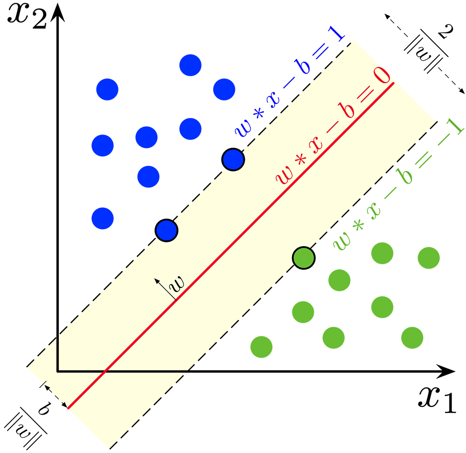
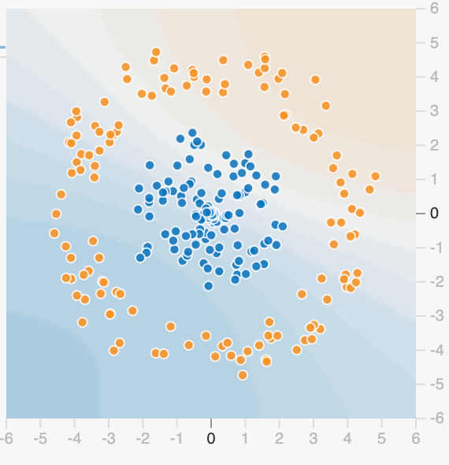
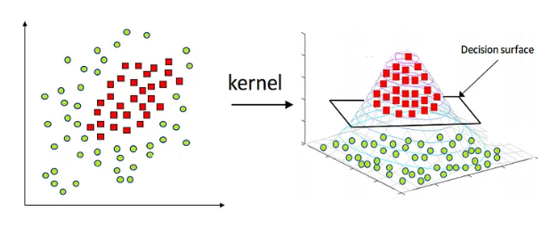

---
tags:
- ML
include:
- math
---

# SVM

支持向量机（support vector machine, SVM）是除了树模型之外另一大经典机器学习算法。

## 想法

对于一个二分类问题，支持向量机的想法非常简单，假设数据是**线性可分**的，我们只需要找到一个最优的**划分超平面**即可。

<figure markdown>

{width=400}

<figurecaption>SVM图解</figurecaption>
</figure>

## 硬间隔

### 最优性定义

==问题是如何定义最优==？

!!! info
    不难发现，划分超平面附近事实上成为了两个类别的**隔离带**，因此朴素的想法是这个隔离带的宽度应该尽量大。

    并且我们最终定义的划分超平面应该尽量远离两侧的样本，因此隔离带的中线是个不错的选择。

### Formulation

假设数据是线性可分的（可以找到一个隔离带），那么总存在图示的两条边界：

$$
w^Tx - b = 1, \quad w^Tx - b = -1
$$

!!! note
    在这两条边界上的数据称为**支持向量**。

> 为了使得右侧的系数为$\pm 1$，我们需要一定的缩放。根据对称性，这总是可以做到的。

以及隔离带的中间超平面$\alpha$：

$$
w^Tx - b = 0
$$

这个时候我们可以计算出两个边界超平面的间隔为：
$$
\frac{2}{\sqrt{w^Tw}}
$$

这就是我们最开始说的隔离带宽度。

因此，我们只需要找到最大的间隔，然后取整个隔离带的中线即可。于是我们得到了优化模型：

$$
\begin{aligned}
&\max_{w,b} \quad \frac{2}{\sqrt{w^Tw}}\\\\
s.t. &\quad y_i(w^Tx_i-b) \ge 1
\end{aligned}
$$

其中$(x_i, y_i)$是训练数据，$y_i \in \\{ 1, -1 \\}$是样本的标签。

### 拉格朗日乘子法

显然，之前的优化问题等价于：

$$
\begin{aligned}
&\min_{w,b} \quad \frac{1}{2} w^Tw\\\\
s.t. &\quad y_i(w^Tx_i-b) \ge 1
\end{aligned}
$$

这是一个美好的凸优化，形式也很简洁。不过为了更加高效求解，我们来寻找它的对偶问题。

令拉格朗日乘子函数为：

$$
L(w, b, a) = \frac{1}{2} w^Tw + \sum_{i} a_i(1- y_i(w^Tx_i - b))
$$

其中$a_i\ge 0$是拉格朗日乘子。

令
$$
\frac{\partial L}{\partial w} = \frac{\partial L}{\partial b} = 0
$$
得到：

$$
w = \sum_i a_iy_ix_i,\quad \sum_i a_iy_i = 0
$$

把这些条件带入拉格朗日函数，得到对偶问题：

$$
\begin{aligned}
&\min_{\vec{a}} \quad \sum_i a_i - \frac{1}{2} \sum_i \sum_j (a_ia_jy_iy_j) \cdot  x^T_ix_j \\\\
s.t. &\quad \sum_i a_iy_i = 0, \quad a_i\ge 0
\end{aligned}
$$

KKT条件如下：

$$
\begin{aligned}
&a_i\ge 0\\\\
&y_i(w^Tx_i - b)\ge 1\\\\
&a_i\left [y_i(w^Tx_i - b) - 1\right] = 0
\end{aligned}
$$

换言之
$$
a_i = 0 \quad \text{或者} \quad y_i(w^Tx_i - b) = 1
$$

也就是说，最终$a_i\ne 0$的那些样本，都是在边界上的**支持向量**。

求解完对偶问题，我们就可以得到:

$$
w = \sum_i a_iy_ix_i
$$

实际上，我们知道这个式子中只会包含支持向量：

$$
w = \sum_{i \in S} a_iy_ix_i
$$

接下来只需要使用KKT条件即可求解$b$:

$$
a_i\left [y_i(w^Tx_i - b) - 1\right] = 0
$$

同样的，只需要找出支持向量的那些下标：

$$
y_i(w^Tx_i - b) = 1 \quad \forall i \in S
$$

带入之前求解的$w$得到:

$$
y_k(\sum_{i \in S} a_iy_ix_i^Tx_k - b) = 1 \quad \forall k \in S
$$

实践中，我们就取：

$$
b = \frac{1}{|S|} \sum_{k \in S} (y_k - \sum_{i \in S} a_iy_ix_i^Tx_k)
$$

## 核函数

显然，数据一般很难是线性可分的，例如下面这样一组数据：

<figure markdown>

{width=300}

<figurecaption>线性不可分数据</figurecaption>
</figure>

### 映射

这时候分类的边界是一个闭合的曲线，但我们依然可以用SVM来解决这个问题，只不过需要把源数据映射到另外一个空间：

不妨设映射为$\phi$，那么优化问题变为：
$$
\begin{aligned}
&\min_{w,b} \quad \frac{1}{2} w^Tw\\\\
s.t. &\quad y_i(w^T\phi(x_i)-b) \ge 1
\end{aligned}
$$

其对偶问题为：

$$
\begin{aligned}
&\min_{\vec{a}} \quad \sum_i a_i - \frac{1}{2} \sum_i \sum_j (a_ia_jy_iy_j) \cdot  \phi(x_i)^T\phi(x_j) \\\\
s.t. &\quad \sum_i a_iy_i = 0, \quad a_i\ge 0
\end{aligned}
$$

求解后得到分类超平面：

$$
f(x) = w^T\phi(x) + b = \sum_i a_iy_i \phi(x_i)^T\phi(x) + b
$$

其中

$$
b = \frac{1}{|S|} \sum_{k \in S} (y_k - \sum_{i \in S} a_iy_i \phi(x_i)^T\phi(x_k))
$$

### 核技巧

不难发现，不论是对偶问题的求解，还是最终分类超平面的计算，==都只需要计算内积$\phi(x_i)^T\phi(x_j)$，而不需要$\phi(\cdot)$本身==。这被称为核技巧（kernel trick）。

因此，我们实际上只需要定义一个核函数：
$$
\kappa(\cdot,\cdot)
$$
满足内积的一些性质即可。

!!! theorem "核函数"
    $\kappa$是核函数，当切仅当对于任意数据$x_i, \quad i=1,\cdots, m$，核矩阵
    $$
    K = [\kappa(x_i,x_j)]_{m\times m}
    $$
    是半正定的。

常用的核函数如下：

- 线性核
    - $\kappa(x_i,x_j) = x_i^Tx_j$
- 多项式核
    - $\kappa(x_i,x_j) = (x_i^Tx_j)^d$
- 高斯核，也称为RBF核
    - $\kappa(x_i,x_j) = \exp(-\lVert x_i-x_j \rVert ^2 / (2\sigma^2))$
- 拉普拉斯核
    - $\kappa(x_i,x_j) = \exp(-\lVert x_i-x_j \rVert / \sigma)$
- Sigmoid核
    - $\kappa(x_i,x_j) = \tanh(\beta x_i^Tx_j + \theta)$

核函数还可以进行组合。

如果$\kappa_1$和$\kappa_2$都是核函数，那么

- $$\gamma_1 \kappa_1 + \gamma_2 \kappa_2$$也是核函数。
- $$(\kappa_1 \otimes \kappa_2)(x,z) = \kappa_1(x,z)\kappa_2(x,z)$$也是核函数。

此外对于任意其他函数$g$
$$
\kappa(x,z) = g(x)\kappa_1(x,z)g(z)
$$

也是核函数。

## 软间隔

当然，即使使用了核函数，数据依然可能不是线性可分的。如果强硬要求线性可分，可能会导致**过拟合**。

这时候通常我们可以考虑使用软间隔，也就是放宽对划分超平面的要求，允许一些样本出错。

具体来说，优化问题转化为：

$$
\begin{aligned}
&\min_{w,b} \quad \frac{1}{2} w^Tw + C\sum_i  l_{0/1} \left(y_i (w^Tx_i-b)-1 \right)
\end{aligned}
$$

其中$C$是惩罚系数，$l_{0/1}$是损失函数，定义为：
$$
l_{0/1}(z) = \mathbb{I}(z\lt 0)
$$

当然，我们可以用更加光滑的函数来代替它：

- hinge损失：$\max(0,1-z)$
- 指数损失：$\exp(-z)$
- 对率损失：$\log(1+\exp(-z))$

除了分类问题，SVM还可以求解回归问题（线性回归就是寻找超平面的过程）。

我们只需要使用软间隔，惩罚在间隔外的样本从而找到最佳的超平面即可。
