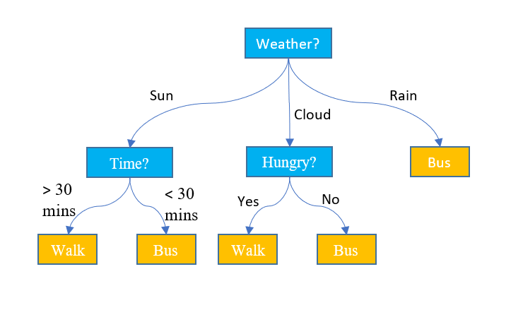
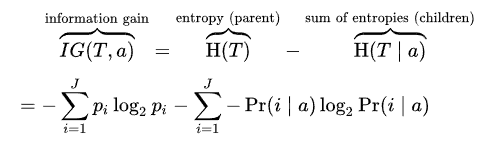
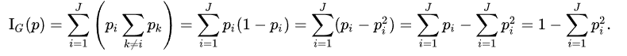
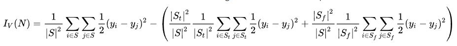
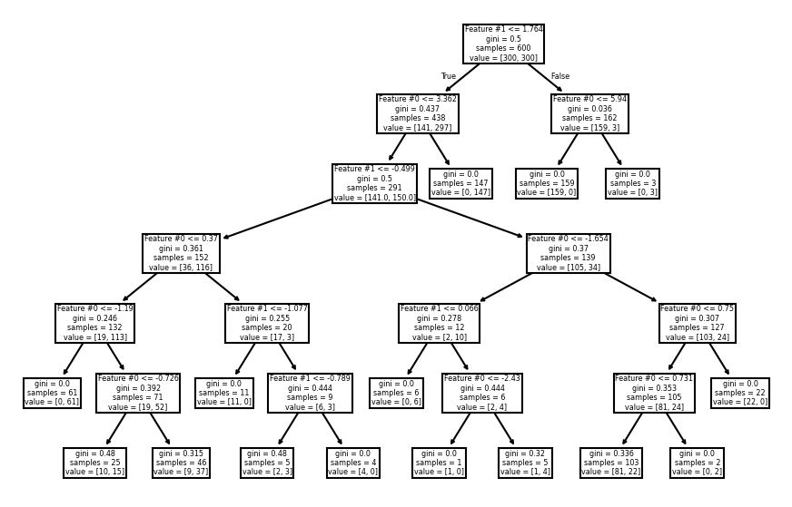
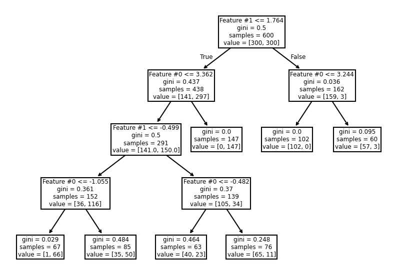
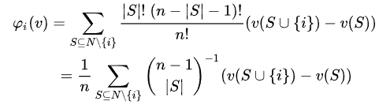
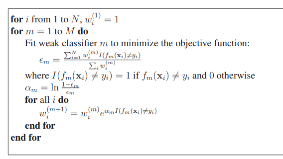

---
tags:
- ML
include:
- math
---

# 树模型

树模型可谓是机器学习领域的“常青树 🌲”，统治力相当于统计里的线性模型。

很多时候我们把树模型（尤其是分类树）和“决策树”这个概念混用。然而后者在决策和运筹领域大概早就存在了：

<figure markdown>

</figure>

## “香草味”树

> vanilla decision tree = 最简单的决策树

树模型本质上就是通过一系列的 if-else 规则判断得到一棵二叉树（也可以是多分叉，不过我们只讨论二叉树的情况）。通过这样的规则离散化可以把数据划分为若干组。

- 如果任务是分类，就给每一个组分配一个标签（通常用组内的众数）。
- 如果任务是回归，就给每一个组分配一个数值（通常用组内的均值）。

通常树模型只用来做这两类任务。

### 如何训练

树模型的想法简单易懂，那么我们如何[构建出一棵树](https://scikit-learn.org/stable/modules/tree.html#tree-algorithms-id3-c4-5-c5-0-and-cart)呢？

#### ID3 算法

> 一般用于分类树的构建

这是最早的树学习算法，核心思想是在构建二叉树的过程中，每个分枝节点都遵守**最大区分**原则：也就是可以把不同类别的数据区尽可能区分开。而衡量区分度的指标就是**信息增益**。具体来说信息增益 IG(S,A)定义为集合 S 选取 A 属性作为分枝节点可以使得**分类结果的熵下降多少：**

<figure markdown>

</figure>

#### C4.5 算法

ID3 算法只能处理离散型属性；并且容易产生过拟合 (Overfitting)，因为它倾向于创建深度很大的树；对缺失值处理不佳。它的改进版 C4.5 算法稍微缓解了这些问题，不过也只是小修小补，大差不差。

#### CART

> Classification and Regression Tree，可以用于分类和回归问题

- 对于分类树，使用 **Geni 不纯度**作为分枝节点的选取指标。
  Geni 不纯度和熵类似，它定义为：

    <figure markdown>
    
    </figure>

含义是各个类在离散均匀分布（或者叫完全随机）的情况下，分类错误的概率的期望，也就是上面的$\sum p_i (1-p_i)$

- 对于回归树，使用**方差减少**作为分枝节点的选取指标。
    方差减少的定义也很直观：
    <figure markdown>
    
    </figure>
    含义是：集合 S 分枝为 T 和 F，前后方差的减少。

这里面

$$
\begin{aligned}
&\frac{1}{|S|^2}\sum_i \sum_j \frac{1}{2}(y_i-y_j)^2 \\\\
= &\frac{1}{|S|^2}\sum_i \sum_j \frac{1}{2} (y_i^2+y_j^2-2y_iy_j)\\\\
=&\frac{1}{|S|^2}\sum_i \frac{1}{2}(|S|y_i^2+\sum_j y_j^2 - 2y_i \sum_j y_j) \\\\
= &\frac{1}{|S|^2}\frac{1}{2}(|S|\sum_i y_i^2+|S|\sum_j y_j^2 - 2\sum_i y_i \sum_j y_j) \\\\
= &\frac{1}{|S|}(\sum_i y_i^2-\left[\sum_i y_i^2\right]^2)
\end{aligned}
$$

其实就是最常见的样本方差

#### 其他算法

OC1：在每个节点寻找一个超平面把样本空间一分为二，超平面可以是多个变量的线性组合。可以看成是多变量分枝。

CHAID：不构建二叉树，而是每次构造多个分叉而后使用卡方检验来作为分叉的指标。

### 树的[超参数](https://inria.github.io/scikit-learn-mooc/python_scripts/trees_hyperparameters.html)

树模型最主要的超参数就是树的高度（**max_depth**）。一般情况下越高的树就越不稳定，所以我们会限制这个参数。

此外默认情况下，构建出的树会呈现出比较对称的形态。

<figure markdown>

</figure>

当然，我们还可以通过调整**min_samples_split **和** min_samples_leaf**来减少不必要的分枝，从而构建出非对称的树。

<figure markdown>

</figure>

### 特征重要性排序

#### 基于信息增益或者 Geni 不纯度或者方差减少

每个节点在分枝的时候已经计算了这些指标，只需要统计每个特征带来的这些指标的总计提高（信息增益增加值、geni 不纯度减少值、方差减少总和等）就行了。

#### Permutation Importance

想法很简单：要衡量一个变量的重要性，最简单的方法就是我**把这个变量去掉**看模型变差多少。

如果是在训练时做这个事情可能太贵了（例如 m 个特征，每次进行缺一特征的学习，需要 m 次）

所以通常做法是，在全数据集上训练完之后，**把某个变量的取值完全打乱**，然后把打乱的数据集输入模型计算指标的下降情况。

#### Shapley Value

> 这个概念来源于 Cooperative Game Theory，2012 年诺贝尔经济学奖

合作博弈论中 Shapley Value 是一种根据玩家对总收益的贡献来分配收益给玩家的方法。玩家们组成联盟（coalition）进行合作，并从这种合作中获得一定的收益。

在树模型里就是若干个变量一起参与了目标的预测，现在需要计算各自的贡献（也就是变量重要性）。

直观上，Shapley Value 就是衡量参与者带来的**边际收益**，其实和之前的 Permutation Importance 异曲同工：

<figure markdown>

</figure>

Shapley Value 是一个理论值，实际应用中需要一些算法进行估计。[SHAP](https://christophm.github.io/interpretable-ml-book/shap.html)就是一个比较常用的方法。

## 集成学习

这里只针对树模型做简短介绍。

### Bagging

> 方差缩减

Bagging 的核心想法就是三个臭皮匠顶一个诸葛亮。用 bootstrap（有放回抽样）的方法构造多个样本子集，并且用随机的超参数和特征组合构建多个较弱的模型，用它们输出的平均作为最终的预测。随机森林就是最经典的 Bagging 方法。通过随机性的引入，Bagging 模型可以有效减弱模型的过拟合问题，降低预测方差。

### Boosting

> 精度提升

Boosting 方法有 GradientBoost、AdaptiveBoost 以及在此基础上的很多变种。核心思想都是从较弱的模型出发通过不断迭代来提高模型的精度，降低偏差。

#### Gradient Boost

Gradient Boost 方法的核心想法源于梯度下降法，每一步迭代都在现有的模型基础之上“走一步”：

$$
t = F_{t-1} + h_t
$$

换言之，我们每次预测的都是先有模型和预测目标之间的残差：

$$
t \approx y-F_{t-1}
$$

最终得到的模型是迭代过程中一系列模型的加和：

$$
= \sum_{t=0}^T F_t
$$

#### Adaptive Boost

Adaptive Boost 方法的核心是给每个样本赋予权重，在迭代的过程中重点关注那些被分类错误的样本。有了权重之后，求分枝节点的时候就可以使用带权重的指标从而提高模型的性能。

权重更新的伪代码如下：

<figure markdown>

</figure>

最终得到的模型是迭代过程中所有模型的加权和：

$$
F = \sum_{m}^M \alpha_m f_m
$$

### Stacking & Blending

> 这些被称为元集成方法 (Meta-Ensemble Method)

Stacking 的核心想法是学习一个**元模型**来融合多个**基础模型**的预测结果，而不是简单的求和、加权：

- 数据集拆分为 train set 和 test set
- 在 train set 上，使用 k-fold 交叉训练 k 个基础模型。f_{1,2,3,...,k}，得到每个 fold 的预测值 f_1(fold 1), f_2(fold 2)...作为**元特征**
- **只用此前在 train set 上得到的元特征**来训练元模型

Blending 和 Stacking 几乎一致，只不过做了简化：

- 数据集拆分为 train validation 和 test
- 在 train set 上训练基础模型
- 用基础模型在 validation set 上做预测，得到元特征
- 用元特征训练元模型

> 注：一般情况下，元模型只输入元特征（基础模型的预测值），而不会输入原始特征

### Voting

Voting 可以视作更加宽泛的 Bagging 方式。我们可以用多个不同的模型（决策树、SVM、神经网络等）来预测同一个目标，然后使用这些模型的 voting 结果作为最终预测。
