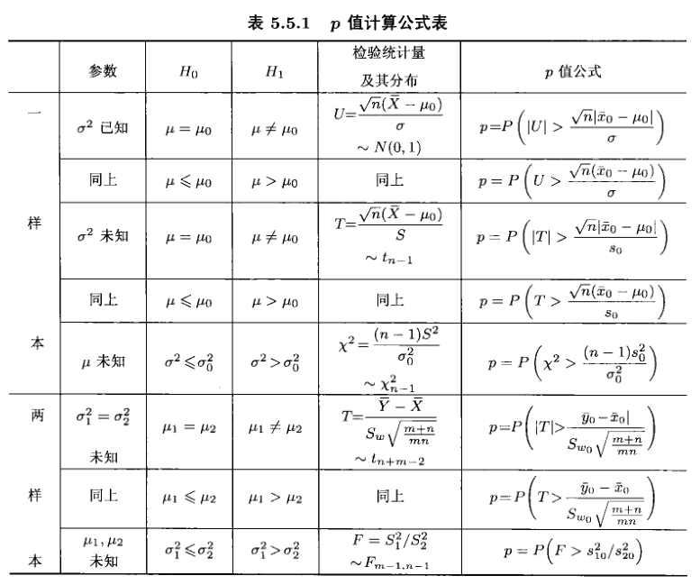

---
tags:
- Statistics
- ML
include:
- math
---

# 假设检验
> 主体内容来自韦来生的《数理统计》

参数估计和假设检验是**统计推断**的两个主要形式。这篇文章旨在介绍假设检验的相关概念。

所谓的假设检验（Hypothesis Testing）就是通过**样本**来检验**总体**分布是否具有某种性质的过程。

假设检验通常分为**参数假设检验**和**非参数假设检验**。

前者会对总体分布进行参数化建模，假设检验的计算过程依赖这些模型和参数；后者则不会对总体分布进行建模，使用分布无关的方法进行计算分析。

此外Bayes学派也有类似的概念，在Bayes统计中有两种统计推断的框架：

- 直接通过后验分布来进行统计推断
- 用统计决策的方法，构建损失函数，最小化损失来进行统计推断

这两种框架也有各自的假设检验方法。

## 参数假设检验

### 概念构建

假设总体分布是$f(\theta), \quad \theta \in \Theta$，$X$是总体的简单随机样本，$x$是样本的一个实现。

参数化假设检验当中我们会对参数提出一个问题，形如：
$$
H_0: \theta \in \Theta_0 \quad \longleftrightarrow \quad  H_1: \theta \in \Theta_1 = \Theta - \Theta_0
$$

- 其中$\Theta$是参数空间，如果$\Theta_0$只包含参数空间的一个点称为简单假设，否则是复合假设。
- $H_0$称为原假设（或零假设），$H_1$称为备择假设。

为了回答我们提出的问题，比较一般的假设检验过程是：

1. 构造$\theta$的一个点估计量$T(X)$（也称为检验统计量）
2. 构造否定域$D$（或者说是检验函数$\phi(x)$），其中临界值$A$待定
    - 例如对于$H_0: \theta = 0$这样的假设，一个合理的否定域是：$|\hat{\theta}| \gt A$
    - 或者说合理的检验函数是：
        $$
        \phi(x) = \begin{cases}
        1 \quad |T(x)|\gt A\\\\
        0 \quad |T(x)|\le A
        \end{cases}
        $$
3. 在一定的显著性水平下，利用统计量的抽样分布求得合适的临界值
    - 假设检验是一个抽样的过程，以小见大。但由于抽样的随机性，错误在所难免。
    - 通常有两类错误：
        - 一类错误：弃真（原假设是对的，但是我们错误地拒绝了它；也称为假阳）
        - 二类错误：取伪（原假设是不对的，但是我们没有拒绝它；也称为假阴）
    - 根据检验函数的定义，我们可以计算功效函数：
        $$
        \beta_\phi (\theta) = \mathrm{P_\theta}\left\\{ \text{用检验}\phi \text{否定了}H_0 \right\\} = E_{\theta}(\phi(X))
        $$
    - 那么假设检验错误的概率分别为：
        - 一类错误：$\alpha = \beta_\phi(\theta)\quad \theta\in\Theta_0$
        - 二类错误：$\beta = 1-\beta_\phi(\theta)\quad \theta\in\Theta_1$
    - 一、二类错误，顾此失彼，无法兼顾。通常我们遵循Neyman-Pearson原则：**在控制犯一类错误概率的情况下，最小化犯二类错误的概率即可。**在这个原则下，犯一类错误的概率是有保障的。换言之，我们倾向于保护原假设，不让它被轻易否定。
    - 我们把犯一类错误的概率上限称为检验的水平：
        $$
        \alpha^* = \sup \left\\{ \beta_\phi(\theta), \quad \theta \in \Theta_0 \right\\}
        $$
4. 对于特定的样本实现，计算统计量和临界值的关系，最终给出假设检验的结论

### p-value
假设检验的结论比较单薄，只是“拒绝”或者“不拒绝”原假设。

而很多时候，我们希望能量化假设检验“拒绝的力度”，也就是我们做出最终结论的把握。

为此，我们可以使用p-value。

严格来说p-value是一个统计量：$p(X)$，它满足：
$$
\mathrm{P_\theta}(p(X) \le \alpha) \le \alpha, \quad \forall \theta \in \Theta_0 ,0\le \alpha \le 1
$$

也就是说，原假设成立的情况下，$p(X)$比$\alpha$小的概率有保障。

这时，我们就可以基于这个统计量构造一个水平为$\alpha$的检验了：
$$
\phi(X) = \text{如果} p(X)\le \alpha \text{就拒绝}H_0
$$
这时候，根据$p(X)$的性质，显然我们的检验水平至少是$\alpha$。

那么问题来了，如此美好的统计量哪里找呢？

实际上有一个直观的构造：

!!! theorem
    设$T(X)$是一个检验统计量。
    
    如果当$T$很大的时候我们会拒绝原假设
    > 换言之，否定域的形式为：$D(X) = \\{X\mid T(X) \gt A\\}$

    那么，对于给定的样本实现$x$，定义（单边p值）
    $$
    p(X) = \sup_{\theta \in \Theta_0} \mathrm{P_\theta}(T(X) \gt T(x))
    $$
    就是一个满足定义的p-value了。

    如果当$|T|$很大的时候我们会拒绝原假设
    > 换言之，否定域的形式为：$D(X) = \\{X\mid |T(X)| \gt A\\}$

    那么，对于给定的样本实现$x$，可以定义（双边p值）
    $$
    p(X) = \sup_{\theta \in \Theta_0} \mathrm{P_\theta}(|T(X)| \gt |T(x)|)
    $$

从这个定理，p-value的涵义也比较显然了：在原假设成立的情况下，得到**现有样本或者更加极端的样本**（当然，我们只是计算了统计量）的概率不会超过p-value。

在实际的应用中，p-value如果很小，小于我们的显著性水平$\alpha$（通常是0.05）。这说明样本在原假设下非常极端，这往往是不太可能的，那么我们就有充分的理由拒绝原假设。

常用的正态总体假设检验p-value列表如下：

### 单正态总体假设检验
均值的$t$检验：

方差的$\chi^2$检验：

### 两正态总体假设检验
均值的$t$检验（又称两样本$t$检验）：

方差的$F$检验：

Benhrens-Fishier问题（两总体方差均未知，对均值的检验）：

- 如果样本量足够大$m,n \to \infty $：

$$
U^* = \frac{(\bar{Y}- \bar{X})-(\mu_2-\mu_1)}{\sqrt{S_1^2/m+S_2^2/n}} \to^{d} N(0,1)
$$

- 对小样本情形有近似：

$$
\frac{(\bar{Y}- \bar{X})-(\mu_2-\mu_1)}{\sqrt{S_1^2/m+S_2^2/n}}  \sim^* t(r)
$$

其中
$$
r = \left[\frac{S_1^2}{m}+\frac{S_2^2}{n}\right]^2 \large{/} \left[ \frac{S_1^4}{m^2(m-1)} + \frac{S_2^4}{n^2(n-1)} \right]
$$

### 多元正态假设检验

单个多元正态总体的均值双边检验：[Hotelling's T-square test](https://en.wikipedia.org/wiki/Hotelling%27s_T-squared_distribution)（当然，这时也可以使用似然比检验的方法）

多个多元正态总体的均值向量比较：

- 两总体：[Hotelling's T-square test](https://en.wikipedia.org/wiki/Hotelling%27s_T-squared_distribution)
- 多总体单因子：[ANOVA+F检验](https://en.wikipedia.org/wiki/Analysis_of_variance)
- 多总体多因子：[MANOVA+似然比检验](https://en.wikipedia.org/wiki/Multivariate_analysis_of_variance)

### 似然比检验
似然比检验在假设检验中的地位，相当于极大似然估计在点估计中的地位。

对假设检验问题：
$$
H_0: \theta \in \Theta_0 \quad \longleftrightarrow \quad  H_1: \theta \in \Theta_1 = \Theta - \Theta_0
$$
我们定义似然比统计量：
> 注意这个定义下恒有$\lambda(x)\ge 1$，也有取倒数的定义

$$
\lambda(x) = \frac{\sum_{\theta\in\Theta} f(x,\theta)}{\sum_{\theta\in\Theta_0}f(x,\theta)}
$$

定义似然比检验：
$$
\phi(x) = \begin{cases}1&\lambda(x) \gt c \\\\ r&\lambda(x)= c \\\\ 0 &\lambda(x) \lt c\end{cases}
$$

似然比统计量有一个美好的渐进分布：

!!! theorem "Wilks定理"
    设$\Theta$的维度是$k$，$\Theta_0$的维度是$s$，如果$k-s=t\gt 0$，并且样本的概率分布满足一定的正则条件，那么
    $$
    2\log \lambda(x) \to^d \chi^2_t \quad \text{as} \quad n\to \infty 
    $$

利用这个定理我们就可以在大样本场景使用似然比检验得到很多美好的结果了。

### NP基本引理

!!! theorem "NP基本引理"
    设样本$X$的分布有概率函数$f(\boldsymbol{x},\theta)$,参数$\theta$只有两个可能的值$\theta_0$和$\theta_1$,考虑下列检验问题：

    $$H_0:\theta=\theta_0\leftrightarrow H_1:\theta=\theta_1$$

    则对任给的$0<\alpha<1$有：

    (1) 存在性. 对上述检验问题必存在一个检验函数$\varphi(\boldsymbol{x})$及非负常数$c$和$0\leqslant r\leqslant1$,满足条件

    (i)

    $$
    \varphi(\boldsymbol{x})=
    \begin{cases} 
    1,&f(\boldsymbol{x},\theta_1)/f(\boldsymbol{x},\theta_0)>c,\\\\
    r,&f(\boldsymbol{x},\theta_1)/f(\boldsymbol{x},\theta_0)=c,\\\\
    0,&f(\boldsymbol{x},\theta_1)/f(\boldsymbol{x},\theta_0)<c
    \end{cases}
    $$

    (ii)
    $$E_{\theta_0}[\varphi(X)]=\alpha.$$

    (2)一致最优性. 任何满足(i)和(ii)的检验$\varphi(x)$是UMPT（uniformly most powerful test, 一致最优检验）.

    也即，设$\varphi$的水平为$\alpha$，那么对任何另外一个水平也为$\alpha$的检验$\varphi_1$：
    $$
    \beta_{\varphi}(\theta) \ge \beta_{\varphi_1}(\theta) \quad \forall \theta \in \Theta_1
    $$

    换言之，在控制第一类错误的前提下，UMPT是最小化第二类错误的检验。

    
NP基本引理给出了一类特殊假设检验问题的UMPT:
$$H_0:\theta=\theta_0\leftrightarrow H_1:\theta=\theta_1$$

实际上，对于指数族而言，下述假设检验问题的UMPT都是存在的：

$$
\begin{aligned}
&(1) H_0:\theta \le \theta_0\leftrightarrow H_1:\theta\gt \theta_0 \\\\
&(2) H_0:\theta \ge \theta_0\leftrightarrow H_1:\theta\lt \theta_0
\end{aligned}
$$
更进一步，如果降低要求，来找UMPUT（uniformly most powerful unbiased test，一致最优无偏检验），那么对于指数族分布下述假设检验问题的UMPUT都是存在的：
> 无偏检验的涵义是：犯一类错误的概率不超过犯二类错误的概率，也就是$$\beta_{\varphi}(\theta_0)\le \alpha \le \beta_{\varphi}(\theta_1)\quad \forall \theta_0 \in\Theta_0, \theta_1 \in \Theta_1$$UMPUT则是所有无偏估计中犯第二类错误概率最小的那一个。显然UMPT都是UMPUT。

$$
\begin{aligned}
&(1) H_0:\theta \le \theta_0\leftrightarrow H_1:\theta\gt \theta_0 \\\\
&(2) H_0:\theta \ge \theta_0\leftrightarrow H_1:\theta\lt \theta_0 \\\\
&(3) H_0:\theta = \theta_0\leftrightarrow H_1:\theta\ne \theta_0 \\\\
&(4) H_0:\theta_1 \le \theta \le \theta_2\leftrightarrow H_1:\theta\lt \theta_1\text{或}\theta\gt \theta_2 
\end{aligned}
$$

## 非参数假设检验
非参方法不依赖于对总体的建模，一般适用性比较广、具有较好的稳健性。这也就同时意味着它的效率比较低，无法充分利用样本的特征。

### 随机性检验

### 拟合优度检验

### 两样本问题

### 相关性检验

## Bayes假设检验

TBC:假设检验